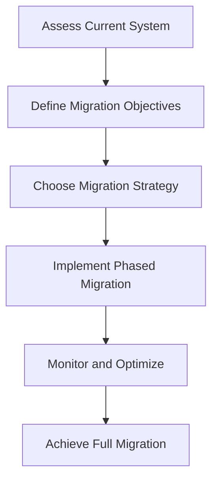
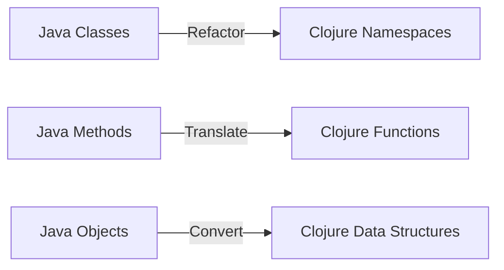

## 1.3 Real-World Success Stories

In the rapidly evolving landscape of enterprise software development, transitioning from Java's Object-Oriented Programming (OOP) paradigm to Clojure's functional programming model can seem daunting. However, numerous enterprises have successfully navigated this transition, reaping significant benefits in scalability, maintainability, and productivity. In this section, we delve into real-world success stories, exploring the strategies employed, challenges faced, and lessons learned from industry leaders who have embraced Clojure.

### Case Study 1: Financial Services Giant

#### Background

A leading financial services company, renowned for its innovative solutions, faced challenges with its legacy Java-based systems. The complexity of maintaining and scaling these systems was hindering their ability to quickly adapt to market changes and regulatory requirements. The company decided to explore functional programming as a means to simplify their codebase and enhance system performance.

#### Migration Strategy

The company adopted a phased migration approach, starting with non-critical systems to minimize risk. They leveraged Clojure's interoperability with Java to gradually replace Java components with Clojure equivalents. This approach allowed them to maintain business continuity while progressively modernizing their architecture.

#### Key Challenges

- **Cultural Shift**: Transitioning to a functional programming mindset required significant training and cultural adaptation within the development team.
- **Interoperability**: Ensuring seamless integration between existing Java components and new Clojure modules was crucial.
- **Performance Optimization**: Initial performance bottlenecks were encountered due to the different execution models of Java and Clojure.

#### Outcomes and Benefits

- **Improved Maintainability**: The adoption of immutable data structures and pure functions reduced code complexity, making the system easier to maintain.
- **Enhanced Scalability**: Clojure's concurrency primitives enabled the company to efficiently handle increased transaction volumes.
- **Faster Time-to-Market**: The ability to rapidly iterate and deploy new features gave the company a competitive edge.

#### Lessons Learned

- **Invest in Training**: Comprehensive training programs were essential to equip developers with the skills needed for functional programming.
- **Leverage Community Support**: Engaging with the Clojure community provided valuable insights and resources that facilitated the migration process.

### Case Study 2: E-commerce Platform Transformation

#### Background

An e-commerce platform, struggling with the limitations of its monolithic Java application, sought to transition to a microservices architecture using Clojure. The goal was to improve system resilience and enable independent deployment of services.

#### Migration Strategy

The company adopted a microservices-first approach, identifying key services that could be decoupled and rewritten in Clojure. They utilized Clojure's rich set of libraries and tools to build robust, scalable services that could be independently deployed and managed.

#### Key Challenges

- **Service Coordination**: Ensuring seamless communication and coordination between microservices was a significant challenge.
- **Data Consistency**: Maintaining data consistency across distributed services required careful design and implementation.

#### Outcomes and Benefits

- **Increased Resilience**: The microservices architecture enhanced system resilience, allowing the platform to handle failures gracefully.
- **Scalability and Flexibility**: The ability to scale services independently provided the flexibility to meet varying demand levels.
- **Reduced Time-to-Resolution**: The modular nature of the architecture simplified troubleshooting and reduced the time required to resolve issues.

#### Lessons Learned

- **Design for Failure**: Building services with failure in mind ensured that the system could recover quickly from unexpected issues.
- **Continuous Integration and Deployment**: Implementing CI/CD pipelines was critical to maintaining the agility and reliability of the platform.

### Case Study 3: Healthcare System Overhaul

#### Background

A healthcare provider, operating a complex network of Java-based applications, faced challenges with data integration and system interoperability. The decision to migrate to Clojure was driven by the need to streamline data processing and improve system interoperability.

#### Migration Strategy

The provider focused on data-centric applications, leveraging Clojure's powerful data manipulation capabilities to simplify data integration processes. They employed a hybrid approach, maintaining critical Java components while gradually introducing Clojure-based solutions.

#### Key Challenges

- **Data Transformation**: Converting data between different formats and systems required sophisticated transformation logic.
- **Regulatory Compliance**: Ensuring compliance with healthcare regulations was a critical consideration throughout the migration process.

#### Outcomes and Benefits

- **Streamlined Data Processing**: Clojure's expressive syntax and data manipulation capabilities significantly reduced the complexity of data processing tasks.
- **Improved Interoperability**: The ability to easily integrate with existing systems enhanced overall system interoperability.
- **Regulatory Compliance**: The migration process was carefully managed to ensure ongoing compliance with healthcare regulations.

#### Lessons Learned

- **Prioritize Data Integration**: Focusing on data integration early in the migration process was key to achieving seamless interoperability.
- **Engage Stakeholders**: Involving stakeholders from across the organization ensured that the migration aligned with business objectives and regulatory requirements.

### Key Takeaways

These success stories highlight the transformative potential of migrating from Java OOP to Clojure. By embracing functional programming, enterprises can achieve significant improvements in system maintainability, scalability, and performance. However, successful migration requires careful planning, a phased approach, and a commitment to cultural and technical adaptation.

### Visual Aids

#### Diagram: Migration Process Flow

*Diagram 1: A high-level overview of the migration process from Java OOP to Clojure.*

#### Diagram: Java to Clojure Component Mapping

*Diagram 2: Mapping Java components to their Clojure equivalents.*

### References and Links

- [Clojure Official Documentation](https://clojure.org/reference)
- [Clojure Community Resources](https://clojure.org/community/resources)
- [Transitioning from OOP to Functional Programming](https://www.lispcast.com/oo-to-fp/)

### Knowledge Check

- What are the key benefits of migrating from Java OOP to Clojure?
- How can enterprises overcome cultural resistance to functional programming?
- What strategies can be employed to ensure data consistency in a microservices architecture?

### Encouraging Engagement

Embracing functional programming can be challenging, but with each step, you'll gain a deeper understanding and see tangible benefits in your codebase. Remember, the journey to Clojure is not just about adopting a new language, but about transforming the way you think about and approach software development.

### Quiz: Are You Ready to Migrate from Java to Clojure?



### What is a key benefit of migrating from Java OOP to Clojure?

- [x] Improved maintainability
- [ ] Increased code complexity
- [ ] Reduced scalability
- [ ] Slower development cycles

> **Explanation:** Clojure's functional programming paradigm, with its emphasis on immutability and pure functions, leads to more maintainable code.

### What approach did the financial services company take for migration?

- [x] Phased migration
- [ ] Big bang migration
- [ ] No migration
- [ ] Immediate full transition

> **Explanation:** The company adopted a phased migration approach to minimize risk and maintain business continuity.

### How did the e-commerce platform benefit from using Clojure?

- [x] Increased resilience
- [ ] Decreased flexibility
- [ ] Reduced scalability
- [ ] Longer time-to-market

> **Explanation:** The microservices architecture enabled by Clojure increased system resilience and flexibility.

### What was a major challenge for the healthcare provider during migration?

- [x] Data transformation
- [ ] Lack of developer skills
- [ ] Insufficient budget
- [ ] No regulatory concerns

> **Explanation:** Converting data between different formats and systems was a significant challenge for the healthcare provider.

### What is a critical factor for successful migration?

- [x] Comprehensive training
- [ ] Ignoring community support
- [ ] Immediate full transition
- [ ] Avoiding stakeholder engagement

> **Explanation:** Comprehensive training programs are essential to equip developers with the skills needed for functional programming.

### What strategy did the e-commerce platform use for migration?

- [x] Microservices-first approach
- [ ] Monolithic approach
- [ ] No migration strategy
- [ ] Immediate full transition

> **Explanation:** The company adopted a microservices-first approach to decouple and rewrite key services in Clojure.

### How can enterprises ensure data consistency in microservices?

- [x] Careful design and implementation
- [ ] Ignoring data consistency
- [ ] Using monolithic architecture
- [ ] Avoiding data transformation

> **Explanation:** Maintaining data consistency across distributed services requires careful design and implementation.

### What is a benefit of engaging with the Clojure community?

- [x] Valuable insights and resources
- [ ] Increased migration costs
- [ ] Slower development cycles
- [ ] Reduced developer skills

> **Explanation:** Engaging with the Clojure community provides valuable insights and resources that facilitate the migration process.

### What is a key takeaway from the success stories?

- [x] Functional programming can improve system performance
- [ ] Java OOP is always better
- [ ] Migration is not beneficial
- [ ] Avoid functional programming

> **Explanation:** The success stories demonstrate that functional programming can lead to significant improvements in system performance.

### True or False: Clojure's concurrency primitives can enhance scalability.

- [x] True
- [ ] False

> **Explanation:** Clojure's concurrency primitives enable efficient handling of increased transaction volumes, enhancing scalability.


