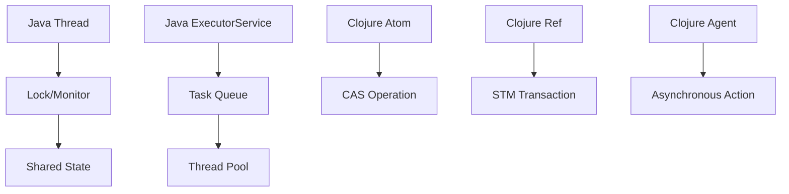

## 10.1 Comparing Java and Clojure Concurrency

Concurrency is a critical aspect of modern software development, especially in enterprise applications where performance and scalability are paramount. As experienced Java developers, you are likely familiar with Java's concurrency model, which provides a robust set of tools for managing concurrent execution. However, transitioning to Clojure introduces a different paradigm that leverages functional programming principles to handle concurrency in a more expressive and less error-prone manner. In this section, we will explore the concurrency mechanisms in Java, introduce Clojure's concurrency primitives, and compare the two approaches to highlight the advantages of Clojure's model.

### Overview of Concurrency Mechanisms in Java

Java's concurrency model is built around threads, locks, and the `java.util.concurrent` package, which provides high-level concurrency utilities. Let's delve into these components to understand how Java handles concurrent execution.

#### Threads and Synchronization

Java's concurrency model is primarily based on threads. A thread is a lightweight process that can run concurrently with other threads. Java provides the `Thread` class and the `Runnable` interface to create and manage threads.

```java
// Java example of creating a thread
public class MyThread extends Thread {
    public void run() {
        System.out.println("Thread is running");
    }

    public static void main(String[] args) {
        MyThread thread = new MyThread();
        thread.start();
    }
}
```

In Java, synchronization is achieved using the `synchronized` keyword, which ensures that only one thread can access a block of code or an object at a time. This prevents race conditions but can lead to deadlocks if not managed carefully.

```java
// Java example of synchronized method
public class Counter {
    private int count = 0;

    public synchronized void increment() {
        count++;
    }

    public int getCount() {
        return count;
    }
}
```

#### Locks and the `java.util.concurrent` Package

Java 5 introduced the `java.util.concurrent` package, which provides higher-level concurrency utilities such as `ExecutorService`, `Locks`, `Atomic` variables, and concurrent collections. These abstractions simplify thread management and improve performance by reducing contention.

```java
// Java example using ExecutorService
import java.util.concurrent.ExecutorService;
import java.util.concurrent.Executors;

public class ExecutorExample {
    public static void main(String[] args) {
        ExecutorService executor = Executors.newFixedThreadPool(2);
        executor.submit(() -> System.out.println("Task 1"));
        executor.submit(() -> System.out.println("Task 2"));
        executor.shutdown();
    }
}
```

### Introduction to Clojure's Concurrency Primitives

Clojure offers a different approach to concurrency, emphasizing immutability and functional programming principles. Clojure's concurrency model is built around atoms, refs, agents, and software transactional memory (STM). Let's explore these primitives and how they differ from Java's model.

#### Immutability and Persistent Data Structures

Before diving into concurrency primitives, it's essential to understand Clojure's emphasis on immutability. In Clojure, data structures are immutable by default, meaning they cannot be changed once created. This immutability simplifies concurrent programming by eliminating the need for locks and reducing the risk of race conditions.

Clojure uses persistent data structures, which provide efficient ways to create modified versions of data structures without altering the original. This feature is crucial for concurrent applications, as it allows multiple threads to share data safely.

```clojure
;; Clojure example of immutable data structure
(def my-list [1 2 3])
(def new-list (conj my-list 4)) ;; new-list is [1 2 3 4], my-list remains [1 2 3]
```

#### Atoms

Atoms in Clojure provide a way to manage shared, synchronous, and independent state. They are suitable for situations where you need to update a single piece of state atomically.

```clojure
;; Clojure example using atoms
(def counter (atom 0))

(defn increment-counter []
  (swap! counter inc))

(increment-counter) ;; counter is now 1
```

Atoms use compare-and-swap (CAS) operations to ensure that updates are atomic and consistent, making them ideal for managing simple state changes.

#### Refs and Software Transactional Memory (STM)

Refs in Clojure are used for coordinated, synchronous updates to multiple pieces of state. They leverage STM to ensure that changes are atomic, consistent, isolated, and durable (ACID).

```clojure
;; Clojure example using refs and STM
(def account-a (ref 100))
(def account-b (ref 200))

(defn transfer [amount]
  (dosync
    (alter account-a - amount)
    (alter account-b + amount)))

(transfer 50) ;; Transfers 50 from account-a to account-b
```

STM allows you to group multiple state changes into a transaction, ensuring that either all changes are applied or none are, maintaining consistency across the system.

#### Agents

Agents in Clojure are used for asynchronous updates to state. They allow you to send actions to be performed on a state in the background, without blocking the main thread.

```clojure
;; Clojure example using agents
(def my-agent (agent 0))

(defn update-agent [value]
  (send my-agent + value))

(update-agent 10) ;; Asynchronously adds 10 to my-agent
```

Agents are ideal for tasks that can be performed independently and do not require immediate feedback.

### Comparing Java and Clojure Concurrency

Now that we have a foundational understanding of both Java and Clojure's concurrency models, let's compare them to highlight the differences and advantages of Clojure's approach.

#### Simplicity and Safety

Clojure's concurrency model is simpler and safer than Java's. By leveraging immutability and functional programming principles, Clojure reduces the complexity of managing concurrent state. The risk of race conditions and deadlocks is minimized, as there is no need for explicit locks or synchronization.

#### Expressiveness and Flexibility

Clojure's concurrency primitives are more expressive and flexible than Java's. Atoms, refs, and agents provide different levels of abstraction for managing state, allowing you to choose the most appropriate tool for your specific use case. This flexibility enables you to write more concise and readable code.

#### Performance Considerations

While Java's concurrency model can be highly performant, especially with the `java.util.concurrent` package, Clojure's model offers performance benefits through immutability and persistent data structures. These features reduce contention and improve scalability, making Clojure well-suited for concurrent applications.

#### Interoperability with Java

Clojure's seamless interoperability with Java allows you to leverage existing Java concurrency utilities when necessary. You can call Java methods and use Java libraries within Clojure, providing a smooth transition for Java developers.

### Visualizing Concurrency Models

To better understand the differences between Java and Clojure's concurrency models, let's visualize the flow of data and control in each model.



**Diagram Description:** This diagram illustrates the flow of data and control in Java and Clojure's concurrency models. Java uses threads, locks, and executors, while Clojure leverages atoms, refs, and agents.

### Knowledge Check

Let's reinforce our understanding of Java and Clojure concurrency with a few questions:

- What are the primary concurrency mechanisms in Java?
- How do Clojure's atoms differ from Java's synchronized methods?
- What advantages does Clojure's STM offer over Java's locks?
- How can agents be used to perform asynchronous updates in Clojure?

### Try It Yourself

Experiment with the provided code examples by modifying them to suit your needs. For instance, try creating a Clojure program that uses refs to manage a bank account system with multiple accounts and transactions. Observe how STM ensures consistency across transactions.

### Key Takeaways

- Java's concurrency model is based on threads, locks, and the `java.util.concurrent` package.
- Clojure offers a different approach with atoms, refs, agents, and STM, emphasizing immutability and functional programming.
- Clojure's model is simpler, safer, and more expressive, reducing the risk of race conditions and deadlocks.
- Clojure's interoperability with Java allows you to leverage existing Java concurrency utilities when needed.

### Further Reading

For more information on Clojure's concurrency model, refer to the [Official Clojure Documentation](https://clojure.org/reference/concurrency) and [ClojureDocs](https://clojuredocs.org/).

## **Quiz: Are You Ready to Migrate from Java to Clojure?**



### What is the primary concurrency mechanism in Java?

- [x] Threads
- [ ] Atoms
- [ ] Refs
- [ ] Agents

> **Explanation:** Java's concurrency model is primarily based on threads, which are lightweight processes that can run concurrently.

### How does Clojure ensure safe concurrent updates to state?

- [ ] By using synchronized methods
- [x] By leveraging immutability and CAS operations
- [ ] By using locks
- [ ] By using ExecutorService

> **Explanation:** Clojure ensures safe concurrent updates by leveraging immutability and CAS operations, which eliminate the need for locks.

### What is the purpose of Clojure's STM?

- [ ] To perform asynchronous updates
- [x] To ensure atomic, consistent, isolated, and durable transactions
- [ ] To manage thread pools
- [ ] To synchronize methods

> **Explanation:** Clojure's STM is used to ensure that changes to multiple pieces of state are atomic, consistent, isolated, and durable.

### Which Clojure primitive is used for asynchronous updates?

- [ ] Atoms
- [ ] Refs
- [x] Agents
- [ ] Threads

> **Explanation:** Agents in Clojure are used for asynchronous updates to state, allowing actions to be performed in the background.

### What advantage does Clojure's concurrency model offer over Java's?

- [x] Simplicity and safety
- [ ] More complex synchronization
- [ ] Better thread management
- [ ] More explicit locks

> **Explanation:** Clojure's concurrency model offers simplicity and safety by reducing the complexity of managing concurrent state through immutability.

### How can you perform coordinated updates to multiple pieces of state in Clojure?

- [ ] Using synchronized methods
- [x] Using refs and STM
- [ ] Using locks
- [ ] Using ExecutorService

> **Explanation:** In Clojure, refs and STM are used to perform coordinated updates to multiple pieces of state, ensuring consistency.

### What is a key feature of Clojure's persistent data structures?

- [ ] They are mutable
- [x] They allow efficient creation of modified versions
- [ ] They require locks
- [ ] They are thread-unsafe

> **Explanation:** Clojure's persistent data structures allow efficient creation of modified versions without altering the original, supporting immutability.

### How does Clojure's concurrency model improve scalability?

- [ ] By using more threads
- [ ] By using synchronized methods
- [x] By reducing contention through immutability
- [ ] By using explicit locks

> **Explanation:** Clojure's concurrency model improves scalability by reducing contention through immutability and persistent data structures.

### What is the role of CAS operations in Clojure's concurrency model?

- [ ] To manage thread pools
- [x] To ensure atomic updates to state
- [ ] To synchronize methods
- [ ] To perform asynchronous actions

> **Explanation:** CAS operations in Clojure ensure atomic updates to state, allowing safe concurrent modifications without locks.

### True or False: Clojure's concurrency model requires explicit locks for thread safety.

- [ ] True
- [x] False

> **Explanation:** False. Clojure's concurrency model does not require explicit locks for thread safety, as it leverages immutability and functional programming principles.


