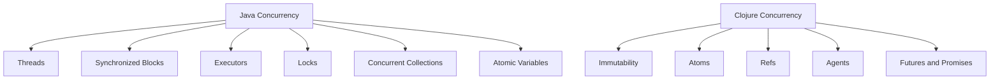

## 10.1 Comparing Java and Clojure Concurrency

Concurrency is a critical aspect of modern software development, especially in enterprise applications where performance and scalability are paramount. In this section, we will delve into the concurrency mechanisms of Java and Clojure, highlighting their differences and how they can be leveraged effectively in enterprise environments.

### Overview of Concurrency Mechanisms in Java

Java has been a staple in enterprise software development for decades, and its concurrency model is one of its core strengths. Java's concurrency is built around threads and the `java.util.concurrent` package, which provides a high-level API for managing concurrent tasks.

#### Java Threads and Synchronization

Java's concurrency model is based on threads, which are lightweight processes that can run concurrently within a single application. Threads in Java are managed by the Java Virtual Machine (JVM) and can be created by extending the `Thread` class or implementing the `Runnable` interface.

```java
// Java example of creating a thread
public class MyThread extends Thread {
    public void run() {
        System.out.println("Thread is running");
    }

    public static void main(String[] args) {
        MyThread thread = new MyThread();
        thread.start(); // Start the thread
    }
}
```

Synchronization in Java is achieved using the `synchronized` keyword, which ensures that only one thread can access a block of code at a time. This is crucial for preventing race conditions and ensuring data consistency.

```java
// Java example of synchronized method
public class Counter {
    private int count = 0;

    public synchronized void increment() {
        count++;
    }

    public int getCount() {
        return count;
    }
}
```

#### Java's `java.util.concurrent` Package

Java's `java.util.concurrent` package provides a set of high-level concurrency utilities that simplify the development of concurrent applications. Key components include:

- **Executors**: Manage thread pools and task execution.
- **Locks**: Provide more flexible locking mechanisms than `synchronized`.
- **Concurrent Collections**: Thread-safe collections like `ConcurrentHashMap`.
- **Atomic Variables**: Support lock-free thread-safe programming.

```java
// Java example using ExecutorService
import java.util.concurrent.ExecutorService;
import java.util.concurrent.Executors;

public class ExecutorExample {
    public static void main(String[] args) {
        ExecutorService executor = Executors.newFixedThreadPool(2);
        executor.submit(() -> System.out.println("Task 1"));
        executor.submit(() -> System.out.println("Task 2"));
        executor.shutdown();
    }
}
```

### Introduction to Clojure's Concurrency Primitives

Clojure, a functional programming language that runs on the JVM, offers a different approach to concurrency. It emphasizes immutability and provides powerful concurrency primitives that simplify concurrent programming.

#### Immutability and Concurrency

In Clojure, data structures are immutable by default, meaning they cannot be changed after they are created. This immutability is a cornerstone of Clojure's concurrency model, as it eliminates the need for locks and reduces the risk of race conditions.

#### Clojure's Concurrency Primitives

Clojure provides several concurrency primitives that facilitate safe and efficient concurrent programming:

- **Atoms**: Provide a way to manage shared, synchronous, and independent state.
- **Refs**: Support coordinated, synchronous updates to shared state using Software Transactional Memory (STM).
- **Agents**: Allow asynchronous updates to shared state.
- **Futures and Promises**: Facilitate asynchronous computation and communication.

```clojure
;; Clojure example using an Atom
(def counter (atom 0))

(defn increment-counter []
  (swap! counter inc))

(increment-counter)
(println @counter) ;; Output: 1
```

### Comparing Java and Clojure Concurrency Models

Now that we have a basic understanding of Java and Clojure's concurrency mechanisms, let's compare them in terms of design philosophy, ease of use, and performance.

#### Design Philosophy

- **Java**: Emphasizes explicit control over threads and synchronization. Developers are responsible for managing thread lifecycle and ensuring thread safety.
- **Clojure**: Focuses on immutability and declarative concurrency. Concurrency primitives abstract away the complexities of thread management, allowing developers to focus on the logic of their applications.

#### Ease of Use

- **Java**: While powerful, Java's concurrency model can be complex and error-prone, especially when dealing with low-level thread management and synchronization.
- **Clojure**: Offers a more straightforward approach to concurrency, thanks to its immutable data structures and high-level concurrency primitives. This reduces the cognitive load on developers and minimizes the risk of concurrency-related bugs.

#### Performance

- **Java**: Provides fine-grained control over concurrency, which can lead to highly optimized applications. However, this often requires significant effort and expertise.
- **Clojure**: While Clojure's concurrency model may not offer the same level of control as Java, its emphasis on immutability and high-level abstractions can lead to more maintainable and scalable applications.

### Code Examples and Comparisons

Let's explore some practical examples to illustrate the differences between Java and Clojure concurrency.

#### Example 1: Incrementing a Counter

In Java, incrementing a shared counter requires careful synchronization to avoid race conditions:

```java
// Java example of synchronized counter increment
public class SynchronizedCounter {
    private int count = 0;

    public synchronized void increment() {
        count++;
    }

    public int getCount() {
        return count;
    }
}
```

In Clojure, we can achieve the same result using an `Atom`, which handles synchronization for us:

```clojure
;; Clojure example using an Atom
(def counter (atom 0))

(defn increment-counter []
  (swap! counter inc))

(increment-counter)
(println @counter) ;; Output: 1
```

#### Example 2: Coordinated Updates

In Java, coordinating updates to multiple shared variables can be challenging and error-prone:

```java
// Java example of coordinated updates using synchronized blocks
public class BankAccount {
    private int balance = 0;

    public synchronized void deposit(int amount) {
        balance += amount;
    }

    public synchronized void withdraw(int amount) {
        balance -= amount;
    }

    public int getBalance() {
        return balance;
    }
}
```

Clojure's `Refs` and STM make coordinated updates straightforward and safe:

```clojure
;; Clojure example using Refs and STM
(def account (ref 0))

(defn deposit [amount]
  (dosync
    (alter account + amount)))

(defn withdraw [amount]
  (dosync
    (alter account - amount)))

(deposit 100)
(withdraw 50)
(println @account) ;; Output: 50
```

### Visual Aids: Concurrency Models Comparison

To further illustrate the differences between Java and Clojure concurrency models, let's use a diagram to compare their approaches.



**Diagram Description:** This diagram compares Java's concurrency model, which relies on threads, synchronization, and various utilities, with Clojure's model, which emphasizes immutability and high-level concurrency primitives like Atoms, Refs, and Agents.

### References and Links

For further reading on Java and Clojure concurrency, consider the following resources:

- [Clojure Official Documentation](https://clojure.org/reference)
- [Java Concurrency in Practice](https://jcip.net/)
- [Clojure Community Resources](https://clojure.org/community/resources)
- [Transitioning from OOP to Functional Programming](https://www.lispcast.com/oo-to-fp/)

### Knowledge Check

To reinforce your understanding of Java and Clojure concurrency, consider the following questions:

1. What are the primary concurrency primitives in Clojure?
2. How does immutability in Clojure simplify concurrency?
3. What are some challenges associated with Java's concurrency model?
4. How do Clojure's Atoms differ from Java's synchronized blocks?

### Encouraging Engagement

Embracing functional programming and Clojure's concurrency model can be challenging, but with each step, you'll gain a deeper understanding and see tangible benefits in your codebase. Experiment with the examples provided, and consider how these concepts can be applied to your enterprise applications.

### Best Practices for Tags

- Use Specific and Relevant Tags
- Use 4 to 8 relevant and specific tags that reflect the article's content.
- Tags should reflect key topics, technologies, or concepts discussed in the article, such as "Clojure", "Java", "Functional Programming", "Migration", "Concurrency", "Data Structures", etc.
- Keep tag names consistent. For example, use "Clojure" instead of alternating between "Clojure" and "clj".
- Wrap tags in double-quotes.
- Avoid tags containing the `#` character.

### Links to Online Guides and References

- Integrate references to other relevant sections within this online guide to provide a cohesive learning experience.
- Include links to official documentation when discussing language features (e.g., [Clojure Documentation](https://clojure.org/reference/)).
- Reference reputable online tutorials or guides that offer additional insights.
- Ensure that all external links are reputable, authoritative, and up-to-date.
- Avoid linking to content behind paywalls to ensure accessibility for all readers.
- Provide full URLs or use markdown link syntax, e.g., `[Clojure STM Guide](https://clojure.org/reference/refs)`.

## **Quiz: Are You Ready to Migrate from Java to Clojure?**



### What is a key advantage of Clojure's concurrency model over Java's?

- [x] Immutability reduces the need for locks.
- [ ] It uses more threads.
- [ ] It requires less memory.
- [ ] It is faster in all scenarios.

> **Explanation:** Clojure's immutability reduces the need for locks, simplifying concurrency.

### Which Clojure primitive is used for asynchronous updates?

- [ ] Refs
- [x] Agents
- [ ] Atoms
- [ ] Futures

> **Explanation:** Agents in Clojure are used for asynchronous updates to shared state.

### How does Java handle thread synchronization?

- [x] Using the `synchronized` keyword.
- [ ] Using Atoms.
- [ ] Using Refs.
- [ ] Using Agents.

> **Explanation:** Java uses the `synchronized` keyword to manage thread synchronization.

### What is a common challenge with Java's concurrency model?

- [x] Complexity and error-prone synchronization.
- [ ] Lack of thread support.
- [ ] No support for concurrent collections.
- [ ] No support for atomic variables.

> **Explanation:** Java's concurrency model can be complex and error-prone due to manual synchronization.

### Which Clojure primitive supports coordinated updates using STM?

- [ ] Atoms
- [x] Refs
- [ ] Agents
- [ ] Futures

> **Explanation:** Refs in Clojure support coordinated updates using Software Transactional Memory (STM).

### What is the primary focus of Clojure's concurrency model?

- [x] Immutability and declarative concurrency.
- [ ] Thread management.
- [ ] Low-level synchronization.
- [ ] High memory usage.

> **Explanation:** Clojure focuses on immutability and declarative concurrency, simplifying concurrent programming.

### Which Java package provides high-level concurrency utilities?

- [x] `java.util.concurrent`
- [ ] `java.lang`
- [ ] `java.io`
- [ ] `java.net`

> **Explanation:** The `java.util.concurrent` package provides high-level concurrency utilities in Java.

### How does Clojure handle shared state updates?

- [x] Using Atoms, Refs, and Agents.
- [ ] Using synchronized blocks.
- [ ] Using thread pools.
- [ ] Using locks.

> **Explanation:** Clojure uses Atoms, Refs, and Agents to manage shared state updates.

### What is a benefit of using Clojure's concurrency primitives?

- [x] Reduced risk of race conditions.
- [ ] Increased complexity.
- [ ] Higher memory usage.
- [ ] Slower performance.

> **Explanation:** Clojure's concurrency primitives reduce the risk of race conditions through immutability.

### True or False: Clojure's concurrency model requires explicit thread management.

- [ ] True
- [x] False

> **Explanation:** Clojure's concurrency model abstracts away explicit thread management, focusing on high-level primitives.


