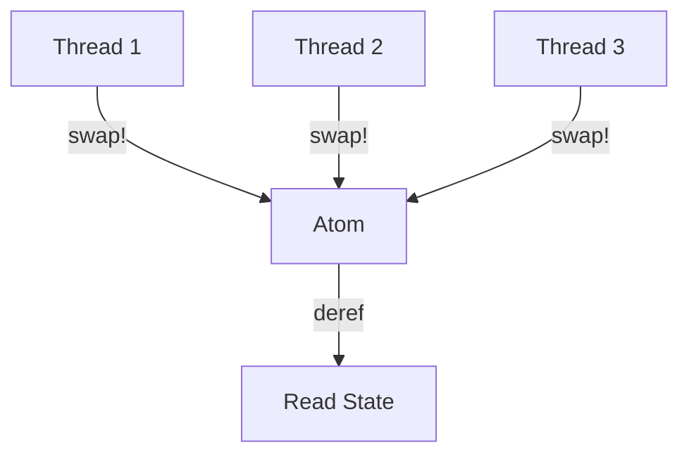
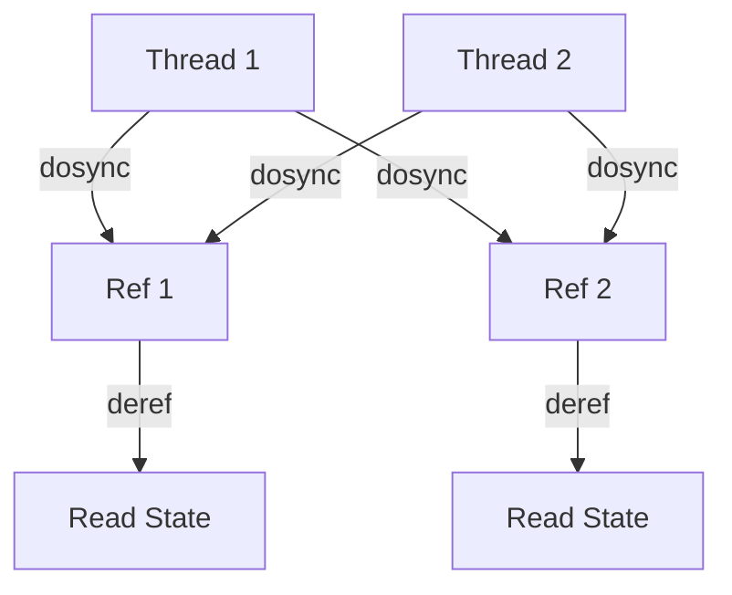
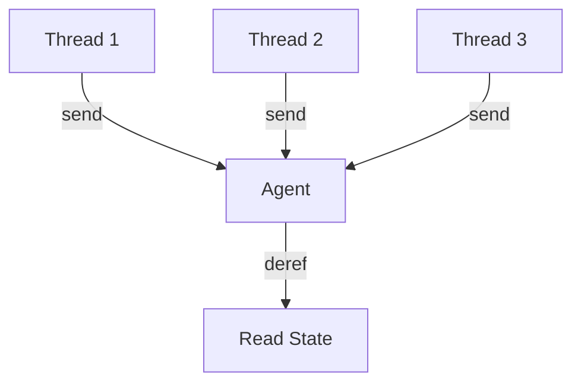

## 10.2 Managing State with Atoms, Refs, and Agents

As we delve into the world of Clojure, one of the most compelling aspects is its approach to concurrency and state management. In Java, managing state in concurrent applications often involves complex mechanisms like synchronized blocks, locks, and concurrent collections. Clojure, however, offers a more elegant and functional approach with its concurrency primitives: Atoms, Refs, and Agents. These constructs allow us to manage state changes in a thread-safe manner while embracing immutability and functional programming principles.

### Understanding Clojure's Concurrency Primitives

Before we dive into each concurrency primitive, let's establish a foundational understanding of why Clojure's approach is beneficial. In traditional Java applications, mutable state can lead to race conditions and difficult-to-debug concurrency issues. Clojure mitigates these problems by encouraging immutability and providing tools that manage state changes in a controlled manner.

#### Atoms

**Atoms** are the simplest of Clojure's concurrency primitives. They provide a way to manage shared, synchronous, and independent state. Atoms are ideal for situations where you need to manage a single piece of state that can be updated independently of other states.

- **Creating an Atom**: You create an atom using the `atom` function, passing the initial state as an argument.

```clojure
(def my-atom (atom 0))
```

- **Reading an Atom**: You can read the current state of an atom using the `deref` function or the `@` reader macro.

```clojure
(println @my-atom) ; Output: 0
```

- **Updating an Atom**: To update an atom, use the `swap!` function, which takes the atom and a function that describes how to update the state.

```clojure
(swap! my-atom inc)
(println @my-atom) ; Output: 1
```

- **Compare-and-Swap**: Atoms use a compare-and-swap (CAS) mechanism to ensure that updates are atomic and thread-safe.

#### Refs

**Refs** are used for managing coordinated, synchronous updates to multiple pieces of state. They are part of Clojure's Software Transactional Memory (STM) system, which allows you to perform transactions on multiple refs.

- **Creating a Ref**: Use the `ref` function to create a ref with an initial state.

```clojure
(def my-ref (ref 0))
```

- **Reading a Ref**: Similar to atoms, you can read the state of a ref using `deref` or `@`.

```clojure
(println @my-ref) ; Output: 0
```

- **Updating a Ref**: To update a ref, use the `dosync` block along with `alter` or `ref-set` functions. `dosync` ensures that all updates within the block are atomic.

```clojure
(dosync
  (alter my-ref inc))
(println @my-ref) ; Output: 1
```

- **Coordinated Updates**: Refs are ideal for scenarios where multiple pieces of state need to be updated together, ensuring consistency.

#### Agents

**Agents** are designed for managing asynchronous state changes. They are suitable for tasks that can be performed independently and do not require immediate feedback.

- **Creating an Agent**: Use the `agent` function to create an agent with an initial state.

```clojure
(def my-agent (agent 0))
```

- **Reading an Agent**: Similar to atoms and refs, use `deref` or `@` to read the state.

```clojure
(println @my-agent) ; Output: 0
```

- **Updating an Agent**: Use the `send` or `send-off` functions to update an agent. These functions queue the update operation to be performed asynchronously.

```clojure
(send my-agent inc)
(println @my-agent) ; Output: 0 (initially, as the update is asynchronous)
```

- **Error Handling**: Agents have built-in error handling mechanisms, allowing you to define error handlers for failed actions.

### Choosing the Right Concurrency Primitive

Choosing the appropriate concurrency primitive depends on the nature of the state you are managing and the requirements of your application.

- **Use Atoms** when you have independent state that can be updated synchronously and does not need coordination with other states.
- **Use Refs** when you need to perform coordinated updates across multiple pieces of state, ensuring consistency.
- **Use Agents** for managing asynchronous tasks that can be performed independently.

### Examples of State Management in Concurrent Applications

Let's explore some practical examples to solidify our understanding of how to manage state with Atoms, Refs, and Agents in Clojure.

#### Example 1: Managing a Counter with Atoms

Suppose we have a simple counter that multiple threads need to update. We can use an atom to manage this state safely.

```clojure
(def counter (atom 0))

(defn increment-counter []
  (swap! counter inc))

; Simulate concurrent updates
(dotimes [_ 100]
  (future (increment-counter)))

(Thread/sleep 1000) ; Wait for all updates to complete
(println @counter) ; Output: 100
```

In this example, we use `swap!` to increment the counter atomically, ensuring that all updates are thread-safe.

#### Example 2: Banking Transactions with Refs

Consider a banking application where we need to transfer money between accounts. We can use refs to ensure that the transfer is atomic and consistent.

```clojure
(def account-a (ref 1000))
(def account-b (ref 500))

(defn transfer [from to amount]
  (dosync
    (alter from - amount)
    (alter to + amount)))

(transfer account-a account-b 200)

(println "Account A:" @account-a) ; Output: 800
(println "Account B:" @account-b) ; Output: 700
```

Here, the `dosync` block ensures that both account updates are performed atomically, maintaining consistency.

#### Example 3: Asynchronous Logging with Agents

Imagine we have a logging system that needs to process log messages asynchronously. We can use an agent to handle this task.

```clojure
(def log-agent (agent []))

(defn log-message [message]
  (send log-agent conj message))

(log-message "Starting application...")
(log-message "Application running...")

(Thread/sleep 1000) ; Wait for all messages to be processed
(println @log-agent) ; Output: ["Starting application..." "Application running..."]
```

In this example, we use `send` to queue log messages for asynchronous processing, allowing the application to continue running without waiting for the logging to complete.

### Visualizing Concurrency Models

To better understand how Atoms, Refs, and Agents work, let's visualize their concurrency models using Mermaid.js diagrams.

#### Atom Concurrency Model



**Diagram Description**: This diagram illustrates multiple threads updating an atom using `swap!`, with the atom ensuring atomic updates.

#### Ref Concurrency Model



**Diagram Description**: This diagram shows how multiple threads can perform coordinated updates on multiple refs using `dosync`.

#### Agent Concurrency Model



**Diagram Description**: This diagram depicts multiple threads sending asynchronous updates to an agent, with the agent processing these updates independently.

### References and Further Reading

- [Official Clojure Documentation on Atoms](https://clojure.org/reference/atoms)
- [Official Clojure Documentation on Refs](https://clojure.org/reference/refs)
- [Official Clojure Documentation on Agents](https://clojure.org/reference/agents)

### Knowledge Check

Let's reinforce our understanding with some questions and exercises.

1. **What is the primary difference between Atoms and Refs in Clojure?**
2. **How does Clojure ensure atomic updates when using Atoms?**
3. **Describe a scenario where using Agents would be more appropriate than Atoms or Refs.**
4. **Try modifying the banking transaction example to handle overdrafts.**

### Summary

In this section, we've explored how Clojure's concurrency primitives—Atoms, Refs, and Agents—provide powerful tools for managing state in concurrent applications. By leveraging these constructs, we can write more robust, thread-safe code that embraces immutability and functional programming principles. As you continue your journey with Clojure, consider how these primitives can simplify and enhance your application's concurrency model.

## **Quiz: Are You Ready to Migrate from Java to Clojure?**



### What is the primary use case for Atoms in Clojure?

- [x] Managing independent, synchronous state
- [ ] Coordinating updates across multiple states
- [ ] Handling asynchronous tasks
- [ ] Managing state with side effects

> **Explanation:** Atoms are used for managing independent, synchronous state changes.

### How do you ensure atomic updates with Refs in Clojure?

- [ ] Using `swap!`
- [x] Using `dosync` with `alter`
- [ ] Using `send`
- [ ] Using `future`

> **Explanation:** Refs require the use of `dosync` with `alter` to ensure atomic updates.

### Which concurrency primitive is best suited for asynchronous tasks?

- [ ] Atoms
- [ ] Refs
- [x] Agents
- [ ] Futures

> **Explanation:** Agents are designed for handling asynchronous tasks.

### What mechanism do Atoms use to ensure thread safety?

- [ ] Locks
- [ ] Monitors
- [x] Compare-and-swap (CAS)
- [ ] Mutexes

> **Explanation:** Atoms use a compare-and-swap (CAS) mechanism to ensure thread safety.

### In the banking transaction example, what ensures the consistency of updates?

- [ ] `swap!`
- [x] `dosync`
- [ ] `send`
- [ ] `future`

> **Explanation:** The `dosync` block ensures that updates to multiple refs are consistent.

### What is the primary advantage of using Agents over Atoms?

- [ ] Synchronous updates
- [x] Asynchronous processing
- [ ] Coordinated updates
- [ ] Immediate feedback

> **Explanation:** Agents provide asynchronous processing, allowing tasks to be performed independently.

### How can you read the current state of an Atom?

- [x] Using `deref` or `@`
- [ ] Using `alter`
- [ ] Using `send`
- [ ] Using `future`

> **Explanation:** You can read the state of an Atom using `deref` or the `@` reader macro.

### Which function is used to update an Agent?

- [ ] `swap!`
- [ ] `alter`
- [x] `send`
- [ ] `dosync`

> **Explanation:** The `send` function is used to update an Agent asynchronously.

### What is the role of `dosync` in Clojure's STM?

- [ ] It updates Atoms
- [x] It ensures atomic transactions for Refs
- [ ] It sends messages to Agents
- [ ] It locks resources

> **Explanation:** `dosync` ensures atomic transactions for Refs in Clojure's STM.

### True or False: Atoms can be used for coordinated updates across multiple states.

- [ ] True
- [x] False

> **Explanation:** Atoms are not suitable for coordinated updates across multiple states; Refs are used for this purpose.



Now that we've explored how to manage state with Atoms, Refs, and Agents in Clojure, you're well-equipped to handle concurrency in your applications. Keep experimenting and applying these concepts to see the benefits of Clojure's functional programming paradigm in action.
