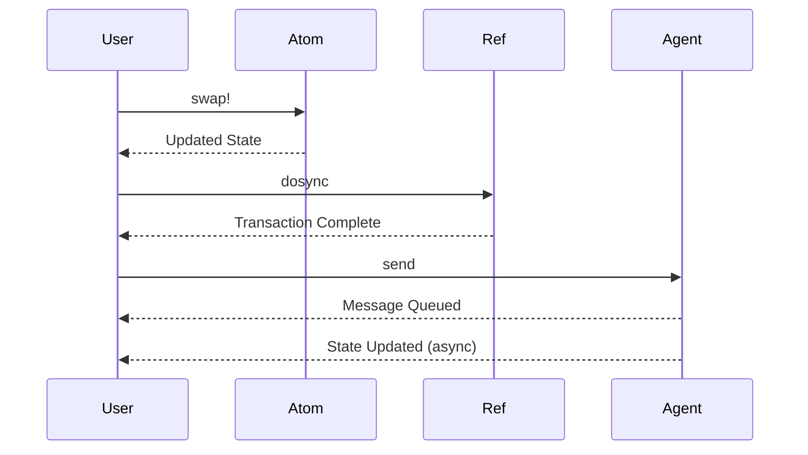

## 10.2 Managing State with Atoms, Refs, and Agents

In the realm of concurrent programming, managing state effectively is crucial for building robust and efficient applications. Clojure offers a unique approach to concurrency with its immutable data structures and a set of powerful concurrency primitives: Atoms, Refs, and Agents. These tools provide a higher level of abstraction compared to traditional Java concurrency mechanisms, allowing developers to write concurrent code that is both simpler and more reliable.

### Introduction to Clojure's Concurrency Primitives

Clojure's concurrency model is built on the foundation of immutability. By default, data structures in Clojure are immutable, meaning that once created, they cannot be changed. This immutability simplifies reasoning about state changes in concurrent applications, as it eliminates the possibility of data races and inconsistent states.

To manage state changes in a controlled manner, Clojure provides three primary concurrency primitives:

- **Atoms**: For managing independent, uncoordinated state changes.
- **Refs**: For coordinated, synchronous state changes across multiple references.
- **Agents**: For asynchronous state changes.

Each of these primitives serves a specific purpose and is suited for different types of concurrency scenarios. Let's explore each one in detail.

### Atoms: Managing Independent State Changes

Atoms are the simplest concurrency primitive in Clojure, designed for managing independent state changes. They provide a way to manage shared, mutable state in a thread-safe manner without the need for locks.

#### How Atoms Work

Atoms use a compare-and-swap (CAS) mechanism to ensure that updates to the state are atomic. This means that when you attempt to update the state of an atom, Clojure checks if the current state matches the expected state. If it does, the update is applied; otherwise, the operation is retried.

#### Using Atoms in Clojure

To create an atom, use the `atom` function, passing the initial state as an argument. You can then use the `swap!` function to update the state of the atom.

```clojure
;; Create an atom with an initial value of 0
(def counter (atom 0))

;; Increment the counter atomically
(swap! counter inc)

;; Print the current value of the counter
(println @counter) ; Output: 1
```

In this example, the `swap!` function takes the atom and a function (`inc`) that describes how to update the state. The `@` symbol is used to dereference the atom and obtain its current value.

#### When to Use Atoms

Atoms are ideal for managing state that is independent and does not require coordination with other state changes. They are particularly useful for counters, flags, and other simple state variables.

### Refs: Coordinated State Changes

Refs are used for managing coordinated, synchronous state changes across multiple references. They provide a mechanism for ensuring that a set of state changes are applied atomically, maintaining consistency across multiple pieces of state.

#### How Refs Work

Refs use Software Transactional Memory (STM) to manage state changes. STM allows you to define transactions that group multiple state changes together. If any part of the transaction fails, the entire transaction is retried, ensuring that all state changes are applied consistently.

#### Using Refs in Clojure

To create a ref, use the `ref` function, passing the initial state as an argument. You can then use the `dosync` macro to define a transaction and the `alter` function to update the state of the ref.

```clojure
;; Create refs for two bank accounts
(def account-a (ref 100))
(def account-b (ref 200))

;; Transfer 50 from account-a to account-b
(dosync
  (alter account-a - 50)
  (alter account-b + 50))

;; Print the current balances
(println @account-a) ; Output: 50
(println @account-b) ; Output: 250
```

In this example, the `dosync` macro defines a transaction that transfers money between two accounts. The `alter` function is used to update the state of each ref within the transaction.

#### When to Use Refs

Refs are ideal for managing state that requires coordination across multiple variables. They are particularly useful for financial transactions, inventory management, and other scenarios where consistency is critical.

### Agents: Asynchronous State Changes

Agents are used for managing asynchronous state changes. They provide a way to perform state updates in the background, allowing your application to continue processing other tasks.

#### How Agents Work

Agents use a message-passing model to manage state changes. When you send a message to an agent, it is placed in a queue and processed asynchronously. This allows you to perform long-running computations without blocking the main thread.

#### Using Agents in Clojure

To create an agent, use the `agent` function, passing the initial state as an argument. You can then use the `send` function to send a message to the agent.

```clojure
;; Create an agent with an initial value of 0
(def counter-agent (agent 0))

;; Increment the counter asynchronously
(send counter-agent inc)

;; Print the current value of the counter
(println @counter-agent) ; Output: 0 (initially, as the update is asynchronous)

;; Wait for the agent to process the message
(await counter-agent)

;; Print the updated value of the counter
(println @counter-agent) ; Output: 1
```

In this example, the `send` function sends a message to the agent, instructing it to increment its state. The `await` function is used to wait for the agent to process the message before printing the updated value.

#### When to Use Agents

Agents are ideal for managing state that can be updated asynchronously. They are particularly useful for background tasks, such as logging, data processing, and other non-blocking operations.

### Choosing the Right Concurrency Primitive

Choosing the right concurrency primitive depends on the nature of the state changes you need to manage. Here are some guidelines to help you decide:

- **Use Atoms** for independent, uncoordinated state changes that require atomic updates.
- **Use Refs** for coordinated, synchronous state changes that require consistency across multiple variables.
- **Use Agents** for asynchronous state changes that can be processed in the background.

### Comparing Clojure's Concurrency Primitives to Java

Java's concurrency model relies heavily on locks and synchronized blocks to manage state changes. While these mechanisms are powerful, they can be complex and error-prone, leading to issues such as deadlocks and race conditions.

Clojure's concurrency primitives provide a higher level of abstraction, allowing you to manage state changes more declaratively. By eliminating the need for explicit locks, Clojure reduces the risk of concurrency-related bugs and simplifies the development process.

#### Java vs. Clojure: A Side-by-Side Comparison

Let's compare Java's concurrency mechanisms with Clojure's primitives using a simple example: a bank account transfer.

**Java Example:**

```java
public class BankAccount {
    private int balance;

    public BankAccount(int initialBalance) {
        this.balance = initialBalance;
    }

    public synchronized void transfer(BankAccount target, int amount) {
        if (this.balance >= amount) {
            this.balance -= amount;
            target.balance += amount;
        }
    }

    public synchronized int getBalance() {
        return balance;
    }
}

// Usage
BankAccount accountA = new BankAccount(100);
BankAccount accountB = new BankAccount(200);

accountA.transfer(accountB, 50);

System.out.println(accountA.getBalance()); // Output: 50
System.out.println(accountB.getBalance()); // Output: 250
```

**Clojure Example:**

```clojure
(def account-a (ref 100))
(def account-b (ref 200))

(dosync
  (alter account-a - 50)
  (alter account-b + 50))

(println @account-a) ; Output: 50
(println @account-b) ; Output: 250
```

In the Java example, we use synchronized methods to ensure that the transfer operation is atomic. In the Clojure example, we use refs and a transaction to achieve the same result. The Clojure code is more concise and easier to reason about, as it abstracts away the complexity of locks and synchronization.

### Visualizing Clojure's Concurrency Primitives

To better understand how Clojure's concurrency primitives work, let's visualize the data flow using a sequence diagram.



**Diagram Description:** This sequence diagram illustrates the interaction between a user and Clojure's concurrency primitives. The user performs state updates using `swap!` for atoms, `dosync` for refs, and `send` for agents. Each primitive processes the update and returns the updated state or confirmation.

### Practical Examples of State Management in Concurrent Applications

Let's explore some practical examples of how Clojure's concurrency primitives can be used in real-world applications.

#### Example 1: Real-Time Analytics

In a real-time analytics application, you may need to aggregate data from multiple sources and update a shared state. Atoms can be used to manage independent counters for each data source, while refs can be used to maintain a consistent view of the aggregated data.

```clojure
(def source-a-count (atom 0))
(def source-b-count (atom 0))
(def total-count (ref 0))

;; Increment counters for each data source
(swap! source-a-count inc)
(swap! source-b-count inc)

;; Update the total count atomically
(dosync
  (alter total-count + @source-a-count @source-b-count))

(println @total-count) ; Output: 2
```

#### Example 2: Background Processing

In a background processing application, you may need to perform long-running computations without blocking the main thread. Agents can be used to manage the state of background tasks, allowing them to run asynchronously.

```clojure
(def task-agent (agent 0))

;; Perform a long-running computation
(send task-agent (fn [state]
                   (Thread/sleep 1000) ; Simulate a delay
                   (inc state)))

;; Continue processing other tasks
(println "Processing other tasks...")

;; Wait for the agent to complete
(await task-agent)

;; Print the result
(println @task-agent) ; Output: 1
```

### Best Practices for Using Clojure's Concurrency Primitives

To make the most of Clojure's concurrency primitives, consider the following best practices:

- **Choose the Right Primitive**: Select the appropriate concurrency primitive based on the nature of the state changes you need to manage.
- **Minimize State Changes**: Limit the number of state changes to reduce contention and improve performance.
- **Avoid Blocking Operations**: Use agents for long-running computations to avoid blocking the main thread.
- **Test Concurrent Code**: Thoroughly test your concurrent code to ensure correctness and identify potential issues.

### Conclusion

Clojure's concurrency primitives—Atoms, Refs, and Agents—offer a powerful and flexible way to manage state in concurrent applications. By leveraging these tools, you can build applications that are both efficient and reliable, without the complexity of traditional concurrency mechanisms.

As you transition from Java OOP to Clojure, understanding these concurrency primitives will be crucial for managing state effectively and taking full advantage of Clojure's functional programming paradigm.

### Further Reading

For more information on Clojure's concurrency primitives, check out the following resources:

- [Clojure Official Documentation](https://clojure.org/reference)
- [Clojure Community Resources](https://clojure.org/community/resources)
- [Clojure STM Guide](https://clojure.org/reference/refs)

## **Quiz: Are You Ready to Migrate from Java to Clojure?**



### What is the primary purpose of Atoms in Clojure?

- [x] Managing independent, uncoordinated state changes
- [ ] Coordinating synchronous state changes
- [ ] Managing asynchronous state changes
- [ ] Handling immutable data structures

> **Explanation:** Atoms are used for managing independent, uncoordinated state changes in a thread-safe manner.

### Which concurrency primitive should you use for coordinated state changes across multiple references?

- [ ] Atoms
- [x] Refs
- [ ] Agents
- [ ] Futures

> **Explanation:** Refs are designed for coordinated, synchronous state changes across multiple references using Software Transactional Memory (STM).

### How do Agents in Clojure handle state changes?

- [ ] Synchronously
- [ ] Using locks
- [x] Asynchronously
- [ ] With transactions

> **Explanation:** Agents handle state changes asynchronously, allowing for non-blocking operations.

### What mechanism do Atoms use to ensure atomic updates?

- [ ] Locks
- [ ] Transactions
- [x] Compare-and-swap (CAS)
- [ ] Message passing

> **Explanation:** Atoms use a compare-and-swap (CAS) mechanism to ensure atomic updates.

### In Clojure, which primitive would you use for background processing tasks?

- [ ] Atoms
- [ ] Refs
- [x] Agents
- [ ] Vars

> **Explanation:** Agents are ideal for managing asynchronous state changes, making them suitable for background processing tasks.

### What is the primary advantage of using Refs over Atoms?

- [ ] Asynchronous updates
- [x] Coordinated state changes
- [ ] Simplicity
- [ ] Performance

> **Explanation:** Refs provide a mechanism for coordinated state changes across multiple references, ensuring consistency.

### Which Clojure primitive is best suited for managing state that requires atomic updates without coordination?

- [x] Atoms
- [ ] Refs
- [ ] Agents
- [ ] Vars

> **Explanation:** Atoms are best suited for managing independent state changes that require atomic updates.

### What is the role of the `dosync` macro in Clojure?

- [ ] To create an atom
- [x] To define a transaction for refs
- [ ] To send a message to an agent
- [ ] To dereference a value

> **Explanation:** The `dosync` macro is used to define a transaction for refs, ensuring coordinated state changes.

### How does Clojure's concurrency model differ from Java's?

- [x] It uses immutable data structures and higher-level abstractions
- [ ] It relies on locks and synchronized blocks
- [ ] It is more complex and error-prone
- [ ] It does not support concurrency

> **Explanation:** Clojure's concurrency model uses immutable data structures and higher-level abstractions, reducing complexity and improving reliability.

### True or False: Clojure's concurrency primitives eliminate the need for explicit locks.

- [x] True
- [ ] False

> **Explanation:** Clojure's concurrency primitives, such as Atoms, Refs, and Agents, eliminate the need for explicit locks, simplifying concurrent programming.


