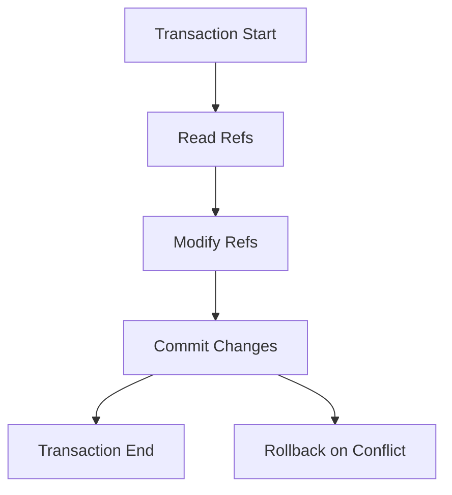

## 10.3 Software Transactional Memory (STM)

As experienced Java developers, you are likely familiar with the challenges of managing concurrency in enterprise applications. Java's concurrency model, while powerful, often requires intricate synchronization mechanisms to ensure thread safety and consistency. This complexity can lead to difficult-to-debug issues such as deadlocks and race conditions. Enter Clojure's Software Transactional Memory (STM), a concurrency model that simplifies state management by allowing coordinated state changes without explicit locks.

### Understanding Software Transactional Memory (STM)

Software Transactional Memory (STM) is a concurrency control mechanism analogous to database transactions. It allows multiple threads to execute transactions on shared memory concurrently, ensuring that these transactions are atomic, consistent, isolated, and durable (ACID properties). STM abstracts the complexity of locks and provides a more intuitive way to manage shared state.

#### Key Concepts of STM

1. **Transactions**: In STM, a transaction is a block of code that reads and writes to shared memory. Transactions are executed in isolation, meaning changes made by one transaction are not visible to others until the transaction is committed.

2. **Refs**: Refs are mutable references to immutable data. They are the primary means of managing shared state in STM. Changes to refs are coordinated through transactions.

3. **Commute and Retry**: STM provides functions like `commute` for operations that are commutative and can be reordered, and `retry` for retrying transactions when conflicts occur.

4. **Consistency and Isolation**: STM ensures that all transactions see a consistent view of the memory and that changes are isolated until committed.

### Implementing STM in Clojure

Let's explore how to implement STM in Clojure with practical examples. We'll start by defining a simple banking application where multiple transactions update account balances concurrently.

#### Example: Banking Application

```clojure
(ns banking.core
  (:require [clojure.core.async :as async]))

;; Define refs for account balances
(def account-a (ref 1000))
(def account-b (ref 2000))

;; Function to transfer money between accounts
(defn transfer [from-account to-account amount]
  (dosync
    (alter from-account - amount)
    (alter to-account + amount)))

;; Transfer $100 from account-a to account-b
(transfer account-a account-b 100)

;; Check balances
(println "Account A balance:" @account-a)
(println "Account B balance:" @account-b)
```

In this example, we define two accounts as refs and a `transfer` function that performs a transaction to move money between accounts. The `dosync` block ensures that the operations are atomic and consistent.

#### Benefits of STM in Enterprise Applications

1. **Simplified Concurrency**: STM abstracts the complexity of locks, making it easier to reason about concurrent code.

2. **Scalability**: STM allows multiple transactions to proceed concurrently, improving scalability in multi-threaded applications.

3. **Reduced Errors**: By eliminating explicit locks, STM reduces the likelihood of deadlocks and race conditions.

4. **Improved Maintainability**: STM's declarative approach to state management leads to cleaner and more maintainable code.

### Comparing STM with Java's Concurrency Model

In Java, concurrency is typically managed using synchronized blocks, locks, and concurrent collections. While these tools are effective, they require careful management to avoid issues like deadlocks and race conditions.

#### Java Example: Synchronized Banking Application

```java
public class BankAccount {
    private int balance;

    public BankAccount(int initialBalance) {
        this.balance = initialBalance;
    }

    public synchronized void transfer(BankAccount toAccount, int amount) {
        this.balance -= amount;
        toAccount.balance += amount;
    }

    public synchronized int getBalance() {
        return balance;
    }
}

public class BankingApp {
    public static void main(String[] args) {
        BankAccount accountA = new BankAccount(1000);
        BankAccount accountB = new BankAccount(2000);

        accountA.transfer(accountB, 100);

        System.out.println("Account A balance: " + accountA.getBalance());
        System.out.println("Account B balance: " + accountB.getBalance());
    }
}
```

In this Java example, we use synchronized methods to ensure thread safety. While effective, this approach can become cumbersome in complex applications with multiple shared resources.

### Visualizing STM with Diagrams

To better understand STM, let's visualize the flow of data through transactions and refs.



**Diagram Description**: This flowchart illustrates the lifecycle of a transaction in STM. Transactions start by reading refs, modifying them, and then attempting to commit changes. If a conflict occurs, the transaction is rolled back and retried.

### Use Cases for STM in Enterprise Applications

1. **Financial Systems**: STM is ideal for applications that require atomic updates to shared financial data, such as banking and trading systems.

2. **Inventory Management**: In systems where inventory levels are updated concurrently, STM ensures consistency and prevents overselling.

3. **Collaborative Applications**: Applications that support real-time collaboration, such as document editors, can benefit from STM's ability to manage concurrent edits.

### Best Practices for Using STM

1. **Minimize Transaction Scope**: Keep transactions small to reduce contention and improve performance.

2. **Use Commute for Commutative Operations**: Leverage the `commute` function for operations that can be reordered without affecting the outcome.

3. **Avoid Side Effects in Transactions**: Ensure that transactions are pure and do not have side effects, as they may be retried multiple times.

4. **Monitor Performance**: Use profiling tools to monitor the performance of STM in your application and identify bottlenecks.

### Knowledge Check

- What are the key benefits of using STM in Clojure?
- How does STM ensure consistency and isolation in transactions?
- Compare and contrast STM with Java's concurrency model.

### Encouraging Experimentation

Now that we've explored how STM works in Clojure, let's apply these concepts to manage state effectively in your applications. Try modifying the banking example to handle multiple concurrent transfers and observe how STM maintains consistency.

### Further Reading

- [Clojure's Official Documentation on STM](https://clojure.org/reference/refs)
- [ClojureDocs: Software Transactional Memory](https://clojuredocs.org/clojure.core/dosync)
- [GitHub Repository: Clojure Concurrency Examples](https://github.com/clojure-examples/concurrency)

## **Quiz: Are You Ready to Migrate from Java to Clojure?**



### What is the primary purpose of Software Transactional Memory (STM)?

- [x] To manage concurrency without explicit locks
- [ ] To improve the speed of single-threaded applications
- [ ] To replace all Java concurrency mechanisms
- [ ] To handle file I/O operations

> **Explanation:** STM is designed to manage concurrency by allowing coordinated state changes without the need for explicit locks.

### Which of the following is a key feature of STM in Clojure?

- [x] Transactions
- [ ] Threads
- [ ] Synchronized blocks
- [ ] Volatile variables

> **Explanation:** Transactions are a fundamental feature of STM, allowing for atomic and isolated state changes.

### How does STM ensure consistency and isolation?

- [x] By executing transactions in isolation and committing changes atomically
- [ ] By using synchronized blocks
- [ ] By locking all shared resources
- [ ] By using volatile variables

> **Explanation:** STM ensures consistency and isolation by executing transactions in isolation and committing changes atomically.

### What is a ref in Clojure's STM?

- [x] A mutable reference to immutable data
- [ ] A synchronized block
- [ ] A thread-safe collection
- [ ] A volatile variable

> **Explanation:** A ref is a mutable reference to immutable data, used to manage shared state in STM.

### Which function is used for commutative operations in STM?

- [x] commute
- [ ] alter
- [ ] retry
- [ ] dosync

> **Explanation:** The `commute` function is used for operations that can be reordered without affecting the outcome.

### What happens if a conflict occurs during a transaction in STM?

- [x] The transaction is rolled back and retried
- [ ] The transaction is aborted permanently
- [ ] The transaction is committed with partial changes
- [ ] The transaction is ignored

> **Explanation:** If a conflict occurs, the transaction is rolled back and retried to ensure consistency.

### How can you monitor the performance of STM in your application?

- [x] Use profiling tools
- [ ] Use synchronized blocks
- [ ] Use logging statements
- [ ] Use volatile variables

> **Explanation:** Profiling tools can help monitor the performance of STM and identify bottlenecks.

### What is a common use case for STM in enterprise applications?

- [x] Financial systems
- [ ] Single-threaded applications
- [ ] File I/O operations
- [ ] Static websites

> **Explanation:** STM is commonly used in financial systems where atomic updates to shared data are required.

### Why should side effects be avoided in STM transactions?

- [x] Because transactions may be retried multiple times
- [ ] Because side effects improve performance
- [ ] Because side effects are not allowed in Clojure
- [ ] Because side effects are always harmful

> **Explanation:** Side effects should be avoided because transactions may be retried multiple times, leading to unintended consequences.

### True or False: STM eliminates the need for all concurrency mechanisms in Java.

- [ ] True
- [x] False

> **Explanation:** While STM simplifies concurrency management, it does not eliminate the need for all concurrency mechanisms in Java.


