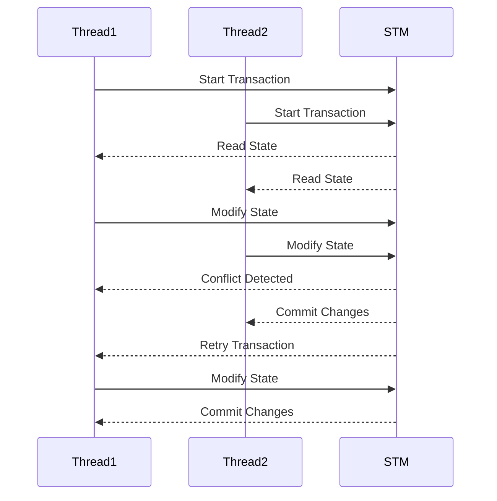

## 10.3 Software Transactional Memory (STM)

In the realm of concurrent programming, managing shared state is a complex challenge that often leads to issues such as race conditions, deadlocks, and inconsistent data. Traditional approaches in Java, such as synchronized blocks and locks, can be cumbersome and error-prone. Clojure offers a powerful alternative: Software Transactional Memory (STM). In this section, we will delve into the concept of STM, its benefits, and how it can be effectively utilized in enterprise applications to manage coordinated state changes.

### Understanding Software Transactional Memory

Software Transactional Memory (STM) is a concurrency control mechanism analogous to database transactions for memory operations. It allows multiple threads to execute transactions concurrently, ensuring that they do not interfere with each other. STM provides a way to manage shared state without explicit locks, making it easier to reason about concurrent code.

#### Key Concepts of STM

1. **Transactions**: In STM, a transaction is a sequence of operations that are executed atomically. If a transaction fails, it is rolled back and retried, ensuring consistency.

2. **Refs**: Refs are mutable references to immutable data. They are the primary mechanism for managing shared state in STM. Changes to refs are made within transactions.

3. **Consistency**: STM ensures that all transactions see a consistent view of the data. If a transaction conflicts with another, it is automatically retried.

4. **Isolation**: Transactions are isolated from each other, meaning that intermediate states are not visible to other transactions.

5. **Atomicity**: Changes made within a transaction are atomic; they either complete entirely or not at all.

### Implementing STM in Clojure

Clojure's STM is built into the language and provides a straightforward way to manage shared state. Let's explore how to implement STM in Clojure with practical examples.

#### Using Refs and Transactions

To use STM in Clojure, you define refs to hold shared state and use the `dosync` macro to create transactions. Here's a simple example:

```clojure
;; Define a ref to hold shared state
(def account-balance (ref 1000))

;; Function to deposit money into the account
(defn deposit [amount]
  (dosync
    (alter account-balance + amount)))

;; Function to withdraw money from the account
(defn withdraw [amount]
  (dosync
    (alter account-balance - amount)))

;; Example usage
(deposit 200)
(withdraw 150)

;; Check the account balance
@account-balance ; => 1050
```

In this example, `account-balance` is a ref that holds the account's balance. The `deposit` and `withdraw` functions modify the balance within a transaction using the `dosync` macro. The `alter` function is used to update the ref's value.

#### Handling Conflicts and Retries

STM automatically handles conflicts and retries transactions when necessary. Consider the following scenario:

```clojure
(defn transfer [from-account to-account amount]
  (dosync
    (alter from-account - amount)
    (alter to-account + amount)))

;; Define two accounts
(def account1 (ref 1000))
(def account2 (ref 500))

;; Transfer money between accounts
(transfer account1 account2 200)

;; Check balances
[@account1 @account2] ; => [800 700]
```

If two threads attempt to transfer money simultaneously, STM will detect the conflict and retry one of the transactions, ensuring consistency.

### Benefits of STM in Enterprise Applications

STM offers several advantages for enterprise applications, particularly in environments with high concurrency and complex state management requirements.

#### Simplified Concurrency

STM abstracts away the complexity of locks and synchronization, allowing developers to focus on business logic rather than concurrency control. This simplification reduces the likelihood of concurrency-related bugs.

#### Improved Scalability

By allowing transactions to execute concurrently without explicit locks, STM can improve the scalability of applications. This is particularly beneficial in multi-core and distributed environments.

#### Enhanced Maintainability

The declarative nature of STM makes concurrent code easier to read and maintain. Transactions clearly define the scope of state changes, making it easier to reason about the code.

#### Use Cases for STM

STM is well-suited for applications that require coordinated state changes across multiple components. Some common use cases include:

- **Financial Systems**: Managing account balances and transactions in banking applications.
- **Inventory Management**: Coordinating stock levels across multiple warehouses.
- **Collaborative Applications**: Ensuring consistency in shared documents or resources.

### Comparing STM with Java's Concurrency Model

Java's concurrency model relies heavily on locks and synchronized blocks, which can lead to complex and error-prone code. Let's compare Java's approach with Clojure's STM to highlight the differences.

#### Java's Concurrency Model

In Java, managing shared state typically involves using `synchronized` blocks or `Lock` objects to ensure mutual exclusion. Here's a simple example:

```java
public class Account {
    private int balance;

    public synchronized void deposit(int amount) {
        balance += amount;
    }

    public synchronized void withdraw(int amount) {
        balance -= amount;
    }

    public synchronized int getBalance() {
        return balance;
    }
}
```

While this approach works, it can lead to issues such as deadlocks and reduced performance due to contention.

#### Clojure's STM Model

Clojure's STM model eliminates the need for explicit locks, reducing the risk of deadlocks and improving performance. Transactions are retried automatically in case of conflicts, ensuring consistency without manual intervention.

### Visualizing STM in Clojure

To better understand how STM works in Clojure, let's visualize the process using a sequence diagram.



This diagram illustrates how two threads interact with STM. When a conflict is detected, one transaction is retried, ensuring that only consistent changes are committed.

### Best Practices for Using STM

To effectively use STM in enterprise applications, consider the following best practices:

1. **Minimize Transaction Scope**: Keep transactions small and focused to reduce contention and improve performance.

2. **Avoid Side Effects**: Transactions should be free of side effects, such as I/O operations, to ensure they can be safely retried.

3. **Use Refs Appropriately**: Use refs for shared state that requires coordinated changes. For independent state, consider using atoms or agents.

4. **Monitor Performance**: Use profiling tools to monitor the performance of STM transactions and identify bottlenecks.

### Migration Strategies from Java to Clojure STM

Transitioning from Java's concurrency model to Clojure's STM requires a shift in mindset and approach. Here are some strategies to facilitate the migration:

#### Identify Shared State

Begin by identifying areas of your Java application that involve shared state and concurrency. These are prime candidates for refactoring to use STM.

#### Refactor Incrementally

Refactor your code incrementally, starting with small, isolated components. This approach allows you to test and validate each change before proceeding.

#### Leverage Clojure's Interoperability

Clojure's interoperability with Java allows you to gradually introduce STM into your existing Java codebase. You can call Clojure functions from Java and vice versa, enabling a smooth transition.

#### Train Your Team

Ensure that your development team is familiar with Clojure and STM concepts. Provide training and resources to help them understand the benefits and best practices of STM.

### Conclusion

Software Transactional Memory (STM) in Clojure offers a powerful and elegant solution to the challenges of concurrent programming. By abstracting away the complexity of locks and synchronization, STM simplifies the development of concurrent applications, making them more scalable, maintainable, and robust. As you transition from Java OOP to Clojure's functional paradigm, embracing STM can significantly enhance your enterprise applications' performance and reliability.

For further reading on Clojure's STM, refer to the [Clojure STM Guide](https://clojure.org/reference/refs) and explore additional resources in the [Clojure Community Resources](https://clojure.org/community/resources).

## **Quiz: Are You Ready to Migrate from Java to Clojure?**



### What is the primary mechanism for managing shared state in Clojure's STM?

- [x] Refs
- [ ] Atoms
- [ ] Agents
- [ ] Vars

> **Explanation:** Refs are used in Clojure's STM to manage shared state within transactions.

### Which of the following is a key benefit of using STM in enterprise applications?

- [x] Simplified concurrency
- [ ] Increased complexity
- [ ] Manual lock management
- [ ] Reduced scalability

> **Explanation:** STM simplifies concurrency by abstracting away locks and synchronization, making code easier to manage.

### How does STM ensure consistency in transactions?

- [x] By automatically retrying conflicting transactions
- [ ] By using explicit locks
- [ ] By allowing intermediate states to be visible
- [ ] By ignoring conflicts

> **Explanation:** STM automatically retries transactions that conflict, ensuring consistency without manual intervention.

### What is a common use case for STM in enterprise applications?

- [x] Financial systems
- [ ] Single-threaded applications
- [ ] Static websites
- [ ] Simple scripts

> **Explanation:** STM is well-suited for managing complex state changes in financial systems and other concurrent applications.

### Which Clojure macro is used to create transactions in STM?

- [x] dosync
- [ ] def
- [ ] let
- [ ] loop

> **Explanation:** The `dosync` macro is used to create transactions in Clojure's STM.

### What should be avoided within STM transactions to ensure they can be safely retried?

- [x] Side effects
- [ ] Immutable data
- [ ] Pure functions
- [ ] Refs

> **Explanation:** Transactions should avoid side effects, such as I/O operations, to ensure they can be safely retried.

### What is the advantage of using STM over Java's synchronized blocks?

- [x] Reduced risk of deadlocks
- [ ] Increased complexity
- [ ] Manual lock management
- [ ] Slower performance

> **Explanation:** STM reduces the risk of deadlocks by eliminating the need for explicit locks.

### How does Clojure's STM model improve scalability?

- [x] By allowing concurrent transactions without explicit locks
- [ ] By using more threads
- [ ] By increasing memory usage
- [ ] By reducing transaction size

> **Explanation:** STM improves scalability by allowing transactions to execute concurrently without explicit locks.

### What is the role of the `alter` function in Clojure's STM?

- [x] To update the value of a ref within a transaction
- [ ] To create a new ref
- [ ] To read the value of a ref
- [ ] To delete a ref

> **Explanation:** The `alter` function is used to update the value of a ref within a transaction in Clojure's STM.

### True or False: STM transactions in Clojure are isolated from each other.

- [x] True
- [ ] False

> **Explanation:** STM transactions are isolated, meaning intermediate states are not visible to other transactions.


