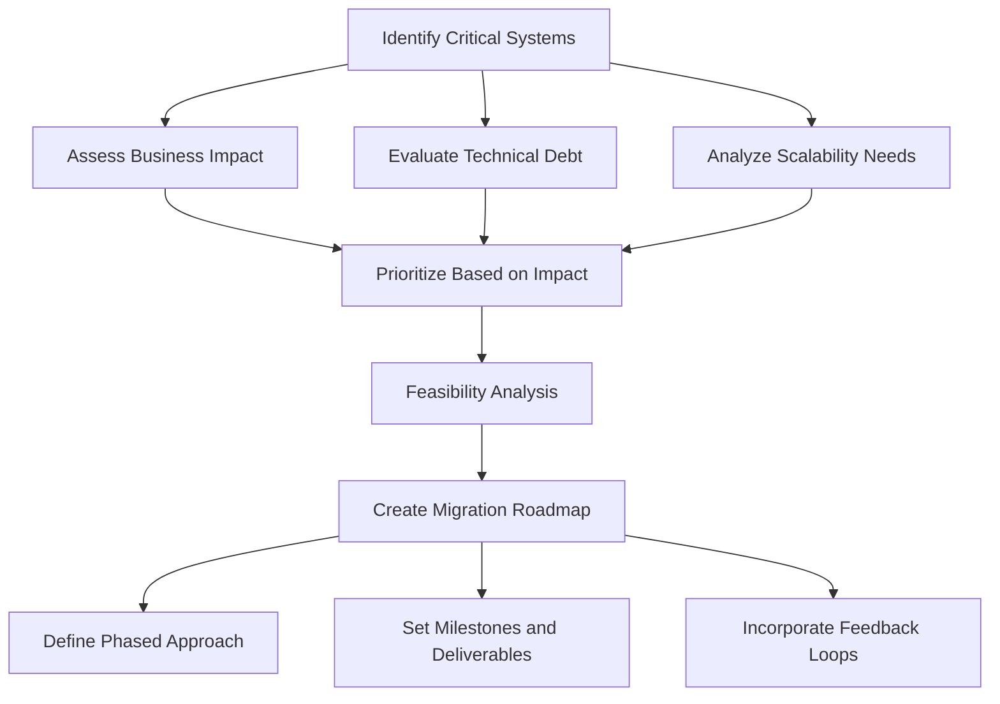

## 11.1 Defining Scope and Priorities

Embarking on the journey of migrating from Java Object-Oriented Programming (OOP) to Clojure's functional programming paradigm requires meticulous planning and strategic foresight. Defining the scope and setting priorities are foundational steps in ensuring a smooth transition. In this section, we will explore how to identify critical systems for migration and prioritize them based on impact and feasibility.

### Understanding the Importance of Scope Definition

Defining the scope of your migration project is akin to setting the boundaries and objectives of a journey. It involves determining which systems, components, and functionalities will be included in the migration process. A well-defined scope helps in:

- **Aligning Stakeholder Expectations:** Clearly defined scope ensures that all stakeholders have a shared understanding of what the migration will entail.
- **Resource Allocation:** It aids in the efficient allocation of resources, including time, budget, and personnel.
- **Risk Management:** By understanding the scope, potential risks can be identified and mitigated early in the process.

### Identifying Critical Systems for Migration

The first step in defining the scope is identifying which systems are critical for migration. This involves evaluating your current Java systems and determining which ones will benefit most from the transition to Clojure. Consider the following factors:

1. **Business Impact:** Assess the systems that have the most significant impact on your business operations. These are often the systems that handle core business processes or customer interactions.

2. **Technical Debt:** Identify systems with high technical debt that could benefit from the cleaner, more maintainable codebase that Clojure offers.

3. **Scalability Needs:** Systems that are struggling with scalability issues may benefit from Clojure's capabilities in handling concurrency and distributed systems.

4. **Innovation Potential:** Consider systems where innovation and rapid development are crucial. Clojure's expressiveness and flexibility can accelerate development cycles.

5. **Integration Complexity:** Evaluate the complexity of integrating Clojure with existing systems. Systems with fewer dependencies may be easier to migrate initially.

### Prioritizing Based on Impact and Feasibility

Once critical systems are identified, the next step is to prioritize them based on their impact and feasibility. This involves balancing the potential benefits of migration against the challenges and resources required. Here are some strategies to guide prioritization:

#### Impact Assessment

- **Value to Business:** Prioritize systems that deliver the most value to the business. This could be in terms of revenue generation, cost savings, or strategic importance.
- **User Experience:** Systems that directly impact user experience should be prioritized to enhance customer satisfaction and retention.
- **Operational Efficiency:** Consider systems that can significantly improve operational efficiency through automation or streamlined processes.

#### Feasibility Analysis

- **Technical Complexity:** Assess the technical complexity of migrating each system. Systems with simpler architectures or fewer dependencies may be prioritized for early migration.
- **Resource Availability:** Consider the availability of skilled personnel and other resources required for migration. Systems that can be migrated with existing resources may be prioritized.
- **Risk Assessment:** Evaluate the risks associated with migrating each system. Systems with lower risk profiles may be prioritized to build confidence and momentum in the migration process.

### Creating a Migration Roadmap

With the scope defined and priorities set, the next step is to create a migration roadmap. This roadmap serves as a strategic plan that outlines the sequence and timeline of migration activities. It should include:

- **Phased Approach:** Consider a phased approach to migration, starting with less critical systems to build expertise and confidence before tackling more complex systems.
- **Milestones and Deliverables:** Define clear milestones and deliverables for each phase of the migration to track progress and ensure accountability.
- **Feedback Loops:** Incorporate feedback loops to gather insights and make adjustments as needed. This iterative approach allows for continuous improvement and adaptation.

### Code Example: Evaluating System Complexity

To illustrate how you might evaluate the complexity of a system for migration, let's consider a simple Java class and its equivalent in Clojure. This example demonstrates how to assess the complexity of translating Java OOP concepts to Clojure's functional paradigm.

**Java Example:**

```java
public class OrderProcessor {
    private List<Order> orders;

    public OrderProcessor(List<Order> orders) {
        this.orders = orders;
    }

    public double calculateTotal() {
        double total = 0;
        for (Order order : orders) {
            total += order.getAmount();
        }
        return total;
    }
}
```

**Clojure Equivalent:**

```clojure
(defn calculate-total [orders]
  (reduce + (map :amount orders)))

;; Usage
(def orders [{:amount 100} {:amount 200} {:amount 300}])
(calculate-total orders) ;; => 600
```

**Key Differences:**

- **Immutability:** In Clojure, data structures are immutable by default, reducing the complexity associated with state management.
- **Functional Composition:** The use of `map` and `reduce` in Clojure promotes functional composition, making the code more concise and expressive.

**Try It Yourself:** Modify the Clojure code to apply a discount to each order before calculating the total. This exercise will help you understand how to manipulate data in a functional style.

### Visual Aids: Migration Planning Flowchart

Below is a flowchart that visually represents the process of defining scope and setting priorities for migration. This diagram illustrates the steps involved in evaluating systems, assessing impact and feasibility, and creating a migration roadmap.



**Diagram Description:** This flowchart outlines the steps in defining scope and priorities for migration, starting with identifying critical systems and ending with creating a migration roadmap.

### References and Further Reading

- [Clojure Official Documentation](https://clojure.org/reference)
- [Transitioning from OOP to Functional Programming](https://www.lispcast.com/oo-to-fp/)
- [Clojure Community Resources](https://clojure.org/community/resources)

### Knowledge Check

To ensure you have a solid understanding of defining scope and priorities, consider the following questions:

1. What are the key factors to consider when identifying critical systems for migration?
2. How does assessing business impact help in prioritizing systems for migration?
3. Why is it important to evaluate the technical complexity of systems during migration planning?
4. What role does a migration roadmap play in the transition process?

### Exercises

1. **System Evaluation Exercise:** Choose a Java system from your organization and evaluate its readiness for migration to Clojure. Consider factors such as business impact, technical debt, and scalability needs.

2. **Prioritization Exercise:** Create a prioritization matrix for the systems identified in the previous exercise. Rank them based on impact and feasibility.

### Summary

Defining scope and setting priorities are crucial steps in the migration process from Java OOP to Clojure. By identifying critical systems and prioritizing them based on impact and feasibility, organizations can ensure a strategic and efficient transition. A well-defined scope and clear priorities provide a roadmap for success, enabling teams to focus their efforts on high-impact areas and manage resources effectively.

## **Quiz: Are You Ready to Migrate from Java to Clojure?**



### What is the first step in defining the scope of a migration project?

- [x] Identifying critical systems for migration
- [ ] Allocating resources
- [ ] Creating a migration roadmap
- [ ] Setting milestones and deliverables

> **Explanation:** Identifying critical systems for migration is the first step in defining the scope, as it helps determine which systems will be included in the migration process.

### Which factor is NOT considered when prioritizing systems for migration?

- [ ] Business impact
- [ ] Technical debt
- [x] Employee satisfaction
- [ ] Scalability needs

> **Explanation:** Employee satisfaction is not a direct factor in prioritizing systems for migration, whereas business impact, technical debt, and scalability needs are key considerations.

### What is a benefit of defining the scope of a migration project?

- [x] Aligning stakeholder expectations
- [ ] Increasing technical debt
- [ ] Reducing business impact
- [ ] Eliminating all risks

> **Explanation:** Defining the scope helps align stakeholder expectations, ensuring everyone has a shared understanding of the migration objectives.

### What is the purpose of a migration roadmap?

- [x] To outline the sequence and timeline of migration activities
- [ ] To increase the complexity of the migration process
- [ ] To eliminate the need for stakeholder engagement
- [ ] To reduce the number of systems to be migrated

> **Explanation:** A migration roadmap outlines the sequence and timeline of migration activities, providing a strategic plan for the transition.

### Which strategy is recommended for creating a migration roadmap?

- [x] Phased approach
- [ ] Big bang approach
- [ ] Random selection
- [ ] Immediate migration of all systems

> **Explanation:** A phased approach is recommended for creating a migration roadmap, as it allows for gradual transition and learning.

### What is a key difference between Java and Clojure in terms of data management?

- [x] Immutability in Clojure
- [ ] Mutable data structures in Clojure
- [ ] Lack of functional composition in Clojure
- [ ] Object-oriented inheritance in Clojure

> **Explanation:** Clojure uses immutable data structures by default, which is a key difference from Java's mutable data structures.

### How can technical complexity affect migration prioritization?

- [x] Systems with simpler architectures may be prioritized for early migration
- [ ] Systems with higher complexity should always be migrated first
- [ ] Technical complexity has no impact on prioritization
- [ ] Only systems with no complexity should be migrated

> **Explanation:** Systems with simpler architectures may be prioritized for early migration to build expertise and confidence.

### Why is it important to incorporate feedback loops in the migration process?

- [x] To gather insights and make adjustments as needed
- [ ] To increase the complexity of the migration
- [ ] To eliminate the need for a migration roadmap
- [ ] To reduce stakeholder engagement

> **Explanation:** Feedback loops are important for gathering insights and making adjustments, allowing for continuous improvement.

### What is a potential benefit of migrating systems with high technical debt?

- [x] Cleaner, more maintainable codebase
- [ ] Increased technical debt
- [ ] Reduced business impact
- [ ] Elimination of all risks

> **Explanation:** Migrating systems with high technical debt can lead to a cleaner, more maintainable codebase, reducing future maintenance challenges.

### True or False: A well-defined scope can help in efficient resource allocation.

- [x] True
- [ ] False

> **Explanation:** True. A well-defined scope helps in efficient resource allocation by clarifying the objectives and boundaries of the migration project.


