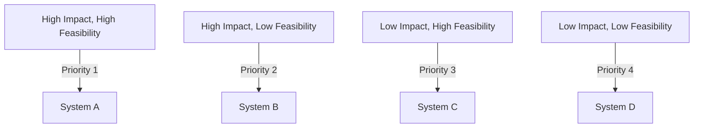

## 11.1 Defining Scope and Priorities

In the journey of migrating from Java's Object-Oriented Programming (OOP) paradigm to Clojure's functional programming approach, defining the scope and setting priorities is a crucial step. This section will guide you through identifying critical systems for migration and prioritizing them based on impact and feasibility. By the end of this chapter, you'll have a clear roadmap for your migration process, ensuring a smooth transition that aligns with your enterprise goals.

### Understanding the Importance of Scope and Priorities

Before diving into the technical aspects of migration, it's essential to understand why defining scope and setting priorities is vital. In any large-scale software migration, resources are limited, and the complexity can be overwhelming. By clearly defining what needs to be migrated and in what order, you can:

- **Maximize Resource Utilization**: Ensure that your team focuses on the most impactful areas first.
- **Minimize Risks**: Address potential challenges early in the process.
- **Align with Business Goals**: Ensure that the migration supports your organization's strategic objectives.

### Identifying Critical Systems for Migration

The first step in defining the scope is to identify which systems or components are critical for migration. This involves evaluating your current Java systems and understanding their role within your enterprise. Here are some steps to guide you:

#### 1. **Conduct a System Inventory**

Start by creating a comprehensive inventory of all Java-based systems within your organization. This inventory should include:

- **System Name**: The name of the application or service.
- **Functionality**: A brief description of what the system does.
- **Dependencies**: Other systems or services that depend on or are used by this system.
- **Business Impact**: The importance of the system to your business operations.

#### 2. **Evaluate System Complexity**

Assess the complexity of each system. Systems with high complexity might require more effort to migrate but could also offer significant benefits once migrated. Consider factors such as:

- **Codebase Size**: Larger codebases may be more challenging to migrate.
- **Integration Points**: Systems with numerous integrations may require careful planning.
- **Technical Debt**: Legacy systems with outdated technology or poor code quality may benefit from a migration.

#### 3. **Assess Business Impact**

Determine the business impact of each system. Systems that are critical to your operations or customer-facing should be prioritized. Consider:

- **Revenue Impact**: Systems that directly contribute to revenue generation.
- **Customer Experience**: Systems that affect customer satisfaction and engagement.
- **Operational Efficiency**: Systems that streamline internal processes.

#### 4. **Identify Quick Wins**

Look for systems that can be migrated quickly with minimal effort. These "quick wins" can provide immediate benefits and build momentum for the migration process.

### Prioritizing Based on Impact and Feasibility

Once you've identified the critical systems, the next step is to prioritize them based on their impact and feasibility. This involves balancing the potential benefits of migration against the effort required. Here's how to approach this:

#### 1. **Impact Assessment**

Evaluate the potential impact of migrating each system. Consider:

- **Performance Improvements**: Will the migration improve system performance or scalability?
- **Maintainability**: Will the migration make the system easier to maintain or extend?
- **Innovation**: Will the migration enable new features or capabilities?

#### 2. **Feasibility Analysis**

Assess the feasibility of migrating each system. Consider:

- **Technical Challenges**: Are there significant technical hurdles to overcome?
- **Resource Availability**: Do you have the necessary skills and resources to complete the migration?
- **Time Constraints**: Can the migration be completed within a reasonable timeframe?

#### 3. **Create a Prioritization Matrix**

To systematically prioritize systems, create a matrix that plots impact against feasibility. This visual tool can help you identify which systems should be migrated first. Here's an example of how such a matrix might look:



### Developing a Migration Roadmap

With your priorities set, the next step is to develop a migration roadmap. This roadmap will guide your migration process, ensuring that you stay on track and achieve your goals. Here's how to create an effective roadmap:

#### 1. **Define Migration Phases**

Break the migration process into manageable phases. Each phase should have clear objectives and deliverables. For example:

- **Phase 1**: Migrate quick wins and foundational systems.
- **Phase 2**: Address high-impact systems with moderate feasibility.
- **Phase 3**: Tackle complex systems with high impact.

#### 2. **Set Milestones and Deadlines**

Establish milestones and deadlines for each phase. This will help you track progress and ensure that the migration stays on schedule.

#### 3. **Allocate Resources**

Assign resources to each phase based on the complexity and effort required. Ensure that your team has the necessary skills and support to complete the migration.

#### 4. **Monitor and Adjust**

Regularly monitor progress and adjust your roadmap as needed. Be prepared to adapt to changing circumstances and address any challenges that arise.

### Code Examples: Java vs. Clojure

To illustrate the migration process, let's look at a simple example of migrating a Java class to Clojure. We'll start with a Java class that represents a basic user profile and then convert it to a Clojure data structure.

#### Java Code Example

```java
public class UserProfile {
    private String name;
    private int age;
    private String email;

    public UserProfile(String name, int age, String email) {
        this.name = name;
        this.age = age;
        this.email = email;
    }

    public String getName() {
        return name;
    }

    public int getAge() {
        return age;
    }

    public String getEmail() {
        return email;
    }
}
```

#### Clojure Code Example

```clojure
;; Define a user profile as a map
(def user-profile
  {:name "Alice"
   :age 30
   :email "alice@example.com"})

;; Accessing values
(println (:name user-profile))  ;; Output: Alice
(println (:age user-profile))   ;; Output: 30
(println (:email user-profile)) ;; Output: alice@example.com
```

**Key Differences:**

- **Immutability**: In Clojure, data structures are immutable by default, which simplifies state management.
- **Conciseness**: Clojure's syntax is more concise, reducing boilerplate code.
- **Data Orientation**: Clojure treats data as first-class citizens, making it easier to manipulate and transform.

### Visual Aids: Prioritization Matrix

To further illustrate the prioritization process, let's revisit the prioritization matrix with a more detailed example. This matrix helps visualize the trade-offs between impact and feasibility.


**Description**: This diagram categorizes systems into four quadrants based on their impact and feasibility. Systems in the top-left quadrant (high impact, high feasibility) should be prioritized first, while those in the bottom-right quadrant (low impact, low feasibility) can be deferred.

### References and Links

For further reading on defining scope and priorities in software migration, consider the following resources:

- [Official Clojure Documentation](https://clojure.org/)
- [ClojureDocs](https://clojuredocs.org/)
- [GitHub: Clojure Examples](https://github.com/clojure)

### Knowledge Check

To reinforce your understanding of defining scope and priorities, consider the following questions:

1. What are the key factors to consider when identifying critical systems for migration?
2. How can a prioritization matrix help in the migration process?
3. What are the benefits of breaking the migration process into phases?

### Encouraging Tone

Now that we've explored how to define scope and set priorities for your migration from Java to Clojure, you're well-equipped to embark on this transformative journey. Remember, the key to a successful migration is careful planning and prioritization. By focusing on the most impactful systems first, you'll maximize the benefits of Clojure's functional programming paradigm and position your organization for success.

### Quiz: Are You Ready to Migrate from Java to Clojure?



### Which of the following is a key step in defining the scope of a migration project?

- [x] Conducting a system inventory
- [ ] Writing unit tests
- [ ] Designing a new user interface
- [ ] Implementing a new database

> **Explanation:** Conducting a system inventory helps identify all Java-based systems and their roles within the organization, which is crucial for defining the migration scope.

### What is the primary purpose of a prioritization matrix in the migration process?

- [x] To balance impact and feasibility
- [ ] To allocate resources
- [ ] To design new features
- [ ] To write documentation

> **Explanation:** A prioritization matrix helps balance the potential impact of migrating systems against the feasibility of doing so, guiding the order of migration.

### Which factor is NOT typically considered when assessing system complexity?

- [ ] Codebase size
- [ ] Integration points
- [ ] Technical debt
- [x] User interface design

> **Explanation:** User interface design is not typically a factor in assessing system complexity for migration purposes.

### What is a "quick win" in the context of migration?

- [x] A system that can be migrated quickly with minimal effort
- [ ] A system that generates the most revenue
- [ ] A system with the most users
- [ ] A system that requires the most resources

> **Explanation:** A "quick win" refers to systems that can be migrated quickly and easily, providing immediate benefits.

### How does Clojure's immutability benefit system migration?

- [x] Simplifies state management
- [ ] Increases code verbosity
- [ ] Requires more memory
- [ ] Complicates data handling

> **Explanation:** Clojure's immutability simplifies state management by ensuring that data structures cannot be altered once created.

### What is the first step in developing a migration roadmap?

- [x] Define migration phases
- [ ] Allocate resources
- [ ] Set milestones
- [ ] Monitor progress

> **Explanation:** Defining migration phases is the first step in creating a roadmap, breaking the process into manageable parts.

### Which of the following is a benefit of setting milestones in a migration roadmap?

- [x] Helps track progress
- [ ] Increases complexity
- [ ] Reduces team size
- [ ] Limits innovation

> **Explanation:** Setting milestones helps track progress and ensures that the migration stays on schedule.

### What should be done if challenges arise during the migration process?

- [x] Adjust the roadmap as needed
- [ ] Ignore the challenges
- [ ] Stop the migration
- [ ] Increase the budget

> **Explanation:** Adjusting the roadmap allows you to adapt to changing circumstances and address challenges effectively.

### What is the role of resource allocation in the migration process?

- [x] Ensures the team has necessary skills and support
- [ ] Reduces project scope
- [ ] Increases project cost
- [ ] Limits team collaboration

> **Explanation:** Resource allocation ensures that the team has the necessary skills and support to complete the migration successfully.

### True or False: Systems with low impact and low feasibility should be prioritized first.

- [ ] True
- [x] False

> **Explanation:** Systems with low impact and low feasibility should be deferred, as they offer minimal benefits and require significant effort.



By following these guidelines and leveraging the power of Clojure, you'll be well on your way to a successful migration that enhances your enterprise's scalability, maintainability, and productivity.
