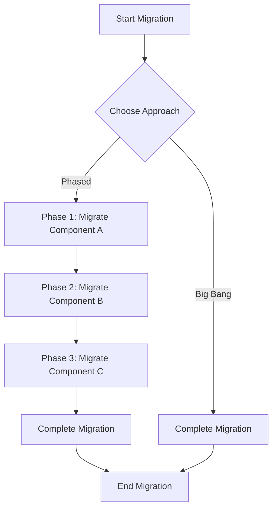

## 11.2 Phased vs. Big Bang Approach

In the journey of migrating from Java Object-Oriented Programming (OOP) to Clojure's functional programming paradigm, one of the most critical decisions is choosing between a phased approach and a big bang approach. Each strategy has its own set of advantages and challenges, and the choice largely depends on the specific needs and constraints of your enterprise. In this section, we will explore both approaches in detail, weigh their pros and cons, and provide guidance on developing a phased migration roadmap.

### Understanding the Phased Approach

The phased approach involves gradually transitioning parts of your application from Java to Clojure over a period of time. This method allows for incremental changes and provides opportunities to test and validate each phase before moving on to the next.

#### Advantages of the Phased Approach

1. **Risk Mitigation**: By migrating in stages, you can identify and address issues early, minimizing the risk of widespread failures.
2. **Continuous Delivery**: Allows for continuous delivery of features and improvements, maintaining business operations without significant disruptions.
3. **Resource Allocation**: Easier to manage resources and allocate them to specific phases, ensuring focused attention and expertise where needed.
4. **Feedback Loops**: Provides opportunities for feedback and learning, enabling teams to adjust strategies based on real-world outcomes.
5. **Stakeholder Engagement**: Facilitates ongoing communication with stakeholders, keeping them informed and involved throughout the process.

#### Challenges of the Phased Approach

1. **Complexity in Integration**: Managing integration between Java and Clojure components can be complex and may require additional effort.
2. **Extended Timeline**: The phased approach can take longer to complete, potentially delaying the realization of full benefits.
3. **Resource Management**: Requires careful planning and management of resources across multiple phases, which can be challenging.

#### Developing a Phased Migration Roadmap

To effectively implement a phased approach, it's essential to develop a comprehensive migration roadmap. Here are the key steps:

1. **Assess Current Systems**: Begin by evaluating your existing Java systems to identify components that can be migrated independently.
2. **Define Phases**: Break down the migration into manageable phases, each with clear objectives and deliverables.
3. **Prioritize Components**: Prioritize components based on factors such as business impact, complexity, and dependencies.
4. **Plan Integration**: Develop a plan for integrating Clojure components with existing Java systems, ensuring seamless communication and data flow.
5. **Allocate Resources**: Assign resources to each phase, ensuring that teams have the necessary skills and support to succeed.
6. **Monitor Progress**: Continuously monitor progress and adjust plans as needed, using feedback and lessons learned to inform future phases.

### Exploring the Big Bang Approach

The big bang approach involves migrating the entire application from Java to Clojure in one comprehensive effort. This method aims to achieve a complete transition in a shorter timeframe, but it comes with its own set of risks and challenges.

#### Advantages of the Big Bang Approach

1. **Unified Transition**: Achieves a complete transition in one go, eliminating the need for ongoing integration between Java and Clojure components.
2. **Immediate Benefits**: Allows for immediate realization of the benefits of Clojure's functional programming paradigm across the entire application.
3. **Simplified Management**: Reduces the complexity of managing multiple phases and integration points, streamlining the migration process.

#### Challenges of the Big Bang Approach

1. **High Risk**: Involves significant risk, as any issues can impact the entire application and business operations.
2. **Resource Intensive**: Requires substantial resources and coordination to execute successfully, often necessitating a dedicated migration team.
3. **Disruption to Operations**: Can lead to disruptions in business operations during the transition period, affecting productivity and customer experience.

### Weighing the Pros and Cons

Choosing between a phased and big bang approach requires careful consideration of various factors, including:

- **Business Priorities**: Consider the impact on business operations and the urgency of realizing the benefits of Clojure.
- **Resource Availability**: Assess the availability of resources, including skilled personnel, time, and budget.
- **Risk Tolerance**: Evaluate your organization's tolerance for risk and its ability to manage potential disruptions.
- **Technical Complexity**: Consider the complexity of your existing systems and the feasibility of integrating Java and Clojure components.

### Visualizing the Migration Process

To better understand the differences between the phased and big bang approaches, let's visualize the migration process using a flowchart:



**Figure 1: Migration Process Flowchart**  
This flowchart illustrates the decision-making process and the sequence of steps involved in both the phased and big bang approaches.

### Code Examples: Java to Clojure Migration

Let's explore a simple example of migrating a Java class to a Clojure namespace, demonstrating the differences in syntax and structure.

**Java Class Example:**

```java
public class Calculator {
    private int value;

    public Calculator(int initialValue) {
        this.value = initialValue;
    }

    public int add(int number) {
        this.value += number;
        return this.value;
    }

    public int subtract(int number) {
        this.value -= number;
        return this.value;
    }
}
```

**Clojure Namespace Example:**

```clojure
(ns calculator)

(defn create-calculator [initial-value]
  {:value initial-value})

(defn add [calculator number]
  (update calculator :value + number))

(defn subtract [calculator number]
  (update calculator :value - number))
```

**Key Differences:**

- **Immutability**: In Clojure, data structures are immutable. The `add` and `subtract` functions return a new calculator map with the updated value.
- **Functional Composition**: Clojure emphasizes functions and data transformations, reducing the need for mutable state.

**Try It Yourself:**  
Experiment with the Clojure code by adding new functions or modifying existing ones to perform additional calculations.

### Knowledge Check

To reinforce your understanding of the phased and big bang approaches, consider the following questions:

1. What are the primary advantages of a phased approach in migrating from Java to Clojure?
2. How does the big bang approach differ in terms of risk and resource requirements?
3. What factors should be considered when choosing between a phased and big bang approach?

### Conclusion

Migrating from Java OOP to Clojure's functional programming paradigm is a significant undertaking that requires careful planning and strategic decision-making. By understanding the pros and cons of both the phased and big bang approaches, you can make informed choices that align with your organization's goals and constraints. Whether you opt for a gradual transition or a comprehensive overhaul, the key to success lies in thorough preparation, effective communication, and continuous learning.

For more information on planning your migration process, refer to [Chapter 11: Planning the Migration Process](#chapter-11-planning-the-migration-process).

### Additional Resources

- [Clojure Official Documentation](https://clojure.org/reference)
- [Clojure Community Resources](https://clojure.org/community/resources)
- [Transitioning from OOP to Functional Programming](https://www.lispcast.com/oo-to-fp/)

## **Quiz: Are You Ready to Migrate from Java to Clojure?**



### What is a key advantage of the phased approach?

- [x] Risk mitigation through incremental changes
- [ ] Immediate realization of benefits
- [ ] Simplified management
- [ ] High resource intensity

> **Explanation:** The phased approach allows for incremental changes, which helps in identifying and addressing issues early, thus mitigating risks.

### Which approach involves migrating the entire application in one effort?

- [ ] Phased approach
- [x] Big bang approach
- [ ] Incremental approach
- [ ] Iterative approach

> **Explanation:** The big bang approach involves migrating the entire application in one comprehensive effort.

### What is a challenge of the big bang approach?

- [x] High risk and potential disruption
- [ ] Extended timeline
- [ ] Complexity in integration
- [ ] Continuous delivery

> **Explanation:** The big bang approach involves significant risk, as any issues can impact the entire application and business operations.

### What should be considered when choosing between phased and big bang approaches?

- [x] Business priorities and risk tolerance
- [ ] Only technical complexity
- [ ] Only resource availability
- [ ] Only stakeholder engagement

> **Explanation:** When choosing between approaches, consider business priorities, risk tolerance, resource availability, and technical complexity.

### Which approach allows for continuous delivery of features?

- [x] Phased approach
- [ ] Big bang approach
- [ ] Waterfall approach
- [ ] Agile approach

> **Explanation:** The phased approach allows for continuous delivery of features and improvements, maintaining business operations without significant disruptions.

### What is a benefit of the big bang approach?

- [x] Immediate benefits realization
- [ ] Extended timeline
- [ ] Complexity in integration
- [ ] Incremental feedback loops

> **Explanation:** The big bang approach allows for immediate realization of the benefits of Clojure's functional programming paradigm across the entire application.

### How does the phased approach handle resource allocation?

- [x] Easier to manage and allocate resources to specific phases
- [ ] Requires substantial resources and coordination
- [ ] Reduces complexity of managing resources
- [ ] Disrupts business operations

> **Explanation:** The phased approach makes it easier to manage resources and allocate them to specific phases, ensuring focused attention and expertise where needed.

### What is a key factor in developing a phased migration roadmap?

- [x] Defining phases with clear objectives
- [ ] Migrating the entire application at once
- [ ] Simplifying management
- [ ] Reducing risk tolerance

> **Explanation:** Developing a phased migration roadmap involves defining phases with clear objectives and deliverables.

### Which approach is more likely to involve stakeholder engagement throughout the process?

- [x] Phased approach
- [ ] Big bang approach
- [ ] Waterfall approach
- [ ] Iterative approach

> **Explanation:** The phased approach facilitates ongoing communication with stakeholders, keeping them informed and involved throughout the process.

### True or False: The big bang approach is less resource-intensive than the phased approach.

- [ ] True
- [x] False

> **Explanation:** The big bang approach is more resource-intensive as it requires substantial resources and coordination to execute successfully.




