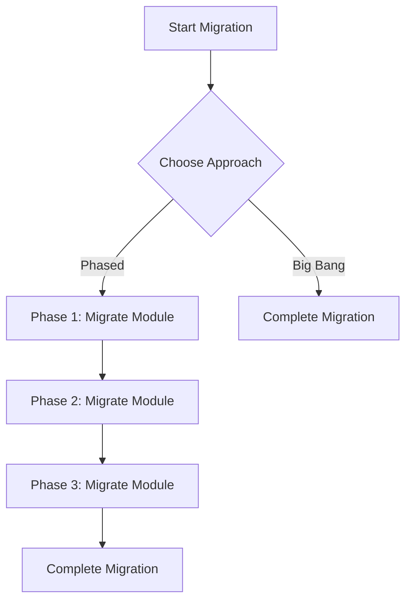

## 11.2 Phased vs. Big Bang Approach

Migrating an enterprise application from Java's Object-Oriented Programming (OOP) paradigm to Clojure's Functional Programming (FP) paradigm is a significant undertaking. It requires careful planning and execution to ensure a smooth transition with minimal disruption to business operations. In this section, we will explore two primary strategies for migration: the Phased Approach and the Big Bang Approach. We'll weigh their pros and cons, provide guidance on developing a phased migration roadmap, and offer insights into choosing the right strategy for your organization.

### Understanding the Phased Approach

The Phased Approach involves gradually migrating components of your Java application to Clojure over time. This strategy allows for incremental changes, reducing risk and enabling continuous learning and adaptation.

#### Advantages of the Phased Approach

1. **Reduced Risk**: By migrating in stages, you can minimize the impact of potential issues, allowing for easier troubleshooting and rollback if necessary.
2. **Continuous Feedback**: Each phase provides an opportunity to gather feedback and make adjustments, improving the overall migration process.
3. **Resource Allocation**: Resources can be allocated more efficiently, focusing on specific components or modules at a time.
4. **Business Continuity**: The application remains operational throughout the migration, ensuring minimal disruption to users.

#### Challenges of the Phased Approach

1. **Complexity in Integration**: Maintaining interoperability between Java and Clojure components can be challenging, requiring careful planning and testing.
2. **Extended Timeline**: The migration process may take longer, requiring sustained commitment and resources.
3. **Consistency Issues**: Ensuring consistency in design and architecture across mixed-language components can be difficult.

#### Developing a Phased Migration Roadmap

To successfully implement a phased migration, it's essential to develop a detailed roadmap. Here are some key steps:

1. **Assess Current Architecture**: Identify components that are suitable for migration based on complexity, dependencies, and business value.
2. **Prioritize Components**: Determine the order of migration based on factors such as risk, impact, and resource availability.
3. **Define Milestones**: Establish clear milestones and deliverables for each phase, ensuring measurable progress.
4. **Plan for Interoperability**: Develop strategies for seamless integration between Java and Clojure components, leveraging Clojure's Java interoperability features.
5. **Allocate Resources**: Assign dedicated teams to manage each phase, ensuring expertise in both Java and Clojure.
6. **Monitor and Adjust**: Continuously monitor progress and make adjustments as needed based on feedback and changing requirements.

### Exploring the Big Bang Approach

The Big Bang Approach involves migrating the entire application from Java to Clojure in a single, comprehensive effort. This strategy aims to achieve a complete transition in a shorter timeframe.

#### Advantages of the Big Bang Approach

1. **Unified Architecture**: The entire application is migrated at once, resulting in a consistent architecture and design.
2. **Shorter Migration Timeline**: The migration process is completed more quickly, reducing the duration of dual-language maintenance.
3. **Simplified Testing**: Testing can focus on the fully migrated application, eliminating the need for mixed-language testing.

#### Challenges of the Big Bang Approach

1. **High Risk**: The all-or-nothing nature of this approach increases the risk of significant issues, potentially impacting business operations.
2. **Resource Intensive**: Requires substantial resources and coordination to manage the migration effectively.
3. **Limited Flexibility**: Less opportunity for iterative learning and adaptation, as changes are implemented all at once.

### Choosing the Right Approach

Selecting the appropriate migration strategy depends on various factors, including the size and complexity of your application, available resources, and organizational goals. Here are some considerations to help guide your decision:

1. **Application Complexity**: For large, complex applications, a phased approach may be more suitable to manage risk and ensure continuity.
2. **Resource Availability**: Consider the availability of skilled resources and their ability to manage the migration process.
3. **Business Impact**: Evaluate the potential impact on business operations and user experience, prioritizing strategies that minimize disruption.
4. **Organizational Culture**: Assess your organization's readiness for change and its ability to adapt to new technologies and processes.

### Code Examples: Phased vs. Big Bang

Let's explore some code examples to illustrate the differences between the phased and big bang approaches.

#### Phased Approach Example

In a phased approach, you might start by migrating a specific module or service. For example, consider a Java service that processes customer orders:

```java
// Java OrderService.java
public class OrderService {
    public void processOrder(Order order) {
        // Process order logic
    }
}
```

You could gradually migrate this service to Clojure:

```clojure
;; Clojure order_service.clj
(ns order-service)

(defn process-order [order]
  ;; Process order logic
  )
```

During the migration, you can use Clojure's Java interoperability to call the Clojure function from Java:

```java
// Java OrderService.java
import clojure.java.api.Clojure;
import clojure.lang.IFn;

public class OrderService {
    private static final IFn processOrder = Clojure.var("order-service", "process-order");

    public void processOrder(Order order) {
        processOrder.invoke(order);
    }
}
```

#### Big Bang Approach Example

In a big bang approach, you would migrate the entire application at once. Here's a simplified example of a Java application:

```java
// Java Main.java
public class Main {
    public static void main(String[] args) {
        OrderService orderService = new OrderService();
        orderService.processOrder(new Order());
    }
}
```

The entire application would be rewritten in Clojure:

```clojure
;; Clojure main.clj
(ns main
  (:require [order-service :refer [process-order]]))

(defn -main [& args]
  (process-order (Order.)))
```

### Visual Aids: Phased vs. Big Bang

To further illustrate the differences between these approaches, let's use a flowchart to visualize the migration process.



**Figure 1:** Flowchart illustrating the Phased and Big Bang migration processes.

### References and Links

- [Official Clojure Documentation](https://clojure.org/)
- [ClojureDocs](https://clojuredocs.org/)
- [GitHub - Clojure](https://github.com/clojure/clojure)

### Knowledge Check

- What are the key differences between the phased and big bang approaches?
- How can Clojure's Java interoperability features facilitate a phased migration?
- What factors should be considered when choosing a migration strategy?

### Encouraging Tone

Now that we've explored the phased and big bang approaches, you're equipped with the knowledge to make an informed decision about your migration strategy. Remember, the key to a successful transition is careful planning and execution. Whether you choose a phased approach or a big bang approach, the journey to Clojure will bring new opportunities for innovation and growth in your organization.

### Best Practices for Tags

- "Clojure"
- "Java Migration"
- "Functional Programming"
- "Phased Approach"
- "Big Bang Approach"
- "Enterprise Migration"
- "Software Transition"
- "Development Strategy"

## **Quiz: Are You Ready to Migrate from Java to Clojure?**



### What is a primary advantage of the phased approach?

- [x] Reduced risk and continuous feedback
- [ ] Shorter migration timeline
- [ ] Unified architecture
- [ ] Simplified testing

> **Explanation:** The phased approach allows for incremental changes, reducing risk and enabling continuous feedback.

### Which approach involves migrating the entire application at once?

- [ ] Phased Approach
- [x] Big Bang Approach
- [ ] Incremental Approach
- [ ] Modular Approach

> **Explanation:** The Big Bang Approach involves migrating the entire application in a single effort.

### What is a challenge of the big bang approach?

- [ ] Reduced risk
- [x] High risk and resource intensity
- [ ] Continuous feedback
- [ ] Business continuity

> **Explanation:** The Big Bang Approach is high risk and resource-intensive due to its all-or-nothing nature.

### How can Clojure's Java interoperability be used in a phased migration?

- [x] By calling Clojure functions from Java
- [ ] By rewriting Java code in Clojure
- [ ] By eliminating Java dependencies
- [ ] By using Java libraries in Clojure

> **Explanation:** Clojure's Java interoperability allows calling Clojure functions from Java, facilitating phased migration.

### Which factor is important when choosing a migration strategy?

- [x] Application complexity
- [ ] Language syntax
- [ ] Code formatting
- [ ] User interface design

> **Explanation:** Application complexity is a key factor in determining the appropriate migration strategy.

### What is a benefit of the big bang approach?

- [ ] Reduced risk
- [ ] Continuous feedback
- [x] Unified architecture
- [ ] Extended timeline

> **Explanation:** The Big Bang Approach results in a unified architecture as the entire application is migrated at once.

### What should be included in a phased migration roadmap?

- [x] Milestones and deliverables
- [ ] Only the final migration date
- [ ] Code formatting guidelines
- [ ] User interface design

> **Explanation:** A phased migration roadmap should include milestones and deliverables to ensure measurable progress.

### What is a key challenge of the phased approach?

- [ ] Unified architecture
- [ ] Simplified testing
- [x] Complexity in integration
- [ ] Shorter migration timeline

> **Explanation:** Maintaining interoperability between Java and Clojure components can be challenging in a phased approach.

### What is a common goal of both migration approaches?

- [x] Successful transition to Clojure
- [ ] Maintaining Java codebase
- [ ] Eliminating all Java dependencies
- [ ] Rewriting the user interface

> **Explanation:** Both approaches aim for a successful transition to Clojure.

### True or False: The phased approach is always better than the big bang approach.

- [ ] True
- [x] False

> **Explanation:** The best approach depends on various factors, including application complexity and organizational goals.


