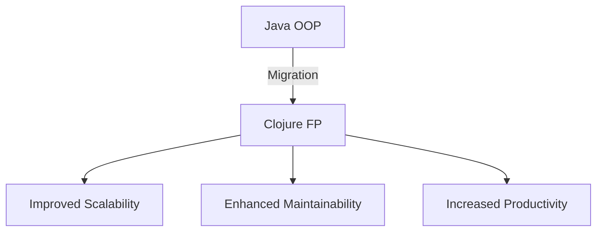
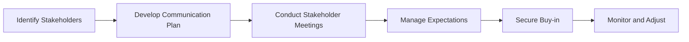

## 11.3 Stakeholder Engagement

Transitioning from Java Object-Oriented Programming (OOP) to Clojure's functional programming paradigm is a significant undertaking for any enterprise. It involves not just a technical shift but also a cultural and organizational transformation. Engaging stakeholders effectively is crucial to ensure a smooth transition, manage expectations, and secure the necessary buy-in for the migration process. In this section, we will explore strategies for communicating plans with stakeholders, managing expectations, and securing their support.

### Understanding Stakeholder Roles

Before diving into engagement strategies, it's essential to identify the key stakeholders involved in the migration process. Stakeholders can be categorized into several groups:

1. **Executive Leadership**: These are the decision-makers who approve budgets and strategic directions. Their support is crucial for the migration's success.
2. **Technical Teams**: This group includes developers, architects, and IT staff who will be directly involved in the migration process.
3. **Business Units**: These stakeholders are concerned with how the migration will impact business operations and outcomes.
4. **End Users**: The individuals who will use the migrated systems and whose feedback is vital for assessing the migration's success.
5. **Project Managers**: Responsible for overseeing the migration process and ensuring that timelines and objectives are met.

Understanding the concerns and interests of each stakeholder group is the first step in developing an effective engagement strategy.

### Communicating Plans with Stakeholders

Effective communication is the cornerstone of successful stakeholder engagement. Here are some strategies to ensure clear and consistent communication:

#### Develop a Communication Plan

- **Define Objectives**: Clearly outline what you aim to achieve with the migration and how it aligns with the organization's goals.
- **Identify Key Messages**: Tailor messages to address the specific concerns and interests of each stakeholder group.
- **Choose Communication Channels**: Select appropriate channels for communication, such as meetings, newsletters, or collaboration tools, to reach different stakeholders effectively.
- **Establish a Timeline**: Set a schedule for regular updates and check-ins to keep stakeholders informed throughout the migration process.

#### Conduct Stakeholder Meetings

- **Kick-off Meetings**: Initiate the migration project with a meeting that includes all key stakeholders. Present the migration plan, objectives, and expected outcomes.
- **Regular Updates**: Schedule regular meetings to provide updates on progress, address concerns, and gather feedback.
- **Workshops and Training Sessions**: Organize workshops to educate stakeholders about Clojure and its benefits, addressing any technical or cultural concerns.

#### Use Visual Aids

Incorporate diagrams and charts to illustrate the migration process, timelines, and expected outcomes. Visual aids can help stakeholders better understand complex concepts and see the bigger picture.



*Diagram: The transition from Java OOP to Clojure FP and its benefits.*

### Managing Expectations

Managing stakeholder expectations is critical to avoid misunderstandings and ensure alignment with the migration goals. Here are some strategies to manage expectations effectively:

#### Set Realistic Goals

- **Define Clear Objectives**: Clearly articulate what the migration aims to achieve and set realistic goals that are achievable within the given timeframe and resources.
- **Highlight Benefits and Challenges**: Be transparent about the potential benefits of migrating to Clojure, such as improved scalability and maintainability, as well as the challenges that may arise during the transition.

#### Address Concerns Proactively

- **Listen to Stakeholder Concerns**: Encourage stakeholders to voice their concerns and address them promptly. This can help build trust and foster a collaborative environment.
- **Provide Evidence and Case Studies**: Share real-world success stories and case studies that demonstrate the benefits of migrating to Clojure. This can help alleviate concerns and build confidence in the migration process.

#### Monitor and Adjust

- **Track Progress**: Regularly monitor the progress of the migration and compare it against the set objectives. Use this data to adjust plans and strategies as needed.
- **Solicit Feedback**: Continuously gather feedback from stakeholders to identify areas for improvement and ensure that their expectations are being met.

### Securing Buy-in

Securing stakeholder buy-in is essential for the success of the migration. Here are some strategies to gain and maintain stakeholder support:

#### Demonstrate Value

- **Showcase Quick Wins**: Identify and highlight quick wins that demonstrate the value of migrating to Clojure. This can help build momentum and encourage further support.
- **Quantify Benefits**: Use metrics and data to quantify the benefits of the migration, such as reduced development time, improved system performance, or cost savings.

#### Build a Coalition of Support

- **Identify Champions**: Identify and engage champions within the organization who can advocate for the migration and influence other stakeholders.
- **Foster Collaboration**: Encourage collaboration between different stakeholder groups to build a sense of ownership and shared responsibility for the migration's success.

#### Address Resistance

- **Understand the Root Causes**: Identify the root causes of resistance and address them directly. This may involve providing additional training, resources, or support.
- **Communicate the Risks of Inaction**: Highlight the risks of not migrating to Clojure, such as falling behind competitors or facing scalability issues with existing systems.

### Code Examples: Java vs. Clojure

To illustrate the benefits of migrating to Clojure, let's compare a simple Java example with its Clojure equivalent.

**Java Code Example:**

```java
import java.util.List;
import java.util.stream.Collectors;

public class Example {
    public static List<Integer> filterEvenNumbers(List<Integer> numbers) {
        return numbers.stream()
                      .filter(n -> n % 2 == 0)
                      .collect(Collectors.toList());
    }
}
```

**Clojure Code Example:**

```clojure
(defn filter-even-numbers [numbers]
  (filter even? numbers))

;; Usage
(filter-even-numbers [1 2 3 4 5 6])
;; => (2 4 6)
```

*Key Differences:*

- **Conciseness**: The Clojure code is more concise and expressive, leveraging higher-order functions like `filter`.
- **Immutability**: Clojure's data structures are immutable by default, reducing the risk of unintended side effects.

### Try It Yourself

Experiment with the Clojure code example by modifying the `filter-even-numbers` function to filter odd numbers instead. Notice how easy it is to adapt the code to different requirements.

### Visual Aids: Stakeholder Engagement Process



*Diagram: The stakeholder engagement process for migrating from Java to Clojure.*

### References and Links

- [Official Clojure Documentation](https://clojure.org/)
- [ClojureDocs](https://clojuredocs.org/)
- [Clojure GitHub Repository](https://github.com/clojure/clojure)

### Knowledge Check

- What are the key stakeholder groups involved in the migration process?
- How can you effectively communicate migration plans with stakeholders?
- What strategies can be used to manage stakeholder expectations?
- How can you secure stakeholder buy-in for the migration?

### Exercises

1. **Identify Stakeholders**: List the stakeholders in your organization who would be involved in the migration process. Consider their roles and interests.
2. **Develop a Communication Plan**: Create a communication plan for engaging stakeholders during the migration. Include key messages, channels, and a timeline.
3. **Address Concerns**: Identify potential concerns stakeholders may have about the migration and propose strategies to address them.

### Summary

Engaging stakeholders effectively is crucial for the success of migrating from Java OOP to Clojure's functional programming paradigm. By communicating plans clearly, managing expectations, and securing buy-in, organizations can ensure a smooth transition and maximize the benefits of the migration. Remember, stakeholder engagement is an ongoing process that requires continuous communication, collaboration, and adaptation.

## **Quiz: Are You Ready to Migrate from Java to Clojure?**



### Who are the key stakeholders in a migration process from Java to Clojure?

- [x] Executive Leadership, Technical Teams, Business Units, End Users, Project Managers
- [ ] Only Technical Teams and Project Managers
- [ ] Only Executive Leadership and Business Units
- [ ] Only End Users and Project Managers

> **Explanation:** The key stakeholders include Executive Leadership, Technical Teams, Business Units, End Users, and Project Managers, as each plays a crucial role in the migration process.

### What is the first step in developing an effective stakeholder engagement strategy?

- [x] Identifying the key stakeholders involved in the migration process
- [ ] Developing a communication plan
- [ ] Conducting stakeholder meetings
- [ ] Securing buy-in

> **Explanation:** Identifying the key stakeholders is the first step, as it helps tailor the engagement strategy to address their specific concerns and interests.

### Why is it important to set realistic goals during the migration process?

- [x] To ensure alignment with the organization's goals and manage stakeholder expectations
- [ ] To impress stakeholders with ambitious targets
- [ ] To avoid any form of resistance
- [ ] To ensure quick wins

> **Explanation:** Setting realistic goals ensures alignment with the organization's goals and helps manage stakeholder expectations effectively.

### How can you demonstrate the value of migrating to Clojure to stakeholders?

- [x] Showcase quick wins and quantify benefits using metrics and data
- [ ] Only focus on the technical advantages
- [ ] Avoid discussing challenges
- [ ] Present only theoretical benefits

> **Explanation:** Demonstrating value involves showcasing quick wins and using metrics and data to quantify the benefits, which helps build confidence in the migration process.

### What is a key strategy for securing stakeholder buy-in?

- [x] Building a coalition of support and identifying champions within the organization
- [ ] Only focusing on executive leadership
- [ ] Avoiding any form of resistance
- [ ] Highlighting only the risks of inaction

> **Explanation:** Building a coalition of support and identifying champions within the organization helps secure stakeholder buy-in by fostering collaboration and shared responsibility.

### What is the role of visual aids in stakeholder engagement?

- [x] To help stakeholders better understand complex concepts and see the bigger picture
- [ ] To replace verbal communication
- [ ] To impress stakeholders with design
- [ ] To avoid detailed explanations

> **Explanation:** Visual aids help stakeholders better understand complex concepts and see the bigger picture, making communication more effective.

### How can you address stakeholder resistance effectively?

- [x] Understand the root causes and communicate the risks of inaction
- [ ] Ignore the resistance and proceed with the migration
- [ ] Focus only on the benefits
- [ ] Avoid discussing any challenges

> **Explanation:** Addressing resistance involves understanding the root causes and communicating the risks of inaction, which helps mitigate concerns and build support.

### What is the importance of conducting stakeholder meetings?

- [x] To provide updates, address concerns, and gather feedback
- [ ] To finalize the migration plan
- [ ] To impress stakeholders with presentations
- [ ] To avoid any form of resistance

> **Explanation:** Conducting stakeholder meetings provides updates, addresses concerns, and gathers feedback, ensuring continuous engagement and alignment.

### What should be included in a communication plan for stakeholder engagement?

- [x] Objectives, key messages, communication channels, and a timeline
- [ ] Only objectives and key messages
- [ ] Only communication channels and a timeline
- [ ] Only key messages and a timeline

> **Explanation:** A communication plan should include objectives, key messages, communication channels, and a timeline to ensure clear and consistent communication.

### True or False: Stakeholder engagement is a one-time process during the migration.

- [ ] True
- [x] False

> **Explanation:** Stakeholder engagement is an ongoing process that requires continuous communication, collaboration, and adaptation throughout the migration.


