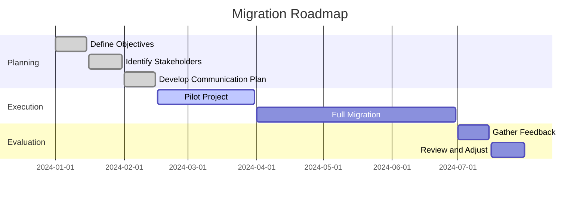
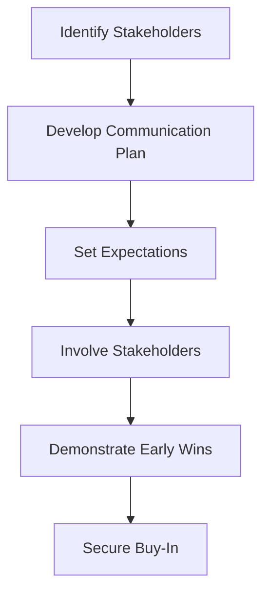

## 11.3 Stakeholder Engagement

In the process of migrating from Java Object-Oriented Programming (OOP) to Clojure's functional programming paradigm, engaging stakeholders is a critical component that can significantly influence the success of the transition. Stakeholders, ranging from technical teams to business executives, need to be informed, involved, and supportive of the migration process. This section will guide you through effective strategies for communicating plans, managing expectations, and securing buy-in from all relevant parties.

### Understanding Stakeholder Roles

Before diving into engagement strategies, it's essential to identify and understand the roles of various stakeholders involved in the migration process. Stakeholders can be categorized into several groups:

1. **Technical Stakeholders**: These include developers, architects, and IT support staff who will be directly involved in the migration. They need to understand the technical benefits and challenges of moving to Clojure.

2. **Business Stakeholders**: This group comprises executives, product managers, and business analysts who are concerned with the impact on business operations, timelines, and costs.

3. **End Users**: Although not directly involved in the migration, end users are affected by changes in the software. Their feedback and satisfaction are crucial for a successful transition.

4. **External Partners**: Vendors, consultants, and other third-party partners who may be impacted by the migration or whose services may be required during the transition.

### Communicating Plans with Stakeholders

Effective communication is the cornerstone of successful stakeholder engagement. Here are some strategies to ensure clear and consistent communication:

#### Develop a Communication Plan

- **Identify Communication Channels**: Determine the most effective channels for reaching each stakeholder group. This could include emails, meetings, webinars, or project management tools.
  
- **Set Communication Objectives**: Clearly define what you want to achieve with each communication. Objectives could range from informing stakeholders about the migration timeline to gathering feedback on specific aspects of the transition.

- **Create a Communication Schedule**: Establish a regular schedule for updates and meetings to keep stakeholders informed throughout the migration process.

#### Tailor Messages to Stakeholder Needs

- **Technical Stakeholders**: Focus on the technical benefits of Clojure, such as improved scalability, maintainability, and concurrency models. Provide detailed documentation and training resources to support their transition.

- **Business Stakeholders**: Highlight the business advantages, such as reduced time-to-market, cost savings, and enhanced product features. Use metrics and case studies to demonstrate potential ROI.

- **End Users**: Communicate changes in a way that emphasizes improvements in user experience and functionality. Provide support channels for addressing concerns and gathering feedback.

- **External Partners**: Ensure they understand how the migration affects their services and what adjustments may be necessary. Collaborate to align their processes with the new system.

### Managing Expectations and Securing Buy-In

Managing expectations and securing buy-in are crucial for minimizing resistance and ensuring a smooth transition. Here are some strategies to achieve these goals:

#### Set Realistic Expectations

- **Define Clear Objectives**: Clearly articulate the goals of the migration and how they align with the organization's strategic objectives. This helps stakeholders understand the purpose and benefits of the transition.

- **Acknowledge Challenges**: Be transparent about potential challenges and risks associated with the migration. This builds trust and prepares stakeholders for any obstacles that may arise.

- **Provide a Roadmap**: Share a detailed roadmap outlining the migration phases, timelines, and key milestones. This helps stakeholders visualize the process and understand the expected outcomes at each stage.

#### Involve Stakeholders in Decision-Making

- **Gather Input and Feedback**: Actively seek input from stakeholders during the planning and execution phases. This not only improves the quality of decisions but also fosters a sense of ownership and commitment.

- **Create Cross-Functional Teams**: Establish teams comprising members from different stakeholder groups to collaborate on specific aspects of the migration. This encourages collaboration and ensures diverse perspectives are considered.

- **Conduct Workshops and Training Sessions**: Organize workshops and training sessions to educate stakeholders about Clojure and its benefits. This helps build confidence and competence among technical teams and other stakeholders.

#### Demonstrate Early Wins

- **Pilot Projects**: Implement pilot projects to demonstrate the benefits of Clojure in a controlled environment. Share the results with stakeholders to build confidence and support for the broader migration.

- **Showcase Success Stories**: Highlight success stories from other organizations that have successfully migrated to Clojure. This provides tangible evidence of the benefits and feasibility of the transition.

- **Celebrate Milestones**: Recognize and celebrate key milestones and achievements throughout the migration process. This boosts morale and reinforces the value of the transition.

### Visual Aids for Stakeholder Engagement

Visual aids can be powerful tools for communicating complex information and engaging stakeholders. Here are some examples of how visual aids can be used effectively:

#### Migration Roadmap

*Caption: A visual representation of the migration roadmap, highlighting key phases and timelines.*

#### Stakeholder Engagement Model

*Caption: A flowchart illustrating the stakeholder engagement model, from identifying stakeholders to securing buy-in.*

### References and Links

For further reading and resources on stakeholder engagement and migration strategies, consider the following:

- [Clojure Official Documentation](https://clojure.org/reference)
- [Clojure Community Resources](https://clojure.org/community/resources)
- [Transitioning from OOP to Functional Programming](https://www.lispcast.com/oo-to-fp/)
- [Effective Stakeholder Engagement](https://www.pmi.org/learning/library/effective-stakeholder-engagement-10137)

### Knowledge Check

To reinforce your understanding of stakeholder engagement during the migration process, consider the following questions:

1. What are the key roles of stakeholders in a migration project?
2. How can you tailor communication to meet the needs of different stakeholder groups?
3. What strategies can be used to manage expectations and secure buy-in from stakeholders?
4. How can visual aids enhance stakeholder engagement and communication?

### Encouraging Engagement

Embracing a new programming paradigm can be challenging, but with effective stakeholder engagement, you can ensure a smooth transition and maximize the benefits of migrating to Clojure. Remember, the key to success lies in clear communication, realistic expectations, and active involvement of all stakeholders. By fostering a collaborative environment and demonstrating early wins, you can build confidence and support for the migration process.

## **Quiz: Are You Ready to Migrate from Java to Clojure?**



### What is the first step in engaging stakeholders for a migration project?

- [x] Identify Stakeholders
- [ ] Develop Communication Plan
- [ ] Set Expectations
- [ ] Secure Buy-In

> **Explanation:** Identifying stakeholders is the first step in understanding who will be affected by the migration and who needs to be engaged.

### How can you tailor communication for technical stakeholders?

- [x] Focus on technical benefits and provide detailed documentation
- [ ] Highlight business advantages and ROI
- [ ] Emphasize user experience improvements
- [ ] Align processes with external partners

> **Explanation:** Technical stakeholders need to understand the technical benefits and have access to resources that support their transition.

### What is a key strategy for managing stakeholder expectations?

- [x] Define Clear Objectives
- [ ] Conduct Workshops
- [ ] Demonstrate Early Wins
- [ ] Create Cross-Functional Teams

> **Explanation:** Defining clear objectives helps stakeholders understand the purpose and benefits of the migration, setting realistic expectations.

### Why is it important to involve stakeholders in decision-making?

- [x] It fosters a sense of ownership and commitment
- [ ] It speeds up the migration process
- [ ] It reduces the need for communication
- [ ] It eliminates the need for training

> **Explanation:** Involving stakeholders in decision-making improves the quality of decisions and fosters a sense of ownership and commitment.

### What is an effective way to demonstrate early wins?

- [x] Implement Pilot Projects
- [ ] Develop Communication Plan
- [x] Showcase Success Stories
- [ ] Conduct Workshops

> **Explanation:** Pilot projects and success stories provide tangible evidence of the benefits and feasibility of the migration.

### How can visual aids enhance stakeholder engagement?

- [x] They simplify complex information
- [ ] They replace the need for communication
- [ ] They eliminate the need for meetings
- [ ] They reduce the migration timeline

> **Explanation:** Visual aids simplify complex information, making it easier for stakeholders to understand and engage with the migration process.

### What is the purpose of a communication plan?

- [x] To determine effective communication channels and objectives
- [ ] To eliminate the need for stakeholder involvement
- [ ] To speed up the migration process
- [ ] To reduce the need for training

> **Explanation:** A communication plan helps determine the most effective channels and objectives for reaching each stakeholder group.

### Why is it important to acknowledge challenges during the migration?

- [x] It builds trust and prepares stakeholders for obstacles
- [ ] It speeds up the migration process
- [ ] It eliminates the need for training
- [ ] It reduces the need for communication

> **Explanation:** Acknowledging challenges builds trust and prepares stakeholders for any obstacles that may arise during the migration.

### How can cross-functional teams benefit the migration process?

- [x] They encourage collaboration and ensure diverse perspectives
- [ ] They speed up the migration process
- [ ] They eliminate the need for communication
- [ ] They reduce the need for training

> **Explanation:** Cross-functional teams encourage collaboration and ensure diverse perspectives are considered in the migration process.

### True or False: End users are not affected by changes in the software during migration.

- [ ] True
- [x] False

> **Explanation:** End users are affected by changes in the software, and their feedback and satisfaction are crucial for a successful transition.



By following these strategies and engaging stakeholders effectively, you can ensure a successful migration from Java OOP to Clojure, paving the way for enhanced scalability, maintainability, and productivity within your organization.
