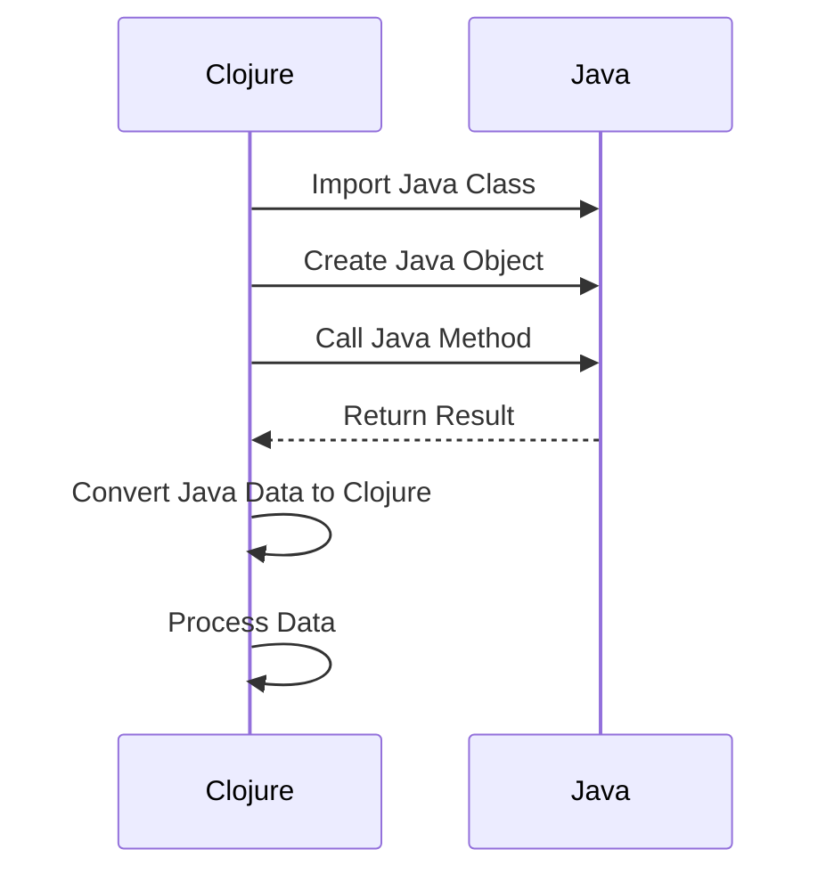

## 12.1 Calling Java from Clojure

As enterprises transition from Java's Object-Oriented Programming (OOP) paradigm to Clojure's functional programming model, one of the most critical aspects is ensuring seamless interoperability between Java and Clojure. This section will guide you through the process of calling Java classes and methods from Clojure, handling Java data types, and integrating them with Clojure's data structures. By leveraging Clojure's robust interoperability features, you can maintain existing Java codebases while gradually migrating to a more functional approach.

### Understanding Clojure's Java Interoperability

Clojure is designed to run on the Java Virtual Machine (JVM), which inherently provides it with the ability to interact with Java classes and libraries. This interoperability is a significant advantage for enterprises, as it allows for the reuse of existing Java code and libraries, reducing the need for rewriting and enabling a smoother transition.

#### Key Concepts

- **Java Classes and Methods**: Clojure can directly access Java classes and invoke methods, allowing for the integration of Java functionality within Clojure applications.
- **Java Data Types**: Clojure provides mechanisms to handle Java data types and convert them into Clojure's immutable data structures.
- **Interoperability Syntax**: Clojure uses a concise syntax to interact with Java, making it easy to call Java methods and access fields.

### Accessing Java Classes and Methods

To call Java classes and methods from Clojure, you need to understand the syntax and conventions used in Clojure for Java interoperability. Let's explore how to access Java classes and invoke methods.

#### Importing Java Classes

In Clojure, you can import Java classes using the `import` statement or the `:import` directive within a `ns` (namespace) declaration. This is similar to Java's `import` statement.

```clojure
(ns myapp.core
  (:import [java.util Date]))

;; Create a new Date instance
(def today (Date.))

;; Print the current date
(println today)
```

In this example, we import the `java.util.Date` class and create an instance of it using the `Date.` constructor syntax. The `.` after `Date` indicates that we are calling a constructor.

#### Calling Java Methods

To call a method on a Java object, use the `.` operator followed by the method name. If the method takes arguments, pass them after the method name.

```clojure
;; Get the current time in milliseconds
(def current-time (.getTime today))

;; Print the current time
(println current-time)
```

Here, we call the `getTime` method on the `today` object to retrieve the current time in milliseconds.

#### Static Methods and Fields

For static methods and fields, use the `.` operator with the class name.

```clojure
(ns myapp.core
  (:import [java.lang Math]))

;; Call the static method Math/sqrt
(def square-root (Math/sqrt 16))

;; Print the square root
(println square-root)
```

In this example, we call the static `sqrt` method from the `Math` class to calculate the square root of 16.

### Handling Java Data Types and Clojure Data Structures

When working with Java from Clojure, it's essential to understand how to handle Java data types and convert them to Clojure's immutable data structures.

#### Converting Java Collections to Clojure

Java collections, such as `List` and `Map`, can be converted to Clojure's immutable data structures using the `clojure.java.api.Clojure` class.

```clojure
(ns myapp.core
  (:import [java.util ArrayList]))

;; Create a Java ArrayList
(def java-list (ArrayList.))
(.add java-list "Clojure")
(.add java-list "Java")

;; Convert to Clojure vector
(def clojure-vector (vec java-list))

;; Print the Clojure vector
(println clojure-vector)
```

In this example, we create a Java `ArrayList`, add elements to it, and then convert it to a Clojure vector using the `vec` function.

#### Converting Clojure Data Structures to Java

Similarly, you can convert Clojure data structures to Java collections using Java interop functions.

```clojure
(ns myapp.core
  (:import [java.util ArrayList]))

;; Create a Clojure vector
(def clojure-vector ["Clojure" "Java"])

;; Convert to Java ArrayList
(def java-list (ArrayList. clojure-vector))

;; Print the Java ArrayList
(println java-list)
```

Here, we convert a Clojure vector to a Java `ArrayList` by passing the vector to the `ArrayList` constructor.

### Practical Examples and Use Cases

Let's explore some practical examples and use cases where calling Java from Clojure can be beneficial in an enterprise setting.

#### Integrating Java Libraries

One of the most common use cases for calling Java from Clojure is integrating existing Java libraries into Clojure applications. This allows you to leverage the extensive ecosystem of Java libraries without rewriting them in Clojure.

```clojure
(ns myapp.core
  (:import [org.apache.commons.lang3 StringUtils]))

;; Use Apache Commons Lang StringUtils to check if a string is empty
(defn is-empty? [s]
  (StringUtils/isEmpty s))

;; Test the function
(println (is-empty? ""))  ;; true
(println (is-empty? "Clojure"))  ;; false
```

In this example, we use the `StringUtils` class from the Apache Commons Lang library to check if a string is empty.

#### Accessing Java APIs

Clojure's interoperability with Java makes it easy to access Java APIs, such as those for database connectivity, web services, and more.

```clojure
(ns myapp.core
  (:import [java.sql DriverManager]))

;; Connect to a database using JDBC
(defn connect-to-db [url user password]
  (DriverManager/getConnection url user password))

;; Example usage
(def db-connection (connect-to-db "jdbc:mysql://localhost:3306/mydb" "user" "password"))

;; Print the database connection
(println db-connection)
```

Here, we use the `DriverManager` class from the Java SQL package to establish a database connection using JDBC.

### Handling Java Exceptions in Clojure

When calling Java methods from Clojure, you may encounter Java exceptions. Clojure provides mechanisms to handle these exceptions gracefully.

#### Using `try-catch` for Exception Handling

Clojure's `try-catch` construct allows you to catch and handle Java exceptions.

```clojure
(ns myapp.core
  (:import [java.io FileNotFoundException]))

;; Read a file and handle exceptions
(defn read-file [file-path]
  (try
    (slurp file-path)
    (catch FileNotFoundException e
      (println "File not found:" (.getMessage e)))
    (catch Exception e
      (println "An error occurred:" (.getMessage e)))))

;; Test the function
(read-file "nonexistent.txt")
```

In this example, we attempt to read a file using the `slurp` function and handle `FileNotFoundException` and other exceptions using `try-catch`.

### Best Practices for Java Interoperability in Clojure

To ensure a smooth and efficient integration of Java and Clojure, consider the following best practices:

- **Minimize Java Interop**: While Java interoperability is powerful, strive to minimize its use to maintain the functional purity of your Clojure code.
- **Encapsulate Java Calls**: Encapsulate Java calls within Clojure functions to isolate Java-specific logic and make your codebase more maintainable.
- **Use Clojure Wrappers**: Consider creating Clojure wrappers around Java libraries to provide a more idiomatic Clojure interface.
- **Handle Exceptions Gracefully**: Always handle Java exceptions gracefully to prevent runtime errors and improve the robustness of your application.

### Visualizing Java-Clojure Interoperability

To better understand the flow of data and control between Java and Clojure, let's visualize the process using a sequence diagram.



**Diagram Description**: This sequence diagram illustrates the interaction between Clojure and Java. Clojure imports a Java class, creates a Java object, and calls a Java method. The result is returned to Clojure, where it is converted to a Clojure data structure for further processing.

### Further Reading and Resources

To deepen your understanding of Java-Clojure interoperability, explore the following resources:

- [Clojure Official Documentation](https://clojure.org/reference/java_interop)
- [Clojure Community Resources](https://clojure.org/community/resources)
- [Java Interoperability in Clojure](https://www.braveclojure.com/java/)
- [Transitioning from OOP to Functional Programming](https://www.lispcast.com/oo-to-fp/)

### Knowledge Check

To reinforce your understanding of calling Java from Clojure, consider the following questions and exercises:

1. **What is the syntax for calling a static method in Java from Clojure?**
2. **How can you convert a Java `ArrayList` to a Clojure vector?**
3. **Describe how to handle Java exceptions in Clojure.**
4. **Explain the benefits of encapsulating Java calls within Clojure functions.**

### Practice Exercise

**Exercise**: Create a Clojure function that uses a Java library to perform a specific task, such as parsing a JSON string or sending an HTTP request. Document the steps and explain how Java interoperability is utilized.

**Solution Guidelines**: Provide a step-by-step solution, including code examples and explanations of each step.

### Summary

In this section, we've explored how to call Java classes and methods from Clojure, handle Java data types, and integrate them with Clojure's data structures. By leveraging Clojure's interoperability features, you can maintain existing Java codebases while transitioning to a functional programming paradigm. Embrace the power of Clojure's seamless Java integration to enhance your enterprise applications and achieve a successful migration.

## **Quiz: Are You Ready to Migrate from Java to Clojure?**



### What is the syntax for calling a constructor in Java from Clojure?

- [x] `ClassName.`
- [ ] `new ClassName()`
- [ ] `ClassName.newInstance()`
- [ ] `ClassName()`

> **Explanation:** In Clojure, the syntax for calling a constructor is `ClassName.` with a dot after the class name.

### How do you import a Java class in a Clojure namespace?

- [x] `(:import [package ClassName])`
- [ ] `import package.ClassName`
- [ ] `use package.ClassName`
- [ ] `require package.ClassName`

> **Explanation:** The `:import` directive within a `ns` declaration is used to import Java classes in Clojure.

### Which operator is used to call a method on a Java object in Clojure?

- [x] `.`
- [ ] `->`
- [ ] `::`
- [ ] `:`

> **Explanation:** The `.` operator is used to call methods on Java objects in Clojure.

### How can you convert a Java `ArrayList` to a Clojure vector?

- [x] `vec`
- [ ] `toVector`
- [ ] `convert`
- [ ] `asVector`

> **Explanation:** The `vec` function is used to convert a Java `ArrayList` to a Clojure vector.

### What is a best practice when using Java interoperability in Clojure?

- [x] Minimize Java interop
- [ ] Use Java interop extensively
- [ ] Avoid Java interop entirely
- [ ] Use Java interop only for exceptions

> **Explanation:** Minimizing Java interop helps maintain the functional purity of Clojure code.

### How do you handle Java exceptions in Clojure?

- [x] `try-catch`
- [ ] `try-finally`
- [ ] `catch-exception`
- [ ] `handle-exception`

> **Explanation:** The `try-catch` construct is used to handle Java exceptions in Clojure.

### What is the benefit of encapsulating Java calls within Clojure functions?

- [x] Isolates Java-specific logic
- [ ] Increases Java dependency
- [ ] Reduces code readability
- [ ] Complicates the codebase

> **Explanation:** Encapsulating Java calls within Clojure functions isolates Java-specific logic, making the codebase more maintainable.

### How can you call a static method from a Java class in Clojure?

- [x] `ClassName/methodName`
- [ ] `ClassName.methodName()`
- [ ] `methodName(ClassName)`
- [ ] `ClassName::methodName`

> **Explanation:** The syntax `ClassName/methodName` is used to call static methods from a Java class in Clojure.

### What is a common use case for calling Java from Clojure?

- [x] Integrating Java libraries
- [ ] Avoiding Java libraries
- [ ] Rewriting Java libraries
- [ ] Ignoring Java libraries

> **Explanation:** Integrating Java libraries is a common use case for calling Java from Clojure.

### True or False: Clojure can only interact with Java classes, not methods.

- [ ] True
- [x] False

> **Explanation:** Clojure can interact with both Java classes and methods, allowing for comprehensive interoperability.


