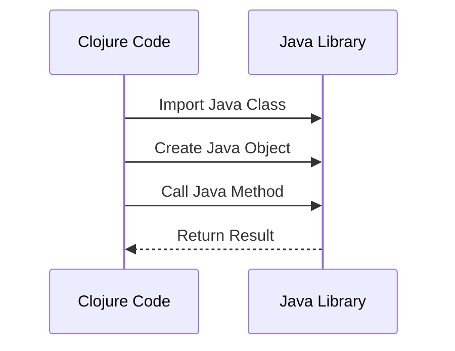

## 12.1 Calling Java from Clojure

As experienced Java developers, you are already familiar with the robust ecosystem and extensive libraries that Java offers. One of the compelling features of Clojure is its seamless interoperability with Java, allowing you to leverage existing Java code and libraries within your Clojure applications. In this section, we will explore how to effectively call Java classes and methods from Clojure, handle Java data types, and integrate them with Clojure's data structures.

### Understanding Clojure's Java Interoperability

Clojure is designed to run on the Java Virtual Machine (JVM), which means it can directly interact with Java classes and methods. This interoperability allows you to:

- **Reuse existing Java libraries**: Leverage the vast array of Java libraries and frameworks within your Clojure applications.
- **Integrate with Java systems**: Seamlessly integrate Clojure code into existing Java systems, facilitating gradual migration or hybrid solutions.
- **Enhance functionality**: Use Java's performance-optimized classes and methods alongside Clojure's expressive syntax and functional paradigms.

### Accessing Java Classes and Methods

To call Java classes and methods from Clojure, you need to understand how to reference Java classes, create instances, and invoke methods. Let's break down these steps:

#### Referencing Java Classes

In Clojure, you can reference Java classes using their fully qualified names. The `import` function is used to bring Java classes into the Clojure namespace, similar to Java's `import` statement.

```clojure
(ns my-clojure-app.core
  (:import [java.util Date]))

;; Create a new Date instance
(def today (Date.))

;; Print the current date
(println today)
```

**Explanation:**

- **`(:import [java.util Date])`**: This line imports the `Date` class from the `java.util` package.
- **`(Date.)`**: This syntax creates a new instance of the `Date` class. Note the use of the dot `.` to indicate constructor invocation.

#### Invoking Java Methods

Once you have a Java object, you can call its methods using the dot `.` operator. Here's how you can invoke methods on a Java object:

```clojure
;; Get the time in milliseconds since epoch
(def time-in-millis (.getTime today))

(println "Time in milliseconds:" time-in-millis)
```

**Explanation:**

- **`(.getTime today)`**: This calls the `getTime` method on the `today` object, which is an instance of `Date`.

#### Static Methods and Fields

For static methods and fields, you use the `/` operator to separate the class name from the method or field name.

```clojure
;; Import the Math class
(ns my-clojure-app.core
  (:import [java.lang Math]))

;; Call a static method
(def pi-value (Math/PI))
(def square-root (Math/sqrt 16))

(println "Value of PI:" pi-value)
(println "Square root of 16:" square-root)
```

**Explanation:**

- **`(Math/PI)`**: Accesses the static field `PI` from the `Math` class.
- **`(Math/sqrt 16)`**: Calls the static method `sqrt` with an argument of `16`.

### Handling Java Data Types and Clojure Data Structures

When working with Java from Clojure, you will often need to convert between Java data types and Clojure data structures. Understanding these conversions is crucial for effective interoperability.

#### Converting Java Collections to Clojure

Java collections such as `List`, `Set`, and `Map` can be easily converted to their Clojure counterparts using the `clojure.java.api.Clojure` library.

```clojure
(ns my-clojure-app.core
  (:import [java.util ArrayList]))

;; Create a Java ArrayList
(def java-list (ArrayList.))
(.add java-list "Clojure")
(.add java-list "Java")

;; Convert to Clojure vector
(def clojure-vector (vec java-list))

(println "Clojure Vector:" clojure-vector)
```

**Explanation:**

- **`(ArrayList.)`**: Creates a new Java `ArrayList`.
- **`(.add java-list "Clojure")`**: Adds an element to the `ArrayList`.
- **`(vec java-list)`**: Converts the `ArrayList` to a Clojure vector.

#### Converting Clojure Data Structures to Java

Conversely, you may need to convert Clojure data structures to Java collections. This can be done using Java interop functions.

```clojure
(ns my-clojure-app.core
  (:import [java.util ArrayList]))

;; Create a Clojure vector
(def clojure-vector ["Clojure" "Java"])

;; Convert to Java ArrayList
(def java-list (ArrayList. clojure-vector))

(println "Java ArrayList:" java-list)
```

**Explanation:**

- **`(ArrayList. clojure-vector)`**: Converts a Clojure vector to a Java `ArrayList`.

### Practical Example: Using Java Libraries in Clojure

Let's consider a practical example where we use a Java library to perform a specific task in Clojure. Suppose we want to use the Apache Commons Lang library to manipulate strings.

#### Step 1: Add Dependency

First, add the Apache Commons Lang dependency to your `project.clj` file.

```clojure
(defproject my-clojure-app "0.1.0-SNAPSHOT"
  :dependencies [[org.clojure/clojure "1.10.3"]
                 [org.apache.commons/commons-lang3 "3.12.0"]])
```

#### Step 2: Import and Use Java Classes

Now, let's use the `StringUtils` class from Apache Commons Lang to check if a string is empty.

```clojure
(ns my-clojure-app.core
  (:import [org.apache.commons.lang3 StringUtils]))

(defn is-empty? [s]
  (StringUtils/isEmpty s))

(println "Is empty:" (is-empty? ""))
(println "Is empty:" (is-empty? "Clojure"))
```

**Explanation:**

- **`(:import [org.apache.commons.lang3 StringUtils])`**: Imports the `StringUtils` class.
- **`(StringUtils/isEmpty s)`**: Calls the `isEmpty` method to check if the string `s` is empty.

### Visualizing Java Interoperability

To better understand the flow of data and method calls between Clojure and Java, let's visualize the process using a sequence diagram.



**Diagram Description:** This sequence diagram illustrates the interaction between Clojure code and a Java library. Clojure imports a Java class, creates an object, calls a method, and receives the result.

### Best Practices for Java Interoperability

When integrating Java with Clojure, consider the following best practices:

- **Minimize Java Interop**: Use Java interop only when necessary. Prefer Clojure's idiomatic solutions for most tasks.
- **Handle Exceptions**: Be mindful of Java exceptions and handle them appropriately in your Clojure code.
- **Performance Considerations**: Be aware of potential performance implications when converting between Java and Clojure data structures.
- **Testing**: Ensure thorough testing of interop code to catch any issues related to data conversion or method invocation.

### Try It Yourself

Now that we've explored calling Java from Clojure, try modifying the examples to deepen your understanding:

1. **Experiment with Different Java Classes**: Import and use different Java classes and methods in your Clojure code.
2. **Convert Complex Data Structures**: Practice converting more complex Java collections to Clojure data structures and vice versa.
3. **Integrate a Java Library**: Choose a Java library you are familiar with and integrate it into a Clojure project.

### Knowledge Check

Let's reinforce what we've learned with a few questions:

- How do you import a Java class in Clojure?
- What operator is used to call a method on a Java object in Clojure?
- How can you convert a Java `ArrayList` to a Clojure vector?

### Summary

In this section, we've explored how to call Java classes and methods from Clojure, handle Java data types, and integrate them with Clojure's data structures. By leveraging Java's extensive libraries and Clojure's expressive syntax, you can create powerful, hybrid applications that benefit from the strengths of both languages.

## **Quiz: Are You Ready to Migrate from Java to Clojure?**



### How do you import a Java class in Clojure?

- [x] Using the `:import` directive in the namespace declaration.
- [ ] Using the `import` keyword like in Java.
- [ ] Using the `require` function.
- [ ] Using the `use` function.

> **Explanation:** In Clojure, Java classes are imported using the `:import` directive within the namespace declaration.

### What operator is used to call a method on a Java object in Clojure?

- [x] The dot `.` operator.
- [ ] The slash `/` operator.
- [ ] The colon `:` operator.
- [ ] The arrow `->` operator.

> **Explanation:** The dot `.` operator is used to call methods on Java objects in Clojure.

### How can you convert a Java `ArrayList` to a Clojure vector?

- [x] Using the `vec` function.
- [ ] Using the `toVector` function.
- [ ] Using the `convert` function.
- [ ] Using the `array-to-vector` function.

> **Explanation:** The `vec` function is used to convert a Java `ArrayList` to a Clojure vector.

### Which of the following is a static method call in Clojure?

- [x] `(Math/sqrt 16)`
- [ ] `(.sqrt Math 16)`
- [ ] `(Math.sqrt 16)`
- [ ] `(Math-sqrt 16)`

> **Explanation:** `(Math/sqrt 16)` is the correct syntax for calling a static method in Clojure.

### What is the purpose of the `:import` directive in Clojure?

- [x] To bring Java classes into the Clojure namespace.
- [ ] To import Clojure libraries.
- [ ] To define Clojure functions.
- [ ] To declare Clojure variables.

> **Explanation:** The `:import` directive is used to bring Java classes into the Clojure namespace.

### How do you handle Java exceptions in Clojure?

- [x] Using `try` and `catch` blocks.
- [ ] Using `try` and `finally` blocks.
- [ ] Using `catch` and `finally` blocks.
- [ ] Using `handle` and `catch` blocks.

> **Explanation:** Java exceptions in Clojure are handled using `try` and `catch` blocks.

### Which function is used to convert a Clojure vector to a Java `ArrayList`?

- [x] `(ArrayList. clojure-vector)`
- [ ] `(toArrayList clojure-vector)`
- [ ] `(convert-to-arraylist clojure-vector)`
- [ ] `(arraylist clojure-vector)`

> **Explanation:** `(ArrayList. clojure-vector)` is the correct way to convert a Clojure vector to a Java `ArrayList`.

### What is a key benefit of Clojure's interoperability with Java?

- [x] Ability to leverage existing Java libraries.
- [ ] Ability to write Java code in Clojure.
- [ ] Ability to convert Java code to Clojure automatically.
- [ ] Ability to run Java code without a JVM.

> **Explanation:** A key benefit of Clojure's interoperability with Java is the ability to leverage existing Java libraries.

### Which Clojure function is used to convert Java collections to Clojure data structures?

- [x] `vec`
- [ ] `convert`
- [ ] `to-clojure`
- [ ] `java-to-clojure`

> **Explanation:** The `vec` function is used to convert Java collections to Clojure data structures.

### True or False: Clojure can only call Java methods but cannot access Java fields.

- [ ] True
- [x] False

> **Explanation:** Clojure can access both Java methods and fields, including static fields.



By mastering Java interoperability in Clojure, you can effectively bridge the gap between these two powerful languages, enhancing your enterprise applications with the best of both worlds.
