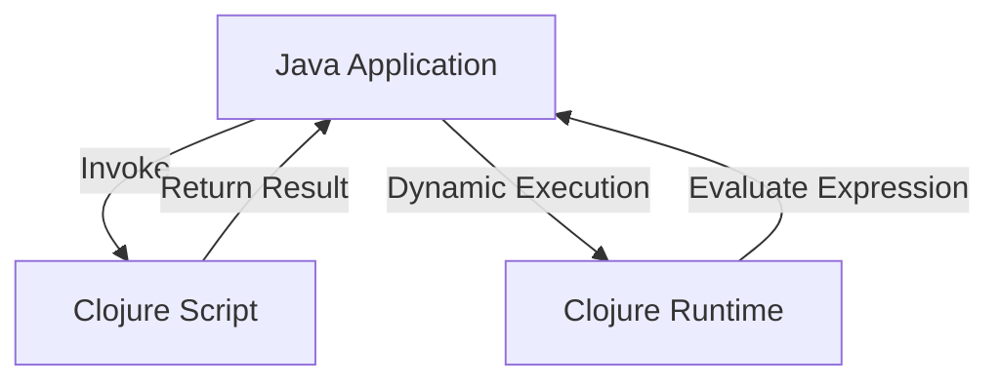

## 12.2 Embedding Clojure in Java Applications

As enterprises seek to modernize their software architectures, integrating Clojure into existing Java applications offers a powerful way to leverage functional programming paradigms while maintaining the robustness of Java. This section explores how to embed Clojure within Java applications, providing a seamless transition that enhances functionality and performance.

### Introduction to Clojure and Java Interoperability

Clojure, a dynamic, functional programming language that runs on the Java Virtual Machine (JVM), offers a unique opportunity for Java developers to incorporate functional programming concepts into their existing codebases. By embedding Clojure in Java applications, developers can take advantage of Clojure's expressive syntax, immutable data structures, and powerful concurrency primitives.

#### Why Embed Clojure in Java?

- **Enhanced Functionality**: Clojure's functional programming capabilities can simplify complex logic and improve code readability.
- **Concurrency**: Clojure's concurrency models, such as Software Transactional Memory (STM), provide robust solutions for managing state in multi-threaded environments.
- **Rapid Prototyping**: Clojure can be used as a scripting language within Java applications, allowing for quick experimentation and prototyping.
- **Interoperability**: Clojure's seamless integration with Java allows for the reuse of existing Java libraries and frameworks.

### Setting Up Your Environment

Before embedding Clojure in a Java application, ensure that your development environment is properly configured. This includes setting up the necessary tools and libraries to facilitate integration.

#### Prerequisites

- **Java Development Kit (JDK)**: Ensure that you have the latest version of the JDK installed.
- **Clojure**: Install Clojure using a build tool like Leiningen or the Clojure CLI.
- **IDE Support**: Use an Integrated Development Environment (IDE) that supports both Java and Clojure, such as IntelliJ IDEA with the Cursive plugin.

#### Configuring Your Project

To integrate Clojure into a Java project, you need to configure your build system to handle both Java and Clojure code. This involves setting up dependencies and ensuring that both languages can coexist within the same project.

##### Using Maven

Maven is a popular build automation tool for Java projects. To add Clojure support, include the following dependencies in your `pom.xml` file:

```xml
<dependencies>
    <!-- Clojure Dependency -->
    <dependency>
        <groupId>org.clojure</groupId>
        <artifactId>clojure</artifactId>
        <version>1.11.1</version>
    </dependency>
    <!-- Clojure Maven Plugin -->
    <dependency>
        <groupId>com.theoryinpractise</groupId>
        <artifactId>clojure-maven-plugin</artifactId>
        <version>1.8.4</version>
    </dependency>
</dependencies>
```

##### Using Gradle

For Gradle users, add the following to your `build.gradle` file:

```groovy
plugins {
    id 'java'
    id 'clojure' version '1.11.1'
}

dependencies {
    implementation 'org.clojure:clojure:1.11.1'
}
```

### Embedding Clojure Code in Java

Once your environment is set up, you can begin embedding Clojure code within your Java application. This involves creating Clojure scripts or functions that can be invoked from Java.

#### Creating Clojure Scripts

Clojure scripts are typically stored in `.clj` files. These scripts can define functions, data structures, and logic that can be called from Java.

**Example Clojure Script (`example.clj`):**

```clojure
(ns example.core)

(defn greet
  "A simple function that returns a greeting message."
  [name]
  (str "Hello, " name "!"))

(defn add-numbers
  "Adds two numbers together."
  [a b]
  (+ a b))
```

#### Invoking Clojure from Java

To call Clojure functions from Java, use the `clojure.java.api.Clojure` class, which provides methods to interact with Clojure code.

**Java Code Example:**

```java
import clojure.java.api.Clojure;
import clojure.lang.IFn;

public class ClojureIntegration {
    public static void main(String[] args) {
        // Load the Clojure script
        Clojure.var("clojure.core", "require").invoke(Clojure.read("example.core"));

        // Get the Clojure function
        IFn greet = Clojure.var("example.core", "greet");
        IFn addNumbers = Clojure.var("example.core", "add-numbers");

        // Call the Clojure function
        String greeting = (String) greet.invoke("World");
        System.out.println(greeting); // Output: Hello, World!

        // Call the add-numbers function
        int sum = (Integer) addNumbers.invoke(5, 10);
        System.out.println("Sum: " + sum); // Output: Sum: 15
    }
}
```

### Using Clojure as a Scripting Language

Clojure can be used as a scripting language within Java applications, allowing for dynamic execution of Clojure code. This is particularly useful for scenarios where you need to evaluate expressions or execute scripts at runtime.

#### Dynamic Code Execution

To execute Clojure code dynamically, use the `clojure.lang.RT` and `clojure.lang.Var` classes to evaluate expressions and manage Clojure state.

**Java Code Example for Dynamic Execution:**

```java
import clojure.lang.RT;
import clojure.lang.Var;

public class ClojureScripting {
    public static void main(String[] args) {
        // Initialize Clojure runtime
        RT.init();

        // Evaluate a simple Clojure expression
        Object result = RT.var("clojure.core", "eval").invoke(RT.read("(+ 1 2 3)"));
        System.out.println("Result: " + result); // Output: Result: 6

        // Define and execute a Clojure function dynamically
        Var defn = RT.var("clojure.core", "defn");
        defn.invoke(RT.read("dynamic-add"), RT.read("[x y]"), RT.read("(+ x y)"));

        Var dynamicAdd = RT.var("user", "dynamic-add");
        Object sum = dynamicAdd.invoke(10, 20);
        System.out.println("Dynamic Sum: " + sum); // Output: Dynamic Sum: 30
    }
}
```

### Best Practices for Embedding Clojure in Java

When embedding Clojure in Java applications, consider the following best practices to ensure a smooth integration:

- **Modular Design**: Keep Clojure code modular and well-organized, using namespaces to separate concerns.
- **Error Handling**: Implement robust error handling to manage exceptions that may arise from Clojure code execution.
- **Performance Optimization**: Profile and optimize Clojure code to ensure it performs efficiently within the Java application.
- **Testing**: Write comprehensive tests for both Java and Clojure components to ensure reliability and correctness.

### Visualizing the Integration Process

To better understand the integration process, consider the following diagram, which illustrates the flow of data and control between Java and Clojure components.



**Diagram Description**: This flowchart depicts a Java application invoking a Clojure script, receiving results, and dynamically executing Clojure expressions through the Clojure runtime.

### References and Further Reading

For more information on embedding Clojure in Java applications, consider the following resources:

- [Clojure Official Documentation](https://clojure.org/reference)
- [Clojure Community Resources](https://clojure.org/community/resources)
- [Transitioning from OOP to Functional Programming](https://www.lispcast.com/oo-to-fp/)
- [Clojure Maven Plugin](https://github.com/talios/clojure-maven-plugin)

### Knowledge Check

To reinforce your understanding of embedding Clojure in Java applications, consider the following questions:

1. What are the benefits of using Clojure as a scripting language within Java applications?
2. How can you dynamically execute Clojure code from a Java application?
3. What are some best practices for integrating Clojure into Java projects?

### Exercises

1. Modify the provided Java code example to call a new Clojure function that multiplies two numbers.
2. Create a Clojure script that defines a function to reverse a string and call it from a Java application.
3. Implement error handling in the Java code to gracefully manage exceptions from Clojure function calls.

### Summary

Embedding Clojure in Java applications allows developers to harness the power of functional programming while maintaining the strengths of their existing Java codebases. By following best practices and leveraging Clojure's capabilities, enterprises can enhance their software architectures, improve code maintainability, and foster innovation.

## **Quiz: Are You Ready to Migrate from Java to Clojure?**



### What is one advantage of embedding Clojure in Java applications?

- [x] Enhanced functionality through functional programming
- [ ] Reduced code complexity
- [ ] Improved object-oriented design
- [ ] Increased memory usage

> **Explanation:** Embedding Clojure in Java applications allows developers to leverage functional programming paradigms, enhancing functionality and code readability.

### Which tool is used to manage Clojure dependencies in a Maven project?

- [x] Clojure Maven Plugin
- [ ] Gradle
- [ ] Leiningen
- [ ] Ant

> **Explanation:** The Clojure Maven Plugin is used to manage Clojure dependencies and integrate Clojure code into Maven projects.

### How can you call a Clojure function from Java?

- [x] Using `clojure.java.api.Clojure` and `IFn`
- [ ] Using `java.lang.reflect.Method`
- [ ] Using `java.util.concurrent.Callable`
- [ ] Using `java.lang.Runnable`

> **Explanation:** The `clojure.java.api.Clojure` class and `IFn` interface are used to call Clojure functions from Java.

### What is the purpose of the `RT` class in Clojure?

- [x] To initialize and manage the Clojure runtime
- [ ] To compile Clojure code
- [ ] To handle Java exceptions
- [ ] To manage Java threads

> **Explanation:** The `RT` class is used to initialize and manage the Clojure runtime, allowing for dynamic code execution.

### Which of the following is a best practice when embedding Clojure in Java?

- [x] Modular Design
- [ ] Use of global variables
- [ ] Avoiding error handling
- [ ] Ignoring performance optimization

> **Explanation:** Modular design is a best practice that ensures Clojure code is well-organized and maintainable.

### What is a common use case for using Clojure as a scripting language in Java?

- [x] Rapid prototyping and experimentation
- [ ] Compiling Java code
- [ ] Managing database connections
- [ ] Handling network requests

> **Explanation:** Clojure can be used as a scripting language for rapid prototyping and experimentation within Java applications.

### How do you define a Clojure function dynamically in Java?

- [x] Using `RT.var` and `RT.read`
- [ ] Using `java.lang.reflect.Method`
- [ ] Using `java.util.function.Function`
- [ ] Using `java.lang.Runnable`

> **Explanation:** `RT.var` and `RT.read` are used to define and execute Clojure functions dynamically in Java.

### What is the role of namespaces in Clojure?

- [x] To organize code and separate concerns
- [ ] To manage memory allocation
- [ ] To handle exceptions
- [ ] To compile Java code

> **Explanation:** Namespaces in Clojure are used to organize code and separate concerns, making it easier to manage and maintain.

### Which class is used to evaluate Clojure expressions in Java?

- [x] `RT`
- [ ] `IFn`
- [ ] `Var`
- [ ] `Clojure`

> **Explanation:** The `RT` class is used to evaluate Clojure expressions in Java, allowing for dynamic execution of code.

### True or False: Clojure can only be used as a standalone language and cannot be integrated with Java.

- [ ] True
- [x] False

> **Explanation:** False. Clojure can be seamlessly integrated with Java, allowing for interoperability and the use of Clojure within Java applications.


