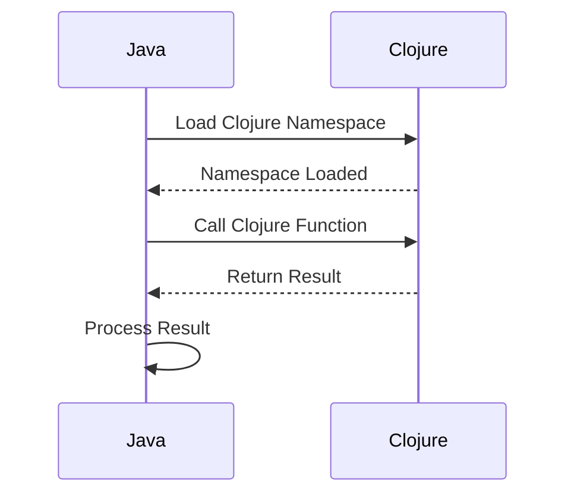

## 12.2 Embedding Clojure in Java Applications

As Java developers, we often face the challenge of integrating new technologies into our existing systems. Clojure, with its powerful functional programming paradigm, offers a unique opportunity to enhance Java applications. In this section, we will explore how to embed Clojure within Java applications, leveraging its capabilities as a scripting language and beyond. This guide will provide you with the knowledge and tools needed to seamlessly integrate Clojure into your Java projects, enhancing functionality and maintainability.

### Understanding Clojure's Role in Java Applications

Clojure is a dynamic, functional programming language that runs on the Java Virtual Machine (JVM). This makes it inherently compatible with Java, allowing for seamless integration. By embedding Clojure in Java applications, you can:

- **Leverage Functional Programming**: Utilize Clojure's functional programming features to write concise, expressive code.
- **Enhance Modularity**: Use Clojure for scripting and modularizing complex logic.
- **Improve Maintainability**: Benefit from Clojure's immutability and simplicity to create maintainable codebases.

### Why Embed Clojure in Java?

Before diving into the technical aspects, let's discuss why you might want to embed Clojure in your Java applications:

1. **Scripting Capabilities**: Clojure can be used as a scripting language within Java applications, allowing for dynamic code execution and rapid prototyping.
2. **Functional Paradigm**: Clojure's functional programming model can simplify complex logic and improve code readability.
3. **Interoperability**: Clojure's seamless interoperability with Java means you can leverage existing Java libraries and frameworks.
4. **Concurrency**: Clojure's concurrency model can enhance the performance of Java applications, particularly in multi-threaded environments.

### Setting Up Clojure in Java Projects

To embed Clojure in a Java application, you need to set up your development environment to support both languages. Here's a step-by-step guide:

#### Step 1: Add Clojure Dependency

First, add Clojure as a dependency in your Java project. If you're using Maven, include the following in your `pom.xml`:

```xml
<dependency>
    <groupId>org.clojure</groupId>
    <artifactId>clojure</artifactId>
    <version>1.10.3</version>
</dependency>
```

For Gradle, add this to your `build.gradle`:

```groovy
dependencies {
    implementation 'org.clojure:clojure:1.10.3'
}
```

#### Step 2: Create a Clojure Script

Create a Clojure script file, for example, `script.clj`, and write your Clojure code. Here's a simple example:

```clojure
(ns myapp.script)

(defn greet [name]
  (str "Hello, " name "!"))

(defn add [a b]
  (+ a b))
```

#### Step 3: Load and Execute Clojure Code in Java

To execute Clojure code from Java, use the `clojure.java.api.Clojure` class. Here's how you can load and call Clojure functions from Java:

```java
import clojure.java.api.Clojure;
import clojure.lang.IFn;

public class ClojureIntegration {
    public static void main(String[] args) {
        // Load the Clojure namespace
        IFn require = Clojure.var("clojure.core", "require");
        require.invoke(Clojure.read("myapp.script"));

        // Access and call the Clojure function
        IFn greet = Clojure.var("myapp.script", "greet");
        String greeting = (String) greet.invoke("World");
        System.out.println(greeting); // Outputs: Hello, World!

        IFn add = Clojure.var("myapp.script", "add");
        int sum = (int) add.invoke(5, 3);
        System.out.println(sum); // Outputs: 8
    }
}
```

### Using Clojure as a Scripting Language

One of the most powerful aspects of embedding Clojure in Java is using it as a scripting language. This allows for dynamic code execution, which can be particularly useful for:

- **Configuration**: Use Clojure scripts for application configuration, allowing for flexible and dynamic setups.
- **Prototyping**: Quickly prototype new features or algorithms without recompiling the entire Java application.
- **Data Processing**: Leverage Clojure's data manipulation capabilities for complex data processing tasks.

#### Example: Dynamic Configuration with Clojure

Imagine you have a Java application that requires dynamic configuration. You can use Clojure to define configuration logic:

```clojure
(ns myapp.config)

(def config
  {:db-host "localhost"
   :db-port 5432
   :api-key "your-api-key"})
```

Load and use this configuration in Java:

```java
import clojure.java.api.Clojure;
import clojure.lang.IFn;
import clojure.lang.PersistentArrayMap;

public class ConfigLoader {
    public static void main(String[] args) {
        IFn require = Clojure.var("clojure.core", "require");
        require.invoke(Clojure.read("myapp.config"));

        IFn config = Clojure.var("myapp.config", "config");
        PersistentArrayMap configMap = (PersistentArrayMap) config.invoke();

        String dbHost = (String) configMap.get(Clojure.read(":db-host"));
        int dbPort = (int) configMap.get(Clojure.read(":db-port"));

        System.out.println("DB Host: " + dbHost);
        System.out.println("DB Port: " + dbPort);
    }
}
```

### Handling Data with Clojure

Clojure's data structures are immutable and persistent, offering a robust way to handle data within Java applications. Let's explore how to manipulate data using Clojure:

#### Example: Data Transformation

Suppose you have a list of numbers and you want to transform them using Clojure:

```clojure
(ns myapp.data)

(defn transform-numbers [numbers]
  (map #(* % 2) numbers))
```

Invoke this transformation from Java:

```java
import clojure.java.api.Clojure;
import clojure.lang.IFn;
import clojure.lang.PersistentVector;

import java.util.List;

public class DataTransformer {
    public static void main(String[] args) {
        IFn require = Clojure.var("clojure.core", "require");
        require.invoke(Clojure.read("myapp.data"));

        IFn transformNumbers = Clojure.var("myapp.data", "transform-numbers");
        List<Integer> numbers = List.of(1, 2, 3, 4, 5);
        PersistentVector transformed = (PersistentVector) transformNumbers.invoke(numbers);

        System.out.println(transformed); // Outputs: [2, 4, 6, 8, 10]
    }
}
```

### Error Handling and Debugging

When embedding Clojure in Java, it's essential to handle errors and debug effectively. Clojure exceptions can be caught and managed in Java, providing a seamless error-handling experience.

#### Example: Handling Clojure Exceptions in Java

Here's how you can catch and handle exceptions thrown by Clojure code:

```java
import clojure.java.api.Clojure;
import clojure.lang.IFn;

public class ExceptionHandling {
    public static void main(String[] args) {
        try {
            IFn require = Clojure.var("clojure.core", "require");
            require.invoke(Clojure.read("myapp.script"));

            IFn divide = Clojure.var("myapp.script", "divide");
            divide.invoke(10, 0); // This will throw an exception
        } catch (Exception e) {
            System.err.println("An error occurred: " + e.getMessage());
        }
    }
}
```

### Best Practices for Embedding Clojure in Java

To ensure a smooth integration of Clojure in Java applications, consider the following best practices:

- **Modularize Clojure Code**: Keep Clojure scripts modular and focused on specific tasks.
- **Use Clojure for Complex Logic**: Leverage Clojure's strengths for complex data transformations and functional logic.
- **Maintain Clear Boundaries**: Clearly define the boundaries between Java and Clojure code to avoid confusion.
- **Optimize Performance**: Profile and optimize Clojure code to ensure it meets performance requirements.

### Visualizing Clojure and Java Integration

To better understand the flow of data and control between Java and Clojure, let's visualize the process using a sequence diagram:



**Diagram Description**: This sequence diagram illustrates the interaction between Java and Clojure. Java loads a Clojure namespace, calls a function, and processes the returned result.

### Try It Yourself

Now that we've explored embedding Clojure in Java applications, try modifying the examples to suit your needs. Experiment with different Clojure functions and see how they can enhance your Java projects.

### Further Reading and Resources

For more information on Clojure and Java interoperability, consider exploring the following resources:

- [Official Clojure Documentation](https://clojure.org/)
- [ClojureDocs](https://clojuredocs.org/)
- [GitHub Repositories](https://github.com/clojure)

### Knowledge Check

Let's reinforce what we've learned with a quick quiz.

## **Quiz: Are You Ready to Migrate from Java to Clojure?**



### What is one of the primary benefits of embedding Clojure in Java applications?

- [x] Leverage functional programming features
- [ ] Increase application size
- [ ] Reduce code readability
- [ ] Limit interoperability

> **Explanation:** Embedding Clojure allows you to leverage its functional programming features, enhancing code expressiveness and maintainability.

### How can you add Clojure as a dependency in a Maven project?

- [x] By adding a dependency in the `pom.xml` file
- [ ] By installing a separate plugin
- [ ] By modifying the Java classpath manually
- [ ] By using a Clojure-specific IDE

> **Explanation:** Adding Clojure as a dependency in the `pom.xml` file is the standard way to include it in a Maven project.

### What is the purpose of the `clojure.java.api.Clojure` class in Java?

- [x] To load and execute Clojure code from Java
- [ ] To compile Java code
- [ ] To manage Java threads
- [ ] To handle Java exceptions

> **Explanation:** The `clojure.java.api.Clojure` class is used to load and execute Clojure code within Java applications.

### Which of the following is a use case for using Clojure as a scripting language in Java?

- [x] Dynamic configuration
- [ ] Static type checking
- [ ] Memory management
- [ ] Network communication

> **Explanation:** Clojure can be used for dynamic configuration, allowing for flexible and adaptable setups within Java applications.

### What is a key advantage of Clojure's data structures?

- [x] Immutability and persistence
- [ ] High memory usage
- [ ] Complex syntax
- [ ] Limited scalability

> **Explanation:** Clojure's data structures are immutable and persistent, providing robustness and reliability in data handling.

### How can you handle exceptions thrown by Clojure code in Java?

- [x] Using try-catch blocks in Java
- [ ] By ignoring them
- [ ] By recompiling the Java application
- [ ] By using a special Clojure IDE

> **Explanation:** Exceptions thrown by Clojure code can be caught and handled using Java's try-catch blocks.

### What is a best practice when embedding Clojure in Java applications?

- [x] Modularize Clojure code
- [ ] Write all logic in a single script
- [ ] Avoid using Clojure for complex logic
- [ ] Mix Java and Clojure code without clear boundaries

> **Explanation:** Modularizing Clojure code helps maintain clarity and focus, making it easier to manage and integrate with Java.

### What does the sequence diagram illustrate in the context of Java and Clojure integration?

- [x] The interaction between Java and Clojure
- [ ] The internal workings of the JVM
- [ ] The structure of a Java class
- [ ] The lifecycle of a Java thread

> **Explanation:** The sequence diagram illustrates the interaction between Java and Clojure, showing how data and control flow between them.

### What is a common use case for Clojure's concurrency model in Java applications?

- [x] Enhancing performance in multi-threaded environments
- [ ] Simplifying single-threaded applications
- [ ] Reducing application security
- [ ] Limiting application scalability

> **Explanation:** Clojure's concurrency model can enhance performance in multi-threaded environments, making it a valuable tool for Java applications.

### True or False: Clojure can only be used for scripting within Java applications.

- [ ] True
- [x] False

> **Explanation:** While Clojure can be used for scripting, it can also be used for more complex logic and data processing within Java applications.



By embedding Clojure in your Java applications, you can harness the power of functional programming to create more expressive, maintainable, and efficient systems. As you continue to explore this integration, remember to leverage Clojure's strengths and maintain clear boundaries between the two languages for optimal results.
