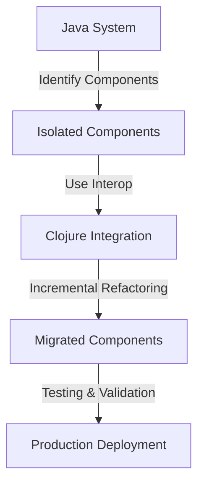

## 12.3 Gradual Migration Techniques

Transitioning from Java's Object-Oriented Programming (OOP) paradigm to Clojure's functional programming model can be a daunting task, especially for large enterprise systems. However, a gradual migration strategy can mitigate risks, manage complexity, and ensure continuity of service. In this section, we will explore various strategies for coexisting Java and Clojure codebases and incrementally replacing Java components with Clojure.

### Introduction to Gradual Migration

Gradual migration involves transitioning from one technology stack to another in a phased manner, allowing both systems to coexist temporarily. This approach is particularly beneficial for enterprises with extensive Java codebases, as it minimizes disruptions and allows for continuous delivery of business value.

#### Key Benefits of Gradual Migration

- **Risk Mitigation**: By migrating incrementally, you can identify and address issues early in the process.
- **Continuous Delivery**: Maintain the ability to deliver new features and updates without a complete system overhaul.
- **Resource Allocation**: Spread the migration effort over time, allowing teams to manage workloads effectively.
- **Learning and Adaptation**: Teams can gradually adapt to Clojure's functional paradigm, reducing the learning curve.

### Strategies for Coexisting Java and Clojure Codebases

To facilitate a smooth transition, it's essential to establish a strategy for integrating Clojure into an existing Java ecosystem. Here are some effective strategies:

#### 1. Identify and Isolate Components

Begin by identifying components within your Java application that can be isolated and rewritten in Clojure. Focus on areas where Clojure's strengths, such as concurrency and data manipulation, can provide immediate benefits.

- **Modular Architecture**: Break down your application into smaller, independent modules. This modular approach makes it easier to replace individual components without affecting the entire system.
- **Microservices**: Consider adopting a microservices architecture, where each service can be independently developed and deployed. This allows for a gradual transition of services from Java to Clojure.

#### 2. Use Interoperability Features

Clojure is designed to interoperate seamlessly with Java, allowing you to call Java code from Clojure and vice versa. This interoperability is crucial for a gradual migration.

- **Calling Java from Clojure**: Use Clojure's Java interop features to call existing Java methods and classes. This allows you to leverage existing Java functionality while gradually introducing Clojure.

```clojure
;; Example of calling a Java method from Clojure
(import 'java.util.Date)

(defn current-time []
  (.toString (Date.)))

(println (current-time)) ; Prints the current date and time
```

- **Embedding Clojure in Java**: Embed Clojure code within Java applications using the Clojure runtime. This approach allows you to introduce Clojure gradually without rewriting entire components.

```java
// Example of embedding Clojure code in Java
import clojure.java.api.Clojure;
import clojure.lang.IFn;

public class ClojureIntegration {
    public static void main(String[] args) {
        IFn plus = Clojure.var("clojure.core", "+");
        System.out.println(plus.invoke(1, 2)); // Outputs 3
    }
}
```

#### 3. Incremental Refactoring

Refactor existing Java code incrementally, replacing specific functionalities with Clojure. This approach allows for a controlled transition, ensuring that each change is thoroughly tested before proceeding to the next.

- **Refactor by Feature**: Identify specific features or functionalities that can be rewritten in Clojure. This targeted approach allows for focused testing and validation.
- **Automated Testing**: Implement automated tests to ensure that refactored components behave as expected. This is crucial for maintaining system integrity during migration.

### Incrementally Replacing Java Components with Clojure

Once you have established a strategy for coexistence, the next step is to incrementally replace Java components with Clojure. This process involves several key steps:

#### 1. Prioritize Components for Migration

Not all components need to be migrated at once. Prioritize components based on factors such as:

- **Business Value**: Focus on components that deliver the most business value when migrated to Clojure.
- **Technical Debt**: Target components with high technical debt, where a rewrite can improve maintainability and performance.
- **Clojure Strengths**: Identify components where Clojure's strengths, such as concurrency and immutability, can provide significant benefits.

#### 2. Develop a Migration Plan

Create a detailed migration plan that outlines the sequence of component migrations, timelines, and resource allocation. This plan should include:

- **Milestones**: Define clear milestones to track progress and ensure alignment with business objectives.
- **Risk Management**: Identify potential risks and develop mitigation strategies to address them.
- **Stakeholder Engagement**: Involve stakeholders throughout the migration process to ensure buy-in and support.

#### 3. Implement and Validate

Begin the migration process by implementing the plan and validating each migrated component. This involves:

- **Development**: Rewrite the identified components in Clojure, ensuring adherence to best practices and coding standards.
- **Testing**: Conduct thorough testing to validate the functionality and performance of migrated components.
- **Deployment**: Deploy the migrated components to production, ensuring minimal disruption to users.

### Case Study: Gradual Migration in Practice

To illustrate the effectiveness of gradual migration, let's consider a hypothetical case study of an enterprise transitioning from Java to Clojure.

#### Background

A financial services company with a large Java-based trading platform decided to migrate to Clojure to leverage its functional programming capabilities and improve system performance.

#### Migration Strategy

The company adopted a gradual migration strategy, focusing on the following key areas:

- **Component Isolation**: Isolated the trading engine as a separate module, allowing for independent migration.
- **Interoperability**: Used Clojure's Java interop features to integrate Clojure components with existing Java code.
- **Incremental Refactoring**: Refactored the trading engine incrementally, replacing specific functionalities with Clojure.

#### Outcomes

The gradual migration approach resulted in several positive outcomes:

- **Improved Performance**: The trading engine's performance improved significantly due to Clojure's efficient concurrency model.
- **Reduced Technical Debt**: The refactored components were more maintainable and easier to extend.
- **Increased Developer Productivity**: Developers reported increased productivity and satisfaction due to Clojure's expressive syntax and functional paradigm.

### Visualizing the Migration Process

To better understand the gradual migration process, let's visualize the data flow between components during migration using a Mermaid.js diagram.



**Diagram Description**: This flowchart illustrates the gradual migration process from a Java system to a Clojure-based system. It highlights key steps such as identifying components, using interoperability features, incremental refactoring, and testing and validation.

### Best Practices for a Successful Migration

To ensure a successful migration from Java to Clojure, consider the following best practices:

- **Effective Communication**: Maintain open communication with stakeholders to manage expectations and address concerns.
- **Incremental Improvements**: Focus on incremental improvements rather than a complete overhaul, allowing for continuous delivery of business value.
- **Leverage Community and Support**: Engage with the Clojure community for support and resources. The [Clojure Community Resources](https://clojure.org/community/resources) page is an excellent starting point.

### Conclusion

Gradual migration from Java to Clojure offers a practical and effective approach to transitioning to a functional programming paradigm. By leveraging interoperability features, prioritizing components for migration, and adopting best practices, enterprises can achieve a seamless transition while minimizing risks and disruptions.

For further reading on Clojure's features and capabilities, refer to the [Clojure Official Documentation](https://clojure.org/reference) and explore additional resources on [Transitioning from OOP to Functional Programming](https://www.lispcast.com/oo-to-fp/).

## **Quiz: Are You Ready to Migrate from Java to Clojure?**



### Which of the following is a key benefit of gradual migration?

- [x] Risk Mitigation
- [ ] Immediate System Overhaul
- [ ] Complete Code Rewrite
- [ ] Discontinuous Delivery

> **Explanation:** Gradual migration allows for risk mitigation by identifying and addressing issues early in the process.

### What is the primary purpose of using Clojure's Java interop features during migration?

- [x] To call existing Java methods and classes
- [ ] To rewrite Java components in Clojure
- [ ] To eliminate Java dependencies
- [ ] To convert Java code to Clojure syntax

> **Explanation:** Clojure's Java interop features allow you to call existing Java methods and classes, facilitating a gradual transition.

### Which strategy involves breaking down an application into smaller, independent modules?

- [x] Modular Architecture
- [ ] Monolithic Architecture
- [ ] Complete Rewrite
- [ ] Immediate Overhaul

> **Explanation:** Modular architecture involves breaking down an application into smaller, independent modules, making it easier to replace individual components.

### What is the first step in incrementally replacing Java components with Clojure?

- [x] Prioritize Components for Migration
- [ ] Rewrite All Components
- [ ] Deploy to Production
- [ ] Eliminate Java Code

> **Explanation:** Prioritizing components for migration is the first step in incrementally replacing Java components with Clojure.

### Which of the following is NOT a benefit of gradual migration?

- [ ] Continuous Delivery
- [ ] Resource Allocation
- [x] Immediate System Overhaul
- [ ] Learning and Adaptation

> **Explanation:** Immediate system overhaul is not a benefit of gradual migration; gradual migration focuses on incremental changes.

### What is the role of automated testing in incremental refactoring?

- [x] To ensure refactored components behave as expected
- [ ] To eliminate the need for manual testing
- [ ] To rewrite Java components
- [ ] To convert Java code to Clojure

> **Explanation:** Automated testing ensures that refactored components behave as expected, maintaining system integrity during migration.

### Which approach allows for independent development and deployment of services?

- [x] Microservices
- [ ] Monolithic Architecture
- [ ] Complete Rewrite
- [ ] Immediate Overhaul

> **Explanation:** Microservices architecture allows for independent development and deployment of services, facilitating gradual migration.

### What should be included in a detailed migration plan?

- [x] Milestones, Risk Management, Stakeholder Engagement
- [ ] Complete Code Rewrite
- [ ] Immediate System Overhaul
- [ ] Elimination of Java Code

> **Explanation:** A detailed migration plan should include milestones, risk management, and stakeholder engagement to ensure a successful transition.

### Which of the following is a best practice for a successful migration?

- [x] Effective Communication
- [ ] Immediate Overhaul
- [ ] Complete Rewrite
- [ ] Elimination of Java Code

> **Explanation:** Effective communication with stakeholders is a best practice for managing expectations and addressing concerns during migration.

### True or False: Gradual migration allows for a complete system overhaul in one step.

- [ ] True
- [x] False

> **Explanation:** Gradual migration focuses on incremental changes rather than a complete system overhaul in one step.


