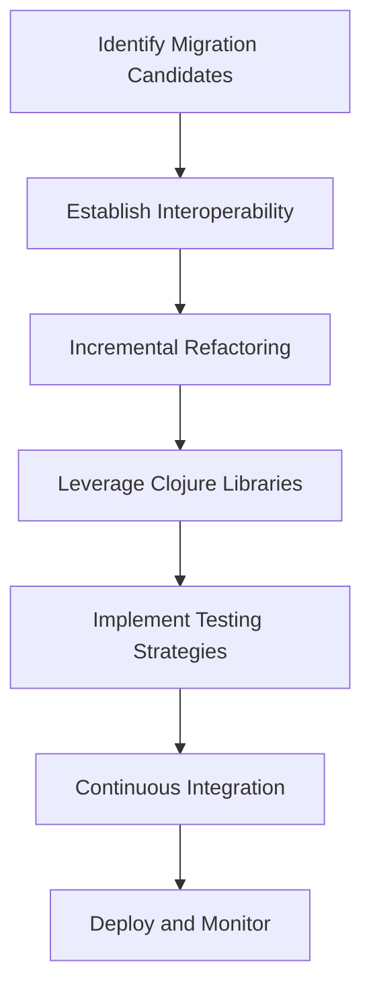

## 12.3 Gradual Migration Techniques

Transitioning from Java to Clojure in an enterprise environment is a significant undertaking that requires careful planning and execution. A gradual migration approach allows organizations to incrementally replace Java components with Clojure, minimizing risk and disruption. This section explores strategies for coexisting Java and Clojure codebases, providing a roadmap for a successful transition.

### Understanding Gradual Migration

Gradual migration involves incrementally integrating Clojure into an existing Java codebase. This approach allows teams to leverage the strengths of both languages while progressively adopting Clojure's functional programming paradigm. By maintaining interoperability between Java and Clojure, organizations can ensure a smooth transition without sacrificing existing functionality.

#### Benefits of Gradual Migration

- **Reduced Risk**: By migrating incrementally, organizations can identify and address issues early, reducing the risk of large-scale failures.
- **Continuous Delivery**: Gradual migration supports continuous delivery practices, allowing teams to deliver value to users throughout the transition.
- **Resource Optimization**: Teams can allocate resources more effectively, focusing on high-impact areas first.
- **Knowledge Transfer**: Developers can gradually build expertise in Clojure, facilitating knowledge transfer and reducing the learning curve.

### Strategies for Coexisting Java and Clojure Codebases

To successfully implement a gradual migration, it's essential to establish strategies for integrating Java and Clojure codebases. The following approaches provide a framework for achieving seamless interoperability:

#### 1. Identify Migration Candidates

Begin by identifying Java components that are suitable for migration to Clojure. Focus on areas where Clojure's strengths, such as concurrency and immutability, can provide significant benefits. Consider the following criteria:

- **Complexity**: Target complex components that can benefit from Clojure's expressive syntax and functional abstractions.
- **Performance**: Identify performance bottlenecks that can be addressed with Clojure's efficient data structures and concurrency models.
- **Maintainability**: Prioritize components with high maintenance costs, where Clojure's concise code can improve readability and reduce errors.

#### 2. Establish Interoperability

Ensure seamless communication between Java and Clojure components by leveraging interoperability features. Clojure runs on the Java Virtual Machine (JVM), allowing direct interaction with Java classes and libraries. Use the following techniques to establish interoperability:

- **Calling Java from Clojure**: Utilize Clojure's interop capabilities to call Java methods and access Java objects. This allows Clojure code to leverage existing Java functionality without rewriting it.

```clojure
;; Example: Calling a Java method from Clojure
(import 'java.util.Date)

(defn get-current-time []
  (.toString (Date.)))

;; Usage
(get-current-time) ; Returns the current date and time as a string
```

- **Embedding Clojure in Java**: Embed Clojure code within Java applications using the Clojure runtime. This approach allows Java code to execute Clojure functions and access Clojure data structures.

```java
// Example: Embedding Clojure in Java
import clojure.java.api.Clojure;
import clojure.lang.IFn;

public class ClojureIntegration {
    public static void main(String[] args) {
        IFn clojureFunction = Clojure.var("clojure.core", "str");
        String result = (String) clojureFunction.invoke("Hello, ", "Clojure!");
        System.out.println(result); // Outputs: Hello, Clojure!
    }
}
```

#### 3. Incremental Refactoring

Adopt an incremental refactoring approach to gradually replace Java components with Clojure. This involves rewriting small sections of code at a time, ensuring that each change is thoroughly tested before proceeding. Follow these steps:

- **Refactor for Immutability**: Begin by refactoring Java code to embrace immutability, a core concept in Clojure. Replace mutable data structures with immutable alternatives, reducing side effects and improving code reliability.

- **Introduce Functional Concepts**: Gradually introduce functional programming concepts, such as pure functions and higher-order functions, into the Java codebase. This prepares the code for a smoother transition to Clojure.

- **Translate Java Patterns**: Identify common Java design patterns and translate them into idiomatic Clojure code. This may involve rethinking object-oriented patterns in favor of functional alternatives.

#### 4. Leverage Clojure Libraries

Take advantage of Clojure's rich ecosystem of libraries to enhance functionality and reduce development time. Clojure libraries often provide more concise and expressive solutions compared to their Java counterparts. Consider the following:

- **Data Transformation**: Use libraries like `clojure.core` and `clojure.data.json` for efficient data transformation and manipulation.

```clojure
(require '[clojure.data.json :as json])

(defn parse-json [json-string]
  (json/read-str json-string :key-fn keyword))

;; Usage
(parse-json "{\"name\": \"Alice\", \"age\": 30}")
;; Returns: {:name "Alice", :age 30}
```

- **Concurrency**: Leverage Clojure's concurrency libraries, such as `core.async` and `clojure.core.reducers`, to simplify concurrent programming and improve performance.

#### 5. Implement Testing Strategies

Testing is crucial during the migration process to ensure that both Java and Clojure components function correctly. Implement comprehensive testing strategies to validate the integration and functionality of the codebase:

- **Unit Testing**: Write unit tests for both Java and Clojure components to verify individual functionality. Use testing frameworks like JUnit for Java and `clojure.test` for Clojure.

```clojure
(ns myapp.core-test
  (:require [clojure.test :refer :all]
            [myapp.core :refer :all]))

(deftest test-addition
  (is (= 5 (add 2 3))))

(run-tests)
```

- **Integration Testing**: Conduct integration tests to validate the interaction between Java and Clojure components. Ensure that data flows correctly and that functionality is preserved across the codebase.

- **Continuous Integration**: Implement continuous integration (CI) pipelines to automate testing and deployment. This ensures that changes are validated and deployed consistently throughout the migration process.

### Visualizing the Migration Process

To better understand the flow of a gradual migration, let's visualize the process using a flowchart. This diagram illustrates the key steps involved in transitioning from Java to Clojure:



**Figure 1**: Flowchart illustrating the gradual migration process from Java to Clojure.

### Best Practices for a Successful Migration

To ensure a successful migration, adhere to the following best practices:

- **Effective Communication**: Maintain open communication with stakeholders and team members throughout the migration process. Clearly articulate the benefits and challenges of the transition to gain support and alignment.

- **Incremental Improvements**: Focus on incremental improvements rather than attempting a complete overhaul. This approach allows for continuous delivery of value and reduces the risk of disruption.

- **Leverage Community and Support**: Engage with the Clojure community to access resources, support, and best practices. Participate in forums, attend meetups, and contribute to open-source projects to enhance your understanding of Clojure.

### Knowledge Check

To reinforce your understanding of gradual migration techniques, consider the following questions:

- What are the key benefits of a gradual migration approach?
- How can you establish interoperability between Java and Clojure codebases?
- What strategies can you use to incrementally refactor Java components to Clojure?
- How can Clojure libraries enhance functionality and reduce development time?
- What testing strategies should be implemented during the migration process?

### Encouraging Experimentation

Now that we've explored gradual migration techniques, let's apply these concepts to your own projects. Experiment with the code examples provided, and consider how you can integrate Clojure into your existing Java applications. By taking a gradual approach, you'll be well-equipped to harness the power of Clojure's functional programming paradigm.

## **Quiz: Are You Ready to Migrate from Java to Clojure?**



### What is a key benefit of gradual migration from Java to Clojure?

- [x] Reduced risk of large-scale failures
- [ ] Immediate performance improvements
- [ ] Complete codebase overhaul
- [ ] Elimination of all Java code

> **Explanation:** Gradual migration reduces the risk of large-scale failures by allowing incremental changes and early identification of issues.

### How can you call Java methods from Clojure?

- [x] Using Clojure's interop capabilities
- [ ] By rewriting Java code in Clojure
- [ ] Through a separate API layer
- [ ] By converting Java classes to Clojure data structures

> **Explanation:** Clojure's interop capabilities allow direct interaction with Java methods and objects, facilitating seamless integration.

### What is the purpose of embedding Clojure in Java applications?

- [x] To execute Clojure functions within Java code
- [ ] To replace Java code with Clojure
- [ ] To convert Java classes to Clojure data structures
- [ ] To create a separate API layer

> **Explanation:** Embedding Clojure in Java applications allows Java code to execute Clojure functions and access Clojure data structures.

### What is a key step in incremental refactoring?

- [x] Refactoring for immutability
- [ ] Rewriting all Java code in Clojure
- [ ] Eliminating all Java dependencies
- [ ] Creating a separate API layer

> **Explanation:** Refactoring for immutability is a key step in incremental refactoring, aligning Java code with Clojure's functional programming principles.

### Which Clojure library is useful for data transformation?

- [x] clojure.data.json
- [ ] core.async
- [ ] clojure.core.reducers
- [ ] clojure.test

> **Explanation:** The `clojure.data.json` library is useful for efficient data transformation and manipulation in Clojure.

### What is the role of unit testing during migration?

- [x] To verify individual functionality of components
- [ ] To eliminate all Java code
- [ ] To create a separate API layer
- [ ] To rewrite all tests in Clojure

> **Explanation:** Unit testing verifies the individual functionality of components, ensuring that both Java and Clojure code function correctly.

### How can continuous integration support the migration process?

- [x] By automating testing and deployment
- [ ] By eliminating all Java dependencies
- [ ] By creating a separate API layer
- [ ] By rewriting all code in Clojure

> **Explanation:** Continuous integration supports the migration process by automating testing and deployment, ensuring consistent validation of changes.

### What is a best practice for effective communication during migration?

- [x] Maintain open communication with stakeholders
- [ ] Eliminate all Java dependencies
- [ ] Create a separate API layer
- [ ] Rewrite all code in Clojure

> **Explanation:** Maintaining open communication with stakeholders ensures alignment and support throughout the migration process.

### How can you leverage the Clojure community during migration?

- [x] By accessing resources and best practices
- [ ] By eliminating all Java dependencies
- [ ] By creating a separate API layer
- [ ] By rewriting all code in Clojure

> **Explanation:** Engaging with the Clojure community provides access to resources, support, and best practices, enhancing the migration process.

### True or False: Gradual migration involves a complete codebase overhaul.

- [ ] True
- [x] False

> **Explanation:** Gradual migration involves incremental changes rather than a complete codebase overhaul, reducing risk and disruption.


