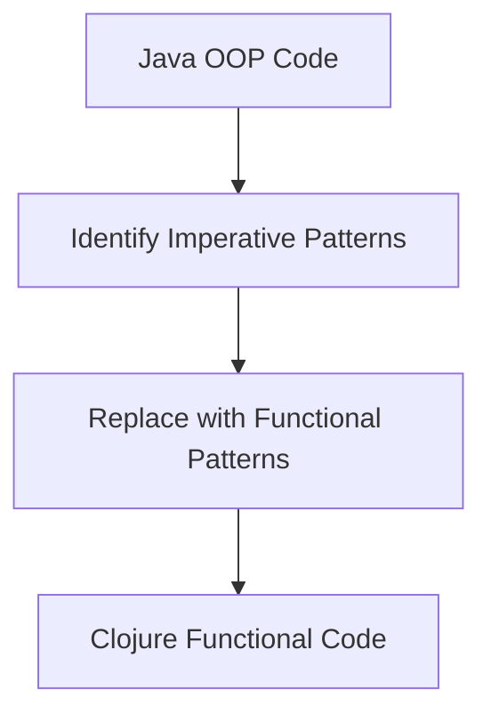

## 13.1 Identifying Refactoring Opportunities

In the journey from Java's Object-Oriented Programming (OOP) to Clojure's functional programming paradigm, identifying refactoring opportunities is a crucial step. This process involves analyzing existing Java code to find areas where functional replacements can simplify and enhance the codebase. By leveraging Clojure's expressive features, we can transform complex OOP structures into elegant functional patterns, improving scalability, maintainability, and productivity.

### Understanding Refactoring in the Context of Migration

Refactoring is the process of restructuring existing code without changing its external behavior. When migrating from Java to Clojure, refactoring involves identifying parts of the Java code that can benefit from functional programming concepts. This transition not only simplifies the code but also aligns it with Clojure's idiomatic practices.

#### Key Benefits of Refactoring

1. **Improved Readability**: Functional code is often more concise and easier to understand.
2. **Enhanced Maintainability**: By reducing complexity, the code becomes easier to maintain and extend.
3. **Increased Testability**: Pure functions and immutability make testing more straightforward.
4. **Better Performance**: Functional patterns can lead to more efficient code execution.

### Analyzing Java Code for Functional Replacements

To identify refactoring opportunities, we must first analyze the existing Java codebase. This involves understanding the current architecture, identifying pain points, and recognizing patterns that can be transformed into functional equivalents.

#### Common Java Patterns and Their Functional Counterparts

1. **Imperative Loops**: Replace with higher-order functions like `map`, `filter`, and `reduce`.
2. **Mutable State**: Transition to immutable data structures.
3. **Inheritance**: Favor composition and protocols over class hierarchies.
4. **Exception Handling**: Use functional error handling strategies.

### Simplifying Complex OOP Code with Functional Patterns

Let's delve into specific examples where Java OOP code can be refactored into Clojure's functional patterns.

#### Example 1: Replacing Imperative Loops

**Java Code:**

```java
List<Integer> numbers = Arrays.asList(1, 2, 3, 4, 5);
List<Integer> squaredNumbers = new ArrayList<>();
for (Integer number : numbers) {
    squaredNumbers.add(number * number);
}
```

**Clojure Code:**

```clojure
(def numbers [1 2 3 4 5])
(def squared-numbers (map #(* % %) numbers))
```

In this example, the imperative loop in Java is replaced by the `map` function in Clojure, which applies a function to each element in a collection, resulting in a more concise and expressive solution.

#### Example 2: Transitioning from Mutable to Immutable State

**Java Code:**

```java
class Counter {
    private int count = 0;

    public void increment() {
        count++;
    }

    public int getCount() {
        return count;
    }
}
```

**Clojure Code:**

```clojure
(defn increment [count]
  (inc count))

(def count 0)
(def new-count (increment count))
```

Here, the mutable state in Java is replaced by immutable data in Clojure. The `increment` function returns a new value instead of modifying the existing state.

#### Example 3: Favoring Composition Over Inheritance

**Java Code:**

```java
class Animal {
    public void makeSound() {
        System.out.println("Some sound");
    }
}

class Dog extends Animal {
    @Override
    public void makeSound() {
        System.out.println("Bark");
    }
}
```

**Clojure Code:**

```clojure
(defprotocol Sound
  (make-sound [this]))

(defrecord Dog []
  Sound
  (make-sound [this] (println "Bark")))
```

In this example, Java's inheritance is replaced by Clojure's protocols and records, promoting composition and flexibility.

### Visualizing Refactoring Opportunities

To better understand the transformation from Java OOP to Clojure functional patterns, let's use a diagram to illustrate the flow of data through higher-order functions.



**Diagram Description**: This flowchart represents the process of identifying imperative patterns in Java code, replacing them with functional patterns, and resulting in Clojure functional code.

### Key Considerations for Refactoring

1. **Identify Bottlenecks**: Focus on areas of the code that are complex, hard to maintain, or have performance issues.
2. **Prioritize Readability**: Ensure that the refactored code is easier to read and understand.
3. **Maintain Functionality**: Refactor without altering the external behavior of the code.
4. **Leverage Clojure's Strengths**: Utilize Clojure's features like immutability, higher-order functions, and concurrency models.

### Try It Yourself: Experiment with Refactoring

To solidify your understanding, try refactoring the following Java code into Clojure:

**Java Code:**

```java
List<String> names = Arrays.asList("Alice", "Bob", "Charlie");
List<String> upperCaseNames = new ArrayList<>();
for (String name : names) {
    upperCaseNames.add(name.toUpperCase());
}
```

**Challenge**: Refactor this code using Clojure's functional patterns.

### Further Reading and Resources

- [Official Clojure Documentation](https://clojure.org/)
- [ClojureDocs](https://clojuredocs.org/)
- [Functional Programming in Clojure](https://www.braveclojure.com/)

### Knowledge Check

1. **What is the primary goal of refactoring in the context of migrating from Java to Clojure?**
   - [x] To simplify and enhance the codebase by aligning it with functional programming practices.
   - [ ] To completely rewrite the code from scratch.
   - [ ] To add more features to the existing code.

2. **Which Clojure function can replace an imperative loop in Java?**
   - [x] `map`
   - [ ] `for`
   - [ ] `loop`

3. **What is a key benefit of using immutable data structures in Clojure?**
   - [x] Increased testability and reduced complexity.
   - [ ] Faster execution time.
   - [ ] Easier to modify state.

4. **How does Clojure handle polymorphism differently from Java?**
   - [x] Through protocols and multimethods.
   - [ ] Through class inheritance.
   - [ ] Through interfaces only.

5. **What should be prioritized when refactoring code?**
   - [x] Readability and maintainability.
   - [ ] Adding new features.
   - [ ] Reducing the number of lines of code.

### Quiz: Are You Ready to Migrate from Java to Clojure?



### What is the primary goal of refactoring in the context of migrating from Java to Clojure?

- [x] To simplify and enhance the codebase by aligning it with functional programming practices.
- [ ] To completely rewrite the code from scratch.
- [ ] To add more features to the existing code.

> **Explanation:** The primary goal of refactoring is to simplify and enhance the codebase by aligning it with functional programming practices, without changing its external behavior.

### Which Clojure function can replace an imperative loop in Java?

- [x] `map`
- [ ] `for`
- [ ] `loop`

> **Explanation:** The `map` function in Clojure applies a function to each element in a collection, effectively replacing an imperative loop.

### What is a key benefit of using immutable data structures in Clojure?

- [x] Increased testability and reduced complexity.
- [ ] Faster execution time.
- [ ] Easier to modify state.

> **Explanation:** Immutable data structures lead to increased testability and reduced complexity, as they prevent unintended side effects.

### How does Clojure handle polymorphism differently from Java?

- [x] Through protocols and multimethods.
- [ ] Through class inheritance.
- [ ] Through interfaces only.

> **Explanation:** Clojure uses protocols and multimethods to handle polymorphism, offering more flexibility than Java's class inheritance.

### What should be prioritized when refactoring code?

- [x] Readability and maintainability.
- [ ] Adding new features.
- [ ] Reducing the number of lines of code.

> **Explanation:** Readability and maintainability should be prioritized to ensure the code is easy to understand and extend.

### True or False: Refactoring should change the external behavior of the code.

- [ ] True
- [x] False

> **Explanation:** Refactoring should not change the external behavior of the code; it should only improve the internal structure.

### Which of the following is a functional pattern that can replace Java's inheritance?

- [x] Composition
- [ ] Singleton
- [ ] Factory

> **Explanation:** Composition is a functional pattern that can replace Java's inheritance, promoting flexibility and reuse.

### What is the advantage of using higher-order functions in Clojure?

- [x] They allow functions to be passed as arguments and returned as values.
- [ ] They make the code run faster.
- [ ] They reduce the number of lines of code.

> **Explanation:** Higher-order functions allow functions to be passed as arguments and returned as values, enabling more abstract and flexible code.

### Which Clojure feature helps in managing concurrency effectively?

- [x] Atoms, Refs, and Agents
- [ ] Threads
- [ ] Locks

> **Explanation:** Atoms, Refs, and Agents are Clojure features that help in managing concurrency effectively, providing different models for state management.

### What is the purpose of using protocols in Clojure?

- [x] To define a set of functions that can be implemented by different types.
- [ ] To create classes.
- [ ] To manage memory.

> **Explanation:** Protocols in Clojure define a set of functions that can be implemented by different types, enabling polymorphism.



By understanding and applying these refactoring opportunities, we can effectively transition from Java's OOP to Clojure's functional programming paradigm, unlocking the full potential of our codebase. Let's embrace this journey and transform our enterprise applications for the better.
