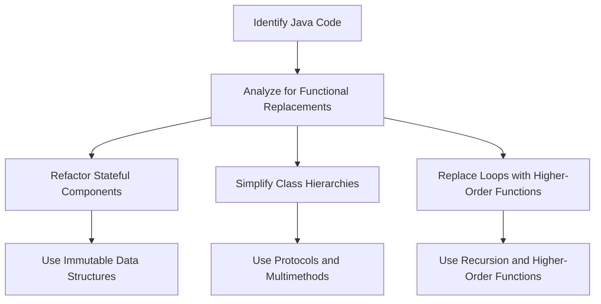

## 13.1 Identifying Refactoring Opportunities

As we embark on the journey of migrating from Java's Object-Oriented Programming (OOP) paradigm to Clojure's functional programming model, one of the crucial steps is identifying refactoring opportunities within your existing Java codebase. This process involves analyzing Java code to find areas where functional programming patterns can replace complex OOP structures, ultimately simplifying the code and enhancing maintainability.

### Understanding Refactoring in the Context of Migration

Refactoring is the process of restructuring existing computer code without changing its external behavior. It is a critical step in the migration process, as it helps in cleaning up the code, making it more readable, and preparing it for a smooth transition to a new paradigm. When transitioning from Java OOP to Clojure, refactoring involves:

- **Analyzing Java Code for Functional Replacements**: Identifying parts of the code that can benefit from functional programming constructs.
- **Simplifying Complex OOP Code with Functional Patterns**: Replacing intricate class hierarchies and state management with simpler, more expressive functional patterns.

### Analyzing Java Code for Functional Replacements

To effectively refactor Java code for Clojure, we must first understand the key differences between the two paradigms and identify specific areas where functional programming can offer improvements.

#### Identifying Stateful Components

Java OOP often relies heavily on mutable state, which can lead to complex and error-prone code. In Clojure, immutability is a core principle, and state is managed in a controlled manner. Look for opportunities to replace mutable state with immutable data structures.

**Example: Mutable State in Java**

```java
public class Counter {
    private int count = 0;

    public void increment() {
        count++;
    }

    public int getCount() {
        return count;
    }
}
```

**Refactored to Clojure**

```clojure
(defn increment [count]
  (inc count))

;; Usage
(def count 0)
(def new-count (increment count))
```

In this example, the mutable state in Java is replaced with an immutable approach in Clojure, where functions return new values instead of modifying existing ones.

#### Simplifying Complex Class Hierarchies

Java applications often use deep class hierarchies to achieve polymorphism and code reuse. In Clojure, protocols and multimethods offer a more flexible and simpler way to achieve polymorphism without the need for complex inheritance structures.

**Example: Class Hierarchy in Java**

```java
abstract class Animal {
    abstract void makeSound();
}

class Dog extends Animal {
    void makeSound() {
        System.out.println("Woof");
    }
}

class Cat extends Animal {
    void makeSound() {
        System.out.println("Meow");
    }
}
```

**Refactored to Clojure**

```clojure
(defprotocol Animal
  (make-sound [this]))

(defrecord Dog []
  Animal
  (make-sound [_] (println "Woof")))

(defrecord Cat []
  Animal
  (make-sound [_] (println "Meow")))

;; Usage
(make-sound (->Dog))
(make-sound (->Cat))
```

By using protocols, we achieve polymorphism without the need for inheritance, making the code more modular and easier to extend.

#### Replacing Loops with Recursion and Higher-Order Functions

Java developers often use loops for iteration, which can be replaced with recursion or higher-order functions in Clojure, leading to more concise and expressive code.

**Example: Loop in Java**

```java
int sum = 0;
for (int i = 0; i < numbers.length; i++) {
    sum += numbers[i];
}
```

**Refactored to Clojure**

```clojure
(def numbers [1 2 3 4 5])

(def sum (reduce + numbers))
```

In this example, the loop is replaced with the `reduce` function, which abstracts the iteration and accumulation process, resulting in cleaner and more readable code.

### Simplifying Complex OOP Code with Functional Patterns

Functional programming offers several patterns that can simplify complex OOP code. Let's explore some of these patterns and how they can be applied to refactor Java code.

#### Using Pure Functions

Pure functions are a cornerstone of functional programming. They do not have side effects and always produce the same output for the same input. Identifying and refactoring methods to become pure functions can lead to more predictable and testable code.

**Example: Impure Function in Java**

```java
public class Calculator {
    private int lastResult = 0;

    public int add(int a, int b) {
        lastResult = a + b;
        return lastResult;
    }
}
```

**Refactored to Clojure**

```clojure
(defn add [a b]
  (+ a b))
```

By removing the side effect of modifying `lastResult`, the function becomes pure, making it easier to reason about and test.

#### Embracing Immutability

In Java, objects are often mutable, leading to potential issues with shared state and concurrency. Clojure's immutable data structures eliminate these problems, making code safer and easier to understand.

**Example: Mutable Object in Java**

```java
public class Point {
    private int x;
    private int y;

    public Point(int x, int y) {
        this.x = x;
        this.y = y;
    }

    public void move(int dx, int dy) {
        x += dx;
        y += dy;
    }
}
```

**Refactored to Clojure**

```clojure
(defn move-point [point dx dy]
  (update point :x + dx)
  (update point :y + dy))

;; Usage
(def point {:x 0 :y 0})
(def new-point (move-point point 1 1))
```

In this refactoring, the `Point` object is replaced with an immutable map, and the `move` operation returns a new map with updated values.

#### Leveraging Higher-Order Functions

Higher-order functions, which take other functions as arguments or return them as results, can replace complex control structures and enhance code reusability.

**Example: Strategy Pattern in Java**

```java
interface Strategy {
    int execute(int a, int b);
}

class AddStrategy implements Strategy {
    public int execute(int a, int b) {
        return a + b;
    }
}

class Context {
    private Strategy strategy;

    public Context(Strategy strategy) {
        this.strategy = strategy;
    }

    public int executeStrategy(int a, int b) {
        return strategy.execute(a, b);
    }
}
```

**Refactored to Clojure**

```clojure
(defn execute-strategy [strategy a b]
  (strategy a b))

;; Usage
(def add-strategy +)
(execute-strategy add-strategy 1 2)
```

By using higher-order functions, we eliminate the need for interfaces and classes, resulting in more concise and flexible code.

### Visualizing the Transition

To better understand the transition from Java OOP to Clojure, let's visualize the refactoring process using a flowchart.



**Diagram Description**: This flowchart illustrates the process of identifying and refactoring Java code for a transition to Clojure. It highlights key areas such as stateful components, class hierarchies, and loops, and suggests functional programming techniques for each.

### Practical Steps for Identifying Refactoring Opportunities

1. **Conduct a Code Review**: Begin by reviewing your Java codebase to identify areas with high complexity, frequent bugs, or performance issues. These are prime candidates for refactoring.

2. **Map Java Concepts to Clojure Equivalents**: Create a mapping of Java OOP concepts to their Clojure counterparts. This will help in visualizing the refactoring process and understanding the benefits of functional replacements.

3. **Prioritize Refactoring Efforts**: Focus on refactoring areas that will provide the most significant benefits in terms of code simplicity, maintainability, and performance.

4. **Iteratively Refactor and Test**: Refactor the code in small, manageable increments, and test each change thoroughly to ensure that the code's behavior remains consistent.

5. **Engage the Team**: Involve the development team in the refactoring process. Encourage collaboration and knowledge sharing to ensure a smooth transition.

### Try It Yourself

To gain hands-on experience with refactoring Java code to Clojure, try the following exercises:

- **Exercise 1**: Identify a class in your Java codebase that uses inheritance and refactor it to use Clojure protocols.
- **Exercise 2**: Find a method that modifies an object's state and refactor it to use immutable data structures in Clojure.
- **Exercise 3**: Replace a loop in your Java code with a higher-order function in Clojure.

### Knowledge Check

- **Question 1**: What is the primary benefit of using immutable data structures in Clojure?
- **Question 2**: How can higher-order functions simplify code in Clojure?
- **Question 3**: What are the advantages of using protocols over class inheritance in Clojure?

### Conclusion

Identifying refactoring opportunities is a crucial step in the migration from Java OOP to Clojure. By analyzing Java code for functional replacements and simplifying complex OOP structures with functional patterns, we can create a more maintainable and efficient codebase. Embracing functional programming principles such as immutability, pure functions, and higher-order functions will not only enhance code quality but also pave the way for a successful transition to Clojure.

## **Quiz: Are You Ready to Migrate from Java to Clojure?**



### What is a key advantage of using immutable data structures in Clojure?

- [x] They prevent unintended side effects.
- [ ] They are faster than mutable structures.
- [ ] They use less memory.
- [ ] They are easier to write.

> **Explanation:** Immutable data structures prevent unintended side effects by ensuring that data cannot be changed once created, leading to safer and more predictable code.

### How do higher-order functions enhance code reusability in Clojure?

- [x] By allowing functions to be passed as arguments.
- [ ] By reducing the need for variables.
- [x] By enabling functions to return other functions.
- [ ] By eliminating the need for loops.

> **Explanation:** Higher-order functions enhance code reusability by allowing functions to be passed as arguments and returned as results, enabling more abstract and flexible code patterns.

### What is a benefit of using protocols in Clojure over class inheritance in Java?

- [x] They provide more flexible polymorphism.
- [ ] They are easier to implement.
- [ ] They require less code.
- [ ] They are faster to execute.

> **Explanation:** Protocols provide more flexible polymorphism by allowing different data types to implement the same interface without the constraints of class inheritance.

### Which of the following is a characteristic of pure functions?

- [x] They do not have side effects.
- [ ] They modify global state.
- [ ] They depend on external variables.
- [ ] They produce different outputs for the same inputs.

> **Explanation:** Pure functions do not have side effects and always produce the same output for the same input, making them predictable and easy to test.

### What is the purpose of the `reduce` function in Clojure?

- [x] To accumulate values in a collection.
- [ ] To iterate over a collection.
- [x] To apply a function to elements of a collection.
- [ ] To filter elements in a collection.

> **Explanation:** The `reduce` function is used to accumulate values in a collection by applying a function to its elements, effectively replacing loops for such operations.

### How can refactoring improve the migration process from Java to Clojure?

- [x] By simplifying code and making it more maintainable.
- [ ] By increasing the complexity of the code.
- [ ] By adding more classes and interfaces.
- [ ] By making the code less readable.

> **Explanation:** Refactoring simplifies code and makes it more maintainable, which is crucial for a successful migration from Java to Clojure.

### What is a common refactoring opportunity when transitioning from Java to Clojure?

- [x] Replacing loops with higher-order functions.
- [ ] Adding more mutable state.
- [x] Simplifying class hierarchies with protocols.
- [ ] Increasing the use of inheritance.

> **Explanation:** Common refactoring opportunities include replacing loops with higher-order functions and simplifying class hierarchies with protocols, aligning with functional programming principles.

### Why is it important to conduct a code review before refactoring?

- [x] To identify areas with high complexity and frequent bugs.
- [ ] To add more features to the code.
- [ ] To increase the number of classes.
- [ ] To make the code longer.

> **Explanation:** Conducting a code review helps identify areas with high complexity and frequent bugs, which are prime candidates for refactoring.

### What is the role of pure functions in functional programming?

- [x] To ensure predictability and ease of testing.
- [ ] To modify global variables.
- [ ] To introduce side effects.
- [ ] To depend on external state.

> **Explanation:** Pure functions ensure predictability and ease of testing by not having side effects and always producing the same output for the same input.

### True or False: Refactoring is only necessary when migrating from Java to Clojure.

- [ ] True
- [x] False

> **Explanation:** Refactoring is a general practice that improves code quality and maintainability, not limited to migration scenarios.


