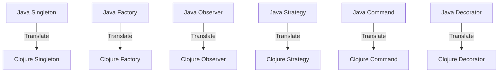

## 13.2 Translating Java Patterns to Clojure

As enterprises transition from Java's object-oriented programming (OOP) to Clojure's functional programming paradigm, understanding how to translate common Java design patterns into Clojure becomes crucial. This section provides a comprehensive guide to mapping Java patterns to their Clojure equivalents, offering refactoring examples and best practices to facilitate a smooth migration.

### Understanding Design Patterns in Java and Clojure

Java design patterns are established solutions to common problems in software design, often leveraging OOP principles such as encapsulation, inheritance, and polymorphism. In contrast, Clojure emphasizes immutability, first-class functions, and data-oriented programming. As we explore the translation of Java patterns to Clojure, we'll focus on how these core principles shift.

### Singleton Pattern

#### Java Implementation

In Java, the Singleton pattern ensures that a class has only one instance and provides a global point of access to it. This is typically implemented using a private constructor and a static method.

```java
public class Singleton {
    private static Singleton instance;

    private Singleton() {}

    public static Singleton getInstance() {
        if (instance == null) {
            instance = new Singleton();
        }
        return instance;
    }
}
```

#### Clojure Equivalent

In Clojure, the Singleton pattern can be achieved using a combination of atoms and lazy initialization. Since Clojure emphasizes immutability, we use an atom to hold the state.

```clojure
(defonce singleton-instance (atom nil))

(defn get-singleton-instance []
  (when (nil? @singleton-instance)
    (reset! singleton-instance (create-instance)))
  @singleton-instance)

(defn create-instance []
  ;; Initialize your instance here
  {})
```

**Key Takeaway:** Clojure's use of `defonce` and atoms provides a thread-safe way to manage singleton instances, aligning with functional programming principles.

### Factory Pattern

#### Java Implementation

The Factory pattern in Java is used to create objects without specifying the exact class of object that will be created.

```java
public interface Shape {
    void draw();
}

public class Circle implements Shape {
    public void draw() {
        System.out.println("Drawing a Circle");
    }
}

public class ShapeFactory {
    public Shape getShape(String shapeType) {
        if (shapeType == null) {
            return null;
        }
        if (shapeType.equalsIgnoreCase("CIRCLE")) {
            return new Circle();
        }
        return null;
    }
}
```

#### Clojure Equivalent

In Clojure, we can use maps and functions to achieve similar behavior, leveraging Clojure's dynamic nature.

```clojure
(defmulti draw-shape :type)

(defmethod draw-shape :circle [_]
  (println "Drawing a Circle"))

(defn shape-factory [shape-type]
  (case shape-type
    "CIRCLE" {:type :circle}
    nil))

;; Usage
(draw-shape (shape-factory "CIRCLE"))
```

**Key Takeaway:** Clojure's multimethods and maps provide a flexible and extensible way to implement factory-like behavior, emphasizing data-driven design.

### Observer Pattern

#### Java Implementation

The Observer pattern defines a one-to-many dependency between objects, so that when one object changes state, all its dependents are notified.

```java
import java.util.ArrayList;
import java.util.List;

interface Observer {
    void update(String message);
}

class Subject {
    private List<Observer> observers = new ArrayList<>();

    public void attach(Observer observer) {
        observers.add(observer);
    }

    public void notifyAllObservers(String message) {
        for (Observer observer : observers) {
            observer.update(message);
        }
    }
}
```

#### Clojure Equivalent

In Clojure, we can use atoms and watchers to achieve similar functionality.

```clojure
(def observers (atom []))

(defn attach [observer]
  (swap! observers conj observer))

(defn notify-all-observers [message]
  (doseq [observer @observers]
    (observer message)))

;; Example observer function
(defn example-observer [message]
  (println "Received message:" message))

;; Usage
(attach example-observer)
(notify-all-observers "Hello, Observers!")
```

**Key Takeaway:** Clojure's atoms and functions as first-class citizens allow for a clean and concise implementation of the Observer pattern.

### Strategy Pattern

#### Java Implementation

The Strategy pattern defines a family of algorithms, encapsulates each one, and makes them interchangeable.

```java
interface Strategy {
    int execute(int a, int b);
}

class AddStrategy implements Strategy {
    public int execute(int a, int b) {
        return a + b;
    }
}

class Context {
    private Strategy strategy;

    public Context(Strategy strategy) {
        this.strategy = strategy;
    }

    public int executeStrategy(int a, int b) {
        return strategy.execute(a, b);
    }
}
```

#### Clojure Equivalent

In Clojure, we can use higher-order functions to achieve the Strategy pattern.

```clojure
(defn add-strategy [a b]
  (+ a b))

(defn execute-strategy [strategy a b]
  (strategy a b))

;; Usage
(execute-strategy add-strategy 5 3)
```

**Key Takeaway:** Higher-order functions in Clojure provide a natural and idiomatic way to implement the Strategy pattern, promoting code reuse and flexibility.

### Command Pattern

#### Java Implementation

The Command pattern encapsulates a request as an object, thereby allowing for parameterization of clients with queues, requests, and operations.

```java
interface Command {
    void execute();
}

class LightOnCommand implements Command {
    public void execute() {
        System.out.println("Light is on");
    }
}

class RemoteControl {
    private Command command;

    public void setCommand(Command command) {
        this.command = command;
    }

    public void pressButton() {
        command.execute();
    }
}
```

#### Clojure Equivalent

In Clojure, functions can be used to encapsulate commands.

```clojure
(defn light-on-command []
  (println "Light is on"))

(defn press-button [command]
  (command))

;; Usage
(press-button light-on-command)
```

**Key Takeaway:** Clojure's emphasis on functions as first-class citizens simplifies the implementation of the Command pattern, reducing boilerplate code.

### Decorator Pattern

#### Java Implementation

The Decorator pattern attaches additional responsibilities to an object dynamically.

```java
interface Coffee {
    String getDescription();
    double cost();
}

class SimpleCoffee implements Coffee {
    public String getDescription() {
        return "Simple Coffee";
    }

    public double cost() {
        return 5.0;
    }
}

class MilkDecorator implements Coffee {
    private Coffee coffee;

    public MilkDecorator(Coffee coffee) {
        this.coffee = coffee;
    }

    public String getDescription() {
        return coffee.getDescription() + ", Milk";
    }

    public double cost() {
        return coffee.cost() + 1.5;
    }
}
```

#### Clojure Equivalent

In Clojure, we can use functions to achieve similar behavior.

```clojure
(defn simple-coffee []
  {:description "Simple Coffee" :cost 5.0})

(defn milk-decorator [coffee]
  (update coffee :description #(str % ", Milk"))
  (update coffee :cost #(+ % 1.5)))

;; Usage
(milk-decorator (simple-coffee))
```

**Key Takeaway:** Clojure's data-oriented approach allows for easy extension and modification of data structures, aligning with the Decorator pattern's intent.

### Try It Yourself

Encourage experimentation by modifying the provided Clojure code examples. For instance, try adding new shapes to the factory pattern or creating additional observers in the observer pattern. This hands-on approach will deepen your understanding of translating Java patterns to Clojure.

### Visual Aids

#### Java to Clojure Pattern Mapping



**Diagram Description:** This flowchart illustrates the mapping of common Java design patterns to their Clojure equivalents, highlighting the translation process.

### References and Links

- [Clojure Official Documentation](https://clojure.org/reference)
- [Clojure Community Resources](https://clojure.org/community/resources)
- [Transitioning from OOP to Functional Programming](https://www.lispcast.com/oo-to-fp/)
- [Clojure STM Guide](https://clojure.org/reference/refs)

### Knowledge Check

- What are the key differences between Java's OOP and Clojure's functional programming paradigms?
- How does Clojure's use of atoms and functions facilitate the implementation of design patterns?
- Experiment with modifying the provided code examples to reinforce your understanding.

### Encouraging Engagement

Embracing functional programming can be challenging, but with each step, you'll gain a deeper understanding and see tangible benefits in your codebase. By translating Java patterns to Clojure, you're not only modernizing your systems but also enhancing their scalability and maintainability.

### Best Practices for Tags

- Use specific and relevant tags such as "Clojure", "Java", "Functional Programming", "Migration", "Design Patterns", "Code Refactoring", "Enterprise Applications", "Software Development".

## **Quiz: Are You Ready to Migrate from Java to Clojure?**



### Which Clojure construct is used to implement the Singleton pattern?

- [x] Atom
- [ ] List
- [ ] Vector
- [ ] Set

> **Explanation:** Atoms in Clojure provide a way to manage state changes safely, making them suitable for implementing the Singleton pattern.


### What is the Clojure equivalent of Java's Factory pattern?

- [x] Multimethods and maps
- [ ] Classes and objects
- [ ] Interfaces and inheritance
- [ ] Threads and locks

> **Explanation:** Clojure's multimethods and maps allow for flexible and extensible factory-like behavior.


### How does Clojure handle the Observer pattern?

- [x] Using atoms and functions
- [ ] Using classes and interfaces
- [ ] Using threads and locks
- [ ] Using inheritance

> **Explanation:** Clojure uses atoms to manage state and functions to notify observers, aligning with functional programming principles.


### Which Clojure feature simplifies the Strategy pattern?

- [x] Higher-order functions
- [ ] Macros
- [ ] Protocols
- [ ] Agents

> **Explanation:** Higher-order functions in Clojure allow for easy implementation of the Strategy pattern by passing functions as arguments.


### What is the primary benefit of using functions for the Command pattern in Clojure?

- [x] Reduces boilerplate code
- [ ] Increases complexity
- [ ] Requires more memory
- [ ] Slows down execution

> **Explanation:** Functions as first-class citizens in Clojure simplify the Command pattern, reducing the need for boilerplate code.


### How does Clojure's data-oriented approach support the Decorator pattern?

- [x] By allowing easy extension of data structures
- [ ] By enforcing strict type checking
- [ ] By using inheritance
- [ ] By requiring interfaces

> **Explanation:** Clojure's data-oriented approach allows for easy modification and extension of data structures, aligning with the Decorator pattern's intent.


### What is a key advantage of translating Java patterns to Clojure?

- [x] Enhances scalability and maintainability
- [ ] Increases code complexity
- [ ] Requires more resources
- [ ] Slows down development

> **Explanation:** Translating Java patterns to Clojure enhances scalability and maintainability by leveraging functional programming principles.


### Which Clojure construct is used to manage state changes safely?

- [x] Atom
- [ ] List
- [ ] Vector
- [ ] Set

> **Explanation:** Atoms provide a way to manage state changes safely in Clojure.


### What is the role of multimethods in Clojure?

- [x] To provide flexible and extensible behavior
- [ ] To enforce strict type checking
- [ ] To manage concurrency
- [ ] To handle exceptions

> **Explanation:** Multimethods in Clojure allow for flexible and extensible behavior, making them suitable for implementing patterns like the Factory pattern.


### True or False: Clojure's functional programming paradigm emphasizes immutability and first-class functions.

- [x] True
- [ ] False

> **Explanation:** Clojure's functional programming paradigm emphasizes immutability and first-class functions, which are core principles of the language.


