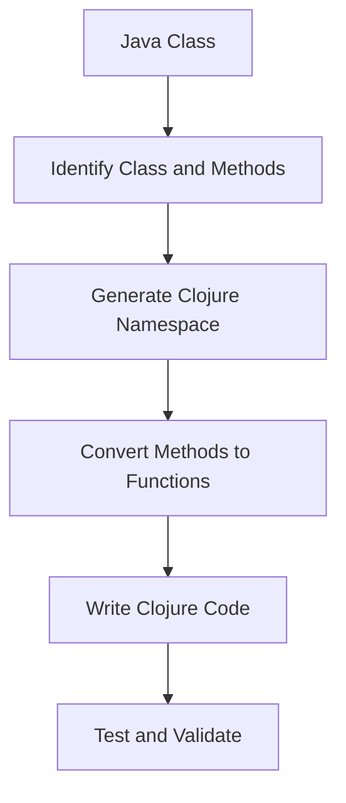

## 13.3 Automating Refactoring Tasks

Migrating from Java's Object-Oriented Programming (OOP) paradigm to Clojure's functional programming model can be a daunting task. However, by automating refactoring tasks, we can streamline the process, ensuring consistency and significantly reducing manual effort. This section will delve into the tools and techniques available for automating code translation, providing a comprehensive guide for developers undertaking this transition.

### Introduction to Automated Refactoring

Automated refactoring involves using tools and scripts to transform code from one form to another, maintaining the original functionality while adapting to a new paradigm. In the context of migrating from Java to Clojure, this means converting Java classes, methods, and patterns into Clojure's functional constructs.

#### Why Automate Refactoring?

1. **Consistency**: Automated tools ensure that refactoring is applied uniformly across the codebase, reducing the risk of human error.
2. **Efficiency**: Automation speeds up the migration process, allowing developers to focus on more complex tasks.
3. **Scalability**: Large codebases can be refactored more easily with automated tools, which can handle repetitive tasks quickly.

### Key Concepts in Automated Refactoring

Before diving into specific tools and techniques, it's essential to understand the key concepts that underpin automated refactoring:

- **Pattern Recognition**: Identifying common Java patterns that can be translated into Clojure equivalents.
- **Code Transformation**: Applying transformations to convert Java code into Clojure syntax and idioms.
- **Testing and Validation**: Ensuring that refactored code maintains its original functionality through rigorous testing.

### Tools for Automating Refactoring

Several tools can assist in automating the refactoring process from Java to Clojure. These tools range from general-purpose refactoring tools to Clojure-specific utilities.

#### General-Purpose Refactoring Tools

1. **IntelliJ IDEA**: A powerful IDE that offers extensive refactoring capabilities for Java. While not specific to Clojure, it can help identify refactoring opportunities and automate some transformations.

2. **Eclipse**: Another popular IDE with robust refactoring support for Java. Eclipse's refactoring tools can be used to prepare Java code for migration.

3. **JRebel**: A tool that allows for real-time code changes, making it easier to test refactored code without restarting the application.

#### Clojure-Specific Tools

1. **ClojureScript**: While primarily used for compiling Clojure to JavaScript, ClojureScript's compiler can help identify syntax errors and ensure that refactored code adheres to Clojure's syntax.

2. **Leiningen**: A build automation tool for Clojure that can be used to automate testing and deployment of refactored code.

3. **Eastwood**: A Clojure lint tool that can help identify potential issues in refactored code, ensuring that it adheres to best practices.

4. **Kibit**: A static code analyzer for Clojure that suggests idiomatic replacements for code patterns, helping to refine refactored code.

### Automating Common Refactoring Tasks

Let's explore some common refactoring tasks that can be automated during the migration from Java to Clojure:

#### Converting Java Classes to Clojure Namespaces

Java classes can be mapped to Clojure namespaces, with methods becoming functions. This transformation can be automated by recognizing class and method patterns and generating corresponding Clojure code.

```java
// Java Class Example
public class Calculator {
    public int add(int a, int b) {
        return a + b;
    }
}
```

```clojure
;; Clojure Namespace Example
(ns calculator)

(defn add [a b]
  (+ a b))
```

#### Transforming Java Loops to Clojure Recursion

Java's iterative loops can be converted to Clojure's recursive functions. This transformation requires recognizing loop patterns and generating recursive equivalents.

```java
// Java Loop Example
for (int i = 0; i < 10; i++) {
    System.out.println(i);
}
```

```clojure
;; Clojure Recursion Example
(defn print-nums [n]
  (when (< n 10)
    (println n)
    (recur (inc n))))

(print-nums 0)
```

#### Replacing Java Conditionals with Clojure's `cond`

Java's `if-else` statements can be replaced with Clojure's `cond` for more readable and idiomatic code.

```java
// Java Conditional Example
if (x > 0) {
    System.out.println("Positive");
} else if (x < 0) {
    System.out.println("Negative");
} else {
    System.out.println("Zero");
}
```

```clojure
;; Clojure Conditional Example
(cond
  (> x 0) (println "Positive")
  (< x 0) (println "Negative")
  :else (println "Zero"))
```

### Automating Refactoring with Scripts

In addition to using tools, custom scripts can be written to automate specific refactoring tasks. These scripts can be tailored to the unique needs of a project, allowing for more granular control over the refactoring process.

#### Example: Automating Namespace Conversion

A script can be written to automate the conversion of Java classes to Clojure namespaces. This script would parse Java files, extract class and method definitions, and generate corresponding Clojure code.

```bash
#!/bin/bash

# Script to convert Java classes to Clojure namespaces

for file in $(find . -name "*.java"); do
    classname=$(basename "$file" .java)
    namespace="${classname,,}"  # Convert to lowercase for Clojure namespace

    echo "(ns $namespace)" > "${namespace}.clj"

    # Extract methods and convert to Clojure functions
    grep -E 'public .* \w+\\(.*\\)' "$file" | while read -r line; do
        methodname=$(echo "$line" | awk '{print $3}' | cut -d'(' -f1)
        echo "(defn $methodname [] ...)" >> "${namespace}.clj"
    done
done
```

### Testing and Validation

Automated refactoring must be accompanied by rigorous testing to ensure that the refactored code maintains its original functionality. This involves:

- **Unit Testing**: Writing tests for individual functions to verify their behavior.
- **Integration Testing**: Ensuring that refactored components work together as expected.
- **Regression Testing**: Running existing tests to confirm that no new bugs have been introduced.

### Visualizing the Refactoring Process

To better understand the refactoring process, let's visualize the transformation of a Java class to a Clojure namespace using a flowchart.



**Figure 1:** Flowchart illustrating the automated refactoring process from Java classes to Clojure namespaces.

### Best Practices for Automated Refactoring

1. **Incremental Refactoring**: Break the refactoring process into smaller, manageable tasks to reduce complexity and risk.
2. **Continuous Integration**: Integrate automated refactoring tools into the CI/CD pipeline to ensure ongoing code quality.
3. **Code Reviews**: Conduct regular code reviews to catch issues that automated tools might miss.
4. **Documentation**: Maintain comprehensive documentation of refactoring scripts and processes to facilitate future maintenance.

### Challenges and Solutions

Automating refactoring tasks presents several challenges, including:

- **Complex Code Structures**: Some Java code structures may not have direct Clojure equivalents, requiring manual intervention.
- **Tool Limitations**: Automated tools may not cover all refactoring scenarios, necessitating custom scripts.
- **Testing Overhead**: Ensuring comprehensive test coverage can be resource-intensive.

To address these challenges, consider:

- **Hybrid Approach**: Combine automated tools with manual refactoring for complex scenarios.
- **Custom Tool Development**: Develop custom scripts to handle unique refactoring needs.
- **Test Automation**: Invest in automated testing frameworks to streamline the testing process.

### Conclusion

Automating refactoring tasks is a critical component of a successful migration from Java OOP to Clojure. By leveraging tools, scripts, and best practices, developers can ensure a smooth transition, maintaining code quality and functionality. As we embrace the functional programming paradigm, automation will play a pivotal role in modernizing enterprise systems.

For further reading on Clojure's functional programming features, visit the [Clojure Official Documentation](https://clojure.org/reference) and explore [Clojure Community Resources](https://clojure.org/community/resources).

## **Quiz: Are You Ready to Migrate from Java to Clojure?**



### What is the primary benefit of automating refactoring tasks?

- [x] Ensures consistency and reduces manual effort
- [ ] Increases code complexity
- [ ] Eliminates the need for testing
- [ ] Guarantees error-free code

> **Explanation:** Automating refactoring tasks ensures consistency across the codebase and reduces the manual effort required for migration.

### Which tool is specifically designed for Clojure linting?

- [ ] IntelliJ IDEA
- [ ] Eclipse
- [x] Eastwood
- [ ] JRebel

> **Explanation:** Eastwood is a Clojure lint tool that helps identify potential issues in refactored code.

### What is the Clojure equivalent of Java's `if-else` statements?

- [ ] `switch`
- [x] `cond`
- [ ] `case`
- [ ] `when`

> **Explanation:** Clojure's `cond` is used to replace Java's `if-else` statements for more readable and idiomatic code.

### How can Java loops be transformed in Clojure?

- [ ] Using `for` loops
- [x] Using recursion
- [ ] Using `while` loops
- [ ] Using `do` blocks

> **Explanation:** Java loops can be transformed into Clojure's recursive functions to adhere to functional programming principles.

### What is a key challenge in automating refactoring tasks?

- [ ] Lack of available tools
- [x] Complex code structures
- [ ] Inability to write tests
- [ ] Lack of documentation

> **Explanation:** Complex code structures may not have direct Clojure equivalents, requiring manual intervention.

### Which tool can be used for build automation in Clojure?

- [ ] Maven
- [ ] Gradle
- [x] Leiningen
- [ ] Ant

> **Explanation:** Leiningen is a build automation tool for Clojure that can automate testing and deployment.

### What is the purpose of a flowchart in the refactoring process?

- [ ] To write code
- [ ] To test code
- [x] To visualize the transformation process
- [ ] To compile code

> **Explanation:** A flowchart helps visualize the transformation process from Java classes to Clojure namespaces.

### What is the benefit of integrating automated refactoring tools into the CI/CD pipeline?

- [x] Ensures ongoing code quality
- [ ] Eliminates the need for manual testing
- [ ] Increases code complexity
- [ ] Guarantees error-free deployment

> **Explanation:** Integrating automated refactoring tools into the CI/CD pipeline ensures ongoing code quality.

### What is a common use case for custom scripts in refactoring?

- [ ] Writing new features
- [x] Automating specific refactoring tasks
- [ ] Compiling code
- [ ] Debugging code

> **Explanation:** Custom scripts can automate specific refactoring tasks tailored to the unique needs of a project.

### True or False: Automated refactoring eliminates the need for code reviews.

- [ ] True
- [x] False

> **Explanation:** Automated refactoring does not eliminate the need for code reviews, which are essential for catching issues that tools might miss.




