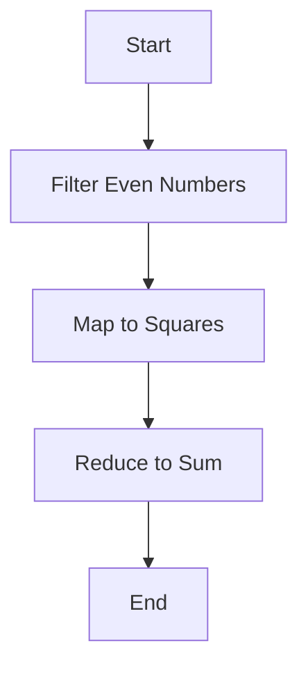

## 13.3 Automating Refactoring Tasks

As enterprises embark on the journey of migrating from Java's Object-Oriented Programming (OOP) paradigm to Clojure's functional programming model, one of the most challenging tasks is refactoring existing Java codebases. This section delves into the strategies, tools, and best practices for automating refactoring tasks, thereby ensuring consistency and significantly reducing manual effort.

### Introduction to Automated Refactoring

Refactoring is the process of restructuring existing computer code without changing its external behavior. When transitioning from Java to Clojure, refactoring becomes a crucial step to adapt the code to a new paradigm. Automation in refactoring can help streamline this process, ensuring that the transformation is efficient and error-free.

#### Why Automate Refactoring?

- **Consistency**: Automated tools apply the same rules across the entire codebase, ensuring uniformity.
- **Efficiency**: Reduces the time and effort required to manually refactor large codebases.
- **Error Reduction**: Minimizes human errors that can occur during manual refactoring.
- **Focus on High-Level Design**: Allows developers to concentrate on architectural and design decisions rather than repetitive code changes.

### Tools for Automating Refactoring

Several tools and scripts can assist in the automation of refactoring tasks. These tools range from simple scripts to sophisticated Integrated Development Environment (IDE) plugins.

#### 1. Cursive for IntelliJ IDEA

Cursive is a popular Clojure plugin for IntelliJ IDEA that provides powerful refactoring capabilities. It supports:

- **Namespace Management**: Automatically updates namespaces and imports.
- **Code Navigation**: Facilitates easy navigation between Java and Clojure code.
- **Refactoring Support**: Offers automated refactoring options like renaming, extracting functions, and more.

#### 2. Leiningen

Leiningen is a build automation tool for Clojure that can be extended with plugins to support refactoring tasks. It provides:

- **Project Management**: Simplifies dependency management and project configuration.
- **Task Automation**: Automates repetitive tasks, including code formatting and testing.

#### 3. clj-refactor

clj-refactor is an Emacs package that provides a suite of refactoring tools for Clojure. It includes:

- **Refactoring Commands**: Offers commands for renaming, extracting functions, and moving code.
- **Code Transformation**: Automates common code transformations to align with Clojure idioms.

#### 4. Java to Clojure Translators

While not perfect, some tools attempt to translate Java code to Clojure. These tools can serve as a starting point for refactoring:

- **j2clj**: A tool that translates Java code to Clojure, focusing on syntax conversion.
- **Java2Clojure**: An experimental tool for converting Java classes to Clojure namespaces.

### Strategies for Automated Refactoring

Automating refactoring tasks requires a strategic approach to ensure that the codebase is transformed effectively. Here are some strategies to consider:

#### Incremental Refactoring

- **Phased Approach**: Break down the refactoring process into manageable phases, focusing on specific modules or components.
- **Continuous Integration**: Integrate refactoring tasks into the CI/CD pipeline to ensure that changes are tested and validated continuously.

#### Code Analysis and Metrics

- **Static Analysis Tools**: Use tools like SonarQube to analyze the Java codebase and identify areas for refactoring.
- **Code Metrics**: Measure code complexity, duplication, and other metrics to prioritize refactoring tasks.

#### Scripted Refactoring

- **Custom Scripts**: Develop custom scripts to automate repetitive refactoring tasks, such as renaming variables or converting loops to functional constructs.
- **Template-Based Refactoring**: Use templates to standardize code patterns and automate their application across the codebase.

### Code Examples

Let's explore some code examples to illustrate automated refactoring from Java to Clojure.

#### Java Code Example

```java
// Java code to calculate the sum of squares of even numbers in a list
import java.util.List;
import java.util.stream.Collectors;

public class SumOfSquares {
    public static int calculateSumOfSquares(List<Integer> numbers) {
        return numbers.stream()
                      .filter(n -> n % 2 == 0)
                      .map(n -> n * n)
                      .reduce(0, Integer::sum);
    }
}
```

#### Clojure Code Example

```clojure
;; Clojure code to calculate the sum of squares of even numbers in a list
(defn calculate-sum-of-squares [numbers]
  (->> numbers
       (filter even?)
       (map #(* % %))
       (reduce + 0)))
```

**Key Differences:**

- **Functional Composition**: Clojure uses threading macros (`->>`) to compose functions, making the code more readable.
- **Immutability**: Clojure's data structures are immutable by default, reducing side effects.
- **Higher-Order Functions**: Clojure leverages higher-order functions like `filter`, `map`, and `reduce` to process collections.

### Visual Aids

To better understand the flow of data through higher-order functions in Clojure, let's visualize the process using a flowchart.



**Diagram Description:** This flowchart represents the transformation of a list of numbers through a series of higher-order functions in Clojure, illustrating the functional programming approach.

### Best Practices for Automated Refactoring

- **Leverage IDE Features**: Use IDE features and plugins to automate refactoring tasks and ensure code consistency.
- **Adopt Functional Patterns**: Embrace functional programming patterns and idioms to simplify code and improve maintainability.
- **Test-Driven Refactoring**: Write tests before refactoring to ensure that the code's behavior remains unchanged.

### Knowledge Check

To reinforce your understanding of automated refactoring tasks, consider the following questions:

1. What are the benefits of automating refactoring tasks during a Java to Clojure migration?
2. How can tools like Cursive and Leiningen assist in the refactoring process?
3. What strategies can be employed to ensure a smooth refactoring process?
4. How does Clojure's approach to data processing differ from Java's?

### Encouraging Tone

Now that we've explored the tools and strategies for automating refactoring tasks, let's apply these concepts to streamline your migration process. By leveraging automation, you can focus on high-level design decisions and ensure a smooth transition to Clojure's functional programming paradigm.

### Quiz: Are You Ready to Migrate from Java to Clojure?



### What is one of the main benefits of automating refactoring tasks?

- [x] Consistency across the codebase
- [ ] Increased manual effort
- [ ] Introduction of more errors
- [ ] Slower refactoring process

> **Explanation:** Automating refactoring tasks ensures consistency across the codebase, reducing manual effort and minimizing errors.

### Which tool is a popular Clojure plugin for IntelliJ IDEA?

- [x] Cursive
- [ ] Leiningen
- [ ] clj-refactor
- [ ] j2clj

> **Explanation:** Cursive is a popular Clojure plugin for IntelliJ IDEA that provides powerful refactoring capabilities.

### What is a key feature of Clojure's approach to data processing?

- [x] Immutability
- [ ] Mutable data structures
- [ ] Object-oriented design
- [ ] Inheritance

> **Explanation:** Clojure's data structures are immutable by default, which is a key feature of its approach to data processing.

### Which strategy involves breaking down the refactoring process into manageable phases?

- [x] Incremental Refactoring
- [ ] Big Bang Approach
- [ ] Manual Refactoring
- [ ] Code Duplication

> **Explanation:** Incremental refactoring involves breaking down the process into manageable phases, focusing on specific modules or components.

### What is the purpose of static analysis tools in refactoring?

- [x] Analyze the codebase and identify areas for refactoring
- [ ] Increase code complexity
- [ ] Introduce new errors
- [ ] Slow down the refactoring process

> **Explanation:** Static analysis tools analyze the codebase and identify areas for refactoring, helping prioritize tasks.

### Which of the following is a higher-order function in Clojure?

- [x] map
- [ ] class
- [ ] object
- [ ] inheritance

> **Explanation:** `map` is a higher-order function in Clojure used to apply a function to each element in a collection.

### What is a benefit of using threading macros in Clojure?

- [x] Improved code readability
- [ ] Increased code complexity
- [ ] Reduced code efficiency
- [ ] More side effects

> **Explanation:** Threading macros in Clojure improve code readability by allowing functions to be composed in a clear and concise manner.

### What is the role of custom scripts in automated refactoring?

- [x] Automate repetitive refactoring tasks
- [ ] Increase manual effort
- [ ] Introduce more errors
- [ ] Slow down the refactoring process

> **Explanation:** Custom scripts automate repetitive refactoring tasks, reducing manual effort and minimizing errors.

### What is a key difference between Java and Clojure code examples provided?

- [x] Use of higher-order functions in Clojure
- [ ] Use of inheritance in Clojure
- [ ] Mutable data structures in Clojure
- [ ] Object-oriented design in Clojure

> **Explanation:** The Clojure code example uses higher-order functions like `filter`, `map`, and `reduce`, which is a key difference from Java.

### True or False: Automated refactoring can help focus on high-level design decisions.

- [x] True
- [ ] False

> **Explanation:** True. Automated refactoring allows developers to focus on high-level design decisions by reducing the need for manual code changes.



By embracing automated refactoring, you can ensure a smooth and efficient transition from Java to Clojure, leveraging the power of functional programming to enhance your enterprise applications.
