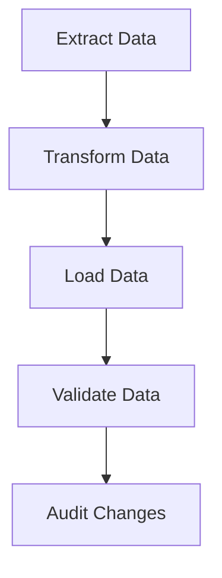

## 14.1 Handling Persistent Data Stores

As we embark on the journey of migrating from Java Object-Oriented Programming (OOP) to Clojure's functional programming paradigm, one of the critical aspects to address is handling persistent data stores. This involves migrating databases and data schemas while maintaining data integrity across systems. In this section, we will explore strategies, best practices, and tools to facilitate a smooth transition of your data layer.

### Understanding Persistent Data Stores

Persistent data stores are databases or storage systems where data is stored permanently. In Java, you might be familiar with relational databases like MySQL, PostgreSQL, or NoSQL databases like MongoDB. Clojure, being a JVM language, can interact with these databases seamlessly, but it offers unique approaches to data handling that align with its functional nature.

#### Key Concepts in Data Migration

1. **Data Integrity**: Ensuring that data remains accurate and consistent during and after migration.
2. **Schema Evolution**: Adapting database schemas to accommodate changes in data structure.
3. **Data Transformation**: Converting data from one format or structure to another.
4. **Transactional Consistency**: Maintaining atomicity, consistency, isolation, and durability (ACID) properties during migration.

### Migrating Databases and Data Schemas

Migrating databases involves transferring data from one database system to another or upgrading the schema of an existing database. This process requires careful planning and execution to avoid data loss or corruption.

#### Steps for Database Migration

1. **Assess Current Database Systems**: Evaluate the existing database architecture, data models, and dependencies. Identify the data that needs to be migrated and any potential challenges.

2. **Define Migration Objectives**: Clearly outline the goals of the migration, such as improving performance, scalability, or adopting new database technologies.

3. **Choose the Right Tools**: Select tools and libraries that facilitate database migration. For Clojure, libraries like [next.jdbc](https://github.com/seancorfield/next-jdbc) and [HoneySQL](https://github.com/seancorfield/honeysql) are popular choices for interacting with SQL databases.

4. **Plan Schema Evolution**: Develop a strategy for evolving database schemas. This may involve creating new tables, modifying existing ones, or transforming data formats.

5. **Implement Data Transformation**: Write scripts or use tools to transform data as needed. This may involve converting data types, normalizing data, or aggregating information.

6. **Test Migration Process**: Conduct thorough testing to ensure data integrity and consistency. Use automated tests to validate data before and after migration.

7. **Execute Migration**: Perform the migration in a controlled environment. Monitor the process closely to address any issues that arise.

8. **Validate and Optimize**: After migration, validate the data and optimize database performance. This may involve indexing, query optimization, or tuning database configurations.

### Maintaining Data Integrity Across Systems

Data integrity is paramount during migration. It ensures that data remains accurate, consistent, and reliable. Here are some strategies to maintain data integrity:

#### Use Transactions

Leverage database transactions to ensure atomicity and consistency. Transactions allow you to group multiple operations into a single unit of work, ensuring that either all operations succeed or none do.

```clojure
(require '[next.jdbc :as jdbc])

(defn migrate-data [db]
  (jdbc/with-transaction [tx db]
    ;; Perform data migration operations here
    (jdbc/execute! tx ["INSERT INTO new_table (column1, column2) SELECT column1, column2 FROM old_table"])
    ;; More operations...
    ))
```

#### Data Validation

Implement data validation checks to ensure data quality. Use Clojure's powerful data validation libraries like [spec](https://clojure.org/guides/spec) to define and enforce data constraints.

```clojure
(require '[clojure.spec.alpha :as s])

(s/def ::name string?)
(s/def ::age pos-int?)

(defn validate-data [data]
  (s/valid? (s/keys :req [::name ::age]) data))
```

#### Data Auditing

Maintain an audit trail of data changes to track modifications and ensure accountability. This can be achieved by logging changes or using database triggers to record alterations.

### Clojure's Approach to Data Handling

Clojure offers unique features that align with functional programming principles, making it well-suited for handling persistent data stores.

#### Immutability and Persistent Data Structures

Clojure's emphasis on immutability ensures that data structures are not modified in place. Instead, new versions of data structures are created, preserving the original data. This approach minimizes side effects and enhances data integrity.

```clojure
(def original-data {:name "Alice" :age 30})
(def updated-data (assoc original-data :age 31))

;; original-data remains unchanged
```

#### Functional Data Transformation

Clojure's rich set of functional programming constructs allows for elegant data transformation. Use functions like `map`, `filter`, and `reduce` to process data efficiently.

```clojure
(defn transform-data [data]
  (->> data
       (filter #(> (:age %) 18))
       (map #(assoc % :status "adult"))))
```

### Tools and Libraries for Data Migration

Several tools and libraries can assist in migrating databases and handling persistent data stores in Clojure:

- **[next.jdbc](https://github.com/seancorfield/next-jdbc)**: A modern Clojure wrapper for JDBC, providing a simple and idiomatic way to interact with SQL databases.
- **[HoneySQL](https://github.com/seancorfield/honeysql)**: A library for generating SQL queries programmatically using Clojure data structures.
- **[Migratus](https://github.com/yogthos/migratus)**: A database migration tool for Clojure that supports versioned migrations and rollback capabilities.

### Visualizing Data Flow and Transformation

To better understand the flow of data during migration, let's visualize a simple data transformation process using a flowchart.



**Figure 1**: Data flow during migration, illustrating the Extract-Transform-Load (ETL) process.

### Knowledge Check

To reinforce your understanding of handling persistent data stores, consider the following questions:

- What are the key steps in migrating a database?
- How does Clojure's immutability enhance data integrity?
- What tools can you use to interact with SQL databases in Clojure?

### Try It Yourself

Experiment with the code examples provided. Modify the data transformation functions to handle different data structures or add additional validation checks. Explore the libraries mentioned and try connecting to a database using `next.jdbc`.

### Conclusion

Handling persistent data stores during migration from Java to Clojure requires careful planning and execution. By leveraging Clojure's functional programming features and utilizing the right tools, you can ensure a smooth transition while maintaining data integrity. As you continue your journey, remember to validate and optimize your data processes to achieve the best results.

## **Quiz: Are You Ready to Migrate from Java to Clojure?**



### What is a key benefit of using transactions during data migration?

- [x] Ensures atomicity and consistency
- [ ] Increases data redundancy
- [ ] Reduces database size
- [ ] Simplifies data transformation

> **Explanation:** Transactions group multiple operations into a single unit, ensuring that either all operations succeed or none do, thus maintaining atomicity and consistency.

### Which Clojure library is commonly used for generating SQL queries?

- [x] HoneySQL
- [ ] Ring
- [ ] Compojure
- [ ] Pedestal

> **Explanation:** HoneySQL is a library for generating SQL queries programmatically using Clojure data structures.

### How does Clojure's immutability benefit data handling?

- [x] Minimizes side effects and enhances data integrity
- [ ] Increases memory usage
- [ ] Complicates data transformation
- [ ] Reduces code readability

> **Explanation:** Immutability ensures that data structures are not modified in place, preserving the original data and minimizing side effects.

### What is the purpose of data validation during migration?

- [x] Ensures data quality and integrity
- [ ] Increases data volume
- [ ] Simplifies schema evolution
- [ ] Reduces migration time

> **Explanation:** Data validation checks ensure that data remains accurate and consistent, maintaining quality and integrity during migration.

### Which tool is used for database migration in Clojure?

- [x] Migratus
- [ ] Leiningen
- [ ] CIDER
- [ ] Figwheel

> **Explanation:** Migratus is a database migration tool for Clojure that supports versioned migrations and rollback capabilities.

### What is schema evolution?

- [x] Adapting database schemas to accommodate changes in data structure
- [ ] Increasing database size
- [ ] Simplifying data transformation
- [ ] Reducing data redundancy

> **Explanation:** Schema evolution involves adapting database schemas to accommodate changes in data structure, ensuring compatibility with new data formats.

### How can you maintain an audit trail of data changes?

- [x] Logging changes or using database triggers
- [ ] Increasing data redundancy
- [ ] Reducing database size
- [ ] Simplifying data transformation

> **Explanation:** Maintaining an audit trail involves logging changes or using database triggers to record alterations, ensuring accountability.

### What is the role of `next.jdbc` in Clojure?

- [x] Provides a simple and idiomatic way to interact with SQL databases
- [ ] Increases data redundancy
- [ ] Reduces database size
- [ ] Simplifies data transformation

> **Explanation:** `next.jdbc` is a modern Clojure wrapper for JDBC, providing a simple and idiomatic way to interact with SQL databases.

### What is the purpose of data transformation during migration?

- [x] Converting data from one format or structure to another
- [ ] Increasing data volume
- [ ] Simplifying schema evolution
- [ ] Reducing migration time

> **Explanation:** Data transformation involves converting data from one format or structure to another, ensuring compatibility with new systems.

### True or False: Clojure's functional programming features complicate data migration.

- [ ] True
- [x] False

> **Explanation:** Clojure's functional programming features, such as immutability and higher-order functions, simplify data migration by enhancing data integrity and transformation processes.


