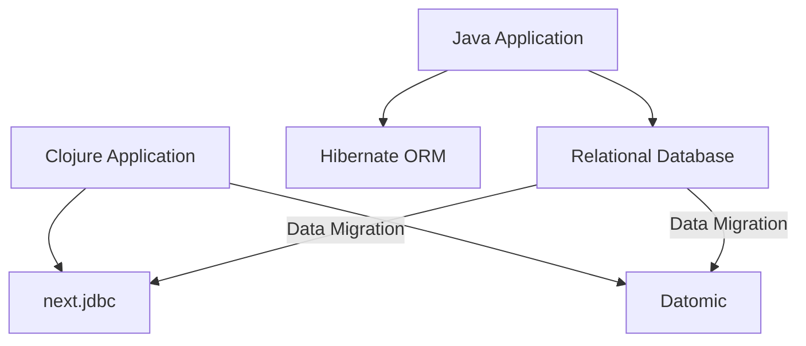

## 14.1 Handling Persistent Data Stores

Migrating enterprise applications from Java Object-Oriented Programming (OOP) to Clojure's functional programming paradigm involves not only transitioning codebases but also adapting how we handle persistent data stores. This section will guide you through the process of migrating databases and data schemas, while maintaining data integrity across systems. We will explore strategies, best practices, and provide practical examples to ensure a smooth transition.

### Introduction to Persistent Data Stores

Persistent data stores, such as relational databases, NoSQL databases, and data warehouses, are critical components of enterprise applications. They store data that must persist beyond the lifecycle of a single application instance. In Java OOP, data access is typically managed using frameworks like Hibernate or JPA, which abstract database interactions through object-relational mapping (ORM).

In Clojure, we embrace a different approach, leveraging functional programming principles to interact with databases. This often involves using libraries like [next.jdbc](https://github.com/seancorfield/next-jdbc) for SQL databases or [Datomic](https://www.datomic.com/) for immutable data storage. Understanding these tools and how they fit into the Clojure ecosystem is crucial for a successful migration.

### Migrating Databases and Data Schemas

#### Evaluating Current Data Architecture

Before initiating the migration, evaluate your current data architecture. Identify the types of databases in use, the complexity of data schemas, and the volume of data. This assessment will help you determine the scope of the migration and identify potential challenges.

- **Relational Databases**: Commonly used in Java applications, these databases require careful schema migration to ensure data integrity.
- **NoSQL Databases**: Often used for scalability and flexibility, these may require different strategies for migration.
- **Data Warehouses**: Large-scale data storage solutions that may involve complex ETL (Extract, Transform, Load) processes.

#### Designing a Migration Strategy

Design a migration strategy that aligns with your enterprise's goals and constraints. Consider the following approaches:

- **Incremental Migration**: Gradually migrate parts of the database, allowing for testing and validation at each step.
- **Big Bang Migration**: Migrate the entire database at once, suitable for smaller databases or when downtime is acceptable.
- **Hybrid Approach**: Combine elements of both incremental and big bang migrations to balance risk and efficiency.

#### Tools and Techniques for Database Migration

Leverage tools and techniques that facilitate database migration:

- **Schema Migration Tools**: Use tools like [Flyway](https://flywaydb.org/) or [Liquibase](https://www.liquibase.org/) to manage schema changes and versioning.
- **Data Transformation**: Implement data transformation scripts to adapt data formats and structures to the new schema.
- **ETL Processes**: For data warehouses, design ETL processes to extract data from the source, transform it as needed, and load it into the target system.

### Maintaining Data Integrity Across Systems

Data integrity is paramount during migration. Ensure that data remains consistent, accurate, and reliable throughout the process.

#### Ensuring Consistency and Accuracy

- **Data Validation**: Implement validation checks to verify data accuracy before and after migration.
- **Transactional Integrity**: Use transactions to ensure atomicity, consistency, isolation, and durability (ACID) properties during data operations.

#### Handling Data Dependencies

Identify and manage data dependencies to prevent issues during migration. This includes understanding foreign key relationships, data constraints, and application-specific dependencies.

#### Testing and Verification

Thoroughly test and verify the migrated data to ensure it meets the required standards:

- **Unit Testing**: Test individual data components and transformations.
- **Integration Testing**: Validate data interactions between different systems and components.
- **User Acceptance Testing (UAT)**: Involve end-users to verify that the migrated data meets business requirements.

### Clojure-Specific Approaches to Data Handling

Clojure offers unique approaches to data handling that align with its functional programming paradigm.

#### Leveraging Immutable Data Structures

Clojure's immutable data structures provide a robust foundation for data integrity. By default, data is not modified in place, reducing the risk of unintended side effects.

```clojure
;; Example of using an immutable map in Clojure
(def user {:id 1 :name "Alice" :email "alice@example.com"})

;; Updating the map returns a new map, leaving the original unchanged
(def updated-user (assoc user :email "alice@newdomain.com"))

;; Original user map remains unchanged
(println user) ; => {:id 1, :name "Alice", :email "alice@example.com"}
```

#### Functional Data Transformation

Functional programming encourages the use of pure functions for data transformation. This approach simplifies reasoning about data changes and enhances testability.

```clojure
;; Function to transform user data
(defn transform-user [user]
  (assoc user :email (str "new-" (:email user))))

;; Applying transformation
(def transformed-user (transform-user user))
```

#### Using Clojure Libraries for Database Interaction

Clojure provides libraries that facilitate database interaction while adhering to functional principles.

- **next.jdbc**: A modern Clojure wrapper for JDBC, providing a simple and idiomatic way to interact with SQL databases.
- **Datomic**: A distributed database designed for immutability and scalability, offering a unique approach to data storage and retrieval.

### Code Examples and Practical Applications

Let's explore practical examples of handling persistent data stores in Clojure.

#### Example: Migrating a Relational Database

Consider a Java application using a relational database with Hibernate. We will migrate this to Clojure using `next.jdbc`.

**Java Example with Hibernate:**

```java
// Java code using Hibernate to fetch a user
Session session = sessionFactory.openSession();
User user = session.get(User.class, userId);
session.close();
```

**Clojure Example with next.jdbc:**

```clojure
(require '[next.jdbc :as jdbc])

;; Define a database connection
(def db-spec {:dbtype "h2" :dbname "test"})

;; Fetch a user from the database
(defn fetch-user [user-id]
  (jdbc/execute-one! db-spec
    ["SELECT * FROM users WHERE id = ?" user-id]))
```

#### Example: Using Datomic for Immutable Data Storage

Datomic provides a powerful alternative to traditional databases, emphasizing immutability and temporal data.

```clojure
(require '[datomic.api :as d])

;; Connect to a Datomic database
(def conn (d/connect "datomic:mem://example"))

;; Define a schema and transact data
(d/transact conn {:tx-data [{:db/ident :user/name :db/valueType :db.type/string :db/cardinality :db.cardinality/one}]})

;; Query data
(defn query-users []
  (d/q '[:find ?name :where [?e :user/name ?name]] (d/db conn)))
```

### Visual Aids and Diagrams

#### Data Flow Diagram: Java to Clojure Migration



*Diagram: Data flow during migration from a Java application using Hibernate to a Clojure application using next.jdbc and Datomic.*

### References and Further Reading

- [Clojure Official Documentation](https://clojure.org/reference)
- [next.jdbc GitHub Repository](https://github.com/seancorfield/next-jdbc)
- [Datomic Documentation](https://www.datomic.com/)
- [Flyway Database Migration](https://flywaydb.org/)
- [Liquibase Database Migration](https://www.liquibase.org/)

### Knowledge Check

- What are the key differences between handling persistent data stores in Java OOP and Clojure?
- How does Clojure's approach to immutability enhance data integrity during migration?
- What are the benefits of using Datomic for data storage in a Clojure application?

### Exercises

1. **Exercise 1**: Migrate a simple Java application using a relational database to Clojure using `next.jdbc`. Verify data integrity by comparing data before and after migration.

2. **Exercise 2**: Implement a data transformation function in Clojure that adapts a Java data schema to a new Clojure schema. Test the function with sample data.

3. **Exercise 3**: Set up a Datomic database and define a schema for a simple application. Transact data and query it using Clojure.

### Summary

Handling persistent data stores during migration from Java OOP to Clojure involves careful planning and execution. By leveraging Clojure's functional programming principles, immutable data structures, and powerful libraries, we can ensure a seamless transition while maintaining data integrity. Embrace the opportunities that Clojure offers to modernize your data handling practices and enhance the scalability and maintainability of your enterprise applications.

## **Quiz: Are You Ready to Migrate from Java to Clojure?**



### What is a key advantage of using immutable data structures in Clojure for data migration?

- [x] They reduce the risk of unintended side effects.
- [ ] They allow for in-place data modification.
- [ ] They require less memory usage.
- [ ] They simplify database schema design.

> **Explanation:** Immutable data structures in Clojure ensure that data is not modified in place, reducing the risk of unintended side effects during migration.

### Which Clojure library is commonly used for SQL database interaction?

- [x] next.jdbc
- [ ] Datomic
- [ ] Hibernate
- [ ] JPA

> **Explanation:** `next.jdbc` is a modern Clojure wrapper for JDBC, providing a simple and idiomatic way to interact with SQL databases.

### What is the primary focus of Datomic as a database solution?

- [x] Immutability and temporal data
- [ ] High transaction throughput
- [ ] In-memory data storage
- [ ] Object-relational mapping

> **Explanation:** Datomic emphasizes immutability and temporal data, offering a unique approach to data storage and retrieval.

### What is a common tool used for managing database schema changes?

- [x] Flyway
- [ ] Datomic
- [ ] next.jdbc
- [ ] JPA

> **Explanation:** Flyway is a tool used for managing database schema changes and versioning.

### How does Clojure's functional programming paradigm benefit data transformation?

- [x] It simplifies reasoning about data changes.
- [ ] It allows for mutable data structures.
- [ ] It requires less code to implement.
- [ ] It enhances object-oriented design.

> **Explanation:** Functional programming in Clojure simplifies reasoning about data changes and enhances testability through pure functions.

### What is a key consideration when designing a migration strategy?

- [x] Balancing risk and efficiency
- [ ] Minimizing code changes
- [ ] Maximizing downtime
- [ ] Avoiding data validation

> **Explanation:** Designing a migration strategy involves balancing risk and efficiency to ensure a smooth transition.

### Which testing approach involves end-users to verify that migrated data meets business requirements?

- [x] User Acceptance Testing (UAT)
- [ ] Unit Testing
- [ ] Integration Testing
- [ ] Load Testing

> **Explanation:** User Acceptance Testing (UAT) involves end-users to verify that the migrated data meets business requirements.

### What is a benefit of using transactions during data operations?

- [x] Ensuring ACID properties
- [ ] Reducing memory usage
- [ ] Simplifying code structure
- [ ] Enhancing object-oriented design

> **Explanation:** Transactions ensure atomicity, consistency, isolation, and durability (ACID) properties during data operations.

### What is a common challenge when migrating NoSQL databases?

- [x] Different strategies for migration
- [ ] Schema complexity
- [ ] High transaction throughput
- [ ] Object-relational mapping

> **Explanation:** NoSQL databases often require different strategies for migration due to their scalability and flexibility.

### True or False: Incremental migration involves migrating the entire database at once.

- [ ] True
- [x] False

> **Explanation:** Incremental migration involves gradually migrating parts of the database, allowing for testing and validation at each step.


