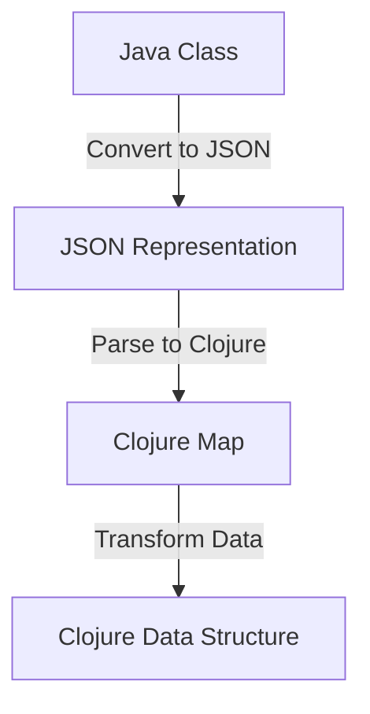

## 14.2 Data Transformation Techniques

Migrating from Java's Object-Oriented Programming (OOP) paradigm to Clojure's functional programming approach involves not just a shift in coding style but also a transformation in how data is represented and manipulated. This section delves into the intricacies of data transformation, providing expert developers with the knowledge and tools necessary to convert data representations effectively between Java and Clojure. We'll explore various techniques, tools, and libraries that facilitate this process, ensuring a seamless transition.

### Understanding Data Representation in Java and Clojure

Before diving into transformation techniques, it's crucial to understand the fundamental differences in data representation between Java and Clojure.

#### Java Data Representation

In Java, data is typically encapsulated within objects. Classes define the structure and behavior of these objects, and data is stored in fields. Java's OOP paradigm emphasizes encapsulation, inheritance, and polymorphism, often leading to complex class hierarchies.

#### Clojure Data Representation

Clojure, on the other hand, is a functional language that emphasizes immutability and simplicity. Data in Clojure is represented using immutable data structures such as lists, vectors, maps, and sets. These structures are persistent, meaning that operations on them return new versions rather than modifying the original.

### Key Differences and Challenges

- **Immutability vs. Mutability**: Java's mutable objects contrast with Clojure's immutable data structures, requiring a shift in mindset and approach.
- **Encapsulation vs. Simplicity**: Java's encapsulation can lead to complex data access patterns, whereas Clojure favors direct data manipulation.
- **Inheritance vs. Composition**: Java often uses inheritance for code reuse, while Clojure encourages composition and the use of protocols for polymorphism.

### Data Transformation Techniques

To effectively migrate data from Java to Clojure, we must employ various transformation techniques that align with Clojure's functional paradigm.

#### 1. Mapping Java Classes to Clojure Data Structures

Java classes often encapsulate data and behavior. In Clojure, we can represent this data using maps, which provide a flexible and expressive way to handle structured data.

**Example: Java Class to Clojure Map**

```java
// Java class
public class Employee {
    private String name;
    private int age;
    private String department;

    // Getters and setters omitted for brevity
}
```

```clojure
;; Clojure map representation
(def employee {:name "Alice" :age 30 :department "Engineering"})
```

**Key Points:**

- Use Clojure maps to represent Java objects.
- Leverage keywords for field names to enhance readability and maintainability.

#### 2. Converting Java Collections to Clojure Collections

Java collections such as `List`, `Set`, and `Map` have direct counterparts in Clojure: lists, vectors, sets, and maps. The conversion process involves transforming these collections while preserving their semantics.

**Example: Java List to Clojure Vector**

```java
// Java List
List<String> names = Arrays.asList("Alice", "Bob", "Charlie");
```

```clojure
;; Clojure vector
(def names ["Alice" "Bob" "Charlie"])
```

**Key Points:**

- Use vectors for ordered collections.
- Use sets for unique collections.
- Use maps for key-value pairs.

#### 3. Handling Java's Null Values

Java's `null` values can lead to `NullPointerException`s if not handled properly. Clojure provides `nil`, which is a first-class citizen and can be safely used in collections and functions.

**Example: Handling Null Values**

```java
// Java null handling
String name = null;
if (name != null) {
    System.out.println(name);
}
```

```clojure
;; Clojure nil handling
(def name nil)
(when name
  (println name))
```

**Key Points:**

- Use `nil` in place of `null`.
- Leverage Clojure's `when`, `if-let`, and `some->` macros for safe null handling.

#### 4. Transforming Java Streams to Clojure Sequences

Java 8 introduced streams for functional-style operations on collections. Clojure's sequences provide similar capabilities with a more consistent and powerful API.

**Example: Java Stream to Clojure Sequence**

```java
// Java Stream
List<String> names = Arrays.asList("Alice", "Bob", "Charlie");
names.stream()
     .filter(name -> name.startsWith("A"))
     .forEach(System.out::println);
```

```clojure
;; Clojure sequence
(def names ["Alice" "Bob" "Charlie"])
(doseq [name (filter #(clojure.string/starts-with? % "A") names)]
  (println name))
```

**Key Points:**

- Use Clojure's `filter`, `map`, and `reduce` for sequence operations.
- Sequences are lazy by default, providing efficient data processing.

### Tools and Libraries for Data Migration

Several tools and libraries can aid in the data transformation process, making it more efficient and less error-prone.

#### 1. Transit

[Transit](https://github.com/cognitect/transit-clj) is a format and set of libraries for conveying values between applications written in different programming languages. It is designed to support the transfer of data between Clojure and Java applications seamlessly.

**Key Features:**

- Supports rich data types, including maps, sets, and lists.
- Provides efficient serialization and deserialization.
- Compatible with JSON and MessagePack formats.

#### 2. Cheshire

[Cheshire](https://github.com/dakrone/cheshire) is a Clojure library for fast JSON encoding and decoding. It can be used to convert Java objects to JSON and then to Clojure data structures.

**Key Features:**

- High-performance JSON parsing and generation.
- Supports custom encoders and decoders.
- Integrates well with Clojure's data structures.

#### 3. clojure.data.json

[clojure.data.json](https://github.com/clojure/data.json) is another library for JSON processing in Clojure. It provides a straightforward API for encoding and decoding JSON data.

**Key Features:**

- Simple and easy-to-use API.
- Supports streaming JSON parsing.
- Compatible with Clojure's immutable data structures.

### Best Practices for Data Transformation

To ensure a smooth data transformation process, consider the following best practices:

- **Plan and Document**: Clearly define the data transformation requirements and document the mapping between Java and Clojure data structures.
- **Automate**: Use tools and scripts to automate repetitive transformation tasks, reducing the risk of human error.
- **Test Thoroughly**: Implement comprehensive tests to validate the correctness of transformed data.
- **Iterate and Refine**: Continuously refine the transformation process based on feedback and testing results.

### Visualizing Data Transformation

To better understand the data transformation process, let's visualize the flow of data from Java to Clojure.



**Diagram Description:** This flowchart illustrates the process of converting a Java class to a JSON representation, parsing it into a Clojure map, and transforming it into a Clojure data structure.

### Try It Yourself

To gain hands-on experience with data transformation, try modifying the following code examples:

1. **Convert a Java `HashMap` to a Clojure map** and perform a transformation on the values.
2. **Transform a Java `ArrayList` to a Clojure vector** and filter out elements based on a condition.
3. **Handle null values in a Java object** and convert them to Clojure's `nil` safely.

### Knowledge Check

Let's reinforce your understanding of data transformation techniques with a few questions:

- What are the key differences between Java's mutable objects and Clojure's immutable data structures?
- How can you safely handle null values when transforming data from Java to Clojure?
- What tools can assist in converting Java objects to Clojure data structures?

### Conclusion

Migrating data from Java to Clojure requires a thoughtful approach to transformation, leveraging Clojure's immutable data structures and functional programming paradigm. By understanding the differences in data representation and utilizing the right tools and techniques, you can ensure a successful data migration process. Embrace the power of Clojure's simplicity and immutability to enhance the scalability and maintainability of your enterprise applications.

## **Quiz: Are You Ready to Migrate from Java to Clojure?**



### What is a key difference between Java and Clojure data structures?

- [x] Java uses mutable objects, while Clojure uses immutable data structures.
- [ ] Java uses immutable data structures, while Clojure uses mutable objects.
- [ ] Both Java and Clojure use mutable objects.
- [ ] Both Java and Clojure use immutable data structures.

> **Explanation:** Java typically uses mutable objects, whereas Clojure emphasizes immutability with its data structures.

### How can you represent a Java class in Clojure?

- [x] Use a Clojure map with keywords for field names.
- [ ] Use a Clojure list with symbols for field names.
- [ ] Use a Clojure vector with strings for field names.
- [ ] Use a Clojure set with numbers for field names.

> **Explanation:** Clojure maps are ideal for representing structured data like Java classes, using keywords for field names.

### Which tool can be used for efficient serialization between Java and Clojure?

- [x] Transit
- [ ] Cheshire
- [ ] clojure.data.json
- [ ] Leiningen

> **Explanation:** Transit is designed for efficient serialization and deserialization between different programming languages, including Java and Clojure.

### What is a common method to handle null values in Clojure?

- [x] Use `nil` and leverage Clojure's macros like `when` and `if-let`.
- [ ] Use `null` and Java's `Optional` class.
- [ ] Use `nil` and Java's `Optional` class.
- [ ] Use `null` and Clojure's `when` macro.

> **Explanation:** In Clojure, `nil` is used instead of `null`, and macros like `when` and `if-let` help handle it safely.

### Which Clojure library is known for fast JSON encoding and decoding?

- [x] Cheshire
- [ ] Transit
- [ ] clojure.data.json
- [ ] Ring

> **Explanation:** Cheshire is a high-performance library for JSON encoding and decoding in Clojure.

### What is a best practice for data transformation?

- [x] Plan and document the transformation requirements.
- [ ] Avoid using any tools for automation.
- [ ] Skip testing to save time.
- [ ] Transform data manually for accuracy.

> **Explanation:** Planning and documenting transformation requirements is crucial for a successful data migration process.

### How can Java streams be transformed into Clojure sequences?

- [x] Use Clojure's `filter`, `map`, and `reduce` functions.
- [ ] Use Java's `forEach` method.
- [ ] Use Clojure's `println` function.
- [ ] Use Java's `filter`, `map`, and `reduce` methods.

> **Explanation:** Clojure's `filter`, `map`, and `reduce` functions provide similar capabilities to Java streams.

### What is the advantage of using Clojure's persistent data structures?

- [x] They provide immutability and efficient data processing.
- [ ] They allow for mutable state changes.
- [ ] They require more memory than Java collections.
- [ ] They are slower than Java collections.

> **Explanation:** Clojure's persistent data structures offer immutability and efficient data processing, enhancing scalability.

### Which Clojure library provides a simple API for JSON processing?

- [x] clojure.data.json
- [ ] Cheshire
- [ ] Transit
- [ ] Ring

> **Explanation:** clojure.data.json offers a straightforward API for JSON encoding and decoding in Clojure.

### True or False: Clojure's sequences are lazy by default.

- [x] True
- [ ] False

> **Explanation:** Clojure's sequences are indeed lazy by default, allowing for efficient data processing.



By mastering these data transformation techniques, you are well-equipped to handle the complexities of migrating from Java to Clojure, ensuring a smooth and successful transition for your enterprise applications.
