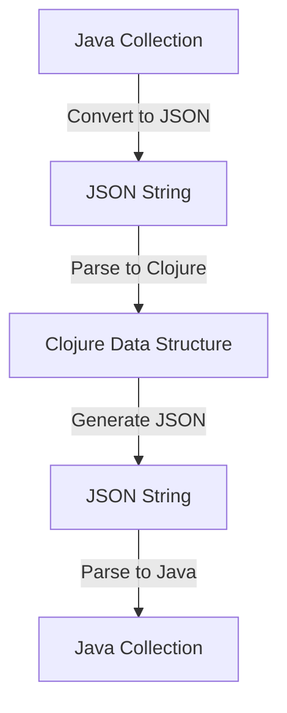

## 14.2 Data Transformation Techniques

As we embark on the journey of migrating enterprise applications from Java to Clojure, one of the critical aspects to address is data transformation. This section will guide you through the process of converting data representations between Java and Clojure, leveraging the strengths of Clojure's functional programming paradigm to enhance your enterprise applications.

### Introduction to Data Transformation

Data transformation is the process of converting data from one format or structure to another. In the context of migrating from Java to Clojure, this involves transforming Java's object-oriented data structures into Clojure's immutable, functional data structures. This transformation is crucial for ensuring that your applications can fully leverage Clojure's capabilities, such as immutability, concurrency, and functional composition.

#### Why Transform Data?

- **Immutability**: Clojure's data structures are immutable by default, which enhances safety and concurrency.
- **Functional Composition**: Clojure's functional programming model allows for more expressive and concise data manipulation.
- **Interoperability**: Seamless data transformation ensures smooth interoperability between Java and Clojure components.

### Understanding Java and Clojure Data Structures

Before diving into transformation techniques, it's essential to understand the differences between Java and Clojure data structures.

#### Java Data Structures

Java, being an object-oriented language, relies heavily on mutable data structures such as `ArrayList`, `HashMap`, and custom objects. These structures are designed for in-place modification, which can lead to issues in concurrent environments.

#### Clojure Data Structures

Clojure, on the other hand, offers a rich set of immutable data structures, including:

- **Lists**: Ordered collections, similar to Java's `LinkedList`.
- **Vectors**: Indexed collections, akin to Java's `ArrayList`, but immutable.
- **Maps**: Key-value pairs, comparable to Java's `HashMap`, but immutable.
- **Sets**: Collections of unique elements, similar to Java's `HashSet`.

### Tools and Libraries for Data Migration

Several tools and libraries can assist in the data transformation process, making it more efficient and less error-prone.

#### Clojure Libraries

- **Cheshire**: A JSON library for Clojure that can be used to serialize and deserialize data, facilitating transformation between JSON and Clojure data structures.
- **clojure.data.json**: Another JSON library that provides functions to read and write JSON data, useful for data interchange.
- **Transit**: A format and set of libraries for conveying values between applications written in different languages, including Java and Clojure.

#### Java Libraries

- **Jackson**: A popular Java library for processing JSON data, which can be used to convert Java objects to JSON and vice versa.
- **Gson**: A Java library that can be used to convert Java objects to JSON and back, useful for data transformation tasks.

### Data Transformation Techniques

Let's explore some practical techniques for transforming data between Java and Clojure.

#### Converting Java Collections to Clojure Data Structures

One of the first steps in data transformation is converting Java collections to Clojure's immutable data structures.

```java
// Java code to convert a List to a JSON string
import com.fasterxml.jackson.databind.ObjectMapper;
import java.util.List;
import java.util.Arrays;

public class JavaToJson {
    public static void main(String[] args) throws Exception {
        List<String> javaList = Arrays.asList("apple", "banana", "cherry");
        ObjectMapper mapper = new ObjectMapper();
        String jsonString = mapper.writeValueAsString(javaList);
        System.out.println(jsonString);
    }
}
```

```clojure
;; Clojure code to convert a JSON string to a Clojure vector
(require '[cheshire.core :as json])

(def json-string "[\"apple\", \"banana\", \"cherry\"]")
(def clojure-vector (json/parse-string json-string true))

(println clojure-vector) ; => ["apple" "banana" "cherry"]
```

#### Converting Clojure Data Structures to Java Collections

Similarly, you may need to convert Clojure data structures back to Java collections.

```clojure
;; Clojure code to convert a vector to a JSON string
(require '[cheshire.core :as json])

(def clojure-vector ["apple" "banana" "cherry"])
(def json-string (json/generate-string clojure-vector))

(println json-string) ; => "[\"apple\",\"banana\",\"cherry\"]"
```

```java
// Java code to convert a JSON string to a List
import com.fasterxml.jackson.databind.ObjectMapper;
import java.util.List;

public class JsonToJava {
    public static void main(String[] args) throws Exception {
        String jsonString = "[\"apple\", \"banana\", \"cherry\"]";
        ObjectMapper mapper = new ObjectMapper();
        List<String> javaList = mapper.readValue(jsonString, List.class);
        System.out.println(javaList);
    }
}
```

#### Handling Nested Data Structures

When dealing with complex, nested data structures, it's important to ensure that all levels of the structure are properly transformed.

```clojure
;; Clojure code to transform nested data structures
(def nested-map {:name "John"
                 :age 30
                 :address {:street "123 Elm St"
                           :city "Springfield"}})

;; Convert to JSON
(def json-string (json/generate-string nested-map))

;; Parse JSON back to Clojure map
(def parsed-map (json/parse-string json-string true))

(println parsed-map)
```

### Visualizing Data Transformation

To better understand the flow of data transformation, let's visualize the process using a flowchart.



**Caption**: This flowchart illustrates the process of transforming data from a Java collection to a Clojure data structure and back, using JSON as an intermediary format.

### Best Practices for Data Transformation

- **Use JSON as an Intermediary**: JSON is a widely supported format that can facilitate data transformation between Java and Clojure.
- **Leverage Libraries**: Utilize libraries like Cheshire and Jackson to handle serialization and deserialization efficiently.
- **Ensure Immutability**: When transforming data to Clojure, ensure that the resulting data structures are immutable to take full advantage of Clojure's functional programming model.
- **Test Thoroughly**: Implement comprehensive tests to validate that data transformation processes work correctly and handle edge cases.

### Knowledge Check

- **What are the key differences between Java and Clojure data structures?**
- **How can JSON be used to facilitate data transformation between Java and Clojure?**
- **What are some best practices for ensuring data integrity during transformation?**

### Exercises

1. **Transform a Java Map to a Clojure Map**: Write a Java program that converts a `HashMap` to a JSON string, and a Clojure program that parses the JSON string into a Clojure map.
2. **Nested Data Transformation**: Create a nested Java object and transform it into a Clojure map, ensuring that all nested levels are correctly converted.
3. **Error Handling**: Implement error handling in your data transformation process to manage potential issues such as malformed JSON or incompatible data types.

### Encouraging Tone

Now that we've explored data transformation techniques, you're well-equipped to handle the conversion of data between Java and Clojure. Embrace the power of Clojure's immutable data structures to enhance the safety and concurrency of your applications. Remember, practice makes perfect, so don't hesitate to experiment with the examples provided and adapt them to your specific use cases.

### References and Links

- [Official Clojure Documentation](https://clojure.org/)
- [Cheshire GitHub Repository](https://github.com/dakrone/cheshire)
- [Jackson GitHub Repository](https://github.com/FasterXML/jackson)
- [ClojureDocs](https://clojuredocs.org/)

## **Quiz: Are You Ready to Migrate from Java to Clojure?**



### What is a key advantage of Clojure's immutable data structures?

- [x] They enhance safety and concurrency.
- [ ] They allow for in-place modification.
- [ ] They are faster than Java's mutable structures.
- [ ] They require less memory.

> **Explanation:** Clojure's immutable data structures enhance safety and concurrency by preventing in-place modifications, which can lead to issues in concurrent environments.

### Which library can be used in Clojure for JSON serialization and deserialization?

- [x] Cheshire
- [ ] Gson
- [ ] Jackson
- [ ] Hibernate

> **Explanation:** Cheshire is a Clojure library used for JSON serialization and deserialization, facilitating data transformation.

### What is the purpose of using JSON as an intermediary format?

- [x] To facilitate data transformation between Java and Clojure.
- [ ] To reduce data size.
- [ ] To improve data security.
- [ ] To enhance data readability.

> **Explanation:** JSON is a widely supported format that can facilitate data transformation between Java and Clojure.

### How can you ensure data integrity during transformation?

- [x] Implement comprehensive tests.
- [ ] Use mutable data structures.
- [ ] Avoid using libraries.
- [ ] Skip error handling.

> **Explanation:** Implementing comprehensive tests ensures that data transformation processes work correctly and handle edge cases.

### What is a common tool for processing JSON data in Java?

- [x] Jackson
- [ ] Cheshire
- [ ] Transit
- [ ] Leiningen

> **Explanation:** Jackson is a popular Java library for processing JSON data, useful for data transformation tasks.

### What should you do when transforming nested data structures?

- [x] Ensure all levels are properly transformed.
- [ ] Only transform the top level.
- [ ] Use mutable structures for nested data.
- [ ] Ignore nested data.

> **Explanation:** When dealing with complex, nested data structures, it's important to ensure that all levels of the structure are properly transformed.

### Which Clojure data structure is similar to Java's `ArrayList`?

- [x] Vector
- [ ] List
- [ ] Map
- [ ] Set

> **Explanation:** Clojure's vector is an indexed collection, akin to Java's `ArrayList`, but immutable.

### What is a benefit of using libraries like Cheshire and Jackson?

- [x] They handle serialization and deserialization efficiently.
- [ ] They increase data size.
- [ ] They require more code.
- [ ] They are slower than manual methods.

> **Explanation:** Libraries like Cheshire and Jackson handle serialization and deserialization efficiently, making data transformation more efficient and less error-prone.

### What is the first step in converting Java collections to Clojure data structures?

- [x] Convert Java collections to JSON.
- [ ] Directly convert to Clojure structures.
- [ ] Use a database.
- [ ] Skip conversion.

> **Explanation:** The first step is to convert Java collections to JSON, which can then be parsed into Clojure's immutable data structures.

### True or False: Clojure's data structures are mutable by default.

- [ ] True
- [x] False

> **Explanation:** Clojure's data structures are immutable by default, which enhances safety and concurrency.


