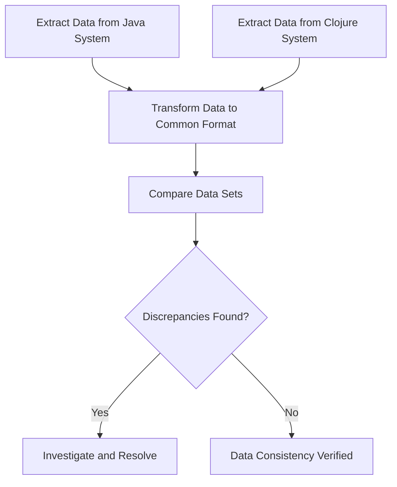

## 14.3 Testing and Validating Migrated Data

In the journey of migrating enterprise applications from Java Object-Oriented Programming (OOP) to Clojure's functional programming paradigm, one of the most critical steps is ensuring the accuracy and consistency of data post-migration. Data is the lifeblood of any application, and its integrity must be preserved throughout the migration process. In this section, we will delve into the strategies and best practices for testing and validating migrated data, ensuring that your transition to Clojure is both smooth and reliable.

### Understanding the Importance of Data Validation

Data validation is crucial in any migration project because it ensures that the data remains accurate, consistent, and usable after being transferred to a new system. In the context of migrating from Java to Clojure, this involves verifying that the data structures and values in Clojure accurately reflect those in the original Java application.

#### Key Objectives of Data Validation

1. **Accuracy**: Ensure that the data values are correct and match the expected results.
2. **Consistency**: Verify that data relationships and constraints are maintained.
3. **Completeness**: Confirm that all necessary data has been migrated without loss.
4. **Integrity**: Ensure that data integrity rules are enforced in the new system.

### Implementing Data Consistency Checks

Data consistency checks are essential to ensure that the migrated data adheres to the same rules and constraints as in the original system. Let's explore some strategies for implementing these checks in Clojure.

#### Strategy 1: Schema Validation

In Clojure, you can use libraries like [Schema](https://github.com/plumatic/schema) or [Spec](https://clojure.org/guides/spec) to define and validate data schemas. These tools allow you to specify the expected structure and constraints of your data, making it easier to validate data consistency.

**Example: Using Clojure Spec for Schema Validation**

```clojure
(require '[clojure.spec.alpha :as s])

;; Define a spec for a user entity
(s/def ::user-id int?)
(s/def ::name string?)
(s/def ::email (s/and string? #(re-matches #".+@.+\..+" %)))

(s/def ::user (s/keys :req [::user-id ::name ::email]))

;; Function to validate a user map
(defn validate-user [user]
  (if (s/valid? ::user user)
    (println "User data is valid.")
    (println "User data is invalid:" (s/explain-str ::user user))))

;; Example usage
(validate-user {:user-id 1 :name "Alice" :email "alice@example.com"})
```

In this example, we define a schema for a user entity and use it to validate user data. This approach ensures that the data conforms to the expected structure and constraints.

#### Strategy 2: Data Comparison

Another effective strategy is to perform data comparison between the original Java system and the new Clojure system. This involves extracting data from both systems and comparing them to identify discrepancies.

**Example: Data Comparison Workflow**



This diagram illustrates a typical data comparison workflow. By transforming data from both systems into a common format, you can perform a detailed comparison to ensure consistency.

#### Strategy 3: Automated Testing

Automated testing plays a crucial role in validating migrated data. By writing automated tests, you can repeatedly verify data accuracy and consistency throughout the migration process.

**Example: Automated Testing with Clojure Test Libraries**

```clojure
(require '[clojure.test :refer :all])

(deftest test-user-data
  (let [expected-user {:user-id 1 :name "Alice" :email "alice@example.com"}
        migrated-user (get-migrated-user 1)] ; Assume this function retrieves the migrated user
    (is (= expected-user migrated-user))))

(run-tests)
```

In this example, we use Clojure's built-in testing library to write a test that compares the expected user data with the migrated data. Automated tests like these provide a reliable way to validate data throughout the migration process.

### Handling Data Anomalies

Despite thorough testing, data anomalies may still arise during migration. It's essential to have strategies in place to handle these anomalies effectively.

#### Identifying Anomalies

Data anomalies can manifest as missing data, incorrect values, or broken relationships. Identifying these anomalies requires careful analysis and comparison of the data sets.

#### Resolving Anomalies

Once identified, anomalies must be resolved to ensure data integrity. This may involve correcting data values, re-establishing relationships, or re-migrating specific data sets.

### Best Practices for Data Validation

To ensure a successful data validation process, consider the following best practices:

1. **Define Clear Validation Criteria**: Establish clear criteria for what constitutes valid data in the new system.
2. **Use Version Control**: Track changes to data validation scripts and schemas using version control systems.
3. **Involve Domain Experts**: Collaborate with domain experts to ensure that validation criteria align with business requirements.
4. **Perform Incremental Validation**: Validate data incrementally throughout the migration process to catch issues early.
5. **Document Validation Results**: Maintain detailed records of validation results and any anomalies encountered.

### Conclusion

Testing and validating migrated data is a critical step in ensuring the success of your migration from Java OOP to Clojure. By implementing robust data consistency checks, leveraging automated testing, and following best practices, you can ensure that your data remains accurate, consistent, and reliable in the new Clojure system.

For further reading on Clojure's data validation capabilities, refer to the [Clojure Spec Guide](https://clojure.org/guides/spec) and explore additional resources in the [Clojure Community Resources](https://clojure.org/community/resources).

## **Quiz: Are You Ready to Migrate from Java to Clojure?**



### What is the primary goal of data validation during migration?

- [x] Ensure data accuracy, consistency, and integrity
- [ ] Increase data volume
- [ ] Reduce data redundancy
- [ ] Simplify data structures

> **Explanation:** Data validation aims to ensure that the data remains accurate, consistent, and maintains its integrity after migration.

### Which Clojure library is commonly used for schema validation?

- [x] Spec
- [ ] JUnit
- [ ] Mockito
- [ ] Hibernate

> **Explanation:** Clojure's Spec library is used for defining and validating data schemas.

### What is a key benefit of automated testing in data validation?

- [x] Repeatedly verify data accuracy and consistency
- [ ] Increase code complexity
- [ ] Reduce testing time
- [ ] Simplify data structures

> **Explanation:** Automated testing allows for repeated verification of data accuracy and consistency throughout the migration process.

### What is a common strategy for handling data anomalies?

- [x] Correct data values and re-establish relationships
- [ ] Ignore anomalies
- [ ] Increase data volume
- [ ] Simplify data structures

> **Explanation:** Handling data anomalies involves correcting data values and re-establishing relationships to ensure data integrity.

### What is the purpose of data comparison in migration?

- [x] Identify discrepancies between original and migrated data
- [ ] Increase data volume
- [ ] Reduce data redundancy
- [ ] Simplify data structures

> **Explanation:** Data comparison helps identify discrepancies between the original and migrated data sets.

### What should be included in data validation documentation?

- [x] Validation results and anomalies encountered
- [ ] Data volume statistics
- [ ] Code complexity metrics
- [ ] Simplified data structures

> **Explanation:** Data validation documentation should include validation results and any anomalies encountered during the process.

### Why is it important to involve domain experts in data validation?

- [x] Ensure validation criteria align with business requirements
- [ ] Increase data volume
- [ ] Reduce testing time
- [ ] Simplify data structures

> **Explanation:** Involving domain experts ensures that validation criteria align with business requirements and expectations.

### What is a benefit of performing incremental validation?

- [x] Catch issues early in the migration process
- [ ] Increase data volume
- [ ] Reduce data redundancy
- [ ] Simplify data structures

> **Explanation:** Incremental validation allows for early detection and resolution of issues during the migration process.

### Which of the following is a best practice for data validation?

- [x] Define clear validation criteria
- [ ] Increase data volume
- [ ] Reduce testing time
- [ ] Simplify data structures

> **Explanation:** Defining clear validation criteria is a best practice to ensure effective data validation.

### True or False: Data validation is only necessary at the end of the migration process.

- [ ] True
- [x] False

> **Explanation:** Data validation should be performed throughout the migration process to ensure ongoing accuracy and consistency.


