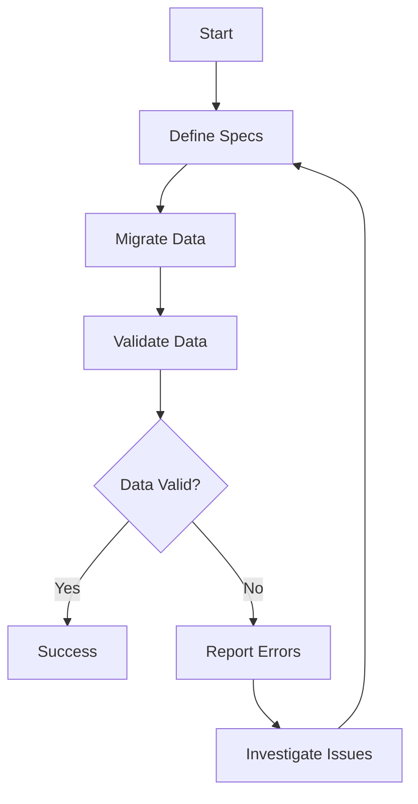

## 14.3 Testing and Validating Migrated Data

As we transition from Java to Clojure, ensuring the accuracy and consistency of migrated data is paramount. This section delves into the methodologies and practices necessary to verify data integrity post-migration. We will explore how to implement data consistency checks and validate the correctness of data transformations, leveraging both Java and Clojure paradigms.

### Introduction to Data Validation in Migration

Data validation is a critical step in the migration process. It involves verifying that the data has been accurately transferred from the source system (Java) to the target system (Clojure) without any loss or corruption. This process ensures that the migrated data maintains its integrity, remains consistent, and is usable in the new environment.

#### Key Objectives of Data Validation

- **Accuracy**: Ensure that data values are correct and match the expected results.
- **Consistency**: Verify that data is uniform across different systems and datasets.
- **Completeness**: Confirm that all necessary data has been migrated.
- **Timeliness**: Ensure that data is up-to-date and reflects the latest information.

### Implementing Data Consistency Checks

Data consistency checks are essential to ensure that the data remains uniform across different systems. In the context of migrating from Java to Clojure, these checks help verify that the data behaves as expected in the functional programming paradigm.

#### Strategies for Data Consistency

1. **Schema Validation**: Ensure that the data structure in Clojure matches the expected schema. This involves checking data types, field names, and constraints.

2. **Data Integrity Constraints**: Implement checks for primary keys, foreign keys, and unique constraints to maintain data integrity.

3. **Cross-System Validation**: Compare data between the Java and Clojure systems to ensure consistency. This can be done using automated scripts or tools that compare datasets.

4. **Functional Tests**: Write tests that validate the behavior of data in the new system. This includes testing data transformations and business logic.

### Clojure's Approach to Data Validation

Clojure provides several tools and libraries that facilitate data validation. These tools leverage Clojure's functional programming capabilities to create robust and maintainable validation logic.

#### Using Spec for Data Validation

Clojure's `spec` library is a powerful tool for defining and validating data structures. It allows you to specify the shape of your data and provides functions to check if data conforms to the specified shape.

```clojure
(require '[clojure.spec.alpha :as s])

;; Define a spec for a user map
(s/def ::user (s/keys :req-un [::id ::name ::email]))

;; Sample data
(def user-data {:id 1 :name "Alice" :email "alice@example.com"})

;; Validate data
(s/valid? ::user user-data) ; => true

;; Explain invalid data
(s/explain ::user {:id 1 :name "Alice"}) ; Missing required key: :email
```

In this example, we define a spec for a user map and validate a sample data structure against it. The `spec` library provides a declarative way to define data structures, making it easier to enforce data consistency.

#### Leveraging Test.check for Property-Based Testing

Clojure's `test.check` library supports property-based testing, which is useful for validating data transformations and ensuring that they behave correctly under various conditions.

```clojure
(require '[clojure.test.check :as tc])
(require '[clojure.test.check.generators :as gen])
(require '[clojure.test.check.properties :as prop])

;; Define a property
(def user-prop
  (prop/for-all [user (gen/hash-map :id gen/int :name gen/string :email gen/string)]
    (s/valid? ::user user)))

;; Run the property test
(tc/quick-check 100 user-prop)
```

Property-based testing generates random data and checks if it satisfies the defined properties. This approach is effective for uncovering edge cases and ensuring the robustness of data transformations.

### Comparing Java and Clojure Data Validation

Java developers transitioning to Clojure may find similarities and differences in how data validation is approached. Let's compare the two:

#### Java Data Validation

In Java, data validation is often performed using frameworks like Hibernate Validator or custom validation logic. These frameworks provide annotations and APIs to define validation rules.

```java
import javax.validation.constraints.*;

public class User {
    @NotNull
    private Integer id;

    @NotEmpty
    private String name;

    @Email
    private String email;

    // Getters and setters
}
```

Java's approach relies heavily on object-oriented principles, using annotations to define validation rules directly in the class definitions.

#### Clojure Data Validation

Clojure, on the other hand, embraces a functional approach. Validation logic is often separated from data definitions, allowing for more flexibility and reusability.

- **Declarative**: Clojure's `spec` allows for declarative data validation, making it easier to understand and maintain.
- **Composable**: Validation logic can be composed using higher-order functions, enabling more complex validation scenarios.

### Practical Example: Validating Migrated Data

Let's walk through a practical example of validating data migrated from a Java system to a Clojure application.

#### Scenario

Suppose we have a Java application that manages customer data. We are migrating this data to a Clojure application and need to ensure that the data is accurately transferred.

#### Java Data Model

```java
public class Customer {
    private Integer id;
    private String name;
    private String email;

    // Getters and setters
}
```

#### Clojure Data Model

```clojure
(defrecord Customer [id name email])
```

#### Validation Process

1. **Define Clojure Specs**: Create specs for the `Customer` data structure.

```clojure
(s/def ::customer (s/keys :req-un [::id ::name ::email]))
```

2. **Migrate Data**: Transfer data from the Java system to the Clojure application.

3. **Validate Data**: Use the defined specs to validate the migrated data.

```clojure
(defn validate-customers [customers]
  (every? #(s/valid? ::customer %) customers))

;; Sample data
(def customers [{:id 1 :name "Alice" :email "alice@example.com"}
                {:id 2 :name "Bob" :email "bob@example.com"}])

(validate-customers customers) ; => true
```

4. **Handle Validation Errors**: Implement logic to handle validation errors and report them for further investigation.

```clojure
(defn report-errors [customers]
  (doseq [customer customers]
    (when-not (s/valid? ::customer customer)
      (println "Invalid customer:" (s/explain-str ::customer customer))))
```

### Visualizing Data Validation Flow

To better understand the flow of data validation, let's visualize the process using a flowchart.



**Figure 1**: Data Validation Flowchart

This flowchart illustrates the iterative process of defining specs, migrating data, validating it, and handling any errors that arise.

### Best Practices for Data Validation

- **Automate Validation**: Use automated scripts and tools to validate data, reducing the risk of human error.
- **Incremental Validation**: Validate data incrementally during the migration process to catch issues early.
- **Comprehensive Testing**: Combine unit tests, integration tests, and property-based tests to cover all aspects of data validation.
- **Continuous Monitoring**: Implement monitoring tools to track data integrity over time and detect anomalies.

### References and Further Reading

- [Clojure Spec Guide](https://clojure.org/guides/spec)
- [Clojure Test.check](https://github.com/clojure/test.check)
- [Java Hibernate Validator](https://hibernate.org/validator/)

### Knowledge Check

Let's test your understanding of data validation in the context of migrating from Java to Clojure.

## **Quiz: Are You Ready to Migrate from Java to Clojure?**



### What is the primary goal of data validation during migration?

- [x] Ensure data accuracy and consistency
- [ ] Improve application performance
- [ ] Reduce code complexity
- [ ] Enhance user interface design

> **Explanation:** The primary goal of data validation during migration is to ensure that the data is accurate and consistent in the new system.

### Which Clojure library is commonly used for data validation?

- [x] Spec
- [ ] Ring
- [ ] Compojure
- [ ] Leiningen

> **Explanation:** Clojure's `spec` library is commonly used for defining and validating data structures.

### How does property-based testing differ from traditional testing?

- [x] It generates random data to test properties
- [ ] It focuses on testing user interfaces
- [ ] It requires manual test case creation
- [ ] It is only applicable to Java applications

> **Explanation:** Property-based testing generates random data to test properties, uncovering edge cases and ensuring robustness.

### What is a key advantage of using Clojure's `spec` for validation?

- [x] Declarative and composable validation logic
- [ ] Requires less memory
- [ ] Faster execution time
- [ ] Built-in support for databases

> **Explanation:** Clojure's `spec` provides declarative and composable validation logic, making it easier to understand and maintain.

### Which of the following is a best practice for data validation?

- [x] Automate validation processes
- [ ] Validate data manually
- [ ] Ignore validation errors
- [ ] Validate data only after migration

> **Explanation:** Automating validation processes reduces the risk of human error and ensures consistent validation.

### What does the `s/valid?` function do in Clojure?

- [x] Checks if data conforms to a spec
- [ ] Generates random test data
- [ ] Compiles Clojure code
- [ ] Connects to a database

> **Explanation:** The `s/valid?` function checks if data conforms to a specified spec.

### What is the purpose of cross-system validation?

- [x] Compare data between Java and Clojure systems
- [ ] Improve code readability
- [ ] Optimize database queries
- [ ] Enhance user experience

> **Explanation:** Cross-system validation involves comparing data between Java and Clojure systems to ensure consistency.

### What should be done if data validation fails?

- [x] Report errors and investigate issues
- [ ] Ignore the errors
- [ ] Restart the migration process
- [ ] Delete the invalid data

> **Explanation:** If data validation fails, errors should be reported and investigated to resolve the issues.

### Which tool is used for property-based testing in Clojure?

- [x] Test.check
- [ ] JUnit
- [ ] Mockito
- [ ] Selenium

> **Explanation:** Clojure's `test.check` library is used for property-based testing.

### True or False: Data validation is only necessary after the migration is complete.

- [ ] True
- [x] False

> **Explanation:** Data validation should be performed throughout the migration process to catch issues early and ensure data integrity.



By following these guidelines and leveraging Clojure's powerful tools, you can ensure a successful data migration from Java to Clojure, maintaining data integrity and consistency throughout the process.
