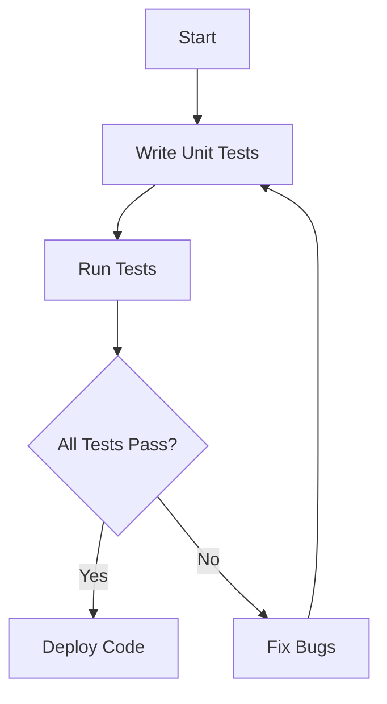

## 15.1 Maintaining Test Coverage

As we embark on the journey of migrating from Java Object-Oriented Programming (OOP) to Clojure's functional programming paradigm, one of the critical aspects to ensure is maintaining robust test coverage. This ensures that the existing functionality remains intact while we introduce new Clojure code. In this section, we will explore strategies for writing effective unit tests for Clojure, drawing parallels with Java testing practices, and leveraging Clojure's unique features to enhance our testing capabilities.

### Understanding the Importance of Test Coverage

Test coverage is a measure of how much of your code is executed while running your tests. High test coverage is crucial during migration to ensure that the new Clojure code integrates seamlessly with existing systems without introducing bugs. It also provides confidence that the refactored code behaves as expected.

#### Key Benefits of Maintaining Test Coverage

- **Ensures Stability**: By covering both new and existing code, we minimize the risk of introducing defects during migration.
- **Facilitates Refactoring**: With comprehensive tests, developers can refactor code with confidence, knowing that tests will catch any regressions.
- **Enhances Code Quality**: Writing tests encourages developers to write cleaner, more modular code, which is easier to test.
- **Supports Continuous Integration**: Automated tests are integral to continuous integration pipelines, ensuring that changes do not break the build.

### Transitioning from Java Testing to Clojure Testing

Java developers are likely familiar with testing frameworks such as JUnit and TestNG. In Clojure, we have similar tools that cater to the functional programming paradigm. Let's explore how we can transition our testing mindset from Java to Clojure.

#### Java Testing Example

Here's a simple example of a Java unit test using JUnit:

```java
import static org.junit.Assert.assertEquals;
import org.junit.Test;

public class CalculatorTest {

    @Test
    public void testAddition() {
        Calculator calculator = new Calculator();
        int result = calculator.add(2, 3);
        assertEquals(5, result);
    }
}
```

#### Clojure Testing with `clojure.test`

Clojure provides a built-in testing library called `clojure.test`. Here's how we can write a similar test in Clojure:

```clojure
(ns calculator-test
  (:require [clojure.test :refer :all]
            [calculator :refer :all]))

(deftest test-addition
  (testing "Addition function"
    (is (= 5 (add 2 3)))))
```

**Key Differences:**

- **Namespace and Imports**: Clojure uses namespaces and requires specific functions from libraries, similar to Java imports.
- **Testing Functions**: Clojure uses `deftest` to define a test and `testing` to group assertions, akin to JUnit's `@Test`.
- **Assertions**: The `is` macro in Clojure is used for assertions, similar to `assertEquals` in JUnit.

### Writing Unit Tests for New Clojure Code

When writing unit tests for new Clojure code, it's essential to embrace functional programming principles. Let's explore some strategies and best practices.

#### Embrace Pure Functions

Pure functions, which have no side effects and return the same output for the same input, are easier to test. Ensure that your Clojure functions are pure wherever possible.

```clojure
(defn multiply [a b]
  (* a b))

(deftest test-multiply
  (testing "Multiplication function"
    (is (= 6 (multiply 2 3)))))
```

#### Use Test Fixtures

Test fixtures allow you to set up a common context for multiple tests. In Clojure, you can use `use-fixtures` to define setup and teardown logic.

```clojure
(use-fixtures :each
  (fn [f]
    (println "Setting up test environment")
    (f)
    (println "Tearing down test environment")))
```

#### Mocking and Stubbing

While Clojure doesn't have built-in mocking libraries like Java, you can use libraries such as `clojure.test.mock` or `mock-clj` to create mocks and stubs.

```clojure
(ns myapp.core-test
  (:require [clojure.test :refer :all]
            [mock-clj.core :refer :all]))

(deftest test-with-mock
  (with-mock [external-service (fn [x] "mocked response")]
    (is (= "mocked response" (external-service "input")))))
```

### Leveraging Clojure's Unique Features for Testing

Clojure offers several unique features that can enhance your testing strategy.

#### Testing with Spec

Clojure's `spec` library allows you to define specifications for your data and functions, which can be used for generative testing.

```clojure
(require '[clojure.spec.alpha :as s])
(require '[clojure.spec.test.alpha :as stest])

(s/fdef add
  :args (s/cat :a int? :b int?)
  :ret int?)

(stest/instrument `add)
```

#### Generative Testing with `test.check`

Clojure's `test.check` library provides powerful generative testing capabilities, allowing you to test your functions with a wide range of inputs.

```clojure
(require '[clojure.test.check :as tc])
(require '[clojure.test.check.generators :as gen])
(require '[clojure.test.check.properties :as prop])

(def prop-addition
  (prop/for-all [a gen/int
                 b gen/int]
    (= (+ a b) (add a b))))

(tc/quick-check 100 prop-addition)
```

### Ensuring Existing Functionality Remains Intact

During migration, it's crucial to ensure that existing functionality remains intact. Here are some strategies to achieve this.

#### Maintain Legacy Tests

Keep your existing Java tests running alongside your new Clojure tests. This ensures that any changes in behavior are caught early.

#### Gradual Migration

Adopt a gradual migration strategy, where you incrementally replace Java components with Clojure. This allows you to test each component thoroughly before moving on to the next.

#### Integration Testing

Perform integration testing to ensure that Clojure and Java components work seamlessly together. Use tools like `clojure.test` and `clojure.test.junit` to integrate with existing Java testing frameworks.

### Visualizing Test Coverage

Visual aids can help you understand the flow of data through your tests and identify areas that need more coverage.



**Diagram Description**: This flowchart illustrates the process of writing and running unit tests, identifying bugs, and deploying code once all tests pass.

### References and Further Reading

- [Official Clojure Documentation](https://clojure.org/reference/documentation)
- [Clojure Testing Libraries](https://clojure.org/guides/testing)
- [Clojure Spec Guide](https://clojure.org/guides/spec)
- [Test Check Library](https://github.com/clojure/test.check)

### Knowledge Check

- What are the benefits of maintaining high test coverage during migration?
- How does Clojure's `clojure.test` differ from Java's JUnit?
- What is a pure function, and why is it easier to test?
- How can you use Clojure's `spec` library to enhance your testing strategy?

### Practice Problems

1. Write a Clojure test for a function that calculates the factorial of a number.
2. Use `test.check` to create a generative test for a function that reverses a string.
3. Implement a test fixture that sets up a database connection before each test.

### Summary

Maintaining test coverage during the migration from Java to Clojure is crucial for ensuring stability and quality. By leveraging Clojure's testing tools and embracing functional programming principles, we can write effective tests that provide confidence in our code. Remember to maintain legacy tests, adopt a gradual migration strategy, and use integration testing to ensure seamless interoperability between Java and Clojure components.

## **Quiz: Are You Ready to Migrate from Java to Clojure?**



### What is the primary benefit of maintaining high test coverage during migration?

- [x] Ensures stability and minimizes the risk of defects
- [ ] Reduces the need for documentation
- [ ] Increases the complexity of the codebase
- [ ] Eliminates the need for code reviews

> **Explanation:** High test coverage ensures that the existing functionality remains intact and minimizes the risk of introducing defects during migration.

### Which Clojure library is used for generative testing?

- [ ] clojure.spec
- [x] test.check
- [ ] clojure.test
- [ ] mock-clj

> **Explanation:** The `test.check` library in Clojure is used for generative testing, allowing you to test functions with a wide range of inputs.

### How does Clojure's `deftest` differ from Java's JUnit `@Test`?

- [x] `deftest` is a macro used to define a test in Clojure
- [ ] `deftest` requires a return type
- [ ] `deftest` is used for integration testing only
- [ ] `deftest` is not used for testing

> **Explanation:** `deftest` is a macro in Clojure used to define a test, similar to JUnit's `@Test` annotation in Java.

### What is a pure function?

- [x] A function with no side effects that returns the same output for the same input
- [ ] A function that modifies global state
- [ ] A function that depends on external input
- [ ] A function that uses mutable data structures

> **Explanation:** A pure function has no side effects and returns the same output for the same input, making it easier to test.

### How can you use Clojure's `spec` library in testing?

- [x] Define specifications for data and functions to validate inputs and outputs
- [ ] Create mocks and stubs for external services
- [ ] Perform integration testing with Java components
- [ ] Generate random data for testing

> **Explanation:** Clojure's `spec` library allows you to define specifications for data and functions, which can be used to validate inputs and outputs during testing.

### What is the purpose of a test fixture in Clojure?

- [x] Set up a common context for multiple tests
- [ ] Generate random test data
- [ ] Define specifications for functions
- [ ] Perform integration testing

> **Explanation:** A test fixture in Clojure is used to set up a common context for multiple tests, allowing for setup and teardown logic.

### Which library can be used for mocking in Clojure?

- [ ] clojure.spec
- [ ] test.check
- [x] mock-clj
- [ ] clojure.test

> **Explanation:** The `mock-clj` library can be used for mocking in Clojure, allowing you to create mocks and stubs for testing.

### What is the role of `use-fixtures` in Clojure testing?

- [x] Define setup and teardown logic for tests
- [ ] Generate random test data
- [ ] Validate function specifications
- [ ] Perform performance testing

> **Explanation:** `use-fixtures` in Clojure testing is used to define setup and teardown logic for tests, ensuring a consistent test environment.

### How can you ensure existing functionality remains intact during migration?

- [x] Maintain legacy tests and perform integration testing
- [ ] Rewrite all tests in Clojure immediately
- [ ] Ignore existing Java tests
- [ ] Use only manual testing

> **Explanation:** Maintaining legacy tests and performing integration testing ensures that existing functionality remains intact during migration.

### True or False: Clojure's `clojure.test` library is similar to Java's JUnit.

- [x] True
- [ ] False

> **Explanation:** Clojure's `clojure.test` library is similar to Java's JUnit in that both are used for unit testing, but they cater to their respective programming paradigms.


