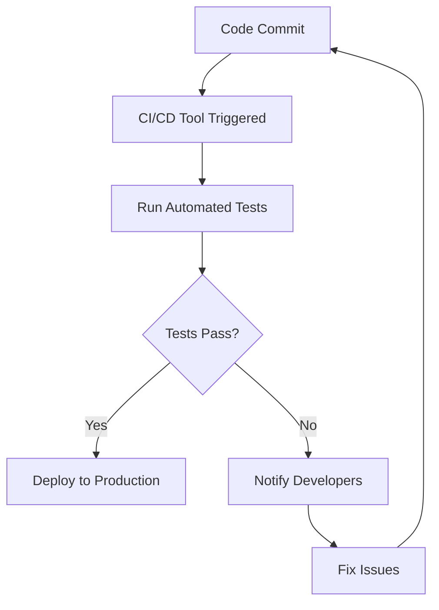

## 15.2 Automated Testing Strategies

As we embark on the journey of migrating from Java's Object-Oriented Programming (OOP) paradigm to Clojure's functional programming approach, automated testing becomes a cornerstone of ensuring a smooth transition. Automated testing not only helps in maintaining the integrity of your application during migration but also enhances the reliability and efficiency of your enterprise systems. In this section, we will delve into the strategies for incorporating automated tests into the migration process, with a focus on continuous integration and deployment pipelines.

### Understanding the Importance of Automated Testing

Automated testing is crucial in the migration process for several reasons:

- **Consistency and Reliability**: Automated tests provide a consistent way to verify that your application behaves as expected after each change.
- **Early Detection of Issues**: By running tests automatically, you can catch bugs and regressions early in the development cycle.
- **Facilitating Refactoring**: Automated tests give you the confidence to refactor code, knowing that any unintended changes will be caught by the tests.
- **Documentation**: Tests serve as a form of documentation, illustrating how the code is intended to be used and what outcomes are expected.

### Transitioning from Java Testing Frameworks to Clojure

Java developers are often familiar with testing frameworks like JUnit and TestNG. In Clojure, we have several testing libraries that offer similar functionalities, such as `clojure.test`, `Midje`, and `Expectations`. Let's explore how these tools can be leveraged in your migration journey.

#### Using `clojure.test`

`clojure.test` is the built-in testing framework in Clojure, providing a simple and effective way to write tests. Here's a basic example of how to use `clojure.test`:

```clojure
(ns myapp.core-test
  (:require [clojure.test :refer :all]
            [myapp.core :refer :all]))

(deftest test-addition
  (testing "Addition function"
    (is (= 4 (add 2 2)))
    (is (= 0 (add -1 1)))))
```

In this example, we define a test namespace and use `deftest` to create a test for an `add` function. The `testing` macro groups related assertions, and the `is` macro checks that the expressions evaluate to true.

#### Comparing with JUnit

For Java developers, here's a similar test in JUnit:

```java
import static org.junit.Assert.assertEquals;
import org.junit.Test;

public class MyAppTest {
    @Test
    public void testAddition() {
        assertEquals(4, MyApp.add(2, 2));
        assertEquals(0, MyApp.add(-1, 1));
    }
}
```

Both `clojure.test` and JUnit provide similar capabilities, but `clojure.test` integrates seamlessly with Clojure's functional style, making it a natural choice for testing Clojure code.

### Advanced Testing with Midje

Midje is another popular testing framework in Clojure, known for its expressive syntax and support for behavior-driven development (BDD). Here's how you can write a test using Midje:

```clojure
(ns myapp.core-test
  (:require [midje.sweet :refer :all]
            [myapp.core :refer :all]))

(fact "Addition function"
  (add 2 2) => 4
  (add -1 1) => 0)
```

Midje's `fact` macro allows you to write tests in a more narrative style, which can be easier to read and understand.

### Continuous Integration and Deployment Pipelines

Automated testing is most effective when integrated into a continuous integration (CI) and continuous deployment (CD) pipeline. This ensures that tests are run automatically whenever code is committed, providing immediate feedback to developers.

#### Setting Up a CI/CD Pipeline

1. **Choose a CI/CD Tool**: Popular tools include Jenkins, Travis CI, CircleCI, and GitHub Actions. These tools can be configured to run your tests automatically.

2. **Configure Your Build Script**: Use Leiningen or deps.edn to define your build process, including running tests. Here's an example of a simple `project.clj` configuration for Leiningen:

   ```clojure
   (defproject myapp "0.1.0-SNAPSHOT"
     :dependencies [[org.clojure/clojure "1.10.3"]]
     :plugins [[lein-midje "3.2.1"]]
     :profiles {:dev {:dependencies [[midje "1.9.9"]]}})
   ```

3. **Integrate with Your CI/CD Tool**: Configure your CI/CD tool to execute the build script. For example, a `.travis.yml` file for Travis CI might look like this:

   ```yaml
   language: clojure
   script: lein midje
   ```

4. **Monitor Test Results**: Ensure that test results are visible to the development team, so issues can be addressed promptly.

### Best Practices for Automated Testing in Clojure

- **Write Tests First**: Adopt a test-driven development (TDD) approach to guide your design and ensure comprehensive test coverage.
- **Use Property-Based Testing**: Tools like `test.check` allow you to generate random test data, uncovering edge cases that may not be covered by example-based tests.
- **Mock External Dependencies**: Use libraries like `with-redefs` to mock external services and isolate the code under test.
- **Focus on Pure Functions**: Leverage Clojure's emphasis on pure functions and immutability to write tests that are easy to reason about and maintain.

### Visualizing the Testing Process

To better understand the flow of automated testing in a CI/CD pipeline, let's visualize the process using a flowchart:



**Caption**: This flowchart illustrates the automated testing process within a CI/CD pipeline, highlighting the feedback loop between code commits and test results.

### Try It Yourself

To solidify your understanding, try modifying the provided code examples:

- **Add More Tests**: Extend the `test-addition` function to cover additional edge cases, such as adding large numbers or handling null inputs.
- **Experiment with Midje**: Rewrite the `clojure.test` example using Midje, and observe the differences in syntax and readability.
- **Integrate with a CI/CD Tool**: Set up a simple CI/CD pipeline using GitHub Actions or another tool of your choice, and configure it to run your tests automatically.

### Knowledge Check

Before moving on, let's review some key concepts:

- **What are the benefits of automated testing during migration?**
- **How does `clojure.test` compare to JUnit?**
- **What role does a CI/CD pipeline play in automated testing?**

### Summary

In this section, we've explored the importance of automated testing in the migration from Java to Clojure, examined various testing frameworks available in Clojure, and discussed how to integrate automated tests into a CI/CD pipeline. By adopting these strategies, you can ensure a smooth and reliable transition to Clojure, enhancing the scalability and maintainability of your enterprise applications.

## **Quiz: Are You Ready to Migrate from Java to Clojure?**



### What is a key benefit of automated testing during migration?

- [x] Early detection of issues
- [ ] Increased code complexity
- [ ] Slower development process
- [ ] Reduced test coverage

> **Explanation:** Automated testing helps in catching bugs and regressions early in the development cycle, ensuring a smooth transition.

### Which Clojure testing framework is built-in and commonly used?

- [x] clojure.test
- [ ] JUnit
- [ ] TestNG
- [ ] Mockito

> **Explanation:** `clojure.test` is the built-in testing framework in Clojure, providing a simple and effective way to write tests.

### How does Midje differ from clojure.test?

- [x] Midje offers a more expressive syntax and supports behavior-driven development.
- [ ] Midje is only for Java applications.
- [ ] Midje does not support assertions.
- [ ] Midje is a build tool.

> **Explanation:** Midje is known for its expressive syntax and support for behavior-driven development, making it easier to read and understand tests.

### What is the purpose of a CI/CD pipeline in automated testing?

- [x] To run tests automatically and provide immediate feedback
- [ ] To increase manual testing efforts
- [ ] To delay the deployment process
- [ ] To reduce test coverage

> **Explanation:** A CI/CD pipeline ensures that tests are run automatically whenever code is committed, providing immediate feedback to developers.

### Which tool can be used for property-based testing in Clojure?

- [x] test.check
- [ ] JUnit
- [ ] TestNG
- [ ] Mockito

> **Explanation:** `test.check` is a tool in Clojure that allows for property-based testing, generating random test data to uncover edge cases.

### What is a common practice when writing tests in Clojure?

- [x] Focus on pure functions
- [ ] Avoid testing edge cases
- [ ] Increase code complexity
- [ ] Use mutable state

> **Explanation:** Focusing on pure functions and immutability makes tests easier to reason about and maintain.

### How can external dependencies be mocked in Clojure tests?

- [x] Using with-redefs
- [ ] Using JUnit
- [ ] Using TestNG
- [ ] Using Mockito

> **Explanation:** `with-redefs` is used in Clojure to mock external services and isolate the code under test.

### What is the role of automated tests in documentation?

- [x] Tests illustrate how the code is intended to be used and what outcomes are expected.
- [ ] Tests increase code complexity.
- [ ] Tests reduce code readability.
- [ ] Tests delay the development process.

> **Explanation:** Automated tests serve as a form of documentation, showing how the code is intended to be used and what outcomes are expected.

### What is a benefit of using Midje for testing?

- [x] Expressive syntax and narrative style
- [ ] Limited to Java applications
- [ ] Lack of support for assertions
- [ ] Increased code complexity

> **Explanation:** Midje's `fact` macro allows for a more narrative style of writing tests, which can be easier to read and understand.

### True or False: Automated testing is only necessary after migration is complete.

- [ ] True
- [x] False

> **Explanation:** Automated testing is crucial throughout the migration process to ensure the integrity and reliability of the application.


