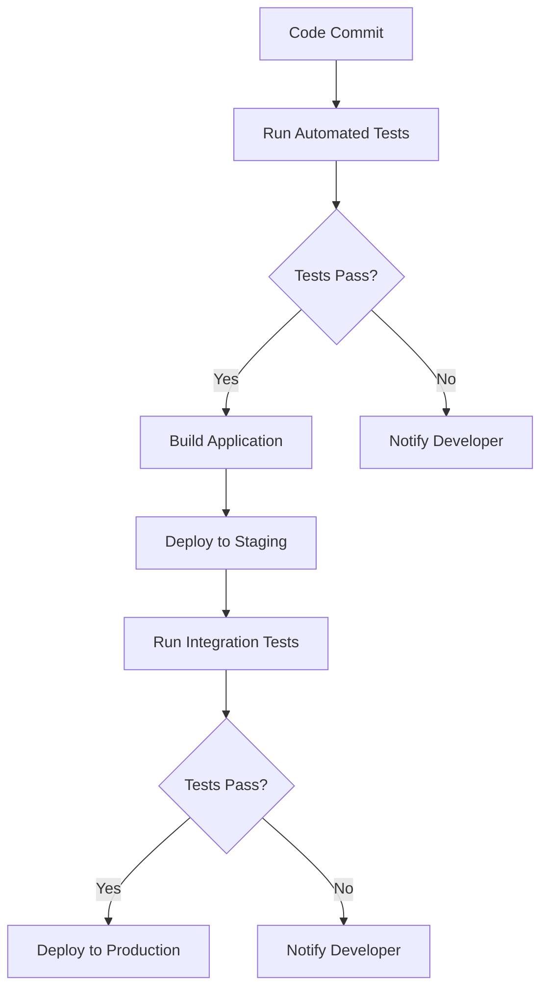

## 15.2 Automated Testing Strategies

As enterprises transition from Java Object-Oriented Programming (OOP) to Clojure's functional programming paradigm, automated testing becomes a cornerstone of ensuring a smooth migration. Automated testing not only validates the correctness of the migrated code but also facilitates continuous integration and deployment, ensuring that changes are seamlessly integrated into the production environment. In this section, we will delve into the strategies for incorporating automated tests into the migration process, drawing parallels between Java and Clojure testing practices, and exploring tools and frameworks that can aid in this transition.

### Understanding the Role of Automated Testing in Migration

Automated testing is crucial in the migration process for several reasons:

1. **Regression Prevention**: Automated tests help ensure that new changes do not introduce bugs into existing functionality.
2. **Confidence in Code Changes**: With a robust suite of tests, developers can confidently refactor and optimize code without fear of breaking existing features.
3. **Facilitating Continuous Integration (CI)**: Automated tests are integral to CI pipelines, allowing for rapid feedback and early detection of issues.
4. **Documentation of Expected Behavior**: Tests serve as a form of documentation, outlining the expected behavior of the system.

### Key Concepts in Automated Testing

Before diving into specific strategies, let's review some key concepts in automated testing:

- **Unit Testing**: Testing individual components or functions in isolation.
- **Integration Testing**: Testing the interaction between different components or systems.
- **End-to-End Testing**: Testing the entire application flow from start to finish.
- **Test-Driven Development (TDD)**: Writing tests before writing the corresponding code.
- **Behavior-Driven Development (BDD)**: Writing tests based on the expected behavior of the application.

### Automated Testing Tools and Frameworks

Both Java and Clojure have a rich ecosystem of tools and frameworks for automated testing. Understanding these tools is essential for a successful migration.

#### Java Testing Tools

- **JUnit**: A widely used framework for unit testing in Java.
- **Mockito**: A framework for creating mock objects in Java tests.
- **Selenium**: A tool for automating web browsers, often used for end-to-end testing.

#### Clojure Testing Tools

- **clojure.test**: The built-in testing framework in Clojure, similar to JUnit.
- **Midje**: A testing framework that emphasizes readability and simplicity.
- **Speclj**: A BDD-style testing framework for Clojure.
- **Cucumber**: A tool for BDD that can be used with Clojure through integration libraries.

### Incorporating Automated Tests into the Migration Process

To effectively incorporate automated tests into the migration process, follow these steps:

#### 1. Establish a Baseline with Existing Java Tests

Begin by reviewing and running existing Java tests to establish a baseline. This will help identify critical areas that need to be covered during migration. Ensure that all tests are passing before starting the migration process.

#### 2. Translate Java Tests to Clojure

As you migrate code from Java to Clojure, translate the corresponding tests. This involves rewriting Java tests using Clojure's testing frameworks. Here's a simple example of translating a Java JUnit test to Clojure's `clojure.test`:

**Java JUnit Test Example:**

```java
import org.junit.Test;
import static org.junit.Assert.assertEquals;

public class CalculatorTest {
    @Test
    public void testAddition() {
        Calculator calculator = new Calculator();
        assertEquals(5, calculator.add(2, 3));
    }
}
```

**Clojure `clojure.test` Example:**

```clojure
(ns calculator-test
  (:require [clojure.test :refer :all]
            [calculator :refer :all]))

(deftest test-addition
  (testing "Addition function"
    (is (= 5 (add 2 3)))))
```

#### 3. Implement Continuous Integration Pipelines

Set up CI pipelines to automatically run tests whenever code changes are pushed to the repository. This ensures that any issues are caught early in the development process. Popular CI tools include Jenkins, Travis CI, and GitHub Actions.

**Example CI Configuration for Clojure (GitHub Actions):**

```yaml
name: Clojure CI

on: [push, pull_request]

jobs:
  build:
    runs-on: ubuntu-latest
    steps:
    - uses: actions/checkout@v2
    - name: Set up JDK 11
      uses: actions/setup-java@v1
      with:
        java-version: '11'
    - name: Install Clojure
      run: sudo apt-get install -y clojure
    - name: Run tests
      run: clojure -M:test
```

#### 4. Leverage Property-Based Testing

Property-based testing is a powerful technique where tests are generated based on properties that should always hold true. This approach can uncover edge cases that traditional example-based tests might miss.

**Example Using `test.check` for Property-Based Testing:**

```clojure
(ns calculator-test
  (:require [clojure.test :refer :all]
            [clojure.test.check :as tc]
            [clojure.test.check.generators :as gen]
            [clojure.test.check.properties :as prop]))

(def add-commutative
  (prop/for-all [a gen/int
                 b gen/int]
    (= (add a b) (add b a))))

(tc/quick-check 1000 add-commutative)
```

#### 5. Ensure Comprehensive Test Coverage

Aim for comprehensive test coverage by identifying critical paths and edge cases in your application. Use tools like `cloverage` to measure test coverage in Clojure.

#### 6. Adopt Test-Driven Development (TDD)

Adopt TDD practices to guide the migration process. By writing tests before implementing functionality, you ensure that the migrated code meets the desired specifications.

### Continuous Integration and Deployment Pipelines

Continuous integration and deployment (CI/CD) pipelines are essential for automating the testing and deployment process. They provide rapid feedback and ensure that code changes are integrated smoothly into the production environment.

#### Setting Up a CI/CD Pipeline

1. **Version Control Integration**: Integrate your CI/CD pipeline with your version control system (e.g., GitHub, GitLab).
2. **Automated Testing**: Configure the pipeline to run automated tests on every commit or pull request.
3. **Build Automation**: Use tools like Leiningen or deps.edn for build automation in Clojure.
4. **Deployment Automation**: Automate the deployment process to staging and production environments.

#### Example CI/CD Pipeline Workflow



### Best Practices for Automated Testing in Clojure

- **Use Pure Functions**: Leverage Clojure's emphasis on pure functions to simplify testing. Pure functions are easier to test because they have no side effects.
- **Mock External Dependencies**: Use mocking frameworks to simulate external dependencies, allowing you to test components in isolation.
- **Write Readable Tests**: Ensure that tests are easy to read and understand. Use descriptive names and comments to clarify the purpose of each test.
- **Regularly Refactor Tests**: Just like production code, tests should be regularly refactored to improve readability and maintainability.

### Challenges and Solutions in Automated Testing During Migration

#### Challenge: Translating Complex Java Tests

**Solution**: Break down complex Java tests into smaller, more manageable Clojure tests. Focus on testing individual functions and components.

#### Challenge: Ensuring Test Coverage

**Solution**: Use coverage tools to identify untested areas. Prioritize writing tests for critical and high-risk components.

#### Challenge: Managing Test Data

**Solution**: Use fixtures and generators to create test data. This ensures consistency and reduces duplication in tests.

### Conclusion

Automated testing is a critical component of the migration process from Java OOP to Clojure. By leveraging the right tools and strategies, enterprises can ensure a smooth transition, maintain high code quality, and facilitate continuous integration and deployment. Embracing automated testing not only enhances reliability but also empowers development teams to innovate and iterate rapidly.

## **Quiz: Are You Ready to Migrate from Java to Clojure?**



### What is the primary purpose of automated testing during migration?

- [x] To ensure that new changes do not introduce bugs into existing functionality.
- [ ] To replace manual testing entirely.
- [ ] To increase the complexity of the codebase.
- [ ] To eliminate the need for code reviews.

> **Explanation:** Automated testing helps prevent regression by ensuring that new changes do not introduce bugs into existing functionality.

### Which Clojure testing framework is built into the language?

- [x] clojure.test
- [ ] Midje
- [ ] Speclj
- [ ] Cucumber

> **Explanation:** `clojure.test` is the built-in testing framework in Clojure, similar to JUnit in Java.

### What is a key benefit of using property-based testing?

- [x] It can uncover edge cases that traditional example-based tests might miss.
- [ ] It requires less setup than unit testing.
- [ ] It eliminates the need for integration tests.
- [ ] It is faster than all other testing methods.

> **Explanation:** Property-based testing generates tests based on properties that should always hold true, uncovering edge cases that might be missed by example-based tests.

### What is the role of CI/CD pipelines in automated testing?

- [x] To automate the testing and deployment process, providing rapid feedback.
- [ ] To replace manual code reviews.
- [ ] To increase the complexity of the development process.
- [ ] To eliminate the need for version control.

> **Explanation:** CI/CD pipelines automate the testing and deployment process, providing rapid feedback and ensuring smooth integration of code changes.

### Which tool can be used to measure test coverage in Clojure?

- [x] cloverage
- [ ] JUnit
- [ ] Selenium
- [ ] Mockito

> **Explanation:** `cloverage` is a tool used to measure test coverage in Clojure.

### What is the advantage of using pure functions in testing?

- [x] They are easier to test because they have no side effects.
- [ ] They require more complex test setups.
- [ ] They eliminate the need for integration tests.
- [ ] They increase the complexity of the codebase.

> **Explanation:** Pure functions are easier to test because they have no side effects, making them predictable and straightforward to validate.

### How can external dependencies be managed in tests?

- [x] By using mocking frameworks to simulate them.
- [ ] By eliminating them from the codebase.
- [ ] By integrating them directly into the tests.
- [ ] By ignoring them during testing.

> **Explanation:** Mocking frameworks can simulate external dependencies, allowing components to be tested in isolation.

### What is a common challenge in translating Java tests to Clojure?

- [x] Translating complex Java tests into smaller, manageable Clojure tests.
- [ ] Finding equivalent testing frameworks.
- [ ] Ensuring compatibility with Java libraries.
- [ ] Maintaining the same test data.

> **Explanation:** Translating complex Java tests into smaller, manageable Clojure tests is a common challenge during migration.

### What is a benefit of using Test-Driven Development (TDD)?

- [x] It ensures that the migrated code meets the desired specifications.
- [ ] It eliminates the need for automated tests.
- [ ] It increases the complexity of the codebase.
- [ ] It replaces the need for CI/CD pipelines.

> **Explanation:** TDD ensures that the migrated code meets the desired specifications by writing tests before implementing functionality.

### True or False: Automated tests can serve as a form of documentation.

- [x] True
- [ ] False

> **Explanation:** Automated tests can serve as a form of documentation, outlining the expected behavior of the system.


