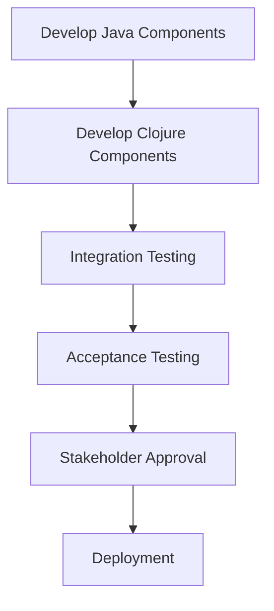

## 15.3 Integration and Acceptance Testing

As we transition from Java Object-Oriented Programming (OOP) to Clojure's functional paradigm, ensuring the seamless interaction between components and validating that business requirements are met is crucial. Integration and acceptance testing play pivotal roles in this process, providing confidence that the system behaves as expected and meets user needs.

### Understanding Integration Testing

Integration testing focuses on verifying the interactions between different components or systems. In the context of migrating from Java to Clojure, this involves testing the integration points between Java and Clojure components to ensure they work together harmoniously.

#### Key Objectives of Integration Testing

1. **Verify Interactions**: Ensure that Java and Clojure components communicate correctly.
2. **Identify Interface Issues**: Detect mismatches or errors in the interfaces between components.
3. **Validate Data Flow**: Confirm that data is correctly passed and transformed across components.
4. **Ensure System Stability**: Test the system's ability to handle real-world interactions and data loads.

### Integration Testing Strategies

To effectively test the integration between Java and Clojure components, consider the following strategies:

#### 1. **Incremental Integration Testing**

Incremental integration testing involves gradually integrating and testing components. This approach allows for early detection of integration issues and reduces the complexity of troubleshooting.

- **Top-Down Approach**: Start by testing higher-level components and gradually integrate lower-level components.
- **Bottom-Up Approach**: Begin with lower-level components and progressively integrate higher-level components.

#### 2. **Continuous Integration (CI)**

Implement a CI pipeline to automate integration testing. This ensures that integration tests are run frequently, providing immediate feedback on the system's integration health.

- **Use CI Tools**: Leverage tools like Jenkins, Travis CI, or GitHub Actions to automate testing.
- **Automate Test Execution**: Ensure that integration tests are automatically triggered on code changes.

#### 3. **Mocking and Stubbing**

Use mocking and stubbing to isolate components and test their interactions without relying on external systems.

- **Mock External Dependencies**: Replace external systems with mock objects to simulate interactions.
- **Stub Interfaces**: Use stubs to provide predefined responses for specific interactions.

### Integration Testing Tools

Several tools can facilitate integration testing between Java and Clojure components:

- **JUnit**: A widely-used testing framework for Java, which can be extended to test Clojure components.
- **Clojure.test**: Clojure's built-in testing framework, suitable for testing Clojure code.
- **Test.check**: A property-based testing library for Clojure, useful for generating test cases.
- **Mocking Libraries**: Libraries like Mockito (Java) and clojure.test.mock (Clojure) for creating mock objects.

### Code Example: Integration Testing with JUnit and Clojure.test

Let's explore a simple example of integration testing between Java and Clojure components using JUnit and Clojure.test.

**Java Component:**

```java
// JavaComponent.java
public class JavaComponent {
    public String greet(String name) {
        return "Hello, " + name + "!";
    }
}
```

**Clojure Component:**

```clojure
;; clojure_component.clj
(ns clojure-component)

(defn farewell [name]
  (str "Goodbye, " name "!"))
```

**Integration Test:**

```java
// IntegrationTest.java
import static org.junit.Assert.assertEquals;
import org.junit.Test;
import clojure.java.api.Clojure;
import clojure.lang.IFn;

public class IntegrationTest {
    @Test
    public void testIntegration() {
        JavaComponent javaComponent = new JavaComponent();
        String greeting = javaComponent.greet("Alice");

        IFn require = Clojure.var("clojure.core", "require");
        require.invoke(Clojure.read("clojure-component"));

        IFn farewell = Clojure.var("clojure-component", "farewell");
        String farewellMessage = (String) farewell.invoke("Alice");

        assertEquals("Hello, Alice!", greeting);
        assertEquals("Goodbye, Alice!", farewellMessage);
    }
}
```

In this example, we demonstrate how to test the integration between a Java component and a Clojure component using JUnit. The test verifies that both components produce the expected output when interacting with the same input.

### Understanding Acceptance Testing

Acceptance testing focuses on validating that the system meets business requirements and user expectations. It is typically performed at the end of the development cycle, before the system is deployed to production.

#### Key Objectives of Acceptance Testing

1. **Validate Business Requirements**: Ensure that the system fulfills the specified business requirements.
2. **Verify User Scenarios**: Test the system's behavior in real-world user scenarios.
3. **Ensure Usability**: Confirm that the system is user-friendly and meets user expectations.
4. **Facilitate Stakeholder Approval**: Provide evidence that the system is ready for deployment.

### Acceptance Testing Strategies

To effectively conduct acceptance testing during the migration from Java to Clojure, consider the following strategies:

#### 1. **User Acceptance Testing (UAT)**

UAT involves testing the system with real users to validate that it meets their needs and expectations.

- **Engage End Users**: Involve end users in the testing process to gather feedback.
- **Test Real-World Scenarios**: Simulate real-world scenarios to validate system behavior.

#### 2. **Behavior-Driven Development (BDD)**

BDD is an approach that involves writing test cases in a natural language format, making them understandable to non-technical stakeholders.

- **Use BDD Tools**: Leverage tools like Cucumber or SpecFlow to write BDD test cases.
- **Collaborate with Stakeholders**: Work with stakeholders to define acceptance criteria.

#### 3. **Automated Acceptance Testing**

Automate acceptance tests to ensure they are repeatable and can be executed frequently.

- **Use Automation Frameworks**: Utilize frameworks like Selenium or Cypress for web-based applications.
- **Integrate with CI/CD**: Incorporate automated acceptance tests into the CI/CD pipeline.

### Acceptance Testing Tools

Several tools can facilitate acceptance testing during the migration process:

- **Cucumber**: A BDD tool that allows writing acceptance tests in a natural language format.
- **Selenium**: A popular tool for automating web-based acceptance tests.
- **Cypress**: A modern testing tool for end-to-end testing of web applications.

### Code Example: Acceptance Testing with Cucumber

Let's explore a simple example of acceptance testing using Cucumber.

**Feature File:**

```gherkin
Feature: User Greeting
  Scenario: Greet user
    Given the user "Alice"
    When the user requests a greeting
    Then the system should respond with "Hello, Alice!"
```

**Step Definitions:**

```java
// StepDefinitions.java
import io.cucumber.java.en.Given;
import io.cucumber.java.en.When;
import io.cucumber.java.en.Then;
import static org.junit.Assert.assertEquals;

public class StepDefinitions {
    private String user;
    private String response;

    @Given("the user {string}")
    public void the_user(String name) {
        user = name;
    }

    @When("the user requests a greeting")
    public void the_user_requests_a_greeting() {
        JavaComponent javaComponent = new JavaComponent();
        response = javaComponent.greet(user);
    }

    @Then("the system should respond with {string}")
    public void the_system_should_respond_with(String expectedResponse) {
        assertEquals(expectedResponse, response);
    }
}
```

In this example, we demonstrate how to use Cucumber to write acceptance tests for a Java component. The feature file describes the acceptance criteria in a natural language format, while the step definitions implement the test logic.

### Integration and Acceptance Testing Workflow

To ensure a smooth migration from Java to Clojure, establish a workflow that incorporates both integration and acceptance testing.



**Diagram Description:** This flowchart illustrates the workflow for integration and acceptance testing during the migration process. It begins with the development of Java and Clojure components, followed by integration testing, acceptance testing, stakeholder approval, and finally deployment.

### Best Practices for Integration and Acceptance Testing

To maximize the effectiveness of integration and acceptance testing, consider the following best practices:

- **Define Clear Test Objectives**: Clearly define the objectives of each test to ensure they align with business requirements.
- **Maintain Test Coverage**: Ensure comprehensive test coverage to minimize the risk of undetected issues.
- **Collaborate with Stakeholders**: Involve stakeholders in the testing process to gather valuable feedback.
- **Continuously Improve**: Regularly review and improve testing processes to enhance efficiency and effectiveness.

### Conclusion

Integration and acceptance testing are critical components of the migration process from Java OOP to Clojure. By ensuring seamless interaction between components and validating business requirements, these testing practices provide confidence in the system's readiness for deployment. Embrace these strategies and tools to facilitate a successful migration and deliver a robust, user-friendly system.

## **Quiz: Are You Ready to Migrate from Java to Clojure?**



### What is the primary objective of integration testing?

- [x] Verify interactions between components
- [ ] Test individual components in isolation
- [ ] Validate user interfaces
- [ ] Ensure code quality

> **Explanation:** Integration testing focuses on verifying the interactions between different components or systems.

### Which approach involves gradually integrating and testing components?

- [x] Incremental Integration Testing
- [ ] Big Bang Integration Testing
- [ ] System Testing
- [ ] Unit Testing

> **Explanation:** Incremental integration testing involves gradually integrating and testing components to detect issues early.

### What is the role of mocking in integration testing?

- [x] Isolate components and simulate interactions
- [ ] Test user interfaces
- [ ] Validate business requirements
- [ ] Ensure code quality

> **Explanation:** Mocking is used to isolate components and simulate interactions without relying on external systems.

### Which tool is commonly used for behavior-driven development (BDD)?

- [x] Cucumber
- [ ] JUnit
- [ ] Selenium
- [ ] TestNG

> **Explanation:** Cucumber is a tool commonly used for behavior-driven development (BDD) to write tests in a natural language format.

### What is the primary focus of acceptance testing?

- [x] Validate business requirements and user expectations
- [ ] Test individual components in isolation
- [ ] Ensure code quality
- [ ] Verify interactions between components

> **Explanation:** Acceptance testing focuses on validating that the system meets business requirements and user expectations.

### Which strategy involves testing the system with real users?

- [x] User Acceptance Testing (UAT)
- [ ] Unit Testing
- [ ] Integration Testing
- [ ] System Testing

> **Explanation:** User Acceptance Testing (UAT) involves testing the system with real users to validate that it meets their needs.

### What is the benefit of automating acceptance tests?

- [x] Ensure tests are repeatable and can be executed frequently
- [ ] Test individual components in isolation
- [ ] Validate user interfaces
- [ ] Ensure code quality

> **Explanation:** Automating acceptance tests ensures they are repeatable and can be executed frequently, providing consistent feedback.

### Which tool is used for automating web-based acceptance tests?

- [x] Selenium
- [ ] JUnit
- [ ] Cucumber
- [ ] TestNG

> **Explanation:** Selenium is a popular tool for automating web-based acceptance tests.

### What is the purpose of a CI pipeline in integration testing?

- [x] Automate integration testing and provide immediate feedback
- [ ] Test user interfaces
- [ ] Validate business requirements
- [ ] Ensure code quality

> **Explanation:** A CI pipeline automates integration testing and provides immediate feedback on the system's integration health.

### True or False: Acceptance testing is typically performed at the beginning of the development cycle.

- [ ] True
- [x] False

> **Explanation:** Acceptance testing is typically performed at the end of the development cycle, before the system is deployed to production.


