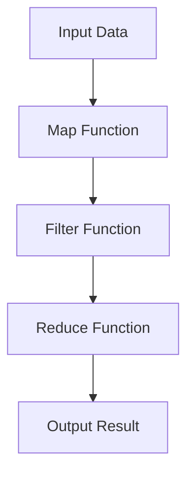

## 16.1 Training Programs for Clojure

Transitioning from Java's Object-Oriented Programming (OOP) paradigm to Clojure's functional programming approach can be a transformative journey for developers. To facilitate this transition, it's essential to design effective training programs that cater to the unique needs of experienced Java developers. In this section, we will explore how to create a comprehensive curriculum, leverage online resources, and conduct workshops to upskill your development team in Clojure.

### Designing Effective Training Curriculums

Creating a training curriculum that resonates with Java developers requires an understanding of their existing knowledge base and the new concepts they need to grasp. Here are some key components to consider:

#### 1. **Introduction to Functional Programming**

Begin by introducing the core principles of functional programming, emphasizing the differences from OOP. Highlight concepts such as immutability, first-class functions, and pure functions.

- **Immutability**: Explain how immutable data structures in Clojure differ from Java's mutable objects. Use examples to demonstrate the benefits of immutability in concurrent programming.

- **First-Class Functions**: Illustrate how functions are treated as first-class citizens in Clojure, allowing them to be passed as arguments, returned from other functions, and stored in data structures.

- **Pure Functions**: Define pure functions and their role in functional programming. Contrast with Java methods that often have side effects.

#### 2. **Clojure Syntax and Basics**

Introduce the syntax and basic constructs of Clojure, drawing parallels with Java where applicable.

- **Data Types and Structures**: Compare Clojure's data types (lists, vectors, maps, and sets) with Java's collections framework. Provide examples of how to create and manipulate these structures in Clojure.

```clojure
;; Clojure example: Creating a vector
(def my-vector [1 2 3 4])

;; Java equivalent: Creating an ArrayList
List<Integer> myList = Arrays.asList(1, 2, 3, 4);
```

- **Variables and State Management**: Discuss how Clojure handles state with atoms, refs, and agents, contrasting with Java's variable assignments.

```clojure
;; Clojure example: Using an atom for state management
(def counter (atom 0))
(swap! counter inc)

;; Java equivalent: Using a simple integer variable
int counter = 0;
counter++;
```

#### 3. **Higher-Order Functions and Functional Composition**

Delve into higher-order functions and how they enable powerful abstractions in Clojure.

- **Map, Filter, and Reduce**: Demonstrate the use of these functions to process collections, comparing with Java's Stream API.

```clojure
;; Clojure example: Using map to increment each element
(map inc [1 2 3 4])

// Java equivalent: Using Stream API to increment each element
List<Integer> incremented = myList.stream().map(x -> x + 1).collect(Collectors.toList());
```

- **Function Composition**: Explain how to compose functions in Clojure to build complex operations from simpler ones.

```clojure
;; Clojure example: Composing functions
(def add-and-double (comp #(* 2 %) #(+ 3 %)))
(add-and-double 5) ;; => 16
```

#### 4. **Concurrency Models**

Introduce Clojure's concurrency models and how they differ from Java's threading model.

- **Atoms, Refs, and Agents**: Explain the use cases for each concurrency primitive and provide examples.

```clojure
;; Clojure example: Using an agent for asynchronous updates
(def my-agent (agent 0))
(send my-agent inc)
```

- **Software Transactional Memory (STM)**: Describe STM and its advantages over traditional locking mechanisms.

#### 5. **Interoperability with Java**

Highlight how Clojure can seamlessly interoperate with existing Java code, making it easier to integrate into Java-based systems.

- **Calling Java from Clojure**: Provide examples of invoking Java methods and using Java libraries within Clojure code.

```clojure
;; Clojure example: Calling a Java method
(.toUpperCase "hello")
```

- **Embedding Clojure in Java Applications**: Discuss strategies for embedding Clojure code in Java applications to leverage Clojure's features.

### Leveraging Online Resources and Workshops

To supplement the training curriculum, leverage a variety of online resources and conduct interactive workshops.

#### 1. **Online Courses and Tutorials**

Recommend online platforms that offer Clojure courses tailored for Java developers. Some popular options include:

- **ClojureBridge**: Offers free workshops and resources for learning Clojure.
- **Coursera and Udemy**: Provide comprehensive courses on Clojure and functional programming.
- **ClojureDocs**: A valuable resource for exploring Clojure functions and their usage.

#### 2. **Interactive Workshops**

Conduct workshops that provide hands-on experience with Clojure. These can be structured as follows:

- **Code Labs**: Organize sessions where developers can work on real-world problems using Clojure. Encourage pair programming to foster collaboration and knowledge sharing.

- **Hackathons**: Host hackathons focused on building small projects in Clojure, allowing developers to apply their skills in a competitive yet supportive environment.

- **Guest Lectures**: Invite experienced Clojure developers to share their insights and experiences, providing valuable perspectives on functional programming.

#### 3. **Community Engagement**

Encourage participation in the Clojure community to stay updated with the latest developments and best practices.

- **Meetups and Conferences**: Attend local Clojure meetups and conferences to network with other developers and learn from industry experts.

- **Online Forums and Groups**: Join online forums such as the Clojure subreddit or the Clojure Google Group to engage in discussions and seek advice.

### Try It Yourself Section

Encourage experimentation by suggesting modifications to the code examples provided. For instance, try using different data structures or functions to achieve similar results. This hands-on approach will reinforce learning and build confidence in using Clojure.

### Visual Aids

To enhance understanding, incorporate diagrams that illustrate key concepts such as function composition, concurrency models, and data flow in higher-order functions.



*Diagram: Data flow through higher-order functions in Clojure.*

### References and Links

For further reading and exploration, consider the following resources:

- [Official Clojure Documentation](https://clojure.org/)
- [ClojureDocs](https://clojuredocs.org/)
- [ClojureBridge](https://clojurebridge.org/)

### Knowledge Check

To reinforce learning, pose questions or small challenges throughout the text. For example:

- What are the benefits of using immutable data structures in Clojure?
- How does function composition in Clojure differ from method chaining in Java?

### Summary

In summary, designing effective training programs for Clojure involves a combination of structured curriculum, practical exercises, and community engagement. By leveraging online resources and conducting interactive workshops, you can equip your development team with the skills needed to successfully transition to Clojure's functional programming paradigm.

## **Quiz: Are You Ready to Migrate from Java to Clojure?**



### What is a key benefit of using immutable data structures in Clojure?

- [x] They simplify concurrent programming.
- [ ] They increase memory usage.
- [ ] They make code harder to read.
- [ ] They require more boilerplate code.

> **Explanation:** Immutable data structures simplify concurrent programming by eliminating the need for locks and reducing the risk of race conditions.

### How are functions treated in Clojure compared to Java?

- [x] Functions are first-class citizens in Clojure.
- [ ] Functions cannot be passed as arguments in Clojure.
- [ ] Functions are not reusable in Clojure.
- [ ] Functions are less important in Clojure.

> **Explanation:** In Clojure, functions are first-class citizens, meaning they can be passed as arguments, returned from other functions, and stored in data structures.

### What is the purpose of using higher-order functions like map, filter, and reduce?

- [x] To process collections in a functional style.
- [ ] To increase code complexity.
- [ ] To replace all loops in the code.
- [ ] To make code less readable.

> **Explanation:** Higher-order functions like map, filter, and reduce are used to process collections in a functional style, promoting code reusability and clarity.

### What is a common use case for Clojure's Software Transactional Memory (STM)?

- [x] Managing shared state in concurrent applications.
- [ ] Increasing the speed of single-threaded applications.
- [ ] Simplifying I/O operations.
- [ ] Reducing memory usage.

> **Explanation:** Clojure's STM is used to manage shared state in concurrent applications, providing a safe and consistent way to handle state changes.

### How can Clojure interoperate with Java?

- [x] By calling Java methods from Clojure code.
- [ ] By rewriting all Java code in Clojure.
- [ ] By using Java classes as Clojure functions.
- [ ] By converting Clojure code to Java bytecode.

> **Explanation:** Clojure can interoperate with Java by calling Java methods directly from Clojure code, allowing seamless integration with existing Java systems.

### What is the role of atoms in Clojure?

- [x] To manage state changes in a thread-safe manner.
- [ ] To replace all variables in the code.
- [ ] To increase code complexity.
- [ ] To simplify I/O operations.

> **Explanation:** Atoms in Clojure are used to manage state changes in a thread-safe manner, providing a simple way to handle mutable state.

### What is an advantage of using function composition in Clojure?

- [x] It allows building complex operations from simpler ones.
- [ ] It increases code duplication.
- [ ] It makes code harder to understand.
- [ ] It requires more boilerplate code.

> **Explanation:** Function composition in Clojure allows developers to build complex operations from simpler ones, promoting code reusability and clarity.

### What is a benefit of attending Clojure meetups and conferences?

- [x] Networking with other developers and learning from industry experts.
- [ ] Increasing the complexity of your projects.
- [ ] Reducing the need for online resources.
- [ ] Avoiding hands-on practice.

> **Explanation:** Attending Clojure meetups and conferences provides opportunities to network with other developers and learn from industry experts, enhancing your understanding of Clojure.

### What is a common challenge when transitioning from Java to Clojure?

- [x] Adapting to the functional programming paradigm.
- [ ] Finding enough libraries for Clojure.
- [ ] Writing more boilerplate code.
- [ ] Managing memory manually.

> **Explanation:** A common challenge when transitioning from Java to Clojure is adapting to the functional programming paradigm, which requires a shift in mindset from OOP.

### True or False: Clojure's concurrency models eliminate the need for locks.

- [x] True
- [ ] False

> **Explanation:** Clojure's concurrency models, such as atoms, refs, and agents, provide mechanisms for managing state changes without the need for traditional locks, reducing the risk of race conditions.



By following this comprehensive guide, your team will be well-equipped to embrace Clojure's functional programming paradigm, enhancing your enterprise applications' scalability, maintainability, and productivity.
