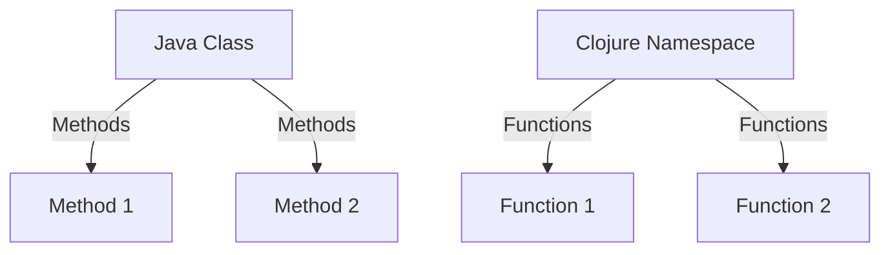

## 16.1 Training Programs for Clojure

Transitioning from Java's Object-Oriented Programming (OOP) paradigm to Clojure's functional programming model requires a strategic approach to training. This section will guide you through designing effective training programs that leverage online resources and workshops to upskill your development team. By the end of this chapter, you'll be equipped with the knowledge to create a comprehensive training curriculum that addresses the unique challenges and opportunities of adopting Clojure in an enterprise setting.

### Designing Effective Training Curriculums

#### Understanding the Learning Curve

Before diving into the specifics of training programs, it's crucial to acknowledge the learning curve associated with transitioning from Java to Clojure. Java developers are accustomed to OOP concepts such as classes, inheritance, and mutable state. In contrast, Clojure emphasizes immutability, first-class functions, and data-driven design. Understanding these differences is the first step in crafting a training curriculum that bridges the gap.

#### Key Components of a Training Curriculum

1. **Introduction to Functional Programming**: Start with the basics of functional programming, highlighting its advantages over OOP. Explain concepts like immutability, pure functions, and higher-order functions. Use examples to illustrate how these concepts lead to more predictable and maintainable code.

2. **Clojure Syntax and Semantics**: Provide a comprehensive overview of Clojure's syntax and semantics. Compare and contrast with Java to help developers draw parallels and understand the differences. Include code examples to demonstrate key features such as data structures, namespaces, and functions.

3. **Hands-On Coding Exercises**: Incorporate practical exercises that allow developers to apply what they've learned. Create tasks that require solving problems using Clojure's functional constructs. Encourage experimentation and exploration to deepen understanding.

4. **Real-World Application**: Showcase real-world examples of Clojure in action. Discuss case studies where enterprises have successfully transitioned to Clojure, highlighting the benefits and challenges encountered. This will provide context and motivation for the training.

5. **Advanced Topics**: Once the basics are covered, delve into advanced topics such as concurrency, macros, and interoperability with Java. These topics are crucial for leveraging Clojure's full potential in an enterprise environment.

6. **Assessment and Feedback**: Implement regular assessments to gauge understanding and provide feedback. Use quizzes, coding challenges, and peer reviews to reinforce learning and identify areas for improvement.

#### Structuring the Curriculum

A well-structured curriculum is essential for effective learning. Consider the following structure:

- **Week 1-2**: Introduction to Functional Programming and Clojure Basics
- **Week 3-4**: Intermediate Concepts and Hands-On Exercises
- **Week 5-6**: Real-World Applications and Advanced Topics
- **Week 7**: Assessment, Feedback, and Review

### Leveraging Online Resources and Workshops

#### Online Resources

The internet is a treasure trove of resources for learning Clojure. Here are some recommended online resources:

- **[Clojure Official Documentation](https://clojure.org/reference)**: The official documentation is a comprehensive resource for understanding Clojure's features and syntax. Encourage your team to refer to it regularly.

- **[Clojure Community Resources](https://clojure.org/community/resources)**: The Clojure community offers a wealth of resources, including tutorials, blogs, and forums. Engaging with the community can provide valuable insights and support.

- **[Transitioning from OOP to Functional Programming](https://www.lispcast.com/oo-to-fp/)**: This resource provides a detailed guide on transitioning from OOP to functional programming, with a focus on Clojure.

- **Online Courses and Tutorials**: Platforms like Coursera, Udemy, and Pluralsight offer courses on Clojure and functional programming. These courses often include video lectures, quizzes, and hands-on projects.

#### Workshops and Bootcamps

Workshops and bootcamps provide an immersive learning experience that can accelerate the transition to Clojure. Consider organizing or participating in the following:

- **In-House Workshops**: Conduct in-house workshops led by experienced Clojure developers. These workshops can be tailored to your team's specific needs and focus on practical applications.

- **External Bootcamps**: Enroll your team in external bootcamps that specialize in Clojure and functional programming. These bootcamps often provide intensive, hands-on training that can quickly build proficiency.

- **Hackathons and Coding Challenges**: Organize hackathons and coding challenges to encourage experimentation and collaboration. These events can foster a culture of learning and innovation within your team.

### Code Examples

Let's explore some code examples to illustrate key concepts in Clojure:

#### Example 1: Pure Functions and Immutability

```clojure
;; Define a pure function that adds two numbers
(defn add [a b]
  (+ a b))

;; Demonstrate immutability with a vector
(def numbers [1 2 3 4])

;; Use the conj function to add an element, returning a new vector
(def new-numbers (conj numbers 5))

;; Original vector remains unchanged
(println numbers)      ;; Output: [1 2 3 4]
(println new-numbers)  ;; Output: [1 2 3 4 5]
```

In this example, we define a pure function `add` that takes two arguments and returns their sum. We also demonstrate immutability by using the `conj` function to add an element to a vector, resulting in a new vector while leaving the original unchanged.

#### Example 2: Higher-Order Functions

```clojure
;; Define a higher-order function that applies a function to each element of a collection
(defn apply-to-all [f coll]
  (map f coll))

;; Use the apply-to-all function with an anonymous function
(def squared-numbers (apply-to-all #(Math/pow % 2) [1 2 3 4]))

(println squared-numbers)  ;; Output: (1.0 4.0 9.0 16.0)
```

Here, we define a higher-order function `apply-to-all` that takes a function `f` and a collection `coll`, applying `f` to each element of `coll`. We then use this function with an anonymous function to square each number in a list.

### Visual Aids

To enhance understanding, let's incorporate a diagram that compares Java classes with Clojure namespaces and functions.



**Diagram Description**: This diagram illustrates how Java classes, which contain methods, map to Clojure namespaces, which contain functions. This visual representation helps Java developers understand the structural differences between the two paradigms.

### References and Links

- [Clojure Official Documentation](https://clojure.org/reference)
- [Clojure Community Resources](https://clojure.org/community/resources)
- [Transitioning from OOP to Functional Programming](https://www.lispcast.com/oo-to-fp/)
- [Clojure STM Guide](https://clojure.org/reference/refs)

### Knowledge Check

To reinforce learning, let's pose some questions and challenges:

1. **What are the key differences between Java OOP and Clojure's functional programming model?**

2. **How does immutability in Clojure lead to more predictable code?**

3. **Try modifying the `apply-to-all` function to filter out even numbers from a list.**

4. **What are the benefits of using higher-order functions in Clojure?**

5. **Explain how Clojure's concurrency model differs from Java's.**

### Encouraging Engagement

Embracing functional programming can be challenging, but with each step, you'll gain a deeper understanding and see tangible benefits in your codebase. Encourage your team to experiment, ask questions, and share their insights. Building a supportive learning environment will foster growth and innovation.

### Best Practices for Tags

- "Clojure"
- "Java"
- "Functional Programming"
- "Training Programs"
- "Upskilling"
- "Workshops"
- "Online Resources"
- "Enterprise Migration"

### Quiz: Are You Ready to Migrate from Java to Clojure?



### What is a key advantage of functional programming over OOP?

- [x] Immutability leads to more predictable code
- [ ] Classes provide better encapsulation
- [ ] Inheritance simplifies code reuse
- [ ] Methods allow for stateful operations

> **Explanation:** Immutability in functional programming leads to more predictable and maintainable code, as it eliminates side effects.

### Which Clojure feature allows functions to be passed as arguments?

- [x] Higher-order functions
- [ ] Inheritance
- [ ] Interfaces
- [ ] Constructors

> **Explanation:** Higher-order functions in Clojure allow functions to be passed as arguments, enabling powerful abstractions.

### How does Clojure handle state management differently from Java?

- [x] Uses immutable data structures
- [ ] Relies on synchronized methods
- [ ] Utilizes class variables
- [ ] Depends on object references

> **Explanation:** Clojure uses immutable data structures to manage state, reducing the complexity of concurrent programming.

### What is the purpose of the `conj` function in Clojure?

- [x] To add an element to a collection
- [ ] To remove an element from a collection
- [ ] To sort a collection
- [ ] To filter a collection

> **Explanation:** The `conj` function in Clojure adds an element to a collection, returning a new collection.

### Which of the following is a higher-order function in Clojure?

- [x] `map`
- [ ] `println`
- [x] `filter`
- [ ] `defn`

> **Explanation:** Both `map` and `filter` are higher-order functions in Clojure, as they take functions as arguments.

### What is a namespace in Clojure?

- [x] A way to organize functions and variables
- [ ] A type of class
- [ ] A method for inheritance
- [ ] A data structure

> **Explanation:** A namespace in Clojure is a way to organize functions and variables, similar to packages in Java.

### How can developers transition from OOP to functional programming?

- [x] By understanding immutability and pure functions
- [ ] By focusing on class hierarchies
- [x] By using higher-order functions
- [ ] By relying on object-oriented design patterns

> **Explanation:** Transitioning to functional programming involves understanding immutability, pure functions, and higher-order functions.

### What is a common use case for macros in Clojure?

- [x] To create new syntactic constructs
- [ ] To define classes
- [ ] To manage state
- [ ] To handle exceptions

> **Explanation:** Macros in Clojure are used to create new syntactic constructs, enabling powerful code transformations.

### How does Clojure's concurrency model differ from Java's?

- [x] It uses software transactional memory
- [ ] It relies on synchronized blocks
- [ ] It depends on thread pools
- [ ] It uses volatile variables

> **Explanation:** Clojure's concurrency model uses software transactional memory, providing a more robust approach to managing state.

### True or False: Clojure functions can be defined within other functions.

- [x] True
- [ ] False

> **Explanation:** In Clojure, functions can be defined within other functions, allowing for encapsulation and modularity.



By following these guidelines and leveraging the resources provided, you can design a comprehensive training program that empowers your team to successfully transition from Java OOP to Clojure's functional programming paradigm.
