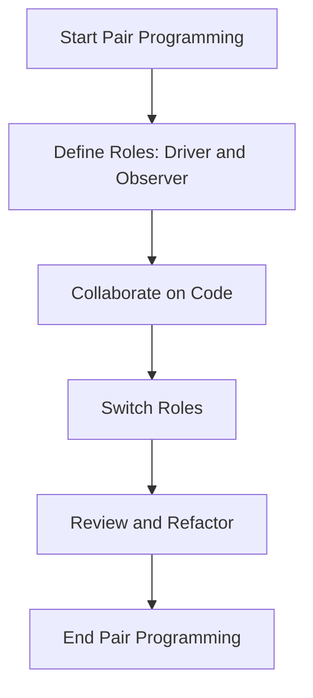
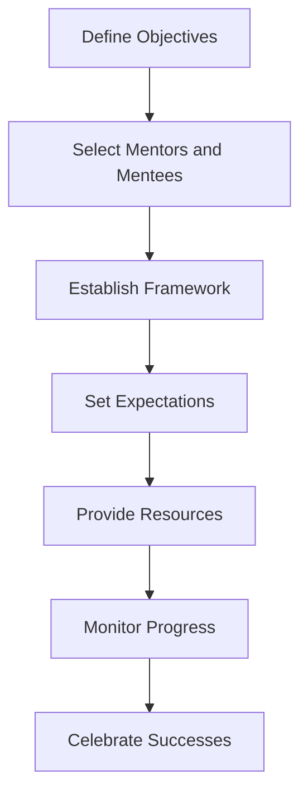

## 16.2 Pair Programming and Mentorship

Transitioning from Java's Object-Oriented Programming (OOP) to Clojure's functional programming paradigm can be a challenging yet rewarding journey. As experienced Java developers, you already possess a strong foundation in programming concepts, but embracing Clojure's unique features requires a shift in mindset and approach. In this section, we will explore how pair programming and mentorship can play pivotal roles in facilitating this transition, enhancing team collaboration, and fostering a culture of continuous learning.

### Encouraging Knowledge Sharing Within Teams

Knowledge sharing is a cornerstone of successful software development teams. It ensures that expertise is distributed across the team, reducing bottlenecks and enhancing problem-solving capabilities. Let's delve into how pair programming and mentorship can encourage knowledge sharing within your team.

#### Pair Programming: A Collaborative Approach

Pair programming is a practice where two developers work together at one workstation, collaboratively writing code. This approach not only enhances code quality but also serves as an effective method for knowledge transfer.

**Benefits of Pair Programming:**

1. **Enhanced Code Quality:** With two sets of eyes on the code, errors are caught early, and code quality improves.
2. **Knowledge Transfer:** Junior developers learn from seniors, and even experienced developers gain new insights from fresh perspectives.
3. **Improved Problem Solving:** Collaborative problem-solving leads to more innovative solutions.
4. **Increased Team Cohesion:** Working closely together fosters a sense of camaraderie and trust.

**Implementing Pair Programming:**

To successfully implement pair programming, consider the following strategies:

- **Rotate Pairs Regularly:** Ensure that team members work with different partners over time to maximize knowledge sharing.
- **Define Roles Clearly:** Typically, one developer acts as the "driver" (writing code) while the other is the "observer" (reviewing and suggesting improvements). Roles should switch frequently.
- **Create a Supportive Environment:** Encourage open communication and respect for each other's ideas.

**Java vs. Clojure Pair Programming:**

In Java, pair programming often focuses on class design, object interactions, and inheritance hierarchies. In Clojure, the focus shifts to functional composition, immutability, and data transformations. Let's compare a simple example in both languages to illustrate this shift.

**Java Example:**

```java
// Java: Calculating the sum of squares of even numbers
List<Integer> numbers = Arrays.asList(1, 2, 3, 4, 5, 6);
int sumOfSquares = numbers.stream()
    .filter(n -> n % 2 == 0)
    .map(n -> n * n)
    .reduce(0, Integer::sum);
System.out.println(sumOfSquares); // Output: 56
```

**Clojure Example:**

```clojure
;; Clojure: Calculating the sum of squares of even numbers
(def numbers [1 2 3 4 5 6])
(def sum-of-squares (->> numbers
                         (filter even?)
                         (map #(* % %))
                         (reduce +)))
(println sum-of-squares) ;; Output: 56
```

**Key Differences:**

- **Functional Composition:** Clojure uses threading macros (`->>`) to compose functions, making the code more readable.
- **Immutability:** Clojure's data structures are immutable by default, reducing side effects and enhancing reliability.

**Try It Yourself:**

Experiment with modifying the above examples to calculate the sum of cubes of odd numbers. Observe how the functional approach in Clojure simplifies the transformation.

#### Mentorship: Guiding the Transition

Mentorship is a powerful tool for guiding developers through the transition from Java to Clojure. A structured mentorship program can accelerate learning and build confidence in using Clojure's functional programming features.

**Benefits of Mentorship:**

1. **Personalized Learning:** Mentees receive tailored guidance based on their individual learning needs.
2. **Skill Development:** Mentors help mentees develop both technical and soft skills.
3. **Career Growth:** Mentorship supports career advancement by providing insights into industry best practices.

**Implementing Mentorship Programs:**

To establish an effective mentorship program, consider the following steps:

- **Identify Mentors and Mentees:** Select experienced Clojure developers as mentors and pair them with Java developers transitioning to Clojure.
- **Set Clear Goals:** Define specific learning objectives and milestones for the mentorship relationship.
- **Encourage Regular Meetings:** Schedule regular check-ins to discuss progress, challenges, and next steps.
- **Provide Resources:** Offer access to learning materials, such as books, online courses, and workshops.

**Mentorship in Action:**

Let's consider a scenario where a Java developer is learning to use Clojure's concurrency models. The mentor can guide the mentee through understanding atoms, refs, and agents, comparing them to Java's concurrency mechanisms.

**Java Concurrency Example:**

```java
// Java: Using synchronized blocks for thread-safe operations
public class Counter {
    private int count = 0;

    public synchronized void increment() {
        count++;
    }

    public synchronized int getCount() {
        return count;
    }
}
```

**Clojure Concurrency Example:**

```clojure
;; Clojure: Using atoms for thread-safe operations
(def counter (atom 0))

(defn increment-counter []
  (swap! counter inc))

(defn get-counter []
  @counter)
```

**Key Differences:**

- **Simplicity:** Clojure's `atom` provides a simple and elegant way to manage state changes safely.
- **Immutability:** The use of immutable data structures in Clojure reduces the complexity of concurrent programming.

**Try It Yourself:**

Modify the Clojure example to use `refs` and `dosync` for managing multiple state changes atomically. Compare this with Java's `ReentrantLock`.

### Implementing Mentorship Programs

Mentorship programs are essential for fostering a culture of continuous learning and development. Let's explore how to implement effective mentorship programs within your organization.

#### Steps to Implement Mentorship Programs

1. **Define Objectives:** Clearly outline the goals of the mentorship program, such as enhancing Clojure proficiency, improving problem-solving skills, or preparing for leadership roles.

2. **Select Mentors and Mentees:** Choose mentors who are not only technically proficient in Clojure but also possess strong communication and interpersonal skills. Pair them with mentees based on their learning needs and career aspirations.

3. **Establish a Framework:** Create a structured framework for the mentorship program, including guidelines for meetings, communication, and feedback.

4. **Set Expectations:** Clearly communicate the roles and responsibilities of both mentors and mentees. Encourage open and honest communication to build trust and rapport.

5. **Provide Resources:** Offer access to learning materials, such as books, online courses, and workshops. Encourage mentors to share their personal experiences and insights.

6. **Monitor Progress:** Regularly assess the progress of the mentorship relationship and provide feedback to both mentors and mentees. Adjust the program as needed to ensure its effectiveness.

7. **Celebrate Successes:** Recognize and celebrate the achievements of both mentors and mentees. This not only boosts morale but also reinforces the value of the mentorship program.

#### Mentorship Program Case Study

Let's examine a case study of a successful mentorship program implemented at a fictional company, TechCorp, during their transition from Java to Clojure.

**Background:**

TechCorp, a leading software development company, decided to migrate their enterprise applications from Java to Clojure to leverage the benefits of functional programming. To facilitate this transition, they implemented a mentorship program to upskill their development teams.

**Mentorship Program Structure:**

- **Mentor Selection:** TechCorp selected experienced Clojure developers as mentors, focusing on those who had successfully transitioned from Java themselves.
- **Mentee Pairing:** Mentees were paired with mentors based on their specific learning needs and career goals.
- **Regular Check-Ins:** Mentors and mentees met weekly to discuss progress, challenges, and next steps.
- **Resource Sharing:** Mentors provided access to learning materials, such as Clojure books, online courses, and workshops.
- **Feedback and Evaluation:** The program included regular feedback sessions to assess progress and make necessary adjustments.

**Outcomes:**

- **Increased Clojure Proficiency:** Mentees reported significant improvements in their understanding and application of Clojure's functional programming features.
- **Enhanced Team Collaboration:** The mentorship program fostered a culture of collaboration and knowledge sharing within the development teams.
- **Successful Migration:** TechCorp successfully migrated their enterprise applications to Clojure, achieving improved scalability, maintainability, and productivity.

### Visual Aids: Understanding Pair Programming and Mentorship

To enhance your understanding of pair programming and mentorship, let's explore some visual aids that illustrate these concepts.

#### Pair Programming Flowchart



**Description:** This flowchart illustrates the typical flow of a pair programming session, highlighting the roles of the driver and observer, collaboration on code, and the importance of reviewing and refactoring.

#### Mentorship Program Structure



**Description:** This diagram outlines the key steps in implementing a mentorship program, from defining objectives to celebrating successes.

### References and Links

For further reading on pair programming and mentorship, consider the following resources:

- [Official Clojure Documentation](https://clojure.org/)
- [ClojureDocs](https://clojuredocs.org/)
- [Pair Programming: A Guide](https://www.agilealliance.org/glossary/pairing/)
- [Mentorship in Software Development](https://www.pluralsight.com/blog/software-development/mentorship-in-software-development)

### Knowledge Check

To reinforce your understanding of pair programming and mentorship, consider the following questions and exercises:

1. **What are the key benefits of pair programming in the context of transitioning from Java to Clojure?**
2. **How does mentorship support the learning and development of Clojure skills?**
3. **Experiment with modifying the Java and Clojure code examples provided. What differences do you observe in terms of readability and simplicity?**
4. **Create a plan for implementing a mentorship program within your organization. What steps will you take to ensure its success?**

### Encouraging Tone

Now that we've explored how pair programming and mentorship can facilitate the transition from Java to Clojure, let's apply these concepts to enhance collaboration and knowledge sharing within your development teams. Embrace the power of collaboration and mentorship to build a culture of continuous learning and innovation.

### Quiz: Are You Ready to Migrate from Java to Clojure?



### What is the primary role of the "driver" in pair programming?

- [x] Writing code
- [ ] Reviewing code
- [ ] Testing code
- [ ] Documenting code

> **Explanation:** In pair programming, the "driver" is responsible for writing code while the "observer" reviews and suggests improvements.

### How does Clojure's `atom` differ from Java's `synchronized` keyword?

- [x] Provides a simpler way to manage state changes
- [ ] Requires more boilerplate code
- [ ] Is less efficient for concurrency
- [ ] Does not support immutability

> **Explanation:** Clojure's `atom` provides a simpler and more elegant way to manage state changes safely, leveraging immutability.

### What is a key benefit of mentorship in the context of transitioning to Clojure?

- [x] Personalized learning
- [ ] Increased project deadlines
- [ ] Reduced team collaboration
- [ ] Decreased code quality

> **Explanation:** Mentorship offers personalized learning, helping developers transition to Clojure by providing tailored guidance.

### Which of the following is a step in implementing a mentorship program?

- [x] Define objectives
- [ ] Increase workload
- [ ] Limit communication
- [ ] Reduce resources

> **Explanation:** Defining objectives is a crucial step in implementing a successful mentorship program.

### What is the benefit of rotating pairs regularly in pair programming?

- [x] Maximizes knowledge sharing
- [ ] Reduces code quality
- [ ] Increases project costs
- [ ] Limits team collaboration

> **Explanation:** Rotating pairs regularly maximizes knowledge sharing by allowing team members to work with different partners.

### How does Clojure's functional composition differ from Java's approach?

- [x] Uses threading macros for readability
- [ ] Relies on inheritance hierarchies
- [ ] Requires more boilerplate code
- [ ] Is less efficient for data transformations

> **Explanation:** Clojure uses threading macros for functional composition, enhancing readability and simplifying data transformations.

### What is a key outcome of a successful mentorship program?

- [x] Increased Clojure proficiency
- [ ] Decreased team collaboration
- [ ] Reduced learning opportunities
- [ ] Limited career growth

> **Explanation:** A successful mentorship program leads to increased Clojure proficiency and enhanced team collaboration.

### Which of the following is NOT a benefit of pair programming?

- [ ] Enhanced code quality
- [x] Increased project deadlines
- [ ] Improved problem solving
- [ ] Knowledge transfer

> **Explanation:** Pair programming enhances code quality, improves problem-solving, and facilitates knowledge transfer, but does not increase project deadlines.

### What is the role of the "observer" in pair programming?

- [ ] Writing code
- [x] Reviewing code
- [ ] Testing code
- [ ] Documenting code

> **Explanation:** In pair programming, the "observer" reviews the code written by the "driver" and suggests improvements.

### True or False: Mentorship programs should only focus on technical skills.

- [ ] True
- [x] False

> **Explanation:** Mentorship programs should focus on both technical and soft skills to support comprehensive development.


