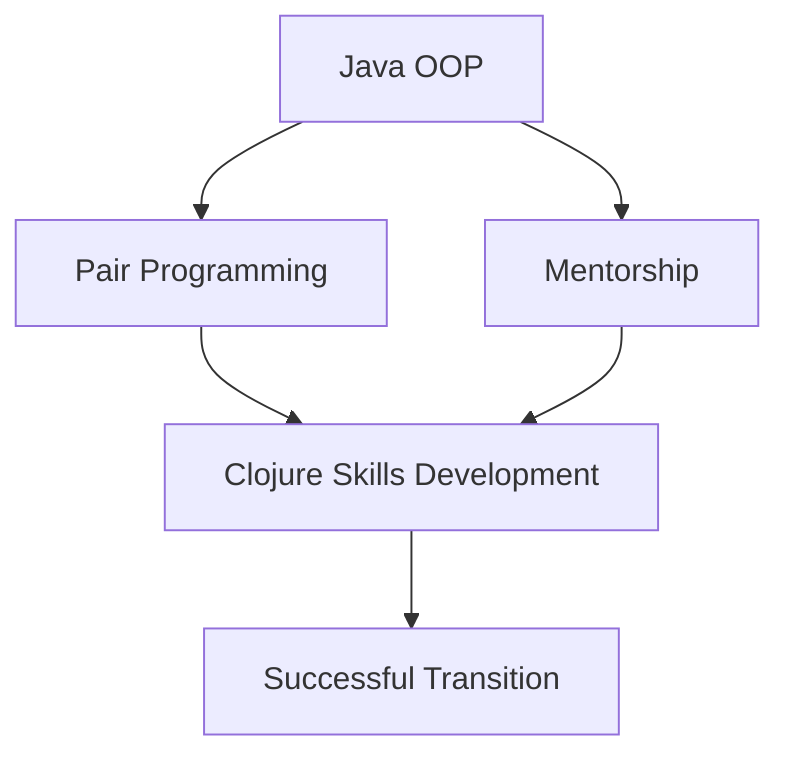

## 16.2 Pair Programming and Mentorship

Transitioning from Java Object-Oriented Programming (OOP) to Clojure's functional programming paradigm presents a unique set of challenges and opportunities for development teams. As organizations embark on this journey, fostering a culture of collaboration and continuous learning becomes paramount. In this section, we will delve into the practices of pair programming and mentorship, exploring how they can be leveraged to facilitate knowledge sharing, skill development, and a smoother transition to Clojure.

### The Role of Pair Programming in Transition

Pair programming is a collaborative programming technique where two developers work together at one workstation. One developer, the "driver," writes the code, while the other, the "observer" or "navigator," reviews each line of code as it is typed. The two programmers switch roles frequently, ensuring active participation and engagement.

#### Benefits of Pair Programming

1. **Enhanced Code Quality**: With two sets of eyes on the code, errors and bugs are more likely to be caught early, leading to higher quality code.
2. **Knowledge Sharing**: Pair programming facilitates the transfer of knowledge between team members, allowing less experienced developers to learn from their peers.
3. **Improved Problem Solving**: Collaboration often leads to more creative and effective solutions, as developers can brainstorm and discuss different approaches in real-time.
4. **Increased Team Cohesion**: Working closely with a partner fosters a sense of camaraderie and trust, strengthening team dynamics.

#### Implementing Pair Programming

To successfully implement pair programming in your organization, consider the following steps:

- **Set Clear Objectives**: Define the goals of pair programming sessions, such as learning new Clojure concepts or refactoring Java code.
- **Choose the Right Pairs**: Pair developers with complementary skills and experience levels to maximize learning opportunities.
- **Create a Supportive Environment**: Encourage open communication and provide a safe space for developers to ask questions and make mistakes.
- **Rotate Pairs Regularly**: Regularly changing pairs ensures that knowledge is distributed evenly across the team and prevents silos.

#### Pair Programming in Practice: A Clojure Example

Let's explore a simple example of pair programming in the context of migrating a Java OOP concept to Clojure. Suppose we have a Java class representing a bank account:

```java
public class BankAccount {
    private double balance;

    public BankAccount(double initialBalance) {
        this.balance = initialBalance;
    }

    public void deposit(double amount) {
        balance += amount;
    }

    public void withdraw(double amount) {
        if (amount <= balance) {
            balance -= amount;
        } else {
            throw new IllegalArgumentException("Insufficient funds");
        }
    }

    public double getBalance() {
        return balance;
    }
}
```

In Clojure, we can represent the same concept using immutable data structures and functions:

```clojure
(defn create-account [initial-balance]
  {:balance initial-balance})

(defn deposit [account amount]
  (update account :balance + amount))

(defn withdraw [account amount]
  (if (>= (:balance account) amount)
    (update account :balance - amount)
    (throw (IllegalArgumentException. "Insufficient funds"))))

(defn get-balance [account]
  (:balance account))

;; Example usage
(let [account (create-account 100.0)]
  (-> account
      (deposit 50.0)
      (withdraw 30.0)
      get-balance))
```

In a pair programming session, one developer might focus on translating the Java class into a Clojure map, while the other ensures that the functions maintain immutability and handle errors appropriately.

### Mentorship: Building a Culture of Learning

Mentorship is a powerful tool for fostering a culture of learning and growth within a development team. By pairing less experienced developers with seasoned mentors, organizations can accelerate the learning curve and ensure a successful transition to Clojure.

#### Benefits of Mentorship

1. **Accelerated Learning**: Mentees gain access to the mentor's wealth of experience and knowledge, allowing them to learn more quickly and effectively.
2. **Personalized Guidance**: Mentors can provide tailored advice and feedback, helping mentees overcome specific challenges and develop their skills.
3. **Increased Confidence**: With the support of a mentor, mentees are more likely to take on new challenges and push their boundaries.
4. **Retention and Engagement**: Mentorship programs can increase job satisfaction and retention by providing employees with opportunities for growth and development.

#### Implementing a Mentorship Program

To establish a successful mentorship program, consider the following steps:

- **Define Clear Objectives**: Set specific goals for the mentorship program, such as improving Clojure proficiency or fostering leadership skills.
- **Select and Train Mentors**: Choose mentors who are not only technically proficient but also possess strong communication and interpersonal skills. Provide training to help them succeed in their roles.
- **Match Mentors and Mentees**: Pair mentors and mentees based on their skills, interests, and career goals to ensure a productive relationship.
- **Monitor and Evaluate**: Regularly assess the progress of mentorship relationships and make adjustments as needed to ensure the program's success.

#### Mentorship in Action: A Case Study

Consider a scenario where a team is transitioning from Java to Clojure. A senior developer with extensive experience in functional programming is paired with a junior developer new to Clojure. Through regular mentorship sessions, the senior developer provides guidance on functional programming concepts, code reviews, and best practices.

Over time, the junior developer gains confidence and proficiency in Clojure, contributing to the team's success in migrating a critical application. The mentorship relationship not only accelerates the junior developer's learning but also strengthens the team's overall capabilities.

### Integrating Pair Programming and Mentorship

Pair programming and mentorship are complementary practices that can be integrated to maximize their benefits. By combining these approaches, organizations can create a supportive environment that encourages continuous learning and collaboration.

#### Strategies for Integration

- **Pair Mentors and Mentees**: Encourage mentors and mentees to engage in pair programming sessions, allowing mentees to learn by doing and receive immediate feedback.
- **Facilitate Knowledge Sharing**: Use pair programming sessions to share insights and best practices across the team, with mentors guiding discussions and providing context.
- **Promote a Growth Mindset**: Foster a culture that values learning and experimentation, encouraging team members to embrace new challenges and learn from their experiences.

### Visualizing the Transition: A Diagram

To better understand how pair programming and mentorship can facilitate the transition from Java OOP to Clojure, consider the following diagram:



**Diagram Description**: This flowchart illustrates the role of pair programming and mentorship in developing Clojure skills and achieving a successful transition from Java OOP.

### Encouraging Engagement and Overcoming Challenges

Transitioning to a new programming paradigm can be daunting, but with the right support and encouragement, teams can thrive. Here are some tips for fostering engagement and overcoming challenges:

- **Celebrate Successes**: Recognize and celebrate milestones and achievements, reinforcing the value of the transition.
- **Address Resistance**: Acknowledge and address any resistance to change, providing support and resources to help team members adapt.
- **Encourage Experimentation**: Create an environment where team members feel comfortable experimenting with new ideas and approaches.

### Knowledge Check

To reinforce the concepts covered in this section, consider the following questions and exercises:

1. **What are the key benefits of pair programming in the context of transitioning to Clojure?**
2. **How can mentorship programs accelerate the learning curve for developers new to Clojure?**
3. **Describe a scenario where pair programming and mentorship could be integrated to enhance team collaboration.**
4. **What strategies can be used to overcome resistance to change during a programming paradigm shift?**

### Conclusion

Pair programming and mentorship are invaluable tools for organizations transitioning from Java OOP to Clojure. By fostering a culture of collaboration and continuous learning, these practices can enhance team capabilities, accelerate skill development, and ensure a successful migration. Embrace these strategies to empower your team and unlock the full potential of Clojure's functional programming paradigm.

## **Quiz: Are You Ready to Migrate from Java to Clojure?**



### What is one of the primary benefits of pair programming?

- [x] Enhanced code quality
- [ ] Faster individual coding speed
- [ ] Reduced need for documentation
- [ ] Increased hardware requirements

> **Explanation:** Pair programming enhances code quality by having two developers review and write code together, catching errors early.

### How does mentorship benefit a development team during a transition?

- [x] Accelerated learning
- [ ] Reduced need for training
- [ ] Increased hardware requirements
- [ ] Decreased team communication

> **Explanation:** Mentorship accelerates learning by providing personalized guidance and support, helping team members adapt to new technologies.

### What is a key strategy for implementing pair programming?

- [x] Rotate pairs regularly
- [ ] Assign permanent pairs
- [ ] Limit communication between pairs
- [ ] Focus on individual tasks

> **Explanation:** Rotating pairs regularly ensures knowledge is shared across the team and prevents silos.

### How can mentorship programs be evaluated for success?

- [x] Monitor and evaluate progress
- [ ] Limit feedback from participants
- [ ] Focus solely on technical skills
- [ ] Avoid setting objectives

> **Explanation:** Regular monitoring and evaluation help ensure mentorship programs meet their objectives and provide value.

### What is a common challenge when transitioning to a new programming paradigm?

- [x] Resistance to change
- [ ] Increased hardware costs
- [ ] Decreased need for training
- [ ] Reduced team size

> **Explanation:** Resistance to change is a common challenge, as team members may be hesitant to adopt new practices and technologies.

### How can pair programming and mentorship be integrated effectively?

- [x] Pair mentors and mentees
- [ ] Limit collaboration
- [ ] Focus on individual tasks
- [ ] Avoid knowledge sharing

> **Explanation:** Pairing mentors and mentees in programming sessions allows for real-time learning and feedback.

### What mindset should be promoted during a transition to Clojure?

- [x] Growth mindset
- [ ] Fixed mindset
- [ ] Competitive mindset
- [ ] Isolated mindset

> **Explanation:** A growth mindset encourages learning and adaptation, which is crucial during a transition to a new programming paradigm.

### What is a benefit of celebrating successes during a transition?

- [x] Reinforces the value of the transition
- [ ] Increases resistance to change
- [ ] Reduces team morale
- [ ] Limits team communication

> **Explanation:** Celebrating successes reinforces the value of the transition and boosts team morale.

### How can resistance to change be addressed?

- [x] Provide support and resources
- [ ] Ignore concerns
- [ ] Limit communication
- [ ] Focus solely on technical skills

> **Explanation:** Providing support and resources helps team members adapt and overcome resistance to change.

### True or False: Pair programming is only beneficial for junior developers.

- [ ] True
- [x] False

> **Explanation:** Pair programming benefits developers of all experience levels by enhancing collaboration, knowledge sharing, and code quality.


