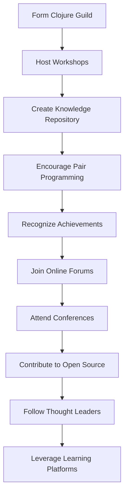

## 16.3 Building a Clojure Community: Fostering Collaboration and Support

Transitioning from Java Object-Oriented Programming (OOP) to Clojure's functional programming paradigm is not just a technical shift; it is a cultural transformation that requires a supportive community. Building a Clojure community within your organization and participating in external Clojure communities can significantly enhance collaboration, support, and innovation. In this section, we will explore strategies for fostering a vibrant Clojure community, drawing parallels with Java communities, and leveraging external resources to maximize your team's potential.

### The Importance of Community in the Transition

Communities play a crucial role in the successful adoption of new technologies. They provide a platform for sharing knowledge, solving problems collaboratively, and fostering a sense of belonging among developers. For Java developers transitioning to Clojure, a strong community can ease the learning curve, provide mentorship opportunities, and encourage the exchange of best practices.

#### Key Benefits of Building a Clojure Community

- **Knowledge Sharing**: Facilitates the exchange of ideas, solutions, and experiences.
- **Support Network**: Offers a safety net for developers facing challenges.
- **Innovation and Experimentation**: Encourages trying new approaches and technologies.
- **Cultural Shift**: Helps in embracing the functional programming mindset.
- **Skill Development**: Provides opportunities for continuous learning and growth.

### Building an Internal Clojure Community

Creating an internal Clojure community involves fostering an environment where developers feel encouraged to learn, share, and collaborate. Here are some strategies to build a thriving Clojure community within your organization:

#### 1. Establish a Clojure Guild or Interest Group

Form a dedicated group of developers interested in Clojure. This group can meet regularly to discuss topics, share experiences, and work on Clojure projects. Encourage participation from all levels of experience to ensure diverse perspectives.

#### 2. Host Regular Clojure Workshops and Hackathons

Organize workshops and hackathons to provide hands-on experience with Clojure. These events can focus on specific topics, such as functional programming concepts, concurrency models, or Clojure tooling. Hackathons can also be a great way to tackle real-world problems using Clojure.

#### 3. Create a Knowledge Repository

Develop a centralized repository of Clojure resources, including tutorials, code samples, and documentation. This repository can serve as a go-to resource for developers seeking information or inspiration.

#### 4. Encourage Pair Programming and Code Reviews

Promote pair programming and code reviews to facilitate knowledge transfer and improve code quality. Pair programming allows developers to learn from each other, while code reviews provide an opportunity for constructive feedback and discussion.

#### 5. Recognize and Celebrate Achievements

Acknowledge and celebrate the achievements of community members. This recognition can be in the form of awards, shout-outs in meetings, or showcasing successful projects. Celebrating achievements boosts morale and encourages continued participation.

### Participation in External Clojure Communities

Engaging with external Clojure communities can provide additional support, resources, and networking opportunities. Here are some ways to participate in the broader Clojure community:

#### 1. Join Online Forums and Discussion Groups

Participate in online forums and discussion groups, such as the Clojure Google Group, Reddit's Clojure subreddit, and the Clojure Slack channel. These platforms offer a wealth of knowledge and a space to ask questions and share insights.

#### 2. Attend Clojure Conferences and Meetups

Attend Clojure conferences and meetups to connect with other Clojure enthusiasts and learn from industry experts. Events like Clojure/conj and EuroClojure provide opportunities to hear about the latest developments and best practices in the Clojure ecosystem.

#### 3. Contribute to Open Source Projects

Contributing to open source Clojure projects is an excellent way to gain experience, improve your skills, and give back to the community. Look for projects that align with your interests and expertise, and start by tackling small issues or documentation improvements.

#### 4. Follow Clojure Thought Leaders

Follow Clojure thought leaders on social media and subscribe to their blogs or newsletters. Thought leaders often share valuable insights, tutorials, and updates on the latest trends in the Clojure world.

#### 5. Leverage Clojure Learning Platforms

Utilize Clojure learning platforms, such as ClojureBridge and 4Clojure, to enhance your skills and connect with other learners. These platforms offer tutorials, exercises, and challenges to help you deepen your understanding of Clojure.

### Code Examples: Building a Simple Clojure Community App

To illustrate the concepts discussed, let's build a simple Clojure application that simulates a community forum. This app will allow users to post messages and reply to existing threads. We'll compare this with a similar Java implementation to highlight the differences.

#### Java Implementation

```java
import java.util.ArrayList;
import java.util.List;

class Post {
    private String content;
    private List<Post> replies;

    public Post(String content) {
        this.content = content;
        this.replies = new ArrayList<>();
    }

    public void addReply(Post reply) {
        replies.add(reply);
    }

    public String getContent() {
        return content;
    }

    public List<Post> getReplies() {
        return replies;
    }
}

public class CommunityForum {
    private List<Post> posts;

    public CommunityForum() {
        this.posts = new ArrayList<>();
    }

    public void addPost(Post post) {
        posts.add(post);
    }

    public List<Post> getPosts() {
        return posts;
    }

    public static void main(String[] args) {
        CommunityForum forum = new CommunityForum();
        Post post1 = new Post("Welcome to the Clojure community!");
        Post reply1 = new Post("Thank you! Excited to be here.");
        post1.addReply(reply1);
        forum.addPost(post1);

        for (Post post : forum.getPosts()) {
            System.out.println("Post: " + post.getContent());
            for (Post reply : post.getReplies()) {
                System.out.println("  Reply: " + reply.getContent());
            }
        }
    }
}
```

#### Clojure Implementation

```clojure
(defn create-post [content]
  {:content content :replies []})

(defn add-reply [post reply]
  (update post :replies conj reply))

(defn create-forum []
  {:posts []})

(defn add-post [forum post]
  (update forum :posts conj post))

(defn display-forum [forum]
  (doseq [post (:posts forum)]
    (println "Post:" (:content post))
    (doseq [reply (:replies post)]
      (println "  Reply:" (:content reply)))))

(defn -main []
  (let [forum (create-forum)
        post1 (create-post "Welcome to the Clojure community!")
        reply1 (create-post "Thank you! Excited to be here.")
        post1 (add-reply post1 reply1)
        forum (add-post forum post1)]
    (display-forum forum)))
```

### Key Differences and Similarities

- **Data Structures**: In Java, we use classes and objects to represent posts and replies, while in Clojure, we use maps and vectors, emphasizing immutability.
- **State Management**: Clojure's functional approach uses pure functions to manage state, whereas Java relies on mutable objects.
- **Syntax**: Clojure's syntax is concise and expressive, focusing on data transformation, whereas Java's syntax is more verbose, focusing on object manipulation.

### Try It Yourself

Experiment with the Clojure code by adding new features, such as editing posts or implementing user authentication. This hands-on practice will deepen your understanding of Clojure's functional programming paradigm.

### Visual Aids: Clojure Community Building Flowchart



*Caption: Flowchart illustrating the steps to build a Clojure community.*

### References and Links

- [Official Clojure Documentation](https://clojure.org/)
- [ClojureDocs](https://clojuredocs.org/)
- [Clojure Google Group](https://groups.google.com/g/clojure)
- [Clojure Slack Channel](https://clojurians.slack.com/)
- [ClojureBridge](https://clojurebridge.org/)
- [4Clojure](https://www.4clojure.com/)

### Knowledge Check

- What are the key benefits of building a Clojure community within your organization?
- How can you participate in external Clojure communities?
- What are the main differences between Java and Clojure when implementing a community forum application?

### Exercises

1. Modify the Clojure community forum app to include user authentication.
2. Implement a feature to edit existing posts and replies in the Clojure app.
3. Create a new Clojure project that simulates a real-world problem your team faces and solve it using functional programming concepts.

### Summary

Building a Clojure community is essential for a successful transition from Java OOP to Clojure's functional programming paradigm. By fostering collaboration and support within your organization and participating in external communities, you can enhance your team's skills, encourage innovation, and embrace the cultural shift towards functional programming. Now that we've explored how to build a Clojure community, let's apply these strategies to create a supportive and thriving environment for your developers.

## **Quiz: Are You Ready to Build a Clojure Community?**



### What is a key benefit of building a Clojure community within your organization?

- [x] Knowledge Sharing
- [ ] Increased Costs
- [ ] Reduced Collaboration
- [ ] Decreased Innovation

> **Explanation:** Building a Clojure community facilitates knowledge sharing among developers.

### Which of the following is a strategy for building an internal Clojure community?

- [x] Host Regular Workshops
- [ ] Discourage Pair Programming
- [ ] Avoid Code Reviews
- [ ] Limit Knowledge Sharing

> **Explanation:** Hosting regular workshops provides hands-on experience and encourages learning.

### How can you participate in external Clojure communities?

- [x] Join Online Forums
- [ ] Avoid Conferences
- [ ] Ignore Open Source Projects
- [ ] Limit Networking

> **Explanation:** Joining online forums allows you to connect with other Clojure enthusiasts.

### What is a difference between Java and Clojure in implementing a community forum app?

- [x] Clojure uses maps and vectors, Java uses classes and objects
- [ ] Java uses maps and vectors, Clojure uses classes and objects
- [ ] Both use the same data structures
- [ ] Neither uses data structures

> **Explanation:** Clojure emphasizes immutability with maps and vectors, while Java uses classes and objects.

### What is an example of an external Clojure community platform?

- [x] Clojure Slack Channel
- [ ] Java User Group
- [ ] Python Meetup
- [ ] Ruby Forum

> **Explanation:** The Clojure Slack Channel is a platform for Clojure enthusiasts to connect.

### What is the purpose of a knowledge repository in a Clojure community?

- [x] Centralize Resources
- [ ] Increase Complexity
- [ ] Limit Access
- [ ] Discourage Learning

> **Explanation:** A knowledge repository centralizes resources for easy access and learning.

### How can you contribute to the Clojure community?

- [x] Contribute to Open Source Projects
- [ ] Avoid Sharing Code
- [ ] Limit Collaboration
- [ ] Discourage Innovation

> **Explanation:** Contributing to open source projects helps improve skills and gives back to the community.

### What is a benefit of attending Clojure conferences?

- [x] Networking Opportunities
- [ ] Increased Isolation
- [ ] Reduced Learning
- [ ] Limited Exposure

> **Explanation:** Attending conferences provides networking opportunities and exposure to new ideas.

### Why is recognizing achievements important in a Clojure community?

- [x] Boosts Morale
- [ ] Decreases Motivation
- [ ] Limits Participation
- [ ] Reduces Collaboration

> **Explanation:** Recognizing achievements boosts morale and encourages continued participation.

### True or False: Building a Clojure community can help ease the transition from Java OOP to Clojure.

- [x] True
- [ ] False

> **Explanation:** A strong community provides support and resources, easing the transition to Clojure.


