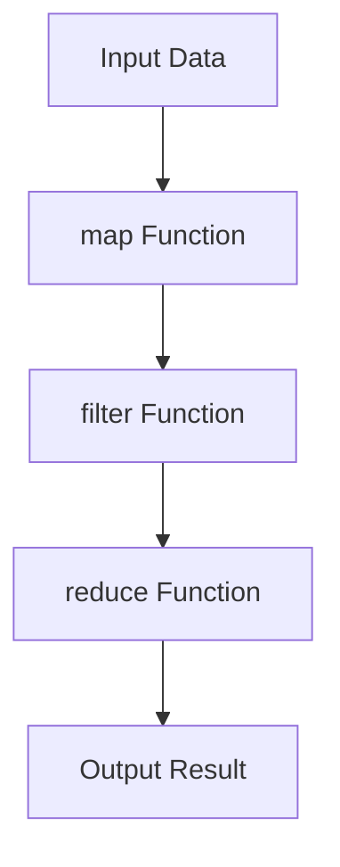
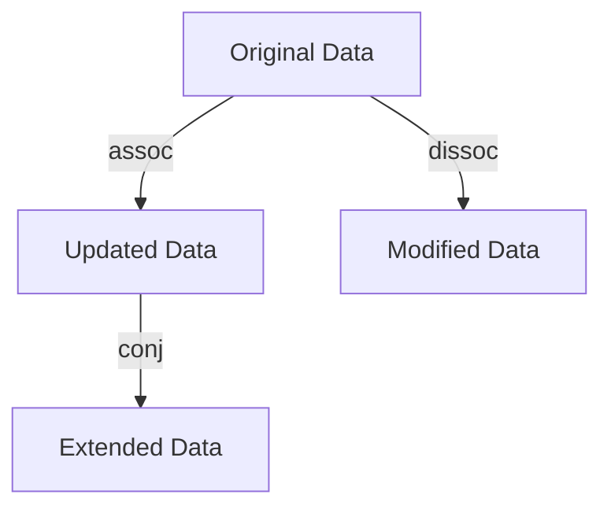

## 17.1 Agile Practices with Clojure

As enterprises transition from Java OOP to Clojure, integrating Agile methodologies such as Scrum and Kanban becomes crucial for maintaining productivity and ensuring successful project outcomes. Agile practices are inherently flexible and can be adapted to leverage the strengths of functional programming in Clojure. In this section, we will explore how to effectively integrate Clojure's functional programming paradigm into Agile practices, focusing on Scrum and Kanban methodologies.

### Understanding Agile Methodologies

Agile methodologies emphasize iterative development, collaboration, and adaptability. They are designed to accommodate change and deliver value incrementally. Let's briefly review the core principles of Scrum and Kanban before diving into their integration with Clojure.

#### Scrum Overview

Scrum is a framework that facilitates team collaboration on complex projects. It is structured around fixed-length iterations called sprints, typically lasting 2-4 weeks. Key roles in Scrum include the Product Owner, Scrum Master, and Development Team. The framework emphasizes:

- **Sprint Planning**: Defining the work to be completed in the upcoming sprint.
- **Daily Stand-ups**: Short meetings to synchronize team efforts and address obstacles.
- **Sprint Reviews**: Demonstrating completed work to stakeholders.
- **Retrospectives**: Reflecting on the sprint to identify improvements.

#### Kanban Overview

Kanban is a visual workflow management method that emphasizes continuous delivery without overburdening the team. It uses a Kanban board to visualize work items and their progress through various stages. Key principles include:

- **Visualizing Work**: Making work visible to improve communication and collaboration.
- **Limiting Work in Progress (WIP)**: Reducing multitasking and improving focus.
- **Managing Flow**: Ensuring smooth and efficient progress of work items.
- **Continuous Improvement**: Regularly optimizing processes and practices.

### Integrating Clojure into Agile Practices

Clojure's functional programming paradigm offers unique advantages that can enhance Agile practices. By leveraging immutability, higher-order functions, and concise syntax, teams can improve code quality, reduce bugs, and accelerate development cycles. Let's explore how to adapt Scrum and Kanban methodologies to incorporate Clojure effectively.

#### Adapting Scrum for Clojure Development

1. **Sprint Planning with Functional Decomposition**

   In Clojure, breaking down complex problems into smaller, reusable functions aligns well with the concept of functional decomposition. During sprint planning, encourage the team to identify tasks that can be modularized into pure functions. This approach not only simplifies code but also facilitates parallel development and testing.

   ```clojure
   ;; Example of functional decomposition in Clojure
   (defn calculate-discount [price discount-rate]
     (* price discount-rate))

   (defn apply-discount [price discount-rate]
     (- price (calculate-discount price discount-rate)))

   ;; Usage
   (apply-discount 100 0.1) ;; => 90.0
   ```

2. **Daily Stand-ups with Emphasis on Functional Challenges**

   During daily stand-ups, encourage team members to discuss challenges related to functional programming concepts, such as recursion or immutability. This practice fosters knowledge sharing and helps the team collectively overcome obstacles unique to Clojure development.

3. **Sprint Reviews with Functional Demonstrations**

   In sprint reviews, demonstrate the power of Clojure's functional features by showcasing how they solve specific problems or improve performance. Highlighting the benefits of immutability and higher-order functions can help stakeholders appreciate the value of the transition.

4. **Retrospectives Focused on Functional Improvements**

   Use retrospectives to reflect on how functional programming principles have impacted the sprint. Discuss what worked well and what could be improved, focusing on the integration of Clojure's features into the development process.

#### Adapting Kanban for Clojure Development

1. **Visualizing Functional Workflows**

   Use the Kanban board to visualize the flow of functional tasks, such as defining pure functions, composing higher-order functions, and managing state with immutable data structures. This visualization helps the team track progress and identify bottlenecks in the functional development process.

   ```mermaid
   graph TD;
       A[Backlog] --> B[Define Pure Functions];
       B --> C[Compose Higher-Order Functions];
       C --> D[Manage State with Immutability];
       D --> E[Testing & Deployment];
   ```

   *Diagram: Visualizing a functional workflow in Kanban.*

2. **Limiting WIP with Functional Focus**

   Limit work in progress by focusing on functional tasks that can be completed independently. Encourage the team to prioritize tasks that enhance code reusability and maintainability, such as refactoring existing code into pure functions.

3. **Managing Flow with Functional Iterations**

   Manage the flow of work by iterating on functional components. Encourage the team to continuously refine and optimize functions, leveraging Clojure's REPL (Read-Eval-Print Loop) for rapid feedback and experimentation.

4. **Continuous Improvement with Functional Metrics**

   Implement metrics to measure the impact of functional programming on code quality and team productivity. Use these metrics to drive continuous improvement initiatives, such as adopting new functional patterns or optimizing existing ones.

### Integrating Functional Programming into Agile Practices

Functional programming in Clojure offers several advantages that can enhance Agile practices:

- **Immutability**: Reduces side effects and simplifies reasoning about code, leading to fewer bugs and more reliable software.
- **Higher-Order Functions**: Enable code reuse and abstraction, reducing duplication and improving maintainability.
- **Concise Syntax**: Accelerates development by reducing boilerplate code and enhancing readability.

By integrating these principles into Agile practices, teams can achieve greater efficiency and deliver higher-quality software. Let's explore some specific strategies for integrating functional programming into Agile methodologies.

#### Leveraging Immutability in Agile Development

Immutability is a core concept in functional programming that can significantly enhance Agile development processes. By ensuring that data structures are immutable, teams can reduce the risk of unintended side effects and improve code reliability.

- **Immutable Data Structures**: Use Clojure's persistent data structures to manage state changes safely. These structures provide efficient updates without modifying the original data, enabling safe concurrent operations.

  ```clojure
  ;; Example of using immutable data structures in Clojure
  (def original-map {:a 1 :b 2})
  (def updated-map (assoc original-map :c 3))

  ;; original-map remains unchanged
  original-map ;; => {:a 1 :b 2}
  updated-map  ;; => {:a 1 :b 2 :c 3}
  ```

- **State Management with Atoms and Refs**: Use Clojure's atoms and refs to manage mutable state safely. Atoms provide a way to manage state changes in a thread-safe manner, while refs offer coordinated state changes across multiple variables.

  ```clojure
  ;; Example of using atoms for state management
  (def counter (atom 0))

  (defn increment-counter []
    (swap! counter inc))

  ;; Usage
  (increment-counter)
  @counter ;; => 1
  ```

#### Enhancing Code Reusability with Higher-Order Functions

Higher-order functions are a powerful feature of functional programming that can enhance code reusability and abstraction. By using functions as first-class citizens, teams can create more flexible and maintainable code.

- **Function Composition**: Encourage the use of function composition to build complex operations from simpler functions. This approach promotes code reuse and simplifies testing.

  ```clojure
  ;; Example of function composition in Clojure
  (defn square [x] (* x x))
  (defn add-one [x] (+ x 1))

  (def composed-fn (comp square add-one))

  ;; Usage
  (composed-fn 2) ;; => 9
  ```

- **Map, Filter, and Reduce**: Leverage Clojure's built-in higher-order functions, such as `map`, `filter`, and `reduce`, to process collections efficiently. These functions enable concise and expressive data transformations.

  ```clojure
  ;; Example of using map, filter, and reduce in Clojure
  (def numbers [1 2 3 4 5])

  (defn even? [x] (zero? (mod x 2)))

  (def even-numbers (filter even? numbers))
  (def squared-numbers (map square numbers))
  (def sum-of-numbers (reduce + numbers))

  ;; Results
  even-numbers   ;; => (2 4)
  squared-numbers ;; => (1 4 9 16 25)
  sum-of-numbers  ;; => 15
  ```

#### Accelerating Development with Clojure's Concise Syntax

Clojure's concise syntax allows developers to express complex ideas with minimal code. This feature can accelerate development cycles and improve team productivity.

- **Reducing Boilerplate**: Encourage the team to embrace Clojure's concise syntax to reduce boilerplate code. This practice not only speeds up development but also enhances code readability and maintainability.

  ```clojure
  ;; Example of concise syntax in Clojure
  (defn greet [name]
    (str "Hello, " name "!"))

  ;; Usage
  (greet "World") ;; => "Hello, World!"
  ```

- **Leveraging Macros**: Use Clojure's powerful macro system to create domain-specific languages (DSLs) and automate repetitive tasks. Macros enable developers to extend the language and create custom abstractions.

  ```clojure
  ;; Example of using macros in Clojure
  (defmacro unless [condition & body]
    `(if (not ~condition)
       (do ~@body)))

  ;; Usage
  (unless false
    (println "This will be printed.")) ;; => "This will be printed."
  ```

### Visual Aids for Agile Practices with Clojure

To enhance understanding of how Clojure integrates with Agile practices, let's use visual aids to illustrate key concepts.

#### Flow of Data Through Higher-Order Functions



*Diagram: Flow of data through higher-order functions in Clojure.*

#### Immutability and Persistent Data Structures



*Diagram: Immutability and persistent data structures in Clojure.*

### References and Further Reading

For more information on Clojure and Agile practices, consider exploring the following resources:

- [Official Clojure Documentation](https://clojure.org/)
- [ClojureDocs](https://clojuredocs.org/)
- [Scrum Guide](https://www.scrumguides.org/)
- [Kanban Guide](https://kanbanize.com/kanban-resources/getting-started/what-is-kanban)

### Knowledge Check

To reinforce your understanding of Agile practices with Clojure, consider the following questions and exercises:

1. **Question**: How can functional decomposition enhance sprint planning in Clojure development?
2. **Exercise**: Refactor a Java class into a set of pure functions in Clojure, focusing on immutability and higher-order functions.
3. **Question**: What are the benefits of using immutable data structures in Agile development?
4. **Exercise**: Implement a Kanban board using Clojure's data structures to track the progress of functional tasks.

### Encouraging Tone

Now that we've explored how to integrate Agile practices with Clojure, let's apply these concepts to enhance your team's productivity and project success. By leveraging Clojure's functional programming paradigm, you can achieve greater efficiency and deliver higher-quality software. Embrace the power of immutability, higher-order functions, and concise syntax to transform your development processes.

### Quiz: Are You Ready to Migrate from Java to Clojure?



### How does functional decomposition enhance sprint planning in Clojure development?

- [x] By breaking down complex problems into smaller, reusable functions
- [ ] By increasing the length of sprints
- [ ] By reducing the number of team members
- [ ] By eliminating the need for daily stand-ups

> **Explanation:** Functional decomposition involves breaking down complex problems into smaller, reusable functions, which aligns well with sprint planning by facilitating parallel development and testing.

### What is a key benefit of using immutable data structures in Agile development?

- [x] Reduces side effects and simplifies reasoning about code
- [ ] Increases the complexity of code
- [ ] Requires more memory
- [ ] Slows down development cycles

> **Explanation:** Immutable data structures reduce side effects and simplify reasoning about code, leading to fewer bugs and more reliable software.

### How can higher-order functions enhance code reusability?

- [x] By enabling code reuse and abstraction
- [ ] By increasing code duplication
- [ ] By making code more complex
- [ ] By reducing code readability

> **Explanation:** Higher-order functions enable code reuse and abstraction, reducing duplication and improving maintainability.

### What is the role of a Kanban board in Agile development?

- [x] Visualizing work items and their progress
- [ ] Increasing the number of tasks
- [ ] Reducing team collaboration
- [ ] Eliminating the need for retrospectives

> **Explanation:** A Kanban board is used to visualize work items and their progress, improving communication and collaboration.

### How can Clojure's concise syntax accelerate development cycles?

- [x] By reducing boilerplate code and enhancing readability
- [ ] By increasing the amount of code
- [ ] By making code harder to understand
- [ ] By slowing down the development process

> **Explanation:** Clojure's concise syntax reduces boilerplate code and enhances readability, accelerating development cycles.

### What is the purpose of using macros in Clojure?

- [x] To create domain-specific languages and automate repetitive tasks
- [ ] To increase code complexity
- [ ] To reduce code readability
- [ ] To slow down development

> **Explanation:** Macros in Clojure are used to create domain-specific languages and automate repetitive tasks, extending the language and creating custom abstractions.

### How can limiting work in progress (WIP) benefit a Kanban team?

- [x] By reducing multitasking and improving focus
- [ ] By increasing the number of tasks
- [ ] By reducing team collaboration
- [ ] By eliminating the need for daily stand-ups

> **Explanation:** Limiting work in progress reduces multitasking and improves focus, enhancing team productivity.

### What is a key advantage of using Clojure's REPL in Agile development?

- [x] Rapid feedback and experimentation
- [ ] Increasing code complexity
- [ ] Reducing code readability
- [ ] Slowing down development cycles

> **Explanation:** Clojure's REPL provides rapid feedback and experimentation, allowing developers to test and refine code quickly.

### How can retrospectives be used to improve functional programming practices?

- [x] By reflecting on the sprint and identifying improvements
- [ ] By increasing the number of tasks
- [ ] By reducing team collaboration
- [ ] By eliminating the need for daily stand-ups

> **Explanation:** Retrospectives are used to reflect on the sprint and identify improvements, focusing on the integration of functional programming principles.

### True or False: Immutability in Clojure can lead to more reliable software.

- [x] True
- [ ] False

> **Explanation:** Immutability reduces side effects and simplifies reasoning about code, leading to more reliable software.


