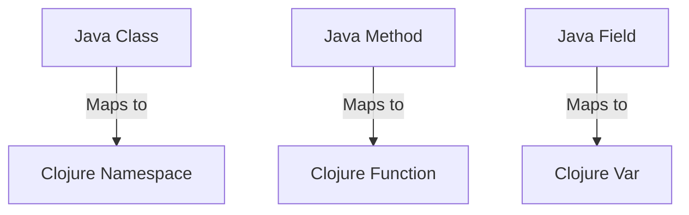

## 17.1 Agile Practices with Clojure

In the rapidly evolving landscape of software development, Agile methodologies like Scrum and Kanban have become the cornerstone of efficient and adaptive project management. As enterprises transition from Java Object-Oriented Programming (OOP) to Clojure's functional programming paradigm, integrating these Agile practices with Clojure can significantly enhance productivity and innovation. In this section, we will explore how to adapt Scrum and Kanban methodologies to leverage the power of Clojure, providing a seamless transition for your development team.

### Understanding Agile Methodologies

Agile methodologies prioritize flexibility, collaboration, and customer feedback, enabling teams to deliver high-quality software incrementally. Let's briefly revisit the core principles of Scrum and Kanban before diving into their integration with Clojure.

#### Scrum

Scrum is an iterative and incremental Agile framework that structures development into time-boxed iterations called sprints, typically lasting two to four weeks. Key roles in Scrum include the Product Owner, Scrum Master, and Development Team. The process involves regular ceremonies such as Sprint Planning, Daily Stand-ups, Sprint Reviews, and Retrospectives.

#### Kanban

Kanban, on the other hand, is a visual workflow management method that emphasizes continuous delivery without overburdening the development team. It uses a Kanban board to visualize work, limit work-in-progress, and optimize flow. Unlike Scrum, Kanban does not prescribe specific roles or ceremonies, making it more flexible.

### Integrating Functional Programming into Agile Practices

Functional programming, with its emphasis on immutability, pure functions, and higher-order functions, aligns well with Agile principles. Clojure, as a functional language, offers unique advantages that can enhance Agile practices:

- **Immutability**: Reduces side effects and bugs, leading to more reliable code.
- **Expressiveness**: Concise syntax allows for rapid prototyping and iteration.
- **Concurrency**: Built-in support for concurrency models facilitates parallel development.

Let's explore how these features can be integrated into Scrum and Kanban methodologies.

### Adapting Scrum with Clojure

#### Sprint Planning with Clojure

During Sprint Planning, teams define the sprint goal and select backlog items to work on. Clojure's expressiveness allows developers to quickly prototype solutions, enabling more accurate estimations and planning.

**Example:**

```clojure
;; Define a simple function to estimate task complexity
(defn estimate-complexity [task]
  (cond
    (= task "simple") 1
    (= task "medium") 3
    (= task "complex") 5
    :else 8))

;; Estimate complexity for a list of tasks
(map estimate-complexity ["simple" "medium" "complex"])
;; => (1 3 5)
```

**Try It Yourself:** Modify the `estimate-complexity` function to include additional task categories and see how it affects your sprint planning.

#### Daily Stand-ups with Functional Insights

Daily Stand-ups are an opportunity for the team to synchronize and address any blockers. Clojure's REPL (Read-Eval-Print Loop) can be used to quickly demonstrate code snippets and solutions during these meetings, fostering a culture of collaboration and continuous learning.

**Example:**

```clojure
;; Use the REPL to demonstrate a quick solution to a blocker
(defn add-numbers [a b]
  (+ a b))

;; Evaluate in REPL
(add-numbers 5 10)
;; => 15
```

**Try It Yourself:** Use the REPL to explore different solutions to a problem discussed in your stand-up.

#### Sprint Reviews and Retrospectives

Sprint Reviews and Retrospectives are crucial for gathering feedback and improving processes. Clojure's ability to rapidly iterate on code can lead to more frequent and meaningful demonstrations of progress.

**Example:**

```clojure
;; Function to simulate a feature demo
(defn demo-feature []
  (println "Feature X is now implemented with the following improvements:"))

;; Call the function during a Sprint Review
(demo-feature)
;; => "Feature X is now implemented with the following improvements:"
```

**Try It Yourself:** Extend the `demo-feature` function to include specific improvements made during the sprint.

### Implementing Kanban with Clojure

#### Visualizing Workflow with Clojure

Kanban boards are essential for visualizing workflow. Clojure's data structures can be used to model and manipulate the state of tasks on a Kanban board.

**Example:**

```clojure
;; Define a Kanban board with tasks in different states
(def kanban-board
  {:todo ["Task 1" "Task 2"]
   :in-progress ["Task 3"]
   :done ["Task 4"]})

;; Function to move a task from one state to another
(defn move-task [board task from to]
  (-> board
      (update from #(remove #{task} %))
      (update to conj task)))

;; Move "Task 1" from :todo to :in-progress
(move-task kanban-board "Task 1" :todo :in-progress)
;; => {:todo ["Task 2"], :in-progress ["Task 3" "Task 1"], :done ["Task 4"]}
```

**Try It Yourself:** Add more tasks and experiment with moving them between different states on the Kanban board.

#### Limiting Work-in-Progress

Limiting work-in-progress (WIP) is a core principle of Kanban. Clojure's functional constructs can help enforce WIP limits programmatically.

**Example:**

```clojure
;; Function to check WIP limits
(defn check-wip-limit [board state limit]
  (<= (count (state board)) limit))

;; Check if :in-progress exceeds WIP limit of 2
(check-wip-limit kanban-board :in-progress 2)
;; => true
```

**Try It Yourself:** Adjust the WIP limit and observe how it affects the flow of tasks.

### Leveraging Clojure's Features in Agile Practices

#### Immutability and Pure Functions

Clojure's immutability and pure functions align with Agile's emphasis on delivering reliable and maintainable software. By reducing side effects, teams can focus on delivering value without being bogged down by unexpected bugs.

**Example:**

```clojure
;; Pure function to calculate the sum of a list
(defn sum-list [numbers]
  (reduce + numbers))

;; Calculate the sum of a list
(sum-list [1 2 3 4 5])
;; => 15
```

**Try It Yourself:** Modify the `sum-list` function to calculate the product of a list instead.

#### Higher-Order Functions and Functional Composition

Higher-order functions and functional composition enable developers to build complex functionality from simple, reusable components, fostering rapid iteration and experimentation.

**Example:**

```clojure
;; Define a higher-order function to apply a discount
(defn apply-discount [discount]
  (fn [price]
    (* price (- 1 discount))))

;; Create a 10% discount function
(def ten-percent-discount (apply-discount 0.10))

;; Apply the discount to a price
(ten-percent-discount 100)
;; => 90.0
```

**Try It Yourself:** Create a function that applies multiple discounts sequentially to a price.

### Visual Aids: Mapping Java Classes to Clojure Namespaces

To further illustrate the transition from Java to Clojure, let's visualize how Java classes map to Clojure namespaces and functions.



**Diagram Description:** This diagram illustrates how Java classes, methods, and fields map to Clojure namespaces, functions, and vars, respectively. This mapping helps developers understand the structural differences and similarities between Java and Clojure.

### References and Further Reading

- [Clojure Official Documentation](https://clojure.org/reference)
- [Clojure Community Resources](https://clojure.org/community/resources)
- [Transitioning from OOP to Functional Programming](https://www.lispcast.com/oo-to-fp/)
- [Scrum Guide](https://www.scrum.org/resources/scrum-guide)
- [Kanban Guide](https://kanbanize.com/kanban-resources/getting-started/what-is-kanban)

### Knowledge Check

To reinforce your understanding, consider the following questions:

1. How can Clojure's immutability benefit Agile practices?
2. What are the advantages of using higher-order functions in an Agile environment?
3. How does Clojure's REPL facilitate collaboration during Daily Stand-ups?

### Exercises

1. **Exercise 1:** Implement a simple Kanban board using Clojure's data structures and functions. Visualize the workflow and enforce WIP limits.
2. **Exercise 2:** Create a Clojure function that calculates the velocity of a Scrum team based on completed story points over multiple sprints.
3. **Exercise 3:** Use Clojure's REPL to prototype a new feature discussed in a Sprint Planning meeting. Share your findings with the team.

### Summary

Integrating Clojure's functional programming paradigm into Agile methodologies like Scrum and Kanban can significantly enhance your development processes. By leveraging Clojure's immutability, expressiveness, and concurrency features, teams can deliver high-quality software more efficiently and effectively. As you continue your journey from Java OOP to Clojure, embrace these Agile practices to unlock the full potential of functional programming in your enterprise.

## **Quiz: Are You Ready to Migrate from Java to Clojure?**



### How does Clojure's immutability benefit Agile practices?

- [x] Reduces side effects and bugs
- [ ] Increases code verbosity
- [ ] Complicates code refactoring
- [ ] Slows down development

> **Explanation:** Immutability reduces side effects and bugs, leading to more reliable and maintainable code, which aligns with Agile's emphasis on delivering high-quality software.

### What is a key advantage of using higher-order functions in an Agile environment?

- [x] Enables rapid iteration and experimentation
- [ ] Increases code complexity
- [ ] Requires more boilerplate code
- [ ] Limits code reuse

> **Explanation:** Higher-order functions enable developers to build complex functionality from simple, reusable components, fostering rapid iteration and experimentation.

### How does Clojure's REPL facilitate collaboration during Daily Stand-ups?

- [x] Allows quick demonstration of code snippets
- [ ] Requires extensive setup
- [ ] Limits real-time feedback
- [ ] Complicates code sharing

> **Explanation:** Clojure's REPL allows developers to quickly demonstrate code snippets and solutions, fostering a culture of collaboration and continuous learning.

### What is the primary focus of Kanban in Agile practices?

- [x] Visualizing workflow and optimizing flow
- [ ] Defining fixed roles and ceremonies
- [ ] Time-boxed iterations
- [ ] Delivering software in large batches

> **Explanation:** Kanban focuses on visualizing workflow, limiting work-in-progress, and optimizing flow, enabling continuous delivery without overburdening the team.

### Which Clojure feature aligns well with Agile's emphasis on delivering reliable software?

- [x] Immutability
- [ ] Dynamic typing
- [ ] Complex syntax
- [ ] Manual memory management

> **Explanation:** Immutability aligns with Agile's emphasis on delivering reliable and maintainable software by reducing side effects and bugs.

### How can Clojure's expressiveness benefit Sprint Planning?

- [x] Allows rapid prototyping and accurate estimations
- [ ] Increases code verbosity
- [ ] Complicates task estimation
- [ ] Limits code readability

> **Explanation:** Clojure's expressiveness allows developers to quickly prototype solutions, enabling more accurate estimations and planning during Sprint Planning.

### What is the role of a Scrum Master in Agile practices?

- [x] Facilitates Scrum ceremonies and removes blockers
- [ ] Defines product requirements
- [ ] Manages the development team
- [ ] Writes all the code

> **Explanation:** The Scrum Master facilitates Scrum ceremonies, helps the team adhere to Scrum practices, and removes any blockers that may impede progress.

### How does limiting work-in-progress (WIP) benefit a Kanban team?

- [x] Prevents overburdening the team and optimizes flow
- [ ] Increases task completion time
- [ ] Limits team collaboration
- [ ] Complicates task prioritization

> **Explanation:** Limiting WIP prevents overburdening the team and optimizes flow, ensuring that tasks are completed efficiently and effectively.

### What is a key difference between Scrum and Kanban?

- [x] Scrum uses time-boxed iterations, while Kanban focuses on continuous delivery
- [ ] Scrum limits work-in-progress, while Kanban uses sprints
- [ ] Scrum visualizes workflow, while Kanban defines roles
- [ ] Scrum requires a Kanban board, while Kanban uses a Scrum board

> **Explanation:** Scrum structures development into time-boxed iterations called sprints, while Kanban emphasizes continuous delivery without fixed iterations.

### True or False: Clojure's concurrency features can enhance Agile practices by facilitating parallel development.

- [x] True
- [ ] False

> **Explanation:** Clojure's built-in support for concurrency models facilitates parallel development, enhancing Agile practices by enabling teams to work on multiple tasks simultaneously.


