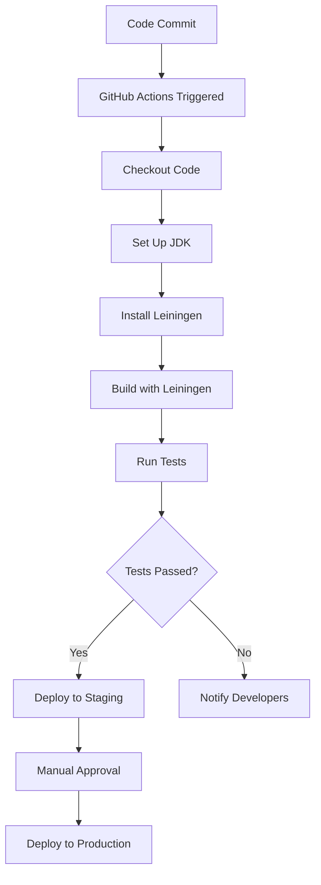

## 17.2 Continuous Integration and Deployment

As we transition from Java OOP to Clojure, one of the critical aspects of modern software development that we must address is Continuous Integration (CI) and Continuous Deployment (CD). These practices are essential for maintaining high-quality code and ensuring rapid delivery of software updates. In this section, we will explore how to set up CI/CD pipelines specifically for Clojure projects, automating builds, tests, and deployments to streamline your development process.

### Understanding CI/CD in the Context of Clojure

**Continuous Integration (CI)** is a development practice where developers integrate code into a shared repository frequently, ideally several times a day. Each integration is verified by an automated build and automated tests to detect integration errors as quickly as possible.

**Continuous Deployment (CD)** extends CI by automatically deploying all code changes to a testing or production environment after the build stage. This ensures that software can be released to production at any time.

**Key Benefits of CI/CD:**
- **Faster Feedback:** Immediate feedback on the quality of the code.
- **Reduced Integration Risk:** Smaller, more frequent integrations reduce the risk of integration issues.
- **Increased Productivity:** Automation of repetitive tasks allows developers to focus on writing code.
- **Improved Code Quality:** Automated testing ensures that code quality is maintained.

### Setting Up CI/CD Pipelines for Clojure Projects

#### Step 1: Choosing the Right CI/CD Tools

When setting up CI/CD for Clojure, the first step is selecting the appropriate tools. Popular CI/CD tools include Jenkins, Travis CI, CircleCI, and GitHub Actions. Each of these tools has its strengths and can be configured to work with Clojure projects.

- **Jenkins:** An open-source automation server that is highly customizable and supports a wide range of plugins.
- **Travis CI:** A cloud-based CI service that is easy to set up and integrates well with GitHub.
- **CircleCI:** Known for its speed and ease of use, CircleCI offers powerful features for CI/CD.
- **GitHub Actions:** Provides CI/CD capabilities directly within GitHub, making it convenient for projects hosted on GitHub.

#### Step 2: Automating Builds with Leiningen

Leiningen is the most popular build automation tool for Clojure. It simplifies the process of managing dependencies, running tests, and building projects.

**Basic Leiningen Build Script (`project.clj`):**

```clojure
(defproject my-clojure-project "0.1.0-SNAPSHOT"
  :description "A sample Clojure project"
  :url "http://example.com/my-clojure-project"
  :license {:name "Eclipse Public License"
            :url "http://www.eclipse.org/legal/epl-v10.html"}
  :dependencies [[org.clojure/clojure "1.10.3"]]
  :main ^:skip-aot my-clojure-project.core
  :target-path "target/%s"
  :profiles {:uberjar {:aot :all}})
```

**Automating Builds:**

- **Compile the Project:** Use `lein compile` to compile your Clojure code.
- **Run Tests:** Use `lein test` to execute your test suite.
- **Create an Uberjar:** Use `lein uberjar` to package your application into a standalone JAR file.

#### Step 3: Integrating Automated Testing

Testing is a crucial part of CI/CD. In Clojure, we can use libraries like `clojure.test` for unit testing and `midje` for behavior-driven development.

**Example Unit Test with `clojure.test`:**

```clojure
(ns my-clojure-project.core-test
  (:require [clojure.test :refer :all]
            [my-clojure-project.core :refer :all]))

(deftest test-addition
  (testing "Addition function"
    (is (= 4 (add 2 2)))))
```

**Running Tests Automatically:**

- Configure your CI/CD tool to run `lein test` as part of the build process.
- Ensure that test results are reported in a format that your CI/CD tool can understand.

#### Step 4: Configuring Deployment Pipelines

Deployment pipelines automate the process of deploying your application to different environments. This can include staging, testing, and production environments.

**Deployment Strategies:**

- **Blue-Green Deployment:** Maintain two identical environments (blue and green). Deploy to the inactive environment and switch traffic once the deployment is verified.
- **Canary Releases:** Gradually roll out the new version to a small subset of users before a full deployment.
- **Rolling Updates:** Deploy the new version incrementally across servers.

**Example Deployment Script:**

```bash
#!/bin/bash

# Build the project
lein uberjar

# Deploy to staging
scp target/my-clojure-project-standalone.jar user@staging-server:/path/to/deploy

# Restart the application
ssh user@staging-server 'systemctl restart my-clojure-project'
```

#### Step 5: Monitoring and Feedback

Monitoring is essential to ensure that your CI/CD pipeline is functioning correctly and that deployments are successful.

- **Use Monitoring Tools:** Tools like Prometheus and Grafana can help monitor application performance and health.
- **Set Up Alerts:** Configure alerts to notify the team of any issues during the build or deployment process.
- **Gather Feedback:** Regularly review the CI/CD process and gather feedback from the team to identify areas for improvement.

### Code Example: Setting Up a CI/CD Pipeline with GitHub Actions

GitHub Actions provides a simple way to set up CI/CD directly within your GitHub repository.

**GitHub Actions Workflow File (`.github/workflows/ci.yml`):**

```yaml
name: CI

on:
  push:
    branches:
      - main
  pull_request:
    branches:
      - main

jobs:
  build:
    runs-on: ubuntu-latest

    steps:
    - name: Checkout code
      uses: actions/checkout@v2

    - name: Set up JDK 11
      uses: actions/setup-java@v1
      with:
        java-version: '11'

    - name: Install Leiningen
      run: |
        curl https://raw.githubusercontent.com/technomancy/leiningen/stable/bin/lein > lein
        chmod +x lein
        sudo mv lein /usr/local/bin/

    - name: Build with Leiningen
      run: lein uberjar

    - name: Run tests
      run: lein test
```

### Visualizing the CI/CD Pipeline

Below is a flowchart that illustrates a typical CI/CD pipeline for a Clojure project using GitHub Actions.



**Diagram Description:** This flowchart represents a CI/CD pipeline where code commits trigger GitHub Actions. The pipeline includes steps for checking out code, setting up the JDK, installing Leiningen, building the project, running tests, and deploying to staging or production based on test results.

### Best Practices for CI/CD in Clojure Projects

- **Keep Builds Fast:** Optimize your build process to ensure that feedback is provided quickly.
- **Use Caching:** Leverage caching mechanisms to speed up dependency resolution and build times.
- **Secure Your Pipeline:** Implement security best practices to protect your CI/CD pipeline from unauthorized access.
- **Document the Process:** Maintain clear documentation of your CI/CD pipeline to facilitate onboarding and troubleshooting.
- **Regularly Review and Improve:** Continuously assess the effectiveness of your CI/CD process and make improvements as needed.

### Knowledge Check

- **What are the key benefits of CI/CD?**
- **How does Leiningen help in automating builds for Clojure projects?**
- **What are some common deployment strategies?**
- **How can GitHub Actions be used to set up a CI/CD pipeline?**

### Exercises

1. **Set Up a CI/CD Pipeline:** Create a simple Clojure project and set up a CI/CD pipeline using GitHub Actions. Ensure that the pipeline includes steps for building, testing, and deploying the application.

2. **Experiment with Deployment Strategies:** Implement a blue-green deployment strategy for your Clojure application. Document the process and any challenges you encounter.

3. **Optimize Your Build Process:** Analyze your current build process and identify areas for optimization. Implement changes to reduce build times and improve efficiency.

### Conclusion

Embracing CI/CD in your Clojure projects can significantly enhance your development workflow, leading to faster delivery of high-quality software. By automating builds, tests, and deployments, you can focus on writing code and delivering value to your users. As you continue to explore the world of Clojure, remember that the journey from Java OOP to functional programming is an opportunity to innovate and improve your development practices.

## **Quiz: Are You Ready to Migrate from Java to Clojure?**



### What is the primary purpose of Continuous Integration (CI)?

- [x] To integrate code into a shared repository frequently and verify it with automated builds and tests.
- [ ] To deploy code changes to production automatically.
- [ ] To manage project dependencies.
- [ ] To compile code into an executable format.

> **Explanation:** Continuous Integration focuses on integrating code changes frequently and verifying them through automated builds and tests to detect errors early.

### Which tool is commonly used for build automation in Clojure projects?

- [x] Leiningen
- [ ] Maven
- [ ] Gradle
- [ ] Ant

> **Explanation:** Leiningen is the most popular build automation tool for Clojure, simplifying dependency management, testing, and building.

### What is a key benefit of using CI/CD pipelines?

- [x] Faster feedback on code quality
- [ ] Increased manual testing
- [ ] Slower deployment cycles
- [ ] Reduced code quality

> **Explanation:** CI/CD pipelines provide faster feedback on code quality by automating builds and tests, allowing developers to address issues quickly.

### What is a blue-green deployment strategy?

- [x] Maintaining two identical environments and switching traffic to the new one after deployment.
- [ ] Deploying code changes to a small subset of users before full deployment.
- [ ] Deploying code changes incrementally across servers.
- [ ] Deploying code changes directly to production without testing.

> **Explanation:** Blue-green deployment involves maintaining two identical environments (blue and green) and switching traffic to the new one after successful deployment.

### How can GitHub Actions be used in CI/CD?

- [x] By automating builds, tests, and deployments directly within a GitHub repository.
- [ ] By managing project dependencies.
- [ ] By compiling code into an executable format.
- [ ] By providing a local development environment.

> **Explanation:** GitHub Actions allows for automation of builds, tests, and deployments directly within a GitHub repository, streamlining the CI/CD process.

### What is the role of automated testing in CI/CD?

- [x] To ensure code quality and detect integration errors early.
- [ ] To compile code into an executable format.
- [ ] To manage project dependencies.
- [ ] To deploy code changes to production.

> **Explanation:** Automated testing ensures code quality by detecting integration errors early in the CI/CD process.

### Which of the following is a common CI/CD tool?

- [x] Jenkins
- [ ] Eclipse
- [ ] IntelliJ IDEA
- [ ] Visual Studio

> **Explanation:** Jenkins is a widely used CI/CD tool known for its flexibility and extensive plugin ecosystem.

### What is the main advantage of using caching in CI/CD pipelines?

- [x] To speed up dependency resolution and build times.
- [ ] To increase manual testing efforts.
- [ ] To slow down deployment cycles.
- [ ] To reduce code quality.

> **Explanation:** Caching in CI/CD pipelines helps speed up dependency resolution and build times, improving overall efficiency.

### What should be included in CI/CD documentation?

- [x] Clear documentation of the pipeline process for onboarding and troubleshooting.
- [ ] Detailed code implementation guides.
- [ ] Marketing strategies for the application.
- [ ] User interface design specifications.

> **Explanation:** CI/CD documentation should include clear documentation of the pipeline process to facilitate onboarding and troubleshooting.

### True or False: Continuous Deployment (CD) automatically deploys all code changes to production after the build stage.

- [x] True
- [ ] False

> **Explanation:** Continuous Deployment automatically deploys all code changes to production after the build stage, ensuring rapid delivery of updates.


