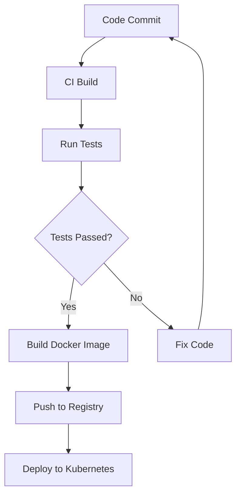

## 17.2 Continuous Integration and Deployment

As we transition from Java to Clojure, it's crucial to adapt our development processes to leverage the full potential of Clojure's functional programming paradigm. Continuous Integration (CI) and Continuous Deployment (CD) are essential practices that ensure code quality, reduce integration issues, and automate the deployment process. In this section, we'll explore how to set up CI/CD pipelines specifically for Clojure projects, drawing parallels with Java-based systems where applicable.

### Understanding CI/CD in the Context of Clojure

Continuous Integration and Continuous Deployment are practices that aim to improve software development efficiency by automating the integration and deployment processes. Let's break down these concepts:

- **Continuous Integration (CI):** CI involves automatically integrating code changes from multiple contributors into a shared repository several times a day. This practice helps to detect integration issues early, ensuring that the codebase remains stable.

- **Continuous Deployment (CD):** CD extends CI by automating the deployment of code changes to production environments. This ensures that new features and bug fixes are delivered to users quickly and reliably.

#### Key Benefits of CI/CD for Clojure Projects

1. **Improved Code Quality:** Automated testing and integration help catch bugs early in the development cycle.
2. **Faster Time to Market:** Automated deployments reduce the time taken to deliver new features to users.
3. **Enhanced Collaboration:** Developers can work on different parts of the codebase without worrying about integration conflicts.
4. **Reduced Manual Effort:** Automation reduces the need for manual testing and deployment, freeing up developer time for more critical tasks.

### Setting Up a CI/CD Pipeline for Clojure

To set up a CI/CD pipeline for Clojure projects, we need to focus on several key components:

1. **Version Control System (VCS):** Use a VCS like Git to manage your codebase.
2. **Build Automation Tools:** Utilize tools like Leiningen or deps.edn for building and managing dependencies.
3. **CI/CD Platforms:** Choose a CI/CD platform such as Jenkins, GitHub Actions, or GitLab CI to automate the pipeline.
4. **Testing Frameworks:** Implement testing frameworks like clojure.test or Midje for automated testing.
5. **Deployment Tools:** Use deployment tools like Docker, Kubernetes, or Heroku for deploying applications.

#### Step-by-Step Guide to Setting Up CI/CD

Let's walk through the process of setting up a CI/CD pipeline for a Clojure project.

##### Step 1: Version Control with Git

Start by setting up a Git repository for your Clojure project. This will serve as the central hub for all code changes.

```bash
# Initialize a new Git repository
git init

# Add all project files
git add .

# Commit the initial set of files
git commit -m "Initial commit"
```

##### Step 2: Build Automation with Leiningen

Leiningen is a popular build automation tool for Clojure. It simplifies dependency management, project building, and testing.

```clojure
;; project.clj
(defproject my-clojure-app "0.1.0-SNAPSHOT"
  :description "A sample Clojure application"
  :dependencies [[org.clojure/clojure "1.10.3"]]
  :main ^:skip-aot my-clojure-app.core
  :target-path "target/%s"
  :profiles {:uberjar {:aot :all}})
```

Use the following command to build your project:

```bash
lein uberjar
```

##### Step 3: Implementing Automated Testing

Testing is a critical component of CI/CD. Use `clojure.test` to write unit tests for your application.

```clojure
(ns my-clojure-app.core-test
  (:require [clojure.test :refer :all]
            [my-clojure-app.core :refer :all]))

(deftest test-sample-function
  (testing "Sample function"
    (is (= 4 (sample-function 2 2)))))
```

Run tests using Leiningen:

```bash
lein test
```

##### Step 4: Setting Up a CI/CD Platform

Choose a CI/CD platform that suits your needs. For this example, we'll use GitHub Actions.

Create a `.github/workflows/ci.yml` file in your repository:

```yaml
name: CI

on:
  push:
    branches: [ main ]
  pull_request:
    branches: [ main ]

jobs:
  build:
    runs-on: ubuntu-latest

    steps:
    - uses: actions/checkout@v2
    - name: Set up JDK 11
      uses: actions/setup-java@v2
      with:
        java-version: '11'
    - name: Build with Leiningen
      run: lein uberjar
    - name: Run tests
      run: lein test
```

##### Step 5: Automating Deployment

For deployment, you can use Docker to containerize your application and Kubernetes to manage deployments.

Create a `Dockerfile` for your Clojure application:

```dockerfile
# Use an official Clojure image
FROM clojure:openjdk-11-lein

# Set the working directory
WORKDIR /app

# Copy the project files
COPY . .

# Build the application
RUN lein uberjar

# Run the application
CMD ["java", "-jar", "target/my-clojure-app-0.1.0-SNAPSHOT-standalone.jar"]
```

Deploy your Docker container to a Kubernetes cluster:

```bash
# Build the Docker image
docker build -t my-clojure-app .

# Push the image to a container registry
docker push my-clojure-app

# Deploy to Kubernetes
kubectl apply -f deployment.yaml
```

### Visualizing the CI/CD Pipeline

To better understand the flow of a CI/CD pipeline, let's visualize it using a flowchart.



**Caption:** This flowchart illustrates the CI/CD pipeline for a Clojure project, from code commit to deployment.

### Best Practices for CI/CD in Clojure

1. **Keep Builds Fast:** Optimize your build process to ensure quick feedback.
2. **Use Caching:** Cache dependencies to speed up builds.
3. **Monitor Pipelines:** Set up monitoring to detect failures early.
4. **Secure Your Pipeline:** Implement security best practices to protect your CI/CD pipeline.

### Knowledge Check

- Explain the benefits of CI/CD for Clojure projects.
- Describe the role of Leiningen in a CI/CD pipeline.
- How does Docker facilitate deployment in a CI/CD process?

### Try It Yourself

Experiment with the provided CI/CD setup by modifying the Clojure code and observing how changes are automatically built, tested, and deployed. Consider adding additional tests or integrating other tools like SonarQube for code quality analysis.

### Further Reading

- [Official Clojure Documentation](https://clojure.org/)
- [Leiningen Documentation](https://leiningen.org/)
- [GitHub Actions Documentation](https://docs.github.com/en/actions)

## **Quiz: Are You Ready to Migrate from Java to Clojure?**



### What is the primary purpose of Continuous Integration?

- [x] To automatically integrate code changes from multiple contributors into a shared repository
- [ ] To deploy code changes to production environments
- [ ] To manage dependencies in a project
- [ ] To write unit tests for an application

> **Explanation:** Continuous Integration focuses on automatically integrating code changes to ensure stability.

### Which tool is commonly used for build automation in Clojure projects?

- [x] Leiningen
- [ ] Maven
- [ ] Gradle
- [ ] Ant

> **Explanation:** Leiningen is the preferred build automation tool for Clojure projects.

### What is the role of Docker in a CI/CD pipeline?

- [x] To containerize applications for consistent deployment
- [ ] To write unit tests
- [ ] To manage code repositories
- [ ] To automate code integration

> **Explanation:** Docker is used to containerize applications, making them easier to deploy across different environments.

### How can you speed up builds in a CI/CD pipeline?

- [x] By caching dependencies
- [ ] By running tests manually
- [ ] By using a slower CI/CD platform
- [ ] By avoiding automated testing

> **Explanation:** Caching dependencies helps reduce build times by avoiding repeated downloads.

### Which CI/CD platform is mentioned in the article for setting up pipelines?

- [x] GitHub Actions
- [ ] Jenkins
- [ ] Travis CI
- [ ] CircleCI

> **Explanation:** GitHub Actions is used as an example platform for setting up CI/CD pipelines.

### What is the purpose of the `lein test` command?

- [x] To run unit tests in a Clojure project
- [ ] To build a Docker image
- [ ] To deploy an application
- [ ] To initialize a Git repository

> **Explanation:** The `lein test` command is used to execute unit tests in a Clojure project.

### What does the `CMD` instruction in a Dockerfile do?

- [x] Specifies the command to run when the container starts
- [ ] Copies files into the container
- [ ] Installs dependencies
- [ ] Builds the application

> **Explanation:** The `CMD` instruction defines the command that runs when the Docker container starts.

### What is a key benefit of using CI/CD?

- [x] Faster time to market
- [ ] Increased manual testing
- [ ] Slower deployment processes
- [ ] Reduced collaboration

> **Explanation:** CI/CD automates processes, leading to faster delivery of features to users.

### How does Kubernetes assist in the deployment process?

- [x] By managing containerized applications across a cluster
- [ ] By writing unit tests
- [ ] By integrating code changes
- [ ] By building Docker images

> **Explanation:** Kubernetes manages containerized applications, facilitating deployment and scaling.

### True or False: Continuous Deployment involves manual approval for deploying code changes.

- [ ] True
- [x] False

> **Explanation:** Continuous Deployment automates the deployment process without requiring manual approval.



By implementing a robust CI/CD pipeline, we can ensure that our Clojure projects are built, tested, and deployed efficiently, allowing us to focus on delivering high-quality software.
