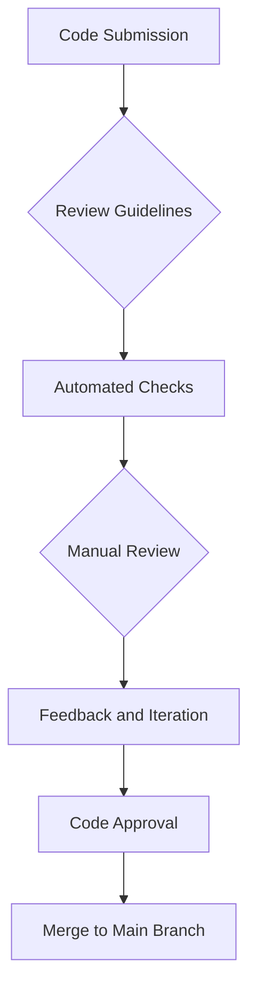

## 17.3 Code Reviews and Quality Assurance

Transitioning from Java's Object-Oriented Programming (OOP) to Clojure's functional paradigm is a significant shift that requires a robust approach to code reviews and quality assurance. This section will guide you through establishing standards for code quality and implementing effective code review processes tailored to Clojure's unique features.

### Establishing Standards for Code Quality

In any software development process, maintaining high code quality is crucial. As we migrate to Clojure, it's essential to redefine what quality means in the context of functional programming. Here are some key areas to focus on:

#### 1. **Immutability and Pure Functions**

Clojure emphasizes immutability and pure functions, which are functions that do not cause side effects and return the same output given the same input. These principles lead to more predictable and testable code.

- **Ensure Immutability**: Review code to confirm that data structures are immutable. This reduces bugs related to unexpected state changes.
- **Promote Pure Functions**: Encourage the use of pure functions wherever possible. This simplifies reasoning about code behavior.

#### 2. **Code Readability and Simplicity**

Clojure's syntax is concise, but it can be unfamiliar to those accustomed to Java. Code readability should be a priority.

- **Use Descriptive Names**: Choose meaningful names for functions and variables to enhance understanding.
- **Limit Function Complexity**: Break down complex functions into smaller, more manageable pieces.

#### 3. **Functional Composition**

Functional composition is a powerful concept in Clojure, allowing developers to build complex operations by combining simpler functions.

- **Encourage Composition**: Review code to ensure that functions are composed effectively, promoting reuse and modularity.

#### 4. **Error Handling**

Clojure provides robust error handling mechanisms, such as `ex-info` for creating informative exceptions.

- **Implement Comprehensive Error Handling**: Ensure that code gracefully handles errors and provides meaningful feedback.

### Implementing Effective Code Review Processes

Code reviews are an integral part of maintaining code quality. They provide an opportunity for team members to share knowledge and improve the overall codebase. Here’s how to adapt your code review process for Clojure:

#### 1. **Define Clear Review Guidelines**

Establish guidelines that outline what reviewers should look for in Clojure code. This includes adherence to functional programming principles, code readability, and proper use of Clojure idioms.

- **Create a Checklist**: Develop a checklist that reviewers can use to ensure consistency across reviews.

#### 2. **Leverage Clojure's REPL**

The Read-Eval-Print Loop (REPL) is a powerful tool in Clojure for interactive development and testing.

- **Encourage REPL Usage**: Use the REPL during code reviews to test and explore code snippets in real-time.

#### 3. **Promote Pair Programming**

Pair programming can be an effective way to conduct code reviews, allowing two developers to collaborate and share insights.

- **Schedule Pair Sessions**: Regularly schedule pair programming sessions to facilitate knowledge sharing and improve code quality.

#### 4. **Automate Code Quality Checks**

Automation can help maintain code quality by catching issues early in the development process.

- **Use Linters and Formatters**: Integrate tools like `clj-kondo` for linting and `cljfmt` for formatting to enforce coding standards automatically.

### Code Example: Implementing a Pure Function

Let's look at a simple example of a pure function in Clojure:

```clojure
;; A pure function that calculates the square of a number
(defn square [n]
  (* n n))

;; Usage
(square 5) ; => 25
```

In this example, the `square` function is pure because it does not modify any state and always returns the same result for the same input.

### Code Example: Functional Composition

Here's how you can use functional composition in Clojure:

```clojure
;; Define two simple functions
(defn add-one [x] (+ x 1))
(defn double [x] (* x 2))

;; Compose functions using comp
(def add-one-and-double (comp double add-one))

;; Usage
(add-one-and-double 3) ; => 8
```

In this example, `add-one-and-double` is a composed function that first adds one to its input and then doubles the result.

### Visual Aid: Code Review Process Flowchart



**Figure 1**: This flowchart illustrates the code review process, starting from code submission to merging the code into the main branch after approval.

### References and Links

- [Clojure Official Documentation](https://clojure.org/reference)
- [Clojure Community Resources](https://clojure.org/community/resources)
- [Transitioning from OOP to Functional Programming](https://www.lispcast.com/oo-to-fp/)

### Knowledge Check

- **What is a pure function, and why is it important in Clojure?**
- **How can functional composition improve code quality?**
- **What are some tools you can use to automate code quality checks in Clojure?**

### Exercises

1. **Refactor a Java Method to a Clojure Function**: Take a simple Java method and rewrite it as a pure function in Clojure. Ensure that it adheres to functional programming principles.

2. **Compose Functions**: Create two simple functions in Clojure and compose them into a new function. Test your composed function with different inputs.

3. **Automate Code Quality Checks**: Set up `clj-kondo` in your Clojure project and run it to identify any potential issues in your codebase.

### Encouraging Engagement

Embracing functional programming can be challenging, but with each step, you'll gain a deeper understanding and see tangible benefits in your codebase. Remember, the goal is to write clean, maintainable, and efficient code. Let's continue to explore and innovate with Clojure!

## **Quiz: Are You Ready to Migrate from Java to Clojure?**



### What is a key characteristic of a pure function in Clojure?

- [x] It does not cause side effects.
- [ ] It modifies global state.
- [ ] It relies on external data sources.
- [ ] It changes its output based on the time of day.

> **Explanation:** A pure function does not cause side effects and always returns the same output for the same input, making it predictable and testable.

### How does functional composition benefit code quality?

- [x] It promotes code reuse.
- [ ] It increases code complexity.
- [x] It enhances modularity.
- [ ] It makes debugging more difficult.

> **Explanation:** Functional composition allows developers to build complex operations by combining simpler functions, promoting reuse and modularity.

### Which tool can be used for linting Clojure code?

- [x] clj-kondo
- [ ] JUnit
- [ ] Maven
- [ ] Gradle

> **Explanation:** `clj-kondo` is a popular linter for Clojure that helps enforce coding standards and catch potential issues.

### What is the purpose of using the REPL in Clojure?

- [x] To interactively test and explore code snippets.
- [ ] To compile Java bytecode.
- [ ] To manage database connections.
- [ ] To deploy applications to production.

> **Explanation:** The REPL (Read-Eval-Print Loop) is used in Clojure for interactive development, allowing developers to test and explore code snippets in real-time.

### What should be included in a code review checklist for Clojure?

- [x] Adherence to functional programming principles.
- [ ] Use of inheritance hierarchies.
- [x] Proper use of Clojure idioms.
- [ ] Extensive use of mutable state.

> **Explanation:** A code review checklist for Clojure should focus on adherence to functional programming principles and proper use of Clojure idioms, avoiding mutable state.

### How can pair programming enhance code reviews?

- [x] By facilitating knowledge sharing.
- [ ] By reducing collaboration.
- [ ] By increasing code duplication.
- [ ] By limiting feedback opportunities.

> **Explanation:** Pair programming allows two developers to collaborate and share insights, enhancing the code review process and improving code quality.

### What is the role of automated checks in code reviews?

- [x] To catch issues early in the development process.
- [ ] To replace manual reviews entirely.
- [x] To enforce coding standards automatically.
- [ ] To increase the workload for developers.

> **Explanation:** Automated checks help catch issues early and enforce coding standards, complementing manual reviews.

### Why is immutability important in Clojure?

- [x] It reduces bugs related to unexpected state changes.
- [ ] It allows for direct modification of data structures.
- [ ] It complicates code readability.
- [ ] It increases the need for synchronization.

> **Explanation:** Immutability in Clojure reduces bugs related to unexpected state changes, making code more predictable and easier to reason about.

### What is a benefit of using descriptive names in Clojure code?

- [x] It enhances code readability.
- [ ] It increases code complexity.
- [ ] It makes code harder to maintain.
- [ ] It reduces the need for comments.

> **Explanation:** Descriptive names enhance code readability, making it easier for developers to understand and maintain the codebase.

### True or False: Clojure's syntax is more concise than Java's.

- [x] True
- [ ] False

> **Explanation:** Clojure's syntax is generally more concise than Java's, allowing developers to express ideas with fewer lines of code.


