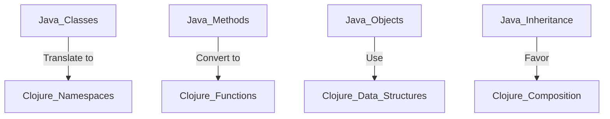

## 18.1 Overcoming Resistance to Change

Transitioning from Java Object-Oriented Programming (OOP) to Clojure's functional programming paradigm represents a significant shift for any enterprise. This change can often be met with resistance, stemming from concerns about the unknown, misconceptions about functional programming, and the comfort of established practices. In this section, we will explore strategies to address these concerns, dispel common misconceptions, and effectively communicate the benefits of adopting Clojure. By doing so, we aim to facilitate a smoother transition and foster a culture that embraces innovation and continuous improvement.

### Addressing Concerns and Misconceptions

#### Understanding the Root of Resistance

Resistance to change is a natural human response, often driven by fear of the unknown, perceived loss of control, or skepticism about the benefits of the new approach. In the context of migrating to Clojure, these concerns may manifest as doubts about the language's maturity, its fit for enterprise applications, or the learning curve associated with functional programming.

**Key Concerns:**

- **Fear of the Unknown:** Developers may be unfamiliar with Clojure's syntax and functional programming concepts, leading to apprehension about their ability to adapt.
- **Perceived Complexity:** Functional programming can initially seem more abstract and complex compared to the imperative style of Java OOP.
- **Job Security:** There may be concerns about job security if developers feel they lack the skills needed for the new paradigm.
- **Compatibility and Integration:** Concerns about how existing Java systems will integrate with Clojure and whether the migration will disrupt current operations.

#### Dispelling Misconceptions

To overcome resistance, it's crucial to address misconceptions about Clojure and functional programming. Here are some common myths and the realities that counter them:

- **Myth:** Functional programming is only for academic or niche applications.
  - **Reality:** Clojure is used in many successful enterprise applications, offering benefits such as improved scalability and maintainability.
- **Myth:** Clojure is too different from Java, making it hard to learn.
  - **Reality:** While Clojure introduces new concepts, its syntax is concise and expressive, and many Java developers find the transition rewarding once they grasp the fundamentals.
- **Myth:** Functional programming is less efficient than OOP.
  - **Reality:** Clojure's immutable data structures and emphasis on pure functions can lead to more efficient and predictable code, especially in concurrent environments.

### Communicating the Benefits and Successes

#### Highlighting the Advantages of Clojure

To build support for the transition, it's essential to clearly communicate the tangible benefits that Clojure brings to the table. Here are some key advantages:

- **Enhanced Scalability:** Clojure's immutable data structures and concurrency primitives make it well-suited for building scalable applications that can handle high loads.
- **Improved Maintainability:** The emphasis on pure functions and immutability leads to code that is easier to reason about, test, and maintain.
- **Increased Productivity:** Clojure's concise syntax and powerful abstractions allow developers to express complex ideas with less code, reducing development time.
- **Interoperability with Java:** Clojure runs on the Java Virtual Machine (JVM), allowing seamless integration with existing Java libraries and systems.

#### Showcasing Real-World Success Stories

Providing examples of successful migrations can help alleviate fears and demonstrate the potential of Clojure in an enterprise setting. Consider sharing case studies or testimonials from organizations that have successfully transitioned to Clojure, highlighting the challenges they faced and the benefits they realized.

**Example Case Study:**

- **Background:** A financial services company with a large Java codebase sought to improve the scalability and maintainability of their systems.
- **Challenges:** Initial resistance from developers who were unfamiliar with functional programming.
- **Solution:** Implemented a phased migration strategy, starting with non-critical components and gradually expanding to core systems.
- **Outcomes:** Achieved significant performance improvements, reduced code complexity, and increased developer satisfaction.

### Strategies for Overcoming Resistance

#### Engaging Stakeholders

Engaging stakeholders at all levels of the organization is crucial for a successful migration. This includes developers, managers, and executives. Here are some strategies to consider:

- **Conduct Workshops and Training:** Provide hands-on workshops and training sessions to familiarize developers with Clojure and functional programming concepts.
- **Foster a Collaborative Environment:** Encourage open communication and collaboration among team members to share knowledge and address concerns.
- **Highlight Quick Wins:** Identify and implement small, impactful projects that demonstrate the benefits of Clojure, building momentum and confidence in the transition.

#### Building a Supportive Culture

Creating a culture that supports change and innovation is essential for overcoming resistance. Here are some ways to foster such a culture:

- **Promote Continuous Learning:** Encourage developers to continuously learn and experiment with new technologies and approaches.
- **Recognize and Reward Adaptability:** Acknowledge and reward team members who embrace change and contribute to the success of the migration.
- **Leverage Internal Champions:** Identify and empower internal champions who can advocate for Clojure and support their peers in the transition.

### Visualizing the Transition

To help visualize the transition from Java OOP to Clojure, let's use a diagram to illustrate the mapping of Java classes to Clojure namespaces and functions.



**Diagram Description:** This diagram illustrates the transition from Java OOP concepts to their Clojure equivalents. Java classes map to Clojure namespaces, methods convert to functions, objects are replaced by data structures, and inheritance is replaced by composition.

### Code Examples: Java vs. Clojure

Let's explore a simple example to illustrate the differences between Java OOP and Clojure's functional approach.

**Java Example:**

```java
// Java OOP: Defining a class with a method
public class Calculator {
    private int value;

    public Calculator(int value) {
        this.value = value;
    }

    public int add(int number) {
        return this.value + number;
    }
}

// Usage
Calculator calculator = new Calculator(5);
int result = calculator.add(10);
System.out.println(result); // Output: 15
```

**Clojure Example:**

```clojure
;; Clojure: Using a function with immutable data
(defn add [value number]
  (+ value number))

;; Usage
(def result (add 5 10))
(println result) ;; Output: 15
```

**Key Differences:**

- In Java, we define a class with a method that operates on an instance variable. In Clojure, we use a pure function that takes arguments and returns a result.
- Clojure's approach emphasizes immutability and simplicity, reducing the need for managing state.

### Try It Yourself

Experiment with the Clojure code example by modifying the `add` function to subtract or multiply numbers. Observe how easy it is to change the behavior without altering any state.

### References and Further Reading

- [Clojure Official Documentation](https://clojure.org/reference)
- [Clojure Community Resources](https://clojure.org/community/resources)
- [Transitioning from OOP to Functional Programming](https://www.lispcast.com/oo-to-fp/)

### Knowledge Check

- What are some common misconceptions about functional programming?
- How can you effectively communicate the benefits of Clojure to stakeholders?
- What strategies can help build a supportive culture for change?

### Exercises

1. **Identify Concerns:** List the top three concerns your team might have about migrating to Clojure and propose solutions to address them.
2. **Case Study Analysis:** Research a real-world case study of a successful Clojure migration and summarize the key challenges and outcomes.
3. **Code Conversion:** Convert a simple Java class to a Clojure function and compare the differences in approach.

### Summary

Overcoming resistance to change is a critical step in successfully migrating from Java OOP to Clojure. By addressing concerns, dispelling misconceptions, and effectively communicating the benefits, we can foster a culture that embraces functional programming and reaps the rewards of this powerful paradigm. Remember, change is an opportunity for growth, and with the right strategies, your team can thrive in the new landscape.

## **Quiz: Are You Ready to Migrate from Java to Clojure?**



### What is a common misconception about functional programming?

- [x] It's only for academic applications.
- [ ] It's easier than OOP.
- [ ] It doesn't support concurrency.
- [ ] It's not suitable for enterprise use.

> **Explanation:** A common misconception is that functional programming is only for academic or niche applications, whereas it is widely used in enterprise settings.

### How can you address the fear of the unknown when transitioning to Clojure?

- [x] Provide training and workshops.
- [ ] Ignore concerns and push forward.
- [ ] Limit communication about the change.
- [ ] Focus only on technical aspects.

> **Explanation:** Providing training and workshops helps familiarize developers with Clojure, reducing fear of the unknown.

### What is a key advantage of Clojure over Java OOP?

- [x] Enhanced scalability.
- [ ] Easier syntax.
- [ ] More libraries.
- [ ] Better IDE support.

> **Explanation:** Clojure's immutable data structures and concurrency primitives enhance scalability.

### Which strategy can help build a supportive culture for change?

- [x] Recognize and reward adaptability.
- [ ] Enforce strict rules.
- [ ] Limit collaboration.
- [ ] Focus on individual achievements.

> **Explanation:** Recognizing and rewarding adaptability encourages a culture that supports change.

### What is a benefit of using Clojure's pure functions?

- [x] Easier testing and maintenance.
- [ ] More complex code.
- [ ] Increased state management.
- [ ] Slower performance.

> **Explanation:** Pure functions lead to easier testing and maintenance due to their predictable behavior.

### How can you demonstrate the benefits of Clojure to stakeholders?

- [x] Highlight quick wins.
- [ ] Focus only on technical details.
- [ ] Avoid discussing challenges.
- [ ] Limit communication to developers.

> **Explanation:** Highlighting quick wins shows tangible benefits and builds confidence in the transition.

### What is a common concern about migrating to Clojure?

- [x] Compatibility with existing systems.
- [ ] Lack of documentation.
- [ ] Poor community support.
- [ ] Limited language features.

> **Explanation:** Compatibility with existing systems is a common concern when migrating to Clojure.

### How can internal champions support the transition to Clojure?

- [x] Advocate for Clojure and support peers.
- [ ] Work independently.
- [ ] Focus on their own tasks.
- [ ] Avoid collaboration.

> **Explanation:** Internal champions can advocate for Clojure and support their peers, facilitating the transition.

### What is a key difference between Java OOP and Clojure's approach?

- [x] Emphasis on immutability.
- [ ] More complex syntax.
- [ ] Less efficient code.
- [ ] Limited concurrency support.

> **Explanation:** Clojure emphasizes immutability, which is a key difference from Java OOP.

### True or False: Clojure can seamlessly integrate with existing Java libraries.

- [x] True
- [ ] False

> **Explanation:** Clojure runs on the JVM, allowing seamless integration with existing Java libraries.


