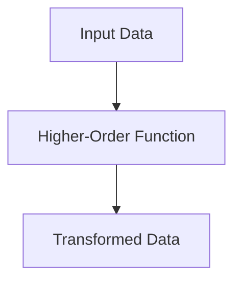
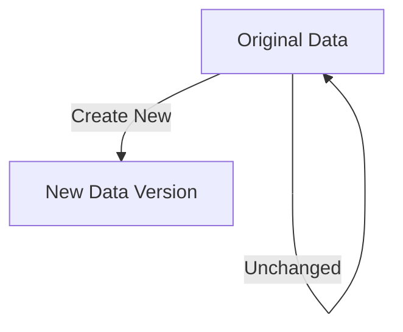

## 18.1 Overcoming Resistance to Change

Transitioning from Java's Object-Oriented Programming (OOP) to Clojure's functional programming paradigm can be a transformative journey for any enterprise. However, this transition often encounters resistance due to ingrained habits, fear of the unknown, and misconceptions about functional programming. In this section, we will explore strategies to overcome resistance to change, address concerns and misconceptions, and effectively communicate the benefits and successes of adopting Clojure.

### Understanding Resistance to Change

Resistance to change is a natural human reaction, especially in the context of well-established practices and technologies. In the software development world, developers and stakeholders may resist transitioning from Java to Clojure for several reasons:

1. **Comfort with Familiarity**: Developers are often comfortable with the tools and languages they have used for years. Java, being a widely used language, has a vast ecosystem and community support, making it a safe choice for many.

2. **Fear of the Unknown**: Clojure, with its functional programming paradigm, introduces new concepts that may seem daunting at first. The fear of learning a new language and paradigm can be a significant barrier.

3. **Misconceptions about Functional Programming**: There are several misconceptions about functional programming, such as it being too theoretical, difficult to learn, or not suitable for real-world applications.

4. **Concerns about Performance and Scalability**: Some may worry that Clojure, being a Lisp dialect, might not perform as well as Java in enterprise applications.

5. **Organizational Inertia**: Enterprises often have established processes and workflows that are resistant to change. Shifting to a new programming paradigm requires changes in these processes, which can be met with resistance.

### Addressing Concerns and Misconceptions

To overcome resistance, it is crucial to address the concerns and misconceptions head-on. Here are some strategies to do so:

#### 1. Educate and Train

**Provide comprehensive training programs** to help developers understand the fundamentals of Clojure and functional programming. Highlight the similarities between Java and Clojure to ease the learning curve. For example, both languages run on the Java Virtual Machine (JVM), allowing for interoperability and leveraging existing Java libraries.

**Java Example:**

```java
// Java code to filter a list of strings
List<String> names = Arrays.asList("Alice", "Bob", "Charlie");
List<String> filteredNames = names.stream()
                                  .filter(name -> name.startsWith("A"))
                                  .collect(Collectors.toList());
```

**Clojure Equivalent:**

```clojure
;; Clojure code to filter a list of strings
(def names ["Alice" "Bob" "Charlie"])
(def filtered-names (filter #(clojure.string/starts-with? % "A") names))
```

**Explanation:** Both examples demonstrate filtering a list of strings. The Clojure code is concise and leverages the `filter` function, showcasing the power of functional programming.

#### 2. Demonstrate Real-World Applications

**Showcase real-world success stories** of companies that have successfully transitioned to Clojure. Highlight the benefits they have experienced, such as improved scalability, maintainability, and developer productivity.

#### 3. Address Performance Concerns

**Provide benchmarks and case studies** that demonstrate Clojure's performance capabilities. Explain how Clojure's immutable data structures and concurrency models can lead to more efficient and scalable applications.

#### 4. Foster a Culture of Innovation

**Encourage experimentation and innovation** by creating a safe environment for developers to explore Clojure. Promote pair programming and mentorship to facilitate knowledge sharing and collaboration.

### Communicating the Benefits and Successes

Effective communication is key to overcoming resistance to change. Here are some strategies to communicate the benefits and successes of adopting Clojure:

#### 1. Highlight Clojure's Strengths

**Emphasize Clojure's strengths** in areas such as concurrency, immutability, and expressiveness. Explain how these features can lead to more robust and maintainable code.

**Concurrency Example:**

```clojure
;; Clojure code demonstrating concurrency with atoms
(def counter (atom 0))

(defn increment-counter []
  (swap! counter inc))

;; Simulate concurrent updates
(doseq [_ (range 1000)]
  (future (increment-counter)))
```

**Explanation:** This example demonstrates how Clojure's `atom` provides a simple and safe way to manage state in a concurrent environment.

#### 2. Share Success Stories

**Share success stories** from within the organization or from other companies that have benefited from adopting Clojure. Highlight tangible outcomes such as reduced development time, fewer bugs, and improved performance.

#### 3. Engage Stakeholders

**Engage stakeholders** by involving them in the transition process. Provide regular updates on the progress and benefits of the migration. Use data and metrics to demonstrate the positive impact of Clojure on the organization.

#### 4. Create a Supportive Community

**Build a supportive community** within the organization by encouraging developers to share their experiences and learnings. Create forums or channels for discussion and collaboration.

### Visual Aids and Diagrams

To enhance understanding, let's incorporate some visual aids and diagrams:

#### Flow of Data Through Higher-Order Functions



**Caption:** This diagram illustrates the flow of data through a higher-order function, showcasing how data is transformed in a functional programming paradigm.

#### Immutability and Persistent Data Structures



**Caption:** This diagram demonstrates the concept of immutability and persistent data structures, where the original data remains unchanged, and a new version is created.

### References and Links

For further reading and exploration, consider the following resources:

- [Official Clojure Documentation](https://clojure.org/)
- [ClojureDocs](https://clojuredocs.org/)
- [Clojure GitHub Repository](https://github.com/clojure/clojure)

### Knowledge Check

Let's engage with some questions and challenges to reinforce learning:

1. **What are some common misconceptions about functional programming?**
2. **How can you address performance concerns when transitioning to Clojure?**
3. **What are the benefits of using immutable data structures in Clojure?**

### Exercises and Practice Problems

1. **Modify the Clojure code example** to filter names that end with a specific letter.
2. **Experiment with Clojure's concurrency models** by creating a simple program that uses agents to manage state.

### Summary

In this section, we've explored strategies to overcome resistance to change when transitioning from Java OOP to Clojure's functional programming paradigm. By addressing concerns, communicating benefits, and fostering a culture of innovation, organizations can successfully embrace Clojure and reap its many advantages.

## **Quiz: Are You Ready to Migrate from Java to Clojure?**



### What is a common misconception about functional programming?

- [x] It is too theoretical and not suitable for real-world applications.
- [ ] It is easier to learn than object-oriented programming.
- [ ] It is only used in academic settings.
- [ ] It cannot handle concurrency effectively.

> **Explanation:** A common misconception is that functional programming is too theoretical and not suitable for real-world applications. However, many enterprises have successfully adopted functional programming languages like Clojure.

### How can you address performance concerns when transitioning to Clojure?

- [x] Provide benchmarks and case studies demonstrating Clojure's performance.
- [ ] Ignore performance concerns as they are not important.
- [ ] Only focus on the theoretical benefits of Clojure.
- [ ] Avoid discussing performance altogether.

> **Explanation:** Addressing performance concerns with concrete benchmarks and case studies can help demonstrate Clojure's capabilities and alleviate worries.

### What is one benefit of using immutable data structures in Clojure?

- [x] They lead to more robust and maintainable code.
- [ ] They make code harder to understand.
- [ ] They are slower than mutable data structures.
- [ ] They are only useful in academic settings.

> **Explanation:** Immutable data structures lead to more robust and maintainable code by preventing unintended side effects and simplifying reasoning about code.

### How can you foster a culture of innovation when transitioning to Clojure?

- [x] Encourage experimentation and create a safe environment for exploration.
- [ ] Discourage any changes to existing processes.
- [ ] Focus solely on theoretical aspects of Clojure.
- [ ] Limit collaboration and knowledge sharing.

> **Explanation:** Encouraging experimentation and creating a safe environment for exploration fosters a culture of innovation and helps teams embrace new technologies like Clojure.

### What is a key strength of Clojure in terms of concurrency?

- [x] Clojure provides simple and safe concurrency models like atoms and agents.
- [ ] Clojure does not support concurrency.
- [ ] Clojure's concurrency models are complex and difficult to use.
- [ ] Clojure relies solely on Java's concurrency mechanisms.

> **Explanation:** Clojure provides simple and safe concurrency models like atoms and agents, making it easier to manage state in concurrent environments.

### How can you engage stakeholders during the transition to Clojure?

- [x] Involve them in the transition process and provide regular updates.
- [ ] Exclude them from the transition process.
- [ ] Only communicate with them at the end of the transition.
- [ ] Focus solely on technical aspects without involving stakeholders.

> **Explanation:** Engaging stakeholders by involving them in the transition process and providing regular updates helps ensure their support and understanding.

### What is one way to build a supportive community within an organization?

- [x] Encourage developers to share their experiences and learnings.
- [ ] Discourage collaboration and discussion.
- [ ] Focus solely on individual achievements.
- [ ] Limit communication channels for developers.

> **Explanation:** Encouraging developers to share their experiences and learnings helps build a supportive community and fosters collaboration.

### How can you effectively communicate the benefits of adopting Clojure?

- [x] Highlight Clojure's strengths and share success stories.
- [ ] Focus only on the challenges of adopting Clojure.
- [ ] Avoid discussing the benefits of Clojure.
- [ ] Only communicate with technical teams.

> **Explanation:** Highlighting Clojure's strengths and sharing success stories effectively communicates the benefits of adopting Clojure.

### What is a key advantage of Clojure's expressiveness?

- [x] It allows for more concise and readable code.
- [ ] It makes code harder to understand.
- [ ] It is only beneficial in small projects.
- [ ] It complicates code maintenance.

> **Explanation:** Clojure's expressiveness allows for more concise and readable code, making it easier to understand and maintain.

### True or False: Clojure's immutable data structures prevent unintended side effects.

- [x] True
- [ ] False

> **Explanation:** True. Clojure's immutable data structures prevent unintended side effects by ensuring that data cannot be changed once created.



In conclusion, overcoming resistance to change requires a strategic approach that addresses concerns, communicates benefits, and fosters a culture of innovation. By embracing Clojure, enterprises can unlock new possibilities and drive their software development efforts forward.
