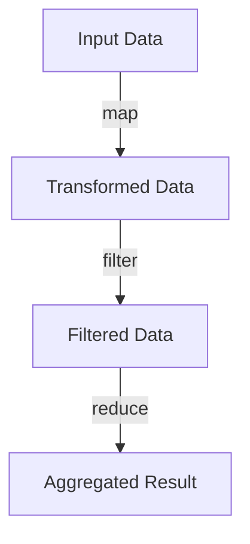
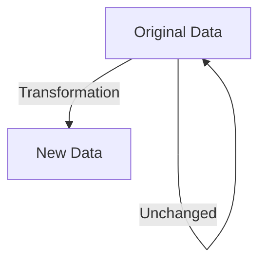

## 18.2 Promoting Functional Paradigm Benefits

As we embark on the journey of transitioning from Java's Object-Oriented Programming (OOP) to Clojure's functional programming paradigm, it's crucial to understand the tangible benefits this shift can bring to your enterprise. In this section, we will explore how adopting functional programming can significantly enhance code quality and productivity. We'll also showcase successful projects and metrics that demonstrate these improvements.

### Understanding the Functional Paradigm

Before diving into the benefits, let's briefly revisit what the functional paradigm entails. Functional programming is a programming paradigm where computation is treated as the evaluation of mathematical functions, avoiding changing-state and mutable data. Key concepts include:

- **Immutability**: Data structures are immutable, meaning they cannot be modified after creation.
- **Pure Functions**: Functions have no side effects and return the same output given the same input.
- **Higher-Order Functions**: Functions that take other functions as arguments or return them as results.
- **First-Class Functions**: Functions are treated as first-class citizens, meaning they can be passed as arguments, returned from other functions, and assigned to variables.

### Enhancing Code Quality

#### Immutability and Its Impact

One of the most significant advantages of Clojure is its emphasis on immutability. In Java, mutable objects can lead to complex state management and bugs that are difficult to trace. Clojure's immutable data structures eliminate these issues, leading to more predictable and reliable code.

**Java Example: Mutable State**

```java
public class Counter {
    private int count = 0;

    public void increment() {
        count++;
    }

    public int getCount() {
        return count;
    }
}
```

**Clojure Example: Immutable State**

```clojure
(defn increment [count]
  (inc count))

(def count 0)
(def new-count (increment count))
```

In the Clojure example, `count` remains unchanged, and `new-count` holds the incremented value. This immutability ensures that functions do not have unintended side effects, making the code easier to reason about.

#### Pure Functions and Testability

Pure functions, a cornerstone of functional programming, enhance testability. Since pure functions do not depend on external state, they are easier to test and debug.

**Java Example: Impure Function**

```java
public class Calculator {
    private int lastResult = 0;

    public int add(int a, int b) {
        lastResult = a + b;
        return lastResult;
    }
}
```

**Clojure Example: Pure Function**

```clojure
(defn add [a b]
  (+ a b))
```

The Clojure `add` function is pure, making it straightforward to test with any input without worrying about side effects or state changes.

### Boosting Productivity

#### Higher-Order Functions and Code Reusability

Clojure's support for higher-order functions promotes code reusability and abstraction. Functions like `map`, `reduce`, and `filter` allow developers to write concise and expressive code.

**Java Example: Iterating Over a List**

```java
List<Integer> numbers = Arrays.asList(1, 2, 3, 4, 5);
List<Integer> doubled = new ArrayList<>();
for (Integer number : numbers) {
    doubled.add(number * 2);
}
```

**Clojure Example: Using `map`**

```clojure
(def numbers [1 2 3 4 5])
(def doubled (map #(* 2 %) numbers))
```

The Clojure code is more concise and expressive, demonstrating how higher-order functions can simplify common programming tasks.

#### Concurrency Made Simple

Clojure's approach to concurrency, with constructs like atoms, refs, and agents, simplifies concurrent programming. This is a stark contrast to Java's complex concurrency model, which often involves intricate thread management.

**Java Example: Thread Management**

```java
public class Counter {
    private int count = 0;

    public synchronized void increment() {
        count++;
    }

    public synchronized int getCount() {
        return count;
    }
}
```

**Clojure Example: Using Atoms**

```clojure
(def count (atom 0))

(defn increment []
  (swap! count inc))
```

Clojure's `atom` provides a simpler and more intuitive way to manage state changes in a concurrent environment, reducing the likelihood of errors and improving developer productivity.

### Showcasing Successful Projects and Metrics

To illustrate the benefits of transitioning to Clojure, let's explore some real-world success stories and metrics.

#### Case Study: Financial Services Application

A leading financial services company migrated a critical application from Java to Clojure. The results were impressive:

- **Code Reduction**: The codebase was reduced by 40%, thanks to Clojure's expressive syntax and higher-order functions.
- **Bug Reduction**: The number of bugs reported decreased by 60%, attributed to immutability and pure functions.
- **Development Speed**: New features were delivered 30% faster, as developers could leverage Clojure's powerful abstractions and concurrency model.

#### Metrics from a Tech Startup

A tech startup adopted Clojure for its backend services, leading to the following improvements:

- **Performance**: The application handled 50% more requests per second, thanks to Clojure's efficient concurrency model.
- **Scalability**: The system scaled seamlessly with increased load, leveraging Clojure's immutable data structures and functional design.
- **Developer Satisfaction**: Surveys showed a 70% increase in developer satisfaction, as they enjoyed the simplicity and elegance of Clojure's functional paradigm.

### Visualizing the Benefits

To further understand the flow of data and the benefits of functional programming, let's look at some diagrams.

#### Flow of Data Through Higher-Order Functions



*Caption: This diagram illustrates how data flows through higher-order functions like `map`, `filter`, and `reduce`, showcasing the power of functional composition.*

#### Immutability and Persistent Data Structures



*Caption: Immutability ensures that original data remains unchanged, leading to more predictable and reliable code.*

### Encouraging Adoption

To promote the adoption of the functional paradigm within your organization, consider the following strategies:

- **Education and Training**: Offer workshops and training sessions to help developers understand the benefits and concepts of functional programming.
- **Pilot Projects**: Start with small pilot projects to demonstrate the advantages of Clojure in a controlled environment.
- **Community Building**: Foster a community of practice where developers can share knowledge, experiences, and best practices.

### Knowledge Check

To reinforce your understanding of the functional paradigm benefits, consider the following questions:

- How does immutability improve code quality?
- What are the advantages of pure functions in testing?
- How do higher-order functions enhance productivity?
- Why is Clojure's concurrency model simpler than Java's?
- What metrics can demonstrate the success of a Clojure migration?

### Conclusion

Transitioning from Java OOP to Clojure's functional programming paradigm offers numerous benefits, including enhanced code quality, increased productivity, and improved developer satisfaction. By embracing immutability, pure functions, and higher-order functions, your organization can build more reliable, scalable, and maintainable systems. As we've seen through real-world examples and metrics, the functional paradigm is not just a theoretical concept but a practical approach that delivers tangible results.

Now that we've explored the benefits of the functional paradigm, let's apply these concepts to modernize your enterprise applications and stay ahead in today's competitive technology landscape.

## **Quiz: Are You Ready to Migrate from Java to Clojure?**



### How does immutability improve code quality?

- [x] By eliminating side effects and making code more predictable
- [ ] By allowing direct modification of data structures
- [ ] By increasing the complexity of state management
- [ ] By making code harder to understand

> **Explanation:** Immutability ensures that data structures cannot be modified, eliminating side effects and making code more predictable and reliable.


### What is a key advantage of pure functions?

- [x] They are easier to test and debug
- [ ] They depend on external state
- [ ] They have side effects
- [ ] They are difficult to reason about

> **Explanation:** Pure functions do not depend on external state and have no side effects, making them easier to test and debug.


### How do higher-order functions enhance productivity?

- [x] By allowing code reuse and abstraction
- [ ] By increasing code verbosity
- [ ] By complicating function composition
- [ ] By making code less expressive

> **Explanation:** Higher-order functions promote code reuse and abstraction, allowing developers to write concise and expressive code.


### Why is Clojure's concurrency model simpler than Java's?

- [x] It uses constructs like atoms, refs, and agents
- [ ] It requires complex thread management
- [ ] It relies on synchronized blocks
- [ ] It uses low-level concurrency primitives

> **Explanation:** Clojure's concurrency model uses high-level constructs like atoms, refs, and agents, simplifying concurrent programming.


### What metrics can demonstrate the success of a Clojure migration?

- [x] Code reduction, bug reduction, and development speed
- [ ] Increased code complexity and longer development cycles
- [ ] Higher bug rates and slower performance
- [ ] Reduced developer satisfaction

> **Explanation:** Successful Clojure migrations often result in code reduction, bug reduction, and faster development speed.


### How does Clojure's immutability benefit concurrency?

- [x] It prevents race conditions and simplifies state management
- [ ] It complicates concurrent programming
- [ ] It requires complex locking mechanisms
- [ ] It increases the risk of data corruption

> **Explanation:** Immutability prevents race conditions and simplifies state management, making concurrent programming more reliable.


### What is a common use of higher-order functions in Clojure?

- [x] To transform data with functions like `map` and `filter`
- [ ] To increase code verbosity
- [ ] To manage mutable state
- [ ] To complicate function composition

> **Explanation:** Higher-order functions like `map` and `filter` are commonly used to transform data in a concise and expressive manner.


### How do pure functions contribute to code reliability?

- [x] They produce consistent results without side effects
- [ ] They depend on external state
- [ ] They have unpredictable behavior
- [ ] They increase code complexity

> **Explanation:** Pure functions produce consistent results without side effects, contributing to code reliability.


### What is a benefit of using atoms in Clojure?

- [x] They provide a simple way to manage state changes
- [ ] They require complex locking mechanisms
- [ ] They complicate state management
- [ ] They increase the risk of race conditions

> **Explanation:** Atoms provide a simple and intuitive way to manage state changes in a concurrent environment.


### True or False: Clojure's functional paradigm can lead to more maintainable systems.

- [x] True
- [ ] False

> **Explanation:** Clojure's functional paradigm, with its emphasis on immutability and pure functions, leads to more maintainable and reliable systems.


