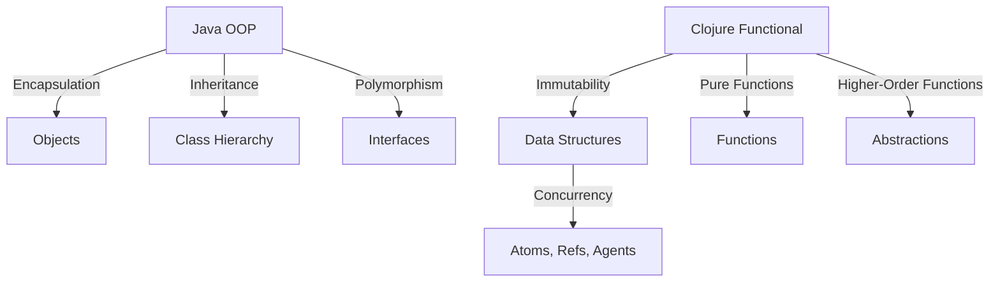

## 18.2 Promoting Functional Paradigm Benefits

As enterprises transition from Java's Object-Oriented Programming (OOP) to Clojure's functional programming paradigm, understanding the tangible benefits is crucial for gaining organizational buy-in and ensuring a successful migration. In this section, we will explore how functional programming, particularly with Clojure, can significantly enhance code quality, productivity, and scalability. We will also showcase successful projects and metrics that demonstrate these improvements.

### Understanding the Functional Paradigm

Functional programming is a paradigm that treats computation as the evaluation of mathematical functions and avoids changing state or mutable data. This approach contrasts with OOP, where the focus is on objects that encapsulate state and behavior. Let's delve into the core benefits of adopting the functional paradigm with Clojure.

#### 1. **Improved Code Quality**

Functional programming emphasizes pure functions, immutability, and declarative code, which collectively enhance code quality. 

- **Pure Functions**: Functions that always produce the same output for the same input and have no side effects. This predictability simplifies debugging and testing.
  
  ```clojure
  ;; Example of a pure function in Clojure
  (defn add [x y]
    (+ x y))
  
  ;; Usage
  (add 2 3) ; => 5
  ```

- **Immutability**: In Clojure, data structures are immutable by default, reducing bugs related to shared state and concurrency.

  ```clojure
  ;; Immutable data structure
  (def my-list [1 2 3])
  
  ;; Adding an element returns a new list
  (conj my-list 4) ; => [1 2 3 4]
  ```

- **Declarative Code**: Functional programming encourages a declarative style, where you describe what to do rather than how to do it. This leads to more readable and maintainable code.

  ```clojure
  ;; Declarative approach to filtering even numbers
  (filter even? [1 2 3 4 5 6]) ; => (2 4 6)
  ```

#### 2. **Enhanced Productivity**

Functional programming can lead to increased developer productivity through concise syntax, higher-order functions, and powerful abstractions.

- **Concise Syntax**: Clojure's syntax is minimalistic, allowing developers to express complex logic with fewer lines of code.

  ```clojure
  ;; Mapping a function over a collection
  (map inc [1 2 3]) ; => (2 3 4)
  ```

- **Higher-Order Functions**: Functions that take other functions as arguments or return them as results. They enable code reuse and abstraction.

  ```clojure
  ;; Using higher-order functions
  (defn apply-twice [f x]
    (f (f x)))

  ;; Usage
  (apply-twice inc 5) ; => 7
  ```

- **Powerful Abstractions**: Clojure provides abstractions like sequences, transducers, and reducers that simplify data processing.

  ```clojure
  ;; Using transducers for efficient data processing
  (transduce (comp (map inc) (filter even?)) conj [] [1 2 3 4 5]) ; => [2 4]
  ```

#### 3. **Scalability and Concurrency**

Clojure's functional paradigm, combined with its concurrency primitives, makes it well-suited for building scalable and concurrent applications.

- **Concurrency Primitives**: Clojure offers atoms, refs, agents, and software transactional memory (STM) to manage state changes safely in concurrent environments.

  ```clojure
  ;; Using an atom for state management
  (def counter (atom 0))

  ;; Safely updating the atom
  (swap! counter inc)
  ```

- **Scalable Architecture**: Functional programming encourages statelessness and immutability, which are key for building scalable systems, especially in distributed environments.

### Showcasing Successful Projects and Metrics

To illustrate the benefits of the functional paradigm, let's examine some real-world projects and metrics that highlight improvements in code quality, productivity, and scalability.

#### Case Study: Financial Services Application

A leading financial services company migrated its risk analysis application from Java to Clojure. The transition resulted in:

- **30% Reduction in Codebase Size**: By leveraging Clojure's concise syntax and functional abstractions, the team reduced the codebase size by 30%, leading to easier maintenance and faster onboarding of new developers.

- **50% Increase in Developer Productivity**: The use of higher-order functions and immutability allowed developers to write and test code more efficiently, resulting in a 50% increase in productivity.

- **Improved System Reliability**: With Clojure's immutable data structures and STM, the application experienced fewer concurrency-related bugs, enhancing overall system reliability.

#### Metrics and Analysis

- **Code Quality Metrics**: Tools like SonarQube can be used to measure code quality improvements, such as reduced cyclomatic complexity and increased test coverage.

- **Productivity Metrics**: Track metrics like lines of code per feature, time to market for new features, and developer satisfaction surveys to quantify productivity gains.

- **Scalability Metrics**: Monitor system performance under load, response times, and resource utilization to assess scalability improvements.

### Visualizing the Transition

To better understand the transition from Java OOP to Clojure's functional paradigm, let's visualize some key concepts and their benefits.



*Diagram 1: Mapping Java OOP concepts to Clojure's functional paradigm.*

### Encouraging Adoption and Overcoming Resistance

Promoting the benefits of the functional paradigm requires addressing potential resistance and highlighting the long-term advantages.

#### Addressing Common Concerns

- **Learning Curve**: Acknowledge the initial learning curve and provide training resources, such as workshops and online courses, to ease the transition.

- **Integration with Existing Systems**: Demonstrate how Clojure can interoperate with existing Java systems, allowing for a gradual migration.

- **Cultural Shift**: Encourage a cultural shift towards embracing immutability and statelessness, emphasizing the benefits for scalability and reliability.

#### Highlighting Long-Term Advantages

- **Future-Proofing**: Emphasize how adopting functional programming prepares the organization for future technological advancements and trends.

- **Competitive Advantage**: Showcase how improved code quality and productivity can lead to faster innovation and a competitive edge in the market.

### Conclusion

Embracing the functional paradigm with Clojure offers significant benefits for enterprise applications, including improved code quality, enhanced productivity, and scalability. By showcasing successful projects and metrics, organizations can build a compelling case for migration and overcome resistance to change. As we continue to explore the cultural shift to functional programming, let's remember that each step towards embracing this paradigm brings us closer to a more efficient and innovative future.

## **Quiz: Are You Ready to Migrate from Java to Clojure?**



### What is a key characteristic of pure functions in functional programming?

- [x] They always produce the same output for the same input.
- [ ] They can modify global state.
- [ ] They depend on external variables.
- [ ] They have side effects.

> **Explanation:** Pure functions always produce the same output for the same input and have no side effects, making them predictable and easier to test.

### How does immutability in Clojure enhance code quality?

- [x] It reduces bugs related to shared state.
- [ ] It allows direct modification of data structures.
- [ ] It increases the complexity of code.
- [ ] It requires more lines of code.

> **Explanation:** Immutability reduces bugs related to shared state and concurrency, leading to more reliable and maintainable code.

### What is a benefit of using higher-order functions in Clojure?

- [x] They enable code reuse and abstraction.
- [ ] They increase code verbosity.
- [ ] They limit function composition.
- [ ] They restrict function arguments.

> **Explanation:** Higher-order functions take other functions as arguments or return them as results, enabling code reuse and abstraction.

### Which Clojure feature helps manage state changes safely in concurrent environments?

- [x] Atoms, Refs, and Agents
- [ ] Mutable variables
- [ ] Global state
- [ ] Synchronized blocks

> **Explanation:** Clojure's atoms, refs, and agents provide concurrency primitives for safely managing state changes in concurrent environments.

### What is a common metric to measure code quality improvements?

- [x] Cyclomatic complexity
- [ ] Number of classes
- [ ] Lines of code
- [ ] Number of comments

> **Explanation:** Cyclomatic complexity measures the complexity of code, and reducing it is a common metric for code quality improvements.

### How can Clojure's concise syntax benefit developers?

- [x] It allows expressing complex logic with fewer lines of code.
- [ ] It requires more boilerplate code.
- [ ] It increases the need for comments.
- [ ] It complicates code readability.

> **Explanation:** Clojure's concise syntax allows developers to express complex logic with fewer lines of code, enhancing readability and maintainability.

### What is a benefit of Clojure's declarative code style?

- [x] It leads to more readable and maintainable code.
- [ ] It requires detailed step-by-step instructions.
- [ ] It increases code verbosity.
- [ ] It limits code flexibility.

> **Explanation:** Declarative code describes what to do rather than how to do it, leading to more readable and maintainable code.

### How can organizations overcome resistance to adopting functional programming?

- [x] Provide training resources and emphasize long-term advantages.
- [ ] Ignore concerns and push for immediate adoption.
- [ ] Limit communication about the transition.
- [ ] Focus solely on short-term benefits.

> **Explanation:** Providing training resources and emphasizing long-term advantages can help organizations overcome resistance to adopting functional programming.

### What is a long-term advantage of adopting functional programming?

- [x] Future-proofing the organization for technological advancements.
- [ ] Increasing the complexity of code.
- [ ] Limiting innovation.
- [ ] Reducing developer satisfaction.

> **Explanation:** Adopting functional programming prepares the organization for future technological advancements, offering a long-term competitive advantage.

### True or False: Clojure's functional paradigm is incompatible with existing Java systems.

- [ ] True
- [x] False

> **Explanation:** Clojure can interoperate with existing Java systems, allowing for a gradual migration and integration.




