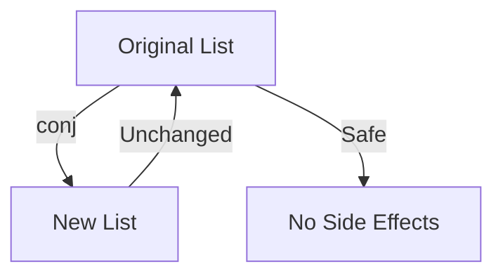
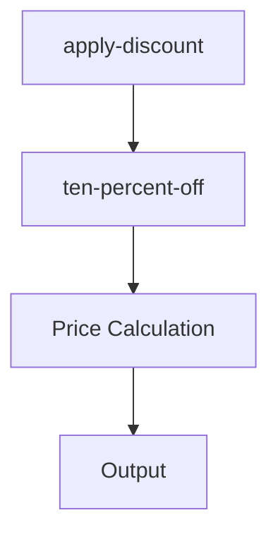

## 18.3 Encouraging Innovation and Experimentation

Transitioning from Java's Object-Oriented Programming (OOP) to Clojure's functional paradigm is not just a technical shift but a cultural one. Encouraging innovation and experimentation is crucial to harnessing the full potential of Clojure and ensuring a successful transition. In this section, we will explore strategies to empower teams to explore and innovate with Clojure, recognize and reward contributions, and build a culture of continuous improvement.

### The Importance of Innovation and Experimentation

Innovation and experimentation are the lifeblood of any successful technology transition. They allow teams to explore new ideas, test hypotheses, and discover more efficient ways to solve problems. In the context of migrating to Clojure, fostering a culture of innovation can lead to:

- **Enhanced Problem-Solving:** By encouraging experimentation, teams can discover novel solutions to complex problems that may not be apparent through traditional approaches.
- **Increased Engagement:** Developers who are empowered to innovate are more engaged and motivated, leading to higher job satisfaction and productivity.
- **Competitive Advantage:** Organizations that foster innovation can stay ahead of the competition by quickly adapting to new technologies and methodologies.

### Strategies for Encouraging Innovation

#### 1. Create a Safe Environment for Experimentation

One of the most important aspects of fostering innovation is creating a safe environment where team members feel comfortable experimenting without fear of failure. This involves:

- **Promoting a Growth Mindset:** Encourage team members to view failures as learning opportunities rather than setbacks.
- **Providing Resources:** Ensure that teams have access to the necessary tools, time, and support to experiment with new ideas.
- **Celebrating Failures and Successes:** Recognize and celebrate both successful experiments and valuable lessons learned from failures.

#### 2. Empower Teams with Autonomy

Autonomy is a key driver of innovation. By giving teams the freedom to explore and make decisions, you empower them to take ownership of their work and pursue innovative solutions. Consider the following:

- **Decentralized Decision-Making:** Allow teams to make decisions about their projects and experiments without excessive oversight.
- **Flexible Work Practices:** Implement flexible work practices that enable teams to explore new ideas and approaches.
- **Encourage Cross-Functional Collaboration:** Foster collaboration between different teams and departments to bring diverse perspectives and expertise to the table.

#### 3. Provide Opportunities for Learning and Growth

Continuous learning is essential for innovation. By providing opportunities for learning and growth, you enable teams to acquire new skills and knowledge that can fuel innovation. Strategies include:

- **Training and Workshops:** Offer training sessions and workshops on Clojure and functional programming concepts.
- **Access to Learning Resources:** Provide access to online courses, books, and other learning materials.
- **Encourage Knowledge Sharing:** Create forums or regular meetings where team members can share their learnings and insights with others.

### Recognizing and Rewarding Contributions

Recognizing and rewarding contributions is essential to sustaining a culture of innovation. It reinforces positive behaviors and motivates team members to continue exploring and experimenting. Consider the following approaches:

#### 1. Implement a Recognition Program

A formal recognition program can help acknowledge and reward innovative contributions. This can include:

- **Awards and Incentives:** Offer awards or incentives for innovative ideas and successful experiments.
- **Public Recognition:** Recognize contributions publicly in team meetings or company-wide communications.
- **Peer Recognition:** Encourage team members to recognize and appreciate each other's contributions.

#### 2. Provide Career Advancement Opportunities

Innovation should be linked to career advancement opportunities. By aligning innovation with career growth, you motivate team members to contribute their best ideas. Consider:

- **Promotions and Raises:** Offer promotions or raises for team members who consistently contribute innovative ideas.
- **Leadership Opportunities:** Provide opportunities for team members to lead projects or initiatives related to their innovative contributions.

#### 3. Foster a Culture of Appreciation

A culture of appreciation goes beyond formal recognition programs. It involves creating an environment where team members feel valued and appreciated for their contributions. Strategies include:

- **Regular Feedback:** Provide regular feedback and appreciation for team members' efforts and contributions.
- **Celebrate Milestones:** Celebrate project milestones and achievements as a team.
- **Encourage Gratitude:** Encourage team members to express gratitude and appreciation for each other's contributions.

### Leveraging Clojure's Unique Features for Innovation

Clojure's unique features can be leveraged to drive innovation and experimentation. By understanding and utilizing these features, teams can unlock new possibilities and efficiencies. Let's explore some of these features:

#### 1. Immutability and Persistent Data Structures

Clojure's emphasis on immutability and persistent data structures allows for safer and more predictable code. This can lead to innovative solutions that are less prone to errors and easier to reason about.

```clojure
;; Example of using persistent data structures in Clojure
(def original-list [1 2 3 4 5])

;; Adding an element to the list without modifying the original
(def new-list (conj original-list 6))

;; original-list remains unchanged
(println original-list) ;; Output: [1 2 3 4 5]
(println new-list)      ;; Output: [1 2 3 4 5 6]
```

In contrast, Java developers might use mutable collections, which can lead to unintended side effects.

```java
// Example of using mutable collections in Java
List<Integer> originalList = new ArrayList<>(Arrays.asList(1, 2, 3, 4, 5));

// Adding an element modifies the original list
originalList.add(6);

System.out.println(originalList); // Output: [1, 2, 3, 4, 5, 6]
```

#### 2. Higher-Order Functions and Functional Composition

Clojure's support for higher-order functions and functional composition enables developers to write more modular and reusable code. This can lead to innovative designs and architectures.

```clojure
;; Example of using higher-order functions in Clojure
(defn apply-discount [discount]
  (fn [price] (* price (- 1 discount))))

(def ten-percent-off (apply-discount 0.10))

(println (ten-percent-off 100)) ;; Output: 90.0
```

In Java, achieving similar functionality requires more boilerplate code.

```java
// Example of using higher-order functions in Java
import java.util.function.Function;

Function<Double, Function<Double, Double>> applyDiscount = discount -> price -> price * (1 - discount);

Function<Double, Double> tenPercentOff = applyDiscount.apply(0.10);

System.out.println(tenPercentOff.apply(100.0)); // Output: 90.0
```

#### 3. Concurrency Models

Clojure's concurrency models, such as atoms, refs, and agents, provide powerful tools for managing state in concurrent applications. This can lead to innovative solutions for handling complex concurrency challenges.

```clojure
;; Example of using atoms for concurrency in Clojure
(def counter (atom 0))

;; Incrementing the counter atomically
(swap! counter inc)

(println @counter) ;; Output: 1
```

In Java, managing concurrency often involves more complex and error-prone constructs.

```java
// Example of using atomic variables in Java
import java.util.concurrent.atomic.AtomicInteger;

AtomicInteger counter = new AtomicInteger(0);

// Incrementing the counter atomically
counter.incrementAndGet();

System.out.println(counter.get()); // Output: 1
```

### Visualizing Clojure's Innovative Features

To better understand how Clojure's features can drive innovation, let's visualize some of these concepts using diagrams.

#### Immutability and Persistent Data Structures



*Diagram: Immutability ensures that the original list remains unchanged, promoting safety and predictability.*

#### Higher-Order Functions and Functional Composition



*Diagram: Higher-order functions enable modular and reusable code, facilitating innovative designs.*

### Encouraging Experimentation with "Try It Yourself" Exercises

To foster experimentation, encourage team members to try modifying the provided code examples. Here are some suggestions:

- **Modify the Discount Function:** Change the discount rate and observe how it affects the output.
- **Experiment with Concurrency:** Create a new atom and try different operations to understand how Clojure manages state.
- **Explore Persistent Data Structures:** Try adding or removing elements from a persistent data structure and observe the behavior.

### Conclusion

Encouraging innovation and experimentation is essential for a successful transition to Clojure. By creating a safe environment, empowering teams, providing learning opportunities, and recognizing contributions, organizations can foster a culture of continuous improvement and innovation. Leveraging Clojure's unique features can unlock new possibilities and efficiencies, driving the organization forward in its functional programming journey.

### Further Reading

For more information on fostering innovation and experimentation, consider exploring the following resources:

- [Official Clojure Documentation](https://clojure.org/)
- [ClojureDocs](https://clojuredocs.org/)
- [Functional Programming in Clojure](https://www.functionalprogramming.com/clojure)

## **Quiz: Are You Ready to Migrate from Java to Clojure?**



### What is a key benefit of fostering innovation and experimentation in a Clojure transition?

- [x] Enhanced problem-solving capabilities
- [ ] Increased complexity in code
- [ ] Reduced team engagement
- [ ] Decreased productivity

> **Explanation:** Encouraging innovation and experimentation can lead to enhanced problem-solving capabilities by allowing teams to explore new ideas and solutions.

### How can organizations create a safe environment for experimentation?

- [x] Promoting a growth mindset
- [ ] Discouraging failure
- [ ] Limiting resources
- [ ] Centralizing decision-making

> **Explanation:** Promoting a growth mindset helps create a safe environment where team members feel comfortable experimenting without fear of failure.

### What role does autonomy play in fostering innovation?

- [x] Empowers teams to explore and make decisions
- [ ] Limits team creativity
- [ ] Increases oversight
- [ ] Reduces team ownership

> **Explanation:** Autonomy empowers teams to explore and make decisions, which is crucial for fostering innovation.

### Which Clojure feature supports safer and more predictable code?

- [x] Immutability and persistent data structures
- [ ] Mutable collections
- [ ] Complex inheritance hierarchies
- [ ] Global state management

> **Explanation:** Immutability and persistent data structures in Clojure support safer and more predictable code by preventing unintended side effects.

### How do higher-order functions contribute to innovation?

- [x] Enable modular and reusable code
- [ ] Increase boilerplate code
- [ ] Complicate code readability
- [ ] Restrict code flexibility

> **Explanation:** Higher-order functions enable modular and reusable code, facilitating innovative designs and architectures.

### What is a benefit of recognizing and rewarding contributions?

- [x] Sustains a culture of innovation
- [ ] Decreases team motivation
- [ ] Limits team collaboration
- [ ] Reduces career advancement opportunities

> **Explanation:** Recognizing and rewarding contributions sustains a culture of innovation by motivating team members to continue exploring and experimenting.

### Which strategy can help align innovation with career growth?

- [x] Providing career advancement opportunities
- [ ] Limiting leadership roles
- [ ] Reducing promotions
- [ ] Centralizing decision-making

> **Explanation:** Providing career advancement opportunities aligns innovation with career growth, motivating team members to contribute their best ideas.

### What is a key feature of Clojure's concurrency models?

- [x] Atoms, refs, and agents
- [ ] Global locks
- [ ] Thread pooling
- [ ] Synchronized blocks

> **Explanation:** Clojure's concurrency models, such as atoms, refs, and agents, provide powerful tools for managing state in concurrent applications.

### How can organizations encourage knowledge sharing?

- [x] Create forums or regular meetings
- [ ] Limit access to learning resources
- [ ] Discourage collaboration
- [ ] Centralize decision-making

> **Explanation:** Creating forums or regular meetings encourages knowledge sharing, enabling team members to share their learnings and insights with others.

### True or False: Innovation should be linked to career advancement opportunities.

- [x] True
- [ ] False

> **Explanation:** Linking innovation to career advancement opportunities motivates team members to contribute their best ideas and align their efforts with organizational goals.


