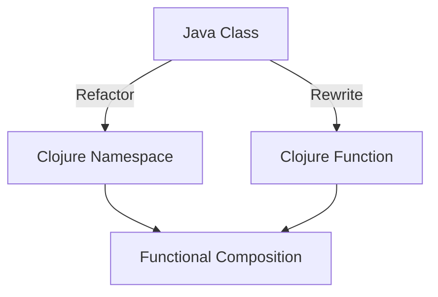
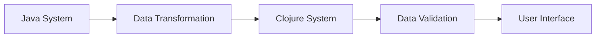

## 19.1 Background and Challenges

In this section, we delve into the intricacies of migrating from Java Object-Oriented Programming (OOP) to Clojure's functional programming paradigm within an enterprise context. We will explore the background of a typical enterprise before migration, the specific challenges faced during the transition, and how these challenges were addressed. This case study aims to provide a comprehensive understanding of the migration process, offering insights and strategies for a successful transition.

### Background of the Enterprise Before Migration

Before embarking on the migration journey, the enterprise in question was a well-established organization with a robust Java-based software ecosystem. The company had been leveraging Java OOP for over a decade, building a suite of applications that served various business functions, from customer relationship management (CRM) to supply chain logistics.

#### Key Characteristics of the Pre-Migration System

1. **Monolithic Architecture**: The enterprise's software architecture was predominantly monolithic, with tightly coupled components that made scalability and maintenance challenging.

2. **Complex Codebase**: Over the years, the Java codebase had grown significantly, leading to increased complexity and technical debt. This complexity often resulted in longer development cycles and higher maintenance costs.

3. **Performance Bottlenecks**: As the user base expanded, the system began to experience performance bottlenecks, particularly during peak usage periods. The existing concurrency model in Java was proving inadequate for handling the increased load efficiently.

4. **Limited Flexibility**: The rigid nature of the OOP paradigm made it difficult to adapt to changing business requirements quickly. The enterprise needed a more flexible and agile approach to software development.

5. **Resource Constraints**: The organization faced resource constraints, both in terms of hardware and skilled personnel. The existing infrastructure was becoming costly to maintain, and there was a shortage of developers proficient in modern programming paradigms.

### Specific Challenges Faced During the Migration

Migrating from Java OOP to Clojure presented several challenges, each requiring careful consideration and strategic planning. Below, we outline the key challenges encountered during the migration process and the solutions implemented to overcome them.

#### Challenge 1: Cultural Shift to Functional Programming

One of the most significant challenges was the cultural shift required to embrace functional programming. Java developers, accustomed to the OOP paradigm, had to adapt to Clojure's functional style, which emphasizes immutability, pure functions, and higher-order functions.

**Solution**: To facilitate this transition, the enterprise invested in comprehensive training programs and workshops focused on functional programming concepts. Pair programming and mentorship were also encouraged to help developers gain hands-on experience with Clojure.

#### Challenge 2: Codebase Refactoring and Rewriting

Refactoring the existing Java codebase to align with Clojure's functional paradigm was a daunting task. The enterprise had to identify which parts of the code could be refactored and which needed to be rewritten entirely.

**Solution**: A phased approach was adopted, starting with less critical components to minimize risk. Automated refactoring tools were employed to streamline the process, and a dedicated team was assigned to ensure code quality and consistency.

#### Challenge 3: Interoperability Between Java and Clojure

Ensuring seamless interoperability between Java and Clojure was crucial, especially during the initial stages of migration when both languages coexisted within the system.

**Solution**: The enterprise leveraged Clojure's robust interoperability features, allowing Java code to be called from Clojure and vice versa. This approach enabled a gradual migration, reducing disruption to ongoing operations.

#### Challenge 4: Data Migration and Transformation

Migrating data from the existing Java-based system to the new Clojure-based system posed significant challenges, particularly in terms of data integrity and consistency.

**Solution**: A comprehensive data migration strategy was developed, involving data transformation techniques and rigorous testing to ensure accuracy. The use of Clojure's powerful data manipulation capabilities facilitated the process.

#### Challenge 5: Performance Optimization

Optimizing the performance of the new Clojure-based system was essential to meet the enterprise's scalability requirements. The transition from Java's concurrency model to Clojure's required careful tuning and optimization.

**Solution**: The enterprise conducted extensive performance profiling and optimization, utilizing Clojure's concurrency primitives such as atoms, refs, and agents. JVM tuning was also performed to enhance performance further.

#### Challenge 6: Stakeholder Engagement and Communication

Engaging stakeholders and maintaining clear communication throughout the migration process was vital to ensure alignment with business objectives and manage expectations.

**Solution**: Regular meetings and updates were conducted to keep stakeholders informed of progress and challenges. A dedicated project manager was appointed to oversee the migration and facilitate communication between technical teams and business units.

### Visual Aids

To better understand the migration process, let's examine a few diagrams that illustrate key concepts and data flow during the transition.

#### Diagram 1: Java Classes to Clojure Namespaces

*Caption*: This diagram illustrates how Java classes are refactored into Clojure namespaces and functions, emphasizing functional composition.

#### Diagram 2: Data Flow During Migration

*Caption*: This flowchart depicts the data flow from the existing Java system to the new Clojure system, highlighting the transformation and validation steps.

### References and Links

For further reading and resources on migrating from Java OOP to Clojure, consider the following links:

- [Clojure Official Documentation](https://clojure.org/reference)
- [Clojure Community Resources](https://clojure.org/community/resources)
- [Transitioning from OOP to Functional Programming](https://www.lispcast.com/oo-to-fp/)
- [Clojure STM Guide](https://clojure.org/reference/refs)

### Knowledge Check

To reinforce your understanding of the migration process, consider the following questions:

1. What are the key characteristics of the enterprise's pre-migration system?
2. How did the enterprise address the cultural shift to functional programming?
3. What strategies were employed to ensure interoperability between Java and Clojure?
4. Describe the data migration process and the challenges involved.
5. How was performance optimization achieved in the new Clojure-based system?

### Encouraging Engagement

Embracing functional programming can be challenging, but with each step, you'll gain a deeper understanding and see tangible benefits in your codebase. Remember, the journey from Java OOP to Clojure is not just about changing languages; it's about adopting a new way of thinking that can lead to more scalable, maintainable, and efficient software solutions.

### Quiz: Are You Ready to Migrate from Java to Clojure?



### What was one of the primary challenges faced during the migration from Java OOP to Clojure?

- [x] Cultural shift to functional programming
- [ ] Lack of Java developers
- [ ] Insufficient hardware resources
- [ ] Absence of a project manager

> **Explanation:** The cultural shift to functional programming was a significant challenge as developers had to adapt to a new paradigm.

### How did the enterprise facilitate the transition to functional programming?

- [x] Comprehensive training programs
- [ ] Hiring new developers
- [ ] Reducing project scope
- [ ] Outsourcing development

> **Explanation:** The enterprise invested in training programs to help developers understand and adopt functional programming concepts.

### What approach was taken to refactor the existing Java codebase?

- [x] Phased approach
- [ ] Immediate rewrite
- [ ] Outsourcing
- [ ] Ignoring legacy code

> **Explanation:** A phased approach was adopted to minimize risk and ensure a smooth transition.

### How was interoperability between Java and Clojure achieved?

- [x] Leveraging Clojure's interoperability features
- [ ] Using a third-party tool
- [ ] Ignoring Java components
- [ ] Rewriting everything in Clojure

> **Explanation:** Clojure's interoperability features allowed seamless integration between Java and Clojure components.

### What was a key strategy for data migration?

- [x] Data transformation techniques
- [ ] Manual data entry
- [ ] Ignoring data integrity
- [ ] Using a different database

> **Explanation:** Data transformation techniques were employed to ensure data integrity and consistency during migration.

### What tools were used for performance optimization?

- [x] Performance profiling and JVM tuning
- [ ] Manual optimization
- [ ] Ignoring performance issues
- [ ] Outsourcing optimization

> **Explanation:** Performance profiling and JVM tuning were essential for optimizing the new Clojure-based system.

### How did the enterprise manage stakeholder engagement?

- [x] Regular meetings and updates
- [ ] Ignoring stakeholder input
- [ ] Outsourcing communication
- [ ] Reducing project scope

> **Explanation:** Regular meetings and updates ensured stakeholders were informed and aligned with the migration process.

### What was the role of the project manager during migration?

- [x] Overseeing the migration and facilitating communication
- [ ] Writing code
- [ ] Ignoring technical teams
- [ ] Reducing project scope

> **Explanation:** The project manager played a crucial role in overseeing the migration and ensuring effective communication.

### What was a key benefit of adopting Clojure's functional paradigm?

- [x] Improved scalability and maintainability
- [ ] Increased hardware costs
- [ ] Reduced developer productivity
- [ ] Longer development cycles

> **Explanation:** Clojure's functional paradigm led to improved scalability and maintainability of the software.

### True or False: The migration process involved rewriting all Java code in Clojure immediately.

- [ ] True
- [x] False

> **Explanation:** The migration process involved a phased approach, not an immediate rewrite of all Java code.


